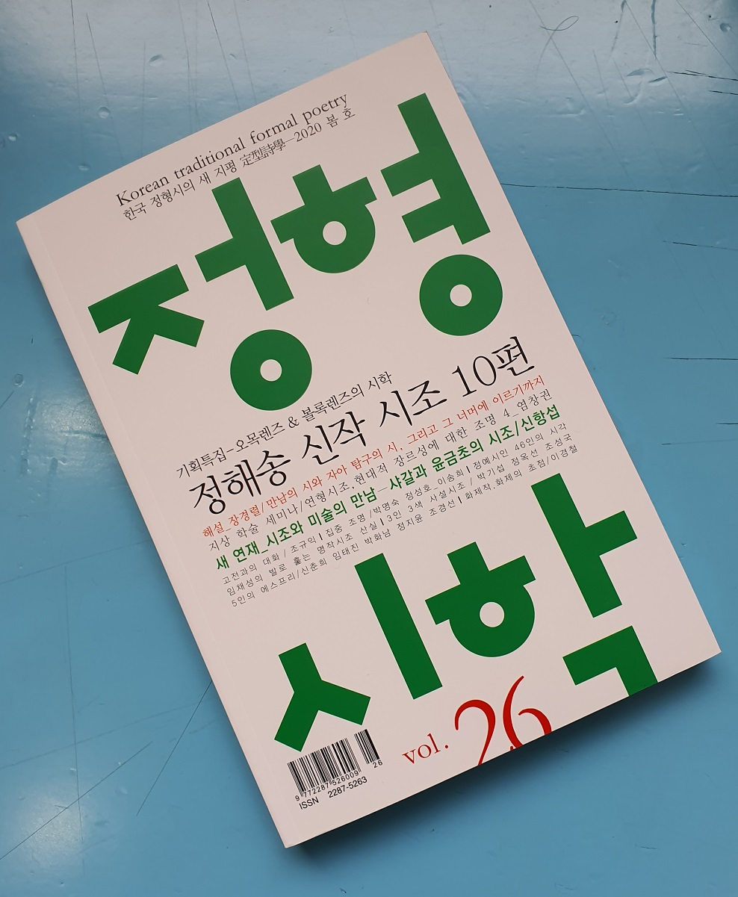

#### 조규익(숭실대 교수)

**하나. 사랑하는 이의 죽음에 대한 서정적 반작용으로서의 넋두리**

‘실존이 본질에 앞선다’는 사르트르(Jean Paul Sartre, 1905~1980)의 명언[<<존재와 무>>]은 인간이 ‘던져진 존재’임을 극명하게 드러낸다. 애당초 아무런 규제나 구속 없이 태어난 인간은 원초적으로 ‘자유인’일 수밖에 없다. 이 세상에 ‘던져진 존재’로 태어난 인간이기에 사회의 규범이나 도덕∙종교 등에 기댈 수밖에 없지만, 그런 범주를 벗어나는 경우 한갓 ‘고민에 싸인 자유인’일 뿐이다. 실존적 상황에서 인간은 자신의 판단으로 모든 것을 선택해야 하며, 종교나 관습은 실존적 존재로서의 인간이 넘기 어려운 죽음과 이별을 초극하기 위해 의지하는 작은 ‘언덕’에 불과하다. 아무리 기대는 종교가 있다 해도 실존적 존재 스스로 마지막에 넘어야 할 최악의 장애물은 죽음 혹은 이별이다.

키에르케고르(Kierkegaard, 1813~1855)는 그의 저서 <<죽음에 이르는 병>>에서 “모든 사람은 다 죽음에 이르는 병에 걸려 있는데, 그 병은 바로 절망”이라고 했다. ‘절망의 종말은 죽음’이라는 것이 이 말의 뜻이겠지만, 사실은 ‘타인의 죽음을 보며 절망의 나락에 떨어지고, 그 절망의 나락에서 헤어 나오지 못하다가 결국 죽음을 맞이하는 존재’가 바로 인간인 것이다. 그러니 죽음과 절망, 그 중 어떤 것이 선행하는 지는 쉽게 말하지 못한다. ‘남의 죽음’을 보면서 그 죽음이 조만간 자신에게도 닥칠 수 있다는 것을 깨닫지 못하는 것은 인간의 심한 아이러니다. 라틴어 경구(警句) ‘메멘토 모리(memento mori)[(그대는) 죽어야 하는 존재임을 기억하라!]’야말로 생자필멸(生者必滅)의 우주적 법칙을 흔히 망각하는 실존적 존재로서의 인간에게 던지는 냉혹한 명령이다.

빈부귀천을 막론하고 우리 선조들도 죽음이나 이별의 두려움과 절대성을 극복하기 위해 많은 노력을 해왔다. 죽어서 떠난 자들을 지극 정성으로 받들어 온 것도 죽음의 두려움과 허무를 초극하려는 산 자들의 몸부림이었다. 부부 혹은 사랑하는 남녀를 떼어놓는 우주적 법칙은 죽음이었다. 그 가운데 여성은 남성보다 죽음에 대하여 더 민감했다. 남편은 가족을 부양하고, 가족은 아버지 혹은 남편에 의지해왔다. 자식들이 장성해 있다면, 비록 남편이 떠나도 아내에게 ‘하늘이 무너지는 듯한’ 큰 걱정은 없었을 것이다. 그러나 자식 없는 젊은 부부, 자식이 어린 젊은 부부, 자식 없는 노부부에게 닥친 ‘남편의 죽음’은 무엇에도 비할 수 없는 충격 아니었겠는가. 굳이 부부가 아니라도, 지극히 사랑하는 남녀 사이에 찾아오는 죽음 또한 또 다른 의미에서 하늘이 무너지는 일이었을 것이다.

우리 선조들은 수천 년을 이어오며 ‘사랑과 죽음’을 노래했고, 그것들 가운데 후대의 문서에 요행히 살아남은 것들 덕에 오늘날 우리들은 그 맥을 짚어낼 수 있게 되었다. 노래와 노래 사이가 수백 년을 격해 있으면서도 우리 의식의 원형을 잘 유지해 왔고, 면면히 이어진 정서의 끈을 놓치지 않은 채 우리 민족의 마음을 잘 표현하고 있는 점은 신기한 일이다. 그 가운데 사랑하는 임이 죽어 떠나는 현장에서 터뜨리는 넋두리는 우리 민족 여인들의 집단심성에 각인되어 있다고 할 만큼 절절하다.

“무당이 죽은 사람의 넋을 대신하여 하는 말[북한사전: 무당이 굿할 때 중얼대듯 ‘도무지 이치에 맞지 않고 동이 닿지 않게 늘어 놓는 말’]/불평이나 불만을 늘어놓으며 하소연하는 말[북한사전: 원통하거나 억울한 일을 길게 늘어놓아 하소연하거나 마음속에 품었던 것을 불평스럽게 늘어놓는 말]” 등 우리나라와 북한의 넋두리에 대한 정의가 다르지 않다. 사랑하는 사람을 떠나보내는 여인의 넋두리는 의식화(儀式化)된 무당의 넋두리보다 앞선다. 어원적으로 넋두리는 ‘넋[魂]’과 ‘두리’의 합성어다. ‘두리’는 동사 ‘두루다[還]’ 즉 ‘돌이키다’의 명사형이다. 따라서 ‘넋두리’는 ‘(떠나가는) 넋을 돌이킴’이다.

베이비부머 세대의 일원인 필자는 어려서부터 전통적 상례의 현장을 꽤 많이 접했다. ‘누구 집에 초상났다!’는 외침이 마을을 울리면, 그 집에 달려가 사자(死者)의 모습을 본 다음 사자를 붙잡고 넋두리하며 통곡하는 부인과 딸, 며느리 등 여성들의 모습을 보곤 했다. 죽음보다 넋두리에 싣던 여인들의 사연과, 애조(哀調)로 점철된 목청이 더 슬펐다. 그렇던 상례가 완벽하게 바뀐 것은 현재의 ‘장례 산업’이 우리 사회에 정착하면서부터였다. 병원 영안실에 상청이 마련되면서 우리나라 여성들은 ‘넋두리의 슬프고 아름다운 전통’을 상실하게 되었고, 새로운 세대에게 <공무도하가>를 비롯한 우리 고전의 ‘넋두리 문학’ 혹은 ‘만가(輓歌)’를 설명할 근거마저 잃어버렸다.

남편의 죽음 앞에서 부인은 그의 부재가 불러올 곤경들을 떠올리며 애조의 극치를 달리는 목청으로 통곡했다. 시신을 어루만지거나 자신의 가슴을 치며 큰 소리로 곡을 함으로써 육신을 빠져 나가 하늘로 올라가는 혼이 되돌아오는 기적을 간절히 소망한 것이다. 가능하면 큰 소리로, 아름다운 율조로 넋두리를 내뱉은 것은 시신이 굳기 전에 혼이 되돌아와 남편이 소생할 수도 있으리라는 가느다란 믿음 때문이었다.

그렇다면 왜 그렇게 아내는 떠나가는 남편을 한사코 붙잡으려 했던 것일까. 그렇게 하는 게 예의로나 체면으로나 합당하다고 여겼던 것일까. 사실 긴 논의가 필요한 문제이긴 하나, 우리나라에서 여성들이 정치∙경제∙문화적으로 독자적 자아를 정립하게 된 것은 20세기 말부터였다. 사실 유교 이데올로기가 삶의 원리로 스며든 중세부터 예의나 체면이 중시되었다고는 하지만, 여성의 자립은 불가능했다. 그러니 육체적∙정신적으로 유일하게 믿고 사랑을 나누던 사람이 남편이었고, 재화를 벌어 삶을 영위할 수 있게 해주는 유일한 존재 또한 그였다. 그래서 현실적으로도 정서적으로도 전통사회의 여성에게 남편의 죽음은 ‘하늘이 무너지는 것’과 같은 일이었다. 남편의 주검 앞에서 내뱉는 아내의 넋두리가 남편의 소생에 대한 간절한 소원이었던 것도 그 때문이었다. 그러나 사자를 위한 무의(巫儀)에서 무당이 중얼거리는 듯한 투로 엮어나가는 넋두리는 사자 주변 여성의 그것과 다른 차원의 작위적 연기(演技)일 따름이었다.

여성들의 이런 넋두리로부터 한 단계 더 나아간 곳에 ‘상여를 메고 나가며 부르는’ 만가(輓歌)가 있었다. 여성의 넋두리와 만가가 발화(發話)나 가창(歌唱)의 주체∙상황∙격식 등에서 다르긴 하나, 그것들 모두는 분명한 예술성을 지니고 있다. ‘<공무도하가>∙<가시리>∙<원부가>’ 등 우리 옛 노래들을 넋두리와 만가의 범주 안에서 살펴 볼 필요가 있다고 보는 것도 그 때문이다.

**둘. <공무도하가>와 <가시리>의 거리**

여보 그 물 건너지 마시랬지요

당신은 기어이 건너시다가

물에 빠져 돌아가시니

당신을 어이하면 좋아요?

<공무도하가>

가시렵니까 가시렵니까?

버리고 가시렵니까?

날러는 어찌 살라하고

버리고 가시렵니까?

붙잡아 두고 싶지마는

서운하면 아니 올까 두려워

서러운 임 보내 드리오니

가시는 것처럼 돌아오소서

<가시리>

하북성(河北省) 조선현(朝鮮縣)의 조선진(朝鮮津)에서 호리병을 낀 백수광부(白首狂夫)가 물을 건너려다 빠져 죽자, 말리던 그의 처가 공후를 타며 노래[<공무도하가>]를 부른 뒤 따라 죽었다. 이 광경을 진졸(津卒) 곽리자고가 목격했고, 그 이야기를 들은 곽리자고의 처 여옥이 이 노래를 다시 불렀으며, 이웃집 여인 여용에게 전해주어 널리 퍼지게 된 노래가 바로 <공무도하가>다. 사건은 매우 단순하고 소박하다. 학자들은 ‘백수광부(白首狂夫)가 호리병을 들었다’는 말에서 ‘미치광이 늙은이가 술병을 들었다’거나 백수광부를 주신(酒神)으로까지 과장 해석해 왔지만, 술병 아닌 강을 건너기 위한 도구를 들고 강에 뛰어들었다가 빠져 죽었다고 보는 일설도 있는 만큼 ‘술’에 너무 구애될 필요는 없다.

추정컨대, 애당초 이 노래는 중국 측 문인(文人)이나 악관(樂官)이 수집한 것을 진(晉)나라 최표(崔豹)가 상화가(相和歌)들을 모아놓은 <<고금주(古今注)>>에 실었고, 그 후 중국의 시인들에게 널리 수용되어 수많은 악부시로 재탄생된 슬프고 아름다운 노래다. 중국 측의 문헌에 실려 있고, 중국의 역대 시인들이 수용하여 새로운 작품으로 만들어냈으며, 중국의 금조(琴操) 구인(九引) 가운데 하나로 편입되어 있다 해도, 당시 고조선 강역 안의 우리 민족에 의해 만들어지고 전파된 노래임은 분명하다. 그 속에 다른 나라나 민족의 여성들에게서 찾을 수 없는 ‘넋두리 구조’가 핵심으로 들어 있음은 당연하다. ‘물 건너다 빠져 죽은’ 남편을 바라보고 늘어놓은 이 노래는 원래 넋두리이었을 뿐 노래가 아니었다. 그럼에도 그 넋두리는 하도 처절하고 아름다워 사람들의 입과 귀를 거치는 과정에서 노래로 바뀌었고, 윤색된 배경설화가 붙으면서 중국의 문인들과 예인들에게 광범하게 수용되었을 것이다.

‘가지 마세요, 가지 마세요, 그렇게 물에 빠져 떠나시면, (홀로 남은)나는 어떻게 살아요?’라는 여인의 절절한 감정이 노래의 핵심이다. 물에 빠져 죽어간 남편을 위해 한바탕 넋두리로 애도한 뒤 절망을 이기지 못한 그 여성도 물에 뛰어들어 남편을 따라간 것이다. 말하자면 그녀는 서러운 넋두리로 남편에 대한 애도와 함께 자신에 대한 애도[즉 자만(自輓)]의 ‘의식(儀式)아닌 의식’까지 수행한 뒤 목숨을 끊은 것이다.

필자는 여기서 한 발 더 나아간 <가시리>를 이미 전고(前稿)[<<정형시학>> 24]에서 ｢‘죽어 이별’의 노래 <가시리>｣란 제목으로 언급한 바 있다. <공무도하가>가 ‘넋두리’라면, <가시리>는 ‘만가(輓歌)’다. 만가는 죽은 사람을 애도하는 노래나 가사이고, 상여꾼들의 상엿소리를 뜻하기도 한다. 따라서 만가는 ‘의례화(儀禮化)된 넋두리’다. 위에 인용한 노랫말들에서 보듯이 <공무도하가> 전체는 <가시리>의 1~4구와 내용적∙형태적으로 부합하는 넋두리다. 말하자면 <가시리>도 전반은 넋두리에 해당된다는 것이다.

그러나 후반에 들어가면서 달라진다. 제5구의 ‘붙잡아 두고 싶다’는 것은 생존에 대한 집착이다. 죽어 떠나는 임을 현실에 붙잡아 놓고 싶다는 화자의 집착과 욕망을 드러낸 부분이다. 그러나 ‘한 번 죽어 떠난 임이 살아날 리 없다는 것’을 잘 알고 있는 화자 자신은 그 절망감으로부터 자아를 지켜야 했고, 그 구체적 자기방어(自己防禦)의 수단으로 제6구의 언술[서운하면 아니 올지 모른다]을 내놓는다. 화자로서 ‘죽어 떠나는’ 임이 자신에게 서운한 마음을 가지고 떠나길 바랄 리 없음에도 그렇게 표현한 것은 다시 돌아올 길 없는 길을 떠나는 임에게 ‘돌아오지 못할 명분’ 정도는 주어야 했기 때문이다. 그렇게 함으로써 이승에 살아남은 화자는 죽어 떠난 임에게 마음의 짐을 가질 이유가 없어질 것 아닌가. 노래의 화자는 관형어구 ‘죽어 이별한’을 ‘나를 싫어해서 떠난’으로 바꿔치기 하는 데 성공한 것이다.

제7구의 ‘서러운’은 주체가 누구냐에 따라 의미가 달라진다. 화자가 주체일 경우 사랑하는 임을 떠나보낼 수밖에 없는 죽음의 절대성 때문에 서러운 것이고, 떠나는 임이 주체일 경우 이승의 삶이나 사랑하는 사람과의 단절 때문에 서러운 것이다. 그런 모호성은 제8구[‘가시는 것처럼 돌아오라’]에서 해결되고 양자의 거리는 사라진다. 그래서 제8구는 넋두리[환혼(還魂)]일 수도, 초혼(招魂)일 수도 있는 것이다. ‘이승의 미련을 훌훌 털고 떠나셨듯이 (나를 힘들게 하지 말고) 다시 돌아오라’는 당부. 전통 시대 초혼 의식(儀式)의 모티프가 바로 그것 아닌가.

<가시리>는 애당초 민간의 누군가가 애절하게 부른 ‘사별가’였다. 그 절제된 슬픔의 세련된 표현과 그로 인한 감동은 그 노래가 궁중으로 도입된 이유였다. 그런 노래가 궁중음악 전문가들에 의해 개작된 다음 임금을 위한 무대에서 속악으로 가창되었다는 것은 처음의 노랫말과 지금의 노랫말 사이에 상당한 거리가 있음을 암시한다.

그들은 넋두리 혹은 만가의 표지(標識)가 노출되지 않도록 개작 과정에서 엄청나게 신경 썼을 것이다. <가시리>의 주제를 단순한 ‘이별의 정한’으로 알고 있는 후대 수용자들의 착시현상도 여기서 생겨난 것이다. ‘이별의 정한’으로 못 박은 양주동 선생의 주장[｢가시리 평설｣]에서 단 한 걸음도 나아가지 못하는 오늘날의 ‘<가시리> 담론’도 바로 이 착시현상을 바로잡지 못한 데서 빚어진 결과이다.

 많은 사람들은 ‘산 자와의 이별’을 <가시리>의 ‘당연한 내용’으로 여긴다. 그러나 시적 진술의 심층이 표층과 같다고 보는 것은 매우 순진한 관점이다. 사실 이 노래의 표층 어디에도 ‘산 자와의 이별’이란 표지나 단서는 없다. ‘날 버리고 가지 말라’, ‘붙잡고 싶지만 서운하게 여겨 돌아오지 않을까봐 그냥 보내 드린다’, ‘떠나는 것처럼 돌아오라’ 등의 언급들로 보아 <가시리>가 ‘산 자와의 이별’을 노래한다고 주장한다면, 그것은 노래에 대한 모독이다. 시나 노랫말을 산문으로, 그것도 보고서나 계약서 같은 실용문 수준으로 받아들일 경우라면, <가시리>의 담론을 ‘산 자와의 이별’이라고 부를 만하다. 물론 ‘산 자와의 원치 않는 이별’, ‘사랑하는 사람과의 이별’이 죽음과 맞먹는 괴로움일 수는 있다. 그러나 좀 더 자연스러운 상황이라면, <가시리>를 죽어 떠나는 연인에게 재회의 언약을 절절하게 강조하는 언술로 보는 것이 맞는 관점이며, 그럴 경우 심층에 잠재된 이 노래의 정체는 죽은 자를 애도하는 만가이면서 살아남은 화자가 스스로를 위로하는 ‘자만가(自輓歌)’일 수 있는 것이다.

<가시리>는 <공무도하가>의 넋두리에서 한 단계 더 의식화(儀式化)로 나아간 노래라 할 수 있다. 당시 고려 궁중의 무대에서 속악으로 부르며 임금에게 송도(頌禱)하던 노래이기 때문이다. 사실 무대 위의 여악(女樂)들은 임금을 위해 최고의 사랑을 바쳐야 했다. 그 때의 분위기가 극적인 사랑의 표현을 요구했다면, ‘죽음으로 패러프레이즈된 사랑’이나, 넋두리의 외피를 쓴 사랑의 표현 등 역설적 담론들 모두 가능했다. 그래서 <가시리>는 단순히 ‘살아 이별’의 노래가 아니라, ‘죽어 이별’의 노래, 더 구체적으로 ‘죽음을 원망하는 넋두리를 바탕으로 죽음을 극복해낸’ 사랑 노래일 수 있다.

넋두리를 통해 남편의 죽음과 자신의 죽음을 동시에 애도하고, 그 넋두리가 노래로 변신하여 남아있는 <공무도하가>. ‘죽어 이별’의 상황이나 감정을 통해 ‘죽음을 극복한’ 노래로 승화된 <가시리>. 이 둘은 각각 넋두리와 만가로서 얼마간의 거리를 보여주고 있긴 하지만, 하나로 뭉뚱그려 볼 수 있을 만큼 가까운 것도 사실이다.

**셋. 만가풍(輓歌風) 서정노래로서의 <원부가(怨婦歌)>**

16세기 장∙단가를 통틀어 우리 노랫말의 작자들을 대표하는 정철(1536~1593)이 남편 잃은 아낙의 입을 빌어 만가풍의 서정노래를 지었다.

남편 죽고 우는 눈물 두 젖에 내려 흘러

젖 맛이 짜다하고 자식은 보채거든

저놈아 어떤 마음으로 계집 되라 하느냐

<<<이선본 송강가사>> No.18>

이 노래의 화자는 남편을 사별한 아내다. 아내 아닌 제3자가 관찰자 겸 화자로 등장하여 정황을 전달하는 노래라 할 수도 있으나, 그렇지 않다. 먼저 떠난 남편에게 던지는 젊은 아내의 직설적이고 진솔한 어조를 보라. 젊은 아내와 어린 자식을 둔 채 세상을 뜬 남편을 원망하는 것이 이 노래의 표층이다. ‘당신은 이 나약한 마누라와 어린 자식을 버려둔 채 왜 그리 황망하게 떠나셨나요? 이렇게 일찍 가실 거면 왜 나를 계집으로 삼으셨나요? 당신 없는 세상에서 나는 이제 어떻게 살아가나요?’가 이 노래의 심층이다.

표층만으로 보면 거친 항의(抗議)성 투정이다. 그는 혼례식에서 ‘백년해로’를 약속했을 것이다. 그러나 아이를 낳아놓은 지 한 두 해만에 세상을 떴으니, 아낙으로서야 어찌 투정뿐이었겠는가. 유일한 사랑의 대상이 사라지고, 삶의 의욕이나 방도는 물론 든든한 버팀목마저 사라진 상태에서 칭얼대는 아이만 묵직한 짐으로 남아 있는 게 그녀의 절망적 현실이다. 아낙에겐 앞으로 살아갈 창창한 날들이 걱정일 것이다. 그러니 현실적으로 어떻게 살아갈 것인가를 궁리하기 전에 ‘책임지지도 못할 거면서 왜 나를 계집으로 데려왔느냐’는 원망조의 넋두리를 늘어놓을 수밖에 없는 것이다.

그런데, ‘죽은 남편에 대한 애도’를 극적으로 고양시키기 위해 끌어온 소도구로서의 비유가 절묘하다. ‘남편의 죽음에 솟아나는 눈물이 흘러내려 두 젖을 적시니 아이는 젖 맛이 짜다고 보챈다’는 내용의 노랫말이 그것이다. 지극한 슬픔을 이렇게 절묘한 방식으로 에둘러 드러낸 것이다. ‘아내와 아이를 이토록 슬프게 만들어 놓고 당신은 무책임하게 떠날 수 있느냐’는 넋두리를 늘어놓았지만, 이것은 단순한 넋두리가 아니다. 겉으로 보기에는 절묘한 소재를 동원한 시문학이나, 그 속에는 죽은 남편을 향한 애도와 사랑의 넋두리가 자리 잡고 있기 때문이다. 앞 시대의 넋두리와 만가가 이 노래에서 비로소 비유를 통한 시문학적 세련미를 갖추게 되었음을 보여주는 사례이다.

넋두리의 원형을 고스란히 간직한 <공무도하가>와, 넋두리 부분이 포함된 만가의 모습을 보여준 <가시리>에 이어 <원부가>가 나타남으로써 만가풍 서정 노래는 일반화될 기틀을 마련하게 된 것이다.

**넷. 넋두리 혹은 만가, 혼효(混淆)된 에로스와 타나토스**

<공무도하가>∙<가시리>∙<원부가> 모두 죽음의 절대성을 노래하지만, 그 죽음은 단순한 종말로 그려지지 않는다. 어딘가로 떠나는 것일 뿐 ‘존재의 사라짐’은 아니라는 것이다. 사르트르가 “죽으면 모든 것이 끝난다. 죽음도 끝난다”[<<존재와 무>>] 라고 말했지만, 그 때의 죽음은 ‘죽음에 대한 사유’일 뿐이니, 산 자들의 ‘죽음에 대한 사유’가 남아 있는 한 ‘죽음=끝’이라 말할 수는 없다. 백수광부의 처는 왜 죽은 남편을 처절하게 불렀으며, ‘홀로 남은 자신의 무력함’에 절망할 여유도 없이 자신도 그 길을 따랐을까. <가시리>의 화자는 ‘죽어 떠난’ 임에게 ‘살아 떠난 자’가 그러하듯 돌아오라고 절규했을까. <가시리> 화자의 절규는 왜 죽음 이상의 처절함을 띠고 있을까. 어린 자식과 함께 세상에 남겨진 원부는 남편이 왜 자신에게 사랑을 심어주고 떠났느냐고 원망했을까. 세상에 홀로 남겨진 젊은 아낙의 고립무원은 왜 죽음 이상으로 무거운 의미를 지니고 있을까.

죽음을 명시적으로 언급했든 암시에 그쳤든, 이 노래들을 관통하는 주제는 죽음이다. 그리고 그 죽음이 당사자들에겐 ‘현실로서의 사라짐’이었지만, 화자들에겐 ‘죽음에 대한 인식과 사유’일 뿐이었다. 세 노래 모두 화자가 여성이라는 점에서 죽음을 맞이한 존재는 ‘사랑하는 남편[혹은 임]들’이다. 그리고 그 죽음의 대척 지점에 사랑이 있다. 여성화자들은 왜 하나같이 남편이나 임의 죽음 앞에 절망하거나 따라 죽는가. 단순히 현실적인 삶 때문에? 상대에 대한 예의로? 아닐 것이다.

사실 그 근저에는 사랑의 소멸에 대한 극도의 불안감이 있다. 에로스와 타나토스! 곧 ’죽음의 욕동과 대립하는 삶의 욕동의 총체/삶의 욕동과 대립하는 죽음의 욕동의 총체‘[장 라플라슈∙장 베르트랑 퐁탈리스의 <<정신분석사전>>] 등이 그것들이다. 에로스와 타나토스는 서로 대척의 위치에 있지만, 가장 가까운 거리를 유지하기도 하고, 아예 서로 섞여 구분할 수 없는 경우도 있다.

백수광부의 처는 전형적인 넋두리를 쏟아놓은 뒤 남편을 따라 강물에 몸을 던졌다. 유교 이데올로기가 강조하는 순절(殉節)의 의리와는 거리가 멀다. 백수광부의 처가 스스로 죽음을 선택한 것은 남편과의 사이에 생성된 원초적 에로스가 자기 파괴적 타나토스를 생성시켰거나 불러온 결과일 뿐이다. 사실 현실적으로 강을 건널 필요가 있었건 단순히 죽기 위해 강에 뛰어 들었건 백수광부의 죽음은 처에게는 헤어 나오기 어려운 ‘우주의 붕괴’였다. 에로스적 측면에서 하늘의 사라짐을 목격하는 순간, 사라진 하늘을 찾기 위해 실존적 존재로서의 자기를 파괴해야 한다는 절박감이 엄습했는데, 그것은 자기를 놓아둔 채 죽음의 관문을 통과한 남편의 존재를 파괴하는 일이기도 했다. 에로스와 타나토스의 혼돈상태는 감성과 이성이 미분화된 상황의 또 다른 양상이기 때문이다.

<가시리>의 화자는 백수광부의 처와 달리 매우 논리적이어서 상대의 내면을 분석하고 그 결과에 자신의 욕망을 합치시키려는 열망이 매우 강하다. 에로스와 타나토스의 미분화 상태에서 미처 분석적 사고를 발동시킬 수 없었던 백수광부 처의 경우와 달리, <가시리>의 화자는 상대방의 내면을 분석하고 그 결과를 토대로 합리적인 해결책을 제시한다. ‘가시는 듯 돌아오라’는 말이 비록 의사 진술[擬似陳述, pseudo statement]이긴 하지만, 이승에 설정한 자신의 좌표를 전제로 내뱉은 말임은 분명하다. 바로 여기에서 그대를 기다릴 것이니, ‘바삐 떠나간 것처럼 바삐 돌아오시라’는 간절한 소망이다. 만약 그 위치에 백수광부의 처가 놓였다면, 그녀는 무슨 수를 써서라도 목숨을 끊었을 것이다.

<가시리>의 화자는 사랑하는 사람의 죽음 앞에서 어쩌면 그렇게 차분할 수 있는가. 그것이 바로 의례(儀禮) 혹은 의식(儀式)의 힘이다. 넋두리가 카오스(chaos)의 발화(發話)라면 만가는 코스모스(cosmos)의 표현이다. 에로스와 타나토스의 혼효는 종잡을 수 없지만 무엇이든 만들어지고 현시(顯示)될 수 있는 혼돈이다. 이에 반해 다양한 관계성 안에 있는 질서를 불러 오고 모든 존재로 하여금 자신들의 안녕을 위해 그 질서에 의존하도록 하는 것이 의례이다.

죽은 남편을 위한 사령굿을 설명하는 어떤 학자의 견해를 인용하며 캐서린 벨은 “배우자의 죽음을 슬퍼하면서 세상에서 어떻게 홀로 살아갈지를 몰라 두려움에 떨고 있는 한국의 한 과부는 굿을 하게 되는데, 그 굿은 죽은 후에도 남편과의 관계가 계속된다는 것을 확신시켜 주고, 그녀의 상실감을 예전부터 지속되어온 가치에 종속시켜 완화해주며, 그녀의 한을 풀어 주어 그녀 스스로 자신의 삶을 제어하며 살 수 있도록 도와준다”[<<의례의 이해>>]고 했다. 남편의 죽음에 즈음하여 그것을 둘러싼 모든 것들은 카오스이나, 그를 위한 굿판은 그의 처로 하여금 카오스에서 코스모스로 넘어가게 하는 징검다리이며, 그 다리를 건넌 뒤에는 코스모스 세계의 평정을 확보하게 되는 것이다.

이처럼 사랑과 죽음 즉 에로스와 타나토스는 서로 적대적인 것이 아니라, 늘 서로 붙어 다니는 짝이다. 카오스의 상태에서 에로스와 타나토스는 뒤섞이거나 서로 넘나든다. ‘사랑하는 사람이 죽었으므로 그 사랑을 온전히 하기 위해 내가 죽어야 한다’는 것은 카오스의 상태다. 그러나 ‘사랑하는 사람이 죽었는데, 그의 행복을 위해 혹은 그가 다시 돌아오기를 기다리며 살아 가겠다’는 것은 코스모스의 상태이다. 백수광부 처의 카오스 상태를 <가시리> 화자의 코스모스 상태로 전환시킨 것이 바로 의례의 힘이다.

그러나 <원부가>의 화자는 카오스나 코스모스 중 어느 쪽인지 모호하다. 작자 정철은 남편을 보낸 어린 아낙의 가련한 처지에 감정이입(感情移入)된 자신을 이 노래의 화자로 내세웠을 것이다. 이 노래 화자의 발화가 단순한 넋두리는 아니고, 그렇다고 의례화된 넋두리도 아니다. 매우 특이한 개인의 정서적 장치를 통해 비극성의 고양에 성공한 것으로 보이기 때문이다. 남편의 죽음으로 인한 슬픈 눈물. 그녀는 그 눈물 섞인 젖이 짜다고 보채는 아이를 내세워 그녀가 갇힌 비극성을 절절하게 그려냈고, 결국 남편에 대한 원망으로 끝을 맺는다. 물론 이 때 그 원망은 남편에 대한 사랑의 반어적 수사(修辭)임은 물론이다.

남아 있는 기록으로만 따지면, 우리 고전시가의 한 축은 ‘단순 넋두리’로 시작하여 ‘의례화된 넋두리’를 거쳐 ‘서정적으로 승화된 넋두리’로 확장∙정착된 만가의 갈래임을 확인할 수 있다. 그 넋두리는 에로스와 타나투스의 양 끝이 혼돈으로 합쳐졌다가 나눠지는 과정을 반복하며, 사랑과 죽음의 원초적 문제를 씨줄과 날줄로 삼아 민족의 전통정서를 이끌어 나온 것이다.♣

공유하기

게시글 관리

**백규서옥\_Blog ver.**