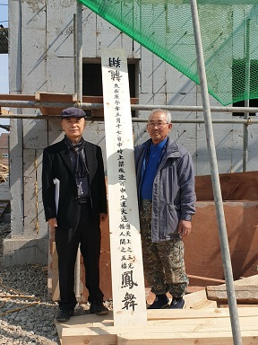

상량식을 앞두고 대장목수 김병호 사장과 함께

                                                                                                                                          조규익

‘대장목수’와 감독 유수근 사장이 상량식을 해야 한다고 했다. 내겐 어릴 적 상량식의 어렴풋한 추억만 남아 있는 상태였다. 붓글씨가 적힌 대들보 양끝을 광목천으로 매어 걸어놓고 어른들이 기원 비슷한 것을 늘어놓으시던 기억이 가물가물 떠올랐다. 기독교적 입장에서 ‘천지신명’은 분명 잡신의 범주에 든다고 보아, 시큰둥한 반응을 내보이니 공사 팀원들의 얼굴에 실망의 빛이 어렸다.

주변의 어른들에게 물었더니, “상량식은 인부들에게 고마움을 표하고 휴식과 보너스를 주는 기회여~!” 라는 대답이 돌아왔다. 계속되는 작업에 휴식이 있어야 사고 없이 일을 잘 마무리할 수 있다는 것이었다. 짓고 있는 집이 한옥은 아니지만, 떡과 고기를 준비하고 상량보에 상량문을 써서 간소한 의식을 갖기로 했다. 공주의 뛰어난 서예가로서 국전 초대작가 출신인 우공(愚工) 이일권(李一權) 선생에게 급히 상량문을 부탁하니 쾌락(快諾)했다. 트럭에 송판을 싣고 이 선생에게 달려간 유수근 사장. 순식간에 완성된 3m 길이의 상량보를 되싣고 돌아왔다. 단정하고 빼어난 우공체의 상량문이 송진내음 그윽한 송판에 새겨진 것이다. 가슴이 뛸 정도로 멋진 예술이었다.

龍翔 歲在庚子年三月十七日申時上梁成造丙申生運大通鳳舞/應天上之三光/備人間之五福                                             

 

“용이 날고 봉이 춤추도다/경자년 3월 17일 신시에 상량 성조하니 병신생인 집주인이 운수 대통할 것이며/하늘의 삼광에 응하고 인간의 오복을 갖출 것이로다”

그렇다. 이걸 천정에 붙인 채 누울 때마다 바라보고 염원하면 말 그대로 이루어지지 않겠는가. 내 어찌 ‘현대판’ 상량문 한 편을 쓰지 않으랴?

\*\*\*\*

무성산(武城山) 백규서옥(白圭書屋) 건립(建立) 상량문(上梁文)

천지신명(天地神明)이시여!

 백규(白圭)는 고향 땅과 부모 슬하를 떠난 십대 중반 이래 반세기 가까이 객지를 떠돌다가 천지신명의 보살피심 덕택으로 이곳 공주시 정안면 월산리 무성산 자락에 새 터를 잡았습니다.

학문을 통해 입신보국(立身輔國)하겠다는 일념으로 풍파 드높은 세상을 쉬지 않고 항해하여 왔으나, 학문의 바다는 끝이 없고 인생은 덧없음을 절실히 깨닫게 되었습니다.

조만간 세속에서의 학구(學究)생활을 마감하고 천지신명이 허락하신 나머지 반생은 또 다른 성취의 꿈을 새로이 가꾸고자 합니다.

지난 수십 년 세월 은둔강학(隱遁講學)하며 후반생을 보낼만한 길지(吉地)를 찾아다니던 중 이곳 무성산 자락 고사터에서 가거지(可居地)를 발견한 것이 2012년 봄이었고, 그로부터 8년 만인 경자년 정월 하순 정초(定礎)를 하게 되었으며, 3월 17일 신시(申時)에 드디어 감격스런 상량식을 갖고 천지신명께 고유(告由)하게 되었습니다.

아름답고 조용한 산수(山水)에 새롭게 뿌리를 내리고 후반생을 살다가 이곳의 흙 속으로 스며 들어 풀과 나무들을 위한 한 줌 거름이 되고자 합니다. 새롭게 만난 이웃들과 강호의 벗들을 두루 불러 인생과 학문을 토론하며 지역사회에 선한 추억을 남기고자 합니다.

아, 무성산의 용맥(龍脈)이 백규서옥을 감아들어 사뿐히 내려앉으니, 평화와 안식의 꽃비가 고사터 골짜기에 가득하옵니다. 새로운 시대의 대운(大運)이 이로부터 현현(顯現)될 것인즉 은사(隱士)의 미덕을 심고 가꾸어 좋은 결실을 이룰 수 있도록 더욱더 겸허한 자세로 노력할 것입니다.

천지신명이시여, 아무도 다치지 않고 어렵지 않은 가운데 이 공사가 수월히 끝날 수 있도록 참여한 장인(匠人)들에게 힘을 주시고, 백규 가족 및 동네의 모든 구성원들에게 행복의 꺼짐 없는 서광(瑞光)을 퍼부어 주시옵소서.

2020. 음 3월 17일

무성산 백규서옥 주인 복원(伏願)

상량판[우공 이일권 선생 글씨]

상량식을 앞두고 대한민국 최고의 건축 장인(匠人)들과 함께

상량식에서 문구를 설명하며

상량을 끝낸 건물

건축주의 상량문

공유하기

게시글 관리

**백규서옥\_Blog ver.**