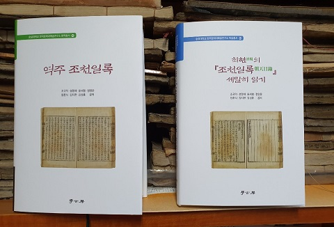

#### 

#### 숭실대학교 한국문학과예술연구소를 중심으로 연구 활동을 펼치고 있는 7명의 학자들이 선조조~인조조의 탁월한  경세가(經世家) 최현(崔晛)의 연행록 <<조천일록(朝天日錄)>>을 역주・분석하여 최근 다음과 같은 자매편 저술들을 발간했다.

#### 

#### 1. <<역주 조천일록>>[조규익・성영애・윤세형・정영문・양훈식・김지현・김성훈 공역/학고방, 2020. 5.])

#### 2. <<최현의 <<조천일록>> 세밀히 읽기>>[조규익・성영애・윤세형・정영문・양훈식・김지현・김성훈 공저/학고방, 2020. 5.]

#### 

#### \*\*<<역주 조천일록>>의 목차

#### 

#### 화보

#### 머리말

#### 역자의 말/조규익

#### 권1 인재선생속집-<<조천일록 1>>

#### 권2 인재선생속집-<<조천일록 2>>

#### 권3 인재선생속집-<<조천일록 3>>

#### 권4 인재선생속집-<<조천록 4>>

#### 권5 인재선생속집-<<조천록 5>>

#### 권5 인재선생속집-<인재선생속집 서문>

#### 찾아보기

#### 

#### 

#### \*\*<<역주 조천일록>>의 머리말

#### 

#### 광주 이현조 박사의 후의로 인재 최현의 <<조천일록>>을 손에 넣은 것은 2006년 무렵이었다. 학계에 전혀 알려지지 않은 상태였고, 훑어보니 내용 또한 여러 면에서 매력적이었다. 즉시 숭실의 학인들과 강독을 시작했다. 반쯤 진행되던 중 뜻하지 않게 새로운 프로젝트에 매달리게 되어, 강독은 기약 없이 미뤄졌다. 그간 이 텍스트에 관한 논문은 두세 편 발표했으나, 번역을 마치는 것이 급선무였다. 그러나 미적거리는 사이 세월은 마구 흘렀고, 더 이상 미룰 수 없다는 판단을 내린 것이 겨우 작년(2019) 중반 쯤이었다. 서너 명씩 두 팀으로 나누어 초벌 번역과 주석 작업을 마쳤고, 최종적으로 마무리 강독을 통해 번역작업은 완성되었다.

#### 문헌학도인 나는 늘 번역문제로 시달린다. 논문 한 편을 쓰려 해도 맞닥뜨리는 원전들이 많기 때문이다. 논문 쓸 때는 정확하게 번역했다고 자부하지만, 논문이 나온 후에 오역들이 발견되는 경우도 없지 않다. 그래 서 좋은 번역서가 늘 반갑고 고맙다. 좋은 번역서들은 연구에 들어가는 품을 많이 덜어준다. 그러나 아직도 번역을 기다리는 원전들은 수두룩하다.

#### 인재 공의 <<조천일록>>은 예사로운 사행록이 아니다. 사행을 출발하는 날부터 돌아와 복명한 뒤 우여곡절을 겪다가 하향(下鄕)하는 날까지 단 하루 빠뜨리지 않고 기록한 점도 놀랍다. 무엇보다 원리주의자에 가까운 성리학자들로부터 학문을 배웠으면서도 실용주의적 경세가의 면모를 보 여주었다는 점에서 인재 공은 특이한 존재다. 임진왜란과 병자호란에 참 전했고, 이괄의 난을 평정하는 대열의 선봉에 서기도 한 그였다. 그 뿐 아니다. 분명한 메시지가 담긴 가사와 소설작품을 남겼고, 각종 소차(疏 箚)들을 통해 민생과 안보․ 경제 등 현실 정치에 관한 건의들을 임금에게 부단히 올리기도 했다. 공리공담 아닌 실용 정신에 입각하여 나라를 바로 세우려는 뜻을 갖고 있었기 때문이다. 한 마디로 역사에 보기 드문 실천 적 애국 지식인이었다. <<조천일록>>의 표층은 ‘중국에서의 문견사건(聞見 事件)들’이나 심층은 ‘나라걱정’인 것도 그런 점에서 당연하다.

#### 공역자들 각자가 발표한 논문들을 모은 <<최현의 조천일록 세밀히 읽 기>>를 이 번역서의 자매편으로 함께 세상에 내어 놓는다. 뜻 맞는 학인들 과 함께 공부한 결과를 세상에 내어 놓는 기쁨을 어떻게 표현할 수 있을 까. 그러나 우리의 손길을 기다리는 다음 작업들을 위해 지금 너무 많이 웃지는 말아야 하리라.

#### 맨 처음 텍스트를 제공해주신 이현조 박사와 성균관대 존경각, 텍스트 의 원본 이미지들을 제공해주신 서울대 규장각, 거친 원고들을 보암직한 책으로 엮어주신 학고방의 하운근 사장님과 조연순 팀장을 비롯한 직원 여러분께 고마움을 전하며, 강호 제현의 일독과 질정(叱正)을 고대한다.

#### 경자년 새봄 백규서옥에서 조 규 익

#### 

두 책의 화보

#### 

#### \*\*<<최현의 <<조천일록>> 세밀히 읽기>>의 목차

#### 

#### 화보

#### 머리말

#### 최현과 <<조천일록>>을 보는 관점/조규익

#### <<조천일록>>과 현실인식/정영문

#### <<조천일록>>과 의례/성영애

#### <<조천일록>>과 누정문학/양훈식

#### <<조천일록>>과 유산기/김지현

#### <<조천일록>>과 요동정세/윤세형

#### <<조천일록>>과 글쓰기 관습/조규익

#### 최현 문학 연구의 현황과 전망

#### Abstract: A Detailed Analysis of *Choi, Hyeon's Jocheonilrok*

#### 참고문헌

#### 찾아보기

#### 

#### 

#### 

#### \*\*<<최현의 조천일록 세밀히 읽기>>의 머리말

#### 

#### 인재(訒齋) 최현(崔晛) 공의 6세손인 광벽(光璧)으로부터 <<조천일록>> 의 서문을 청탁받은 당시의 탁월한 학자 이헌경(李獻慶). 다음과 같은 말로 글을 시작한다.

#### “조천록이 이 세상에 어찌 없을 수 있겠는가? 우리나라 사대부들이 연경에 갔다가 돌아오며 이런 기록을 남기지 않은 이가 없었으나 선생처 럼 상세하지 않았다. 이를 갖고 연경에 가서 살펴 따라가면 비록 처음 가는 나그네라도 익숙한 길처럼 생각될 것이다. 군대를 이끄는 자가 이를 얻으면 견고함과 빈틈, 험지와 평지의 소재를 알 수 있고, 풍속을 살피는 자가 이를 보면 풍속의 교화와 다스림이 어디에서부터 시작되는지를 알 수 있다.(…)당시에는 경계할 줄 몰랐고 오히려 뒷사람에게 밝은 본보기 를 남겨주었으니, 조천록이 세상에 어찌 없을 수 있겠는가?”

#### 그렇다. 당시 조선의 지식인들에게 연경은 세상을 향한 창문이었고, 중국은 자신들을 지탱해주던 중세 질서의 근원이었다. 인재 공 또한 중국 의 실상을 바탕으로 조선의 문제적 현실을 고쳐보려는 꿈을 갖고 있었지 만, 이미 기득권 세력의 아성으로 굳어버린 조선에서 어찌 그 꿈의 실현 이 가당키나 했겠는가. 150여년 후에야 겨우 문집의 한 부분으로 엮이어 나온 인재 공의 기록. 그 시기에라도 지식사회가 인재 공의 경계(警戒)를 받아들였더라면, 왕조는 더욱 탄탄해질 수 있었을 텐데... 후손들을 위한 그런 꿈을 기록으로나마 제대로 남겨 놓은 인물이 바로 인재 공이었다!

#### 

#### 나는 십 수 년 전 인재 공의 <<조천일록>>을 발견했고, 최근 숭실의 학인 들과 함께 역주(譯註) 작업을 마친 바 있다. 그 사이에 발표한 몇 편의 논문들 가운데 두 편을 고르고 학인들의 논문을 덧붙여 묶은 것이 바로 이 책이다. 근래 인재 공의 정치적 활약이나 저술들에 관한 연구가 활발 해진 것은 사실이나 <<조천일록>>에 관한 논의는 아직 없는 점으로 미루 어, 그간 이 기록이 강호 학자들의 시야에서 벗어나 있었음이 분명하다. 우국의 충심으로 점철된 인재 공의 진면목이 제대로 드러나지 않으면 어쩌나? 서둘러 <<조천일록>>의 역주서와 연구서를 자매편으로 엮어내는 이유도 이 점에 있다.

#### 맨처음 텍스트를 제공해주신 이현조 박사, 텍스트의 원본 이미지들을 제공해주신 서울대 규장각과 성균관대 존경각, 거친 원고들을 보암직한 책으로 엮어주신 학고방의 하운근 사장님과 조연순 팀장을 비롯한 직원 여러분께 고마움을 전하며, 강호 제현의 일독과 질정(叱正)을 고대한다.

#### 2020. 4.

#### 

#### 백규서옥에서

#### 조규익

#### 

#### \*\*\*\*\*

#### 

#### 조선 중기의 문신인 인재(訒齋) 최현[崔晛, 1563(명종 18)~1640(인조18)]은 고응척[高應陟, 1531∼1605]・김성일[金誠一, 1538∼1593]・권문해[權文海, 1534∼1591]・장현광[張顯光, 1554∼1637]・정구[鄭逑, 1543년∼1620년] 등 명현들에게 일생 배움을 받았고, 44세 되던 해 관직에 오른 이후 수많은 요직들을 거치면서 임・병 양란에 참전하는 등 국가적 위기들의 해결에 부심한 애국적 지식인이었다. 46세[1608년] 8월에는 동지사의 서장관으로 상사(上使) 신설(申渫)・부사(副使) 윤양(尹暘) 등과 함께 명나라에 다녀왔고, 78세 되던 인조 18년(1640) 고종(考終)한 뒤 예조판서에 추증되었다.

#### 

#### <<인재선생문집(訒齋先生文集)>>은 원집(原集) 13권, 별집(別集) 2권, 습유(拾遺)・연보(年譜)・부록(附錄) 등 다양한 문체의 방대한 글들로 이루어져 있으며, 동지사 서장관으로 명나라에 다녀 온 기록인 <<조천일록(朝天日錄)>>은 <<인재선생속집(訒齋先生續集)>>에 실려 있다. 그 외에 가사 <용사음(龍蛇吟)>・<명월음(明月吟)>, 소설 ｢금생이문록(琴生異聞錄)｣, 선산읍지인 <<일선지(一善志)>> 등이 남아 있다.

#### 

#### 그의 생애나 관직・저술 등을 통괄할 때 ‘의병으로 임진왜란에 참전한 점, 서장관으로 명나라에 다녀 온 점, 임금에게 여러 번 소(疏)와 차자(箚子)들을 통해 시무책(時務策)을 올린 점’ 등은 그의 <<조천일록>>과 관련하여 두드러진 행적들이다. ‘공이 사람들의 착함을 말하기 좋아하고 사람들이 잘못과 악함을 입에 올려 말하지 않았다는 점/이해(利害)에 임하고 사변(事變)을 만나면 의연하여 뺏을 수 없는 게 있었고, 마음의 공평함을 잡아 같고 다름을 따져 논하지 않았으므로 좌우의 사람들도 감히 헐뜯지 않았다는 점/일찍이 스승의 문하를 찾아 정인(正人)과 군자(君子)의 논의를 들었고, 일찍이 한강(寒岡)과 여헌(旅軒) 두 선생을 따라 놀며 학문을 연마하여 온축에 근본이 있으니, 그 수립한 바가 근본 없이 그러할 수 없었다는 점/공은 귀가 밝고 기억을 잘하여 천문・지리・병법・산수를 통해 알지 못함이 없었으므로 문장을 함에 매이거나 꾸밈을 일삼지 않았고, 산이 맥을 타고 흐르듯 끝없이 이어지고 비가 억수로 쏟아지듯 기세가 왕성하여 이치의 통달로 주를 삼았다는 점’ 등을 지적한 권두인[權斗寅, 1643∼1719]의 평[｢관찰사인재선생최공묘갈명(觀察使訒齋先生崔公墓碣銘)｣]에도 성리학으로 배움을 시작했으되 실용학문으로 입신한 그의 철학과 학문적 성향은 분명히 드러난다. 따라서 당대 여타의 유자(儒者)들과 달리 의병으로 임진왜란에 참전함으로써 충성심이나 애국심을 몸으로 실천했고, 그런 차원에서 그가 올린 각종 소차(疏箚)들의 진정성이나 실용성은 <<조천일록>>의 방향성과 직결된다는 점에서 무엇보다 중요하다.

#### 

#### 일찍이 그는 임진왜란 참전의 경험을 가사 <용사음>으로, 임금에 대한 근심을 가사 <명월음>으로 각각 술회한 바 있었다. 그리고 각종 시무책에 관한 소차들을 여러 번 올린 점 등은 <<조천일록>> 텍스트의 방향이나 이면적 의미의 형성에 결정적인 단서나 바탕으로 작용했다고 할 수 있는데, 다음과 같은 두 가지 사실이 그것들이다. 첫째, 그가 임진왜란에 참전했다는 것은 애국심의 진정성과 함께 당시 일반적인 유자들과 달리 투철하고 합리적인 국방(國防)의 방책이나 안보의식으로 무장하고 있었음을 입증한다. 따라서 <<조천일록>>에 반영되어 있을 것으로 추정되는 애국심이나 안보의식의 양상을 확인할 필요가 있다. 둘째, <<인재선생문집>>에 실려 있는 15편의 소(疏)와 9편의 차자(箚子)들 대부분은 시무책에 관한 것들이다. 그것들에서 개진한 내용을 통해 시국이나 정치현실에 대한 최현의 생각을 알 수 있고, 그 내용의 요목들은 <<조천일록>>의 내용적 골자를 판별하고 평가하는 기준이 될 수도 있을 것이기 때문이다.

#### 

#### <<조천일록>>은 기록자 최현이 천재일우의 기회를 만나 중세 보편적 질서의 본산인 중국을 밟아보고 그곳에서의 견문을 바탕으로 자기 개혁의 처방을 만들어내고자 한 경세(經世/警世)의 기록이다. 월사(月沙) 이정구[李廷龜, 1564~1635]의 사행록들[｢무술조천록 상・하(戊戌朝天錄 上・下)｣/｢갑진조천록 상・하(甲辰朝天錄 上・下)｣/｢병진조천록(丙辰朝天錄)｣/｢경신조천록 상・하(庚申朝天錄 上・下｣], 죽천(竹泉) 이덕형[李德泂, 1566~1645]의 <<죽천조천록(竹泉朝天錄)>>, 노가재(老稼齋) 김창업[金昌業, 1658~1721]의 <<노가재연행일기(老稼齋燕行日記)>>, 담헌(湛軒) 홍대용[洪大容, 1731~1783]의 <<담헌연기(湛軒燕記)>>, 연암(燕巖) 박지원[朴趾源, 1737~1805]의 <<열하일기(熱河日記)>>, 학수(鶴叟) 서유문[徐有聞, 1762~1822]의 <<무오연행록(戊午燕行錄)>>, 여행(汝行) 김경선[金景善, 1788~1853]의 <<연원직지(燕轅直指)>> 등 16세기 후반부터 19세기 전반까지 조선조 여행문학 혹은 외교문학의 맥을 형성하던 사행록의 계보에서 인재의 <<조천일록>>은 앞자리를 차지하지만, 연행록 전성기의 막내격인 김경선 조차 ‘노가재・담헌・연암’ 3인의 사행록을 꼽았을 뿐 인재의 사행록은 거론하지 않았다. 무엇보다 <<조천일록>>이 인재의 6대손 최광벽[崔光璧, 1728~1791]에 의해 비로소 편집・간행되었다는 것, 즉 원작은 16세기 후반에 이루어졌으되 공간(公刊)된 것은 19세기의 일인 셈이니, 사람들에게 쉽사리 발견되지 않았기 때문일 것이다. 인재의 <<조천일록>>이 단순한 보고용으로 사용된 뒤 사람들에게 알려지지 않았을 뿐 아니라, 사행록의 일반적인 패턴이 아직 확립되지 않았을 때의 기록이었다는 사실도 그 가능성을 설명해주는 점이다.

#### 

#### 최현은 당대 성리학의 학풍에 매몰되지 않고, 민생과 안보 등 국가의 현실문제들에 대하여 실용적인 가치를 추구한 실천적 지식인이었다. 성리학으로 입문했음에도 성리학에 대한 저술을 남기지 않았고, 많은 소차(疏箚)들을 통해 인재등용・민생・국방 등 정치의 요체를 임금에게 간언해왔으며, 무엇보다 임진・병자 두 전쟁에 참전한 점은 그가 공리공담에 매몰되어 있던 당대 유자들의 범주로부터 훨씬 벗어나 있던 존재임을 입증한다.

#### 

#### 사행기간 내내 매일매일 문견사건(聞見事件)들을 기록하고 사일기(私日記)를 부대함으로써 자신의 견해와 철학을 담고자 했는데, 그것들 모두는 ‘중국에 대한 정보’이자 조선의 국내 상황이나 외교 정책의 수립에 큰 도움이 되는 자료들이었다. 제도・정책・사회풍조・민생 등의 문제, 오랑캐와의 갈등을 중심으로 하는 국가안보 문제, 관리들의 탐풍(貪風)이나 예법의 문란을 중심으로 하는 이데올로기적 기강 해이의 문제, 학자나 무장(武將)을 중심으로 하는 인물 등용의 문제, 문화・역사에 대한 평가와 해석의 문제 등 중국에서 만나는 각종 물상들에 대한 기록은 조선의 왕과 지배층이 유념하기를 바라던 최현의 소망이 담긴 글들이었다. 그가 주력해오던 경세문들의 골자를 이루는 철학이나 시국관으로부터 그의 비평안이 나왔고, 그런 안목으로 중국의 문제적 현실에 대한 관찰을 기록한 결과가 <<조천일록>>이었는데, 그 점은 그가 글쓰기에서 평생 일관성 있게 견지해온 실용주의의 소산이었다.

#### 

#### 예컨대 ｢신수노하기(新修路河記)｣나 ｢제본(題本)｣ 등 중국의 관리들이 쓴 글을 비평 없이 인용한 것도 그런 글들에 제시된 정치・사회・안보・문화・인물・역사 등의 실용적이고 합리적인 견해가 조선의 현실에도 매우 긴요하다고 보았기 때문이다. 중국에 들어서는 시점부터 업무를 마친 뒤 귀로에 압록강을 건너기 전까지 사행을 괴롭힌 탐풍(貪風)의 문제나 중국 체류 중 목격하게 된 비례(非禮)의 모습들은 조선의 경우도 현재 진행 중이거나 미구에 도래할 문제적 현실로 인식되었기 때문에 상세히 기록하고자 한 듯하다. 그것들을 시시콜콜 나열한 것은 중세 보편주의의 근원인 명나라가 처참하게 무너지는 모습을 보여줌으로써 역으로 조선에도 그런 상황이 올 수 있다는 경각심을 불러일으키고자 했기 때문으로 보인다.

#### 

#### 현실적이고 실천적인 학문으로서의 유학이나 유교를 가까이 하는 대신 기복(祈福)신앙으로 빗나간 비례(非禮)의 현장을 통해 유교의 순정성이 훼손되는 모습은 무엇보다 심각한 문제로 인식한 경우였다. 유자이되 실용주의적 사고를 겸한 합리주의적 경세가로서의 최현이 보기에도 중국인들의 신앙은 궤도를 상당히 이탈해 있었던 것이다. 탐풍으로 인한 이도(吏道)의 붕괴, 인간적 도리나 예의를 망각한 백성들, 정책의 실패로 인한 민생의 파탄과 그로 인한 오랑캐의 침탈 등 명말 비정(秕政)의 근저에 비례(非禮)가 있었고, 그것들은 공고하게 구축되어 있던 중세적 질서를 허무는 요인들이었다. 최현은 권력의 힘으로 백성이나 타국 빈객들의 재물을 탈취하거나 오랑캐들이 침범하여 안보를 해치는 현실 등을 현장에서 목격하며 그것들이 예를 바탕으로 형성된 중세적 통치 질서를 무너뜨리는 결정적 요인들로서 쉽게 극복할 수 없는 망국의 근원임을 확인하게 된 것이다. 조선 역시 지방관들의 탐학으로 민생이 어려워졌고, 안보를 소홀히 함으로써 임진왜란의 외침을 겪었으며, 그로 인해 중세질서의 위기에 봉착하게 되었음을 체험적으로 알고 있던 최현의 입장에서 그런 말기적 현상들이 중세질서의 본산인 명나라의 경우가 훨씬 더 심각하다는 점을 발견한 것은 엄청난 충격이었다. 최현이 명나라 비정(秕政)의 원인으로 비례(非禮)에 초점을 맞추어 기록함으로써 유사한 상황에 빠져 있으면서도 깨닫지 못하는 조선 지배층을 경각시키고자 한 데 있었던 것도 그 때문이었다.

#### 

#### 이처럼 인재에게 중국 사행길은 단순한 여행길이 아니었고, 당연히 <<조천일록>>은 단순한 ‘사행 보고서’나 중국 여행기가 아니었다. 조선에 산적한 문제들을 해결할 현실적 방책이나 처방을 찾아보려는 ‘모색의 길’이자, 자신이 임금에게 올렸던 많은 소차(疏箚)들처럼 정치의 방향을 바로 잡도록 진언(進言)하는, 일종의 경세적(經世的/警世的] 기록이었다.

#### 

#### 

#### 

#### 조규익・성영애・윤세형・정영문・양훈식・김지현・김성훈 공역, <<역주 조천일록>>, 학고방, 2020. 5./ 31,000원.

#### 조규익・성영애・윤세형・정영문・양훈식・김지현・김성훈 공저. <<최현의 <<조천일록>> 세밀히 읽기>>, 학고방, 2020. 5./28,000원

공유하기

게시글 관리

**백규서옥\_Blog ver.**