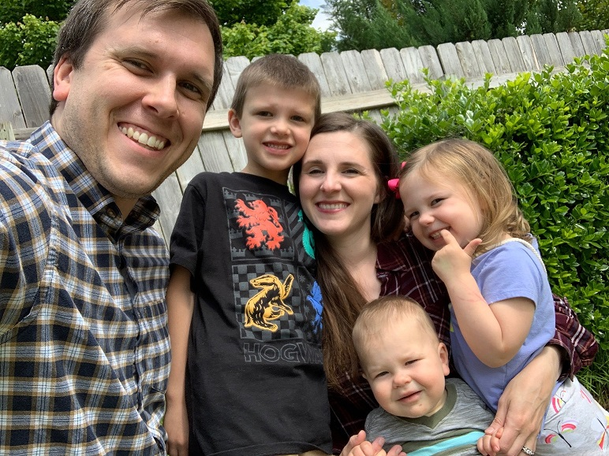

제이슨 가족 사진[왼쪽부터 제이슨, 그레이슨, 놀만, 제이콥, 에벌린]

밝은 표정으로 놀고 있는 그레이슨과 에벌린

  노마드(nomadism), 노마디즘(nomadism)이란 말이 유행이다. 각각 유목민(遊牧民), 유목(민)주의[遊牧(民)主義 혹은 유목민 정신]로 번역되겠지만, 그 내포는 간단치 않다. 우리 같은 농경 정착민으로서는 쉽지 않은 생활양식을 갖고 있는 사람들이 유목민이다. 풀이 우거진 곳을 찾아 천막을 세우고 소떼나 양떼를 기르는 사람들. 그러다가 동물들이 얼추 풀을 뜯어먹었다 싶으면 냉큼 천막을 말아 수레나 말 등에 싣고 또 다른 풀밭을 찾아 떠나는 사람들. 그들은 한 곳에서 진득하게 머물지 않는다. 그들은 누구인가. 철학자 들뢰즈와 가타리는 영토화와 ‘나의 발견’에 바탕을 둔 ‘탈주의 철학’을 고안했지만, 그 근원적 사고가 노마드 혹은 노마디즘에 있음은 명백하다. 특정한 가치나 삶의 방식이란 굴레일 수 있으니, 그에 얽매이지 않고 끊임없이 새로운 자아를 찾아 가고자 하는 것. 그것이 노마디즘이다. 대학 재직 40년 동안 많은 적지 않은 구미인(歐美人)들을 만났고, 두 번에 걸친 미국 체류 기간에도 그들을 만나며 그들의 내면에 남아있는 노마디즘을 찾아낼 수 있었다. 그것이 그들 정체성의 큰 부분이었다.

   2013년 풀브라이트 학자(Fulbright Scholar)로 미국의 OSU(오클라호마 주립대학)에 체류하고 있던 나는 여러 명의 패컬티 멤버들과 교유했는데, 그 중 가장 인상적인 사람이 뛰어난 영어 교육자 제이슨 컬프(Jason Culp)였다. 이미 이 블로그에 그에 관한 글과 사진들을 남긴 바 있는데, 그 글에서 나는 그의 영어를 다음과 같이 묘사한 바 있다.

  **그와 만나는 과정에서 그가 TESOL[Teaching English to Speakers of Other Language/외국어 사용자들을 위한 영어 교육]을 전공한다는 사실을 알게 되었고, 그의 영어가 매우 명료하면서도 정확하다는 점을 깨닫게 되었다. 한국 사람들이라고 모두 표준 한국말을 ‘명료하고 정확하게’ 구사하지는 못하듯, 미국 사람들이라고 모두 표준 영어를 구사하지는 못한다는 사실을 나는 이미 알고 있었다. 영어만으로 분류할 경우 미국에서 만난 미국인들은 대충 네 부류로 나뉘었다. 짤막하면서도 느릿느릿한 영어로 상대방을 편안하게 해 주는 어른들, 진한 사투리 억양으로 상대방을 갸웃거리게 만드는 사람들, 입에 오토바이 엔진을 단 듯 숨넘어가게 지껄여대는 학생들과 젊은이들, 제이슨처럼 교과서적인 영어로 호감을 주는 소수의 지식인들. 가끔 방송에서 목격하는 오바마 대통령, 전 국무장관 힐러리 클린턴, 현 백악관 대변인과 미 국무성 대변인 등의 대중 스피치를 통해 미국 지도자들이나 상류층의 덕목 가운데 ‘언어의 명료성과 모범성’이 큰 자리를 차지한다는 사실을 알게 되었고, 제이슨에게서 그런 스피치의 전형을 확인하게 된 것이었다.**

   이 글을 내 여행기[<<인디언과 바람의 고향 오클라호마에서 보물찾기>>]에 다시 실었지만, 그것으로 그[그의 가족]와의 관계가 끝나지 않은 것은 잊을만하면 도란도란 전해지는 그의 말이 귀를 간질이는 초원의 산들바람처럼 나를 기분 좋게 만들기 때문이다.

마치 내가 넓은 초원의 한 귀퉁이에 오두막을 짓고 사는데, 이곳을 찾아와 잠시 양떼에게 풀을 먹이며 쉬다가 ‘안녕!’을 고하고 떠난 그가 몇 년 후 늘어난 가족들과 양떼들을 몰고 새로운 목초지를 찾아 이곳을 지나다가 내게 또 ‘안녕!’을 고하는 것 같지 않은가. 내가 귀국하고 한 해 뒤에 그는 내게 연락을 해왔다. 한국의 대학에서 잠시 일할 만한 자리가 없겠느냐는 부탁이었다. 통탄할 만큼 좁은 나의 교제범위 때문일까. 시원한 대답을 못해주었다. 미안한 마음을 문면에 담아 이메일을 보냈으나, 한동안 연락이 없었다. 그러다가 6개월쯤 후에 독일로부터 이메일이 날아왔다. 몇 년간 그곳 대학에서 영어를 가르치며 지내게 되었노라는 메시지와 독일에서 낳은 예쁜 딸 에벌린(Everlyn)도 함께 한 가족사진을 첨부하여. 나는 반색을 하며 반가움의 답신을 보내면서 두어 차례 이메일들이 오가다가 다시 한동안 끊기고 말았다.

   코로나 바이러스가 세계를 덮치면서 초강대국 미국도 힘을 쓰지 못하는 나날이 계속되면서 NYU의 교수로 있는 큰 아이[조경현]와 제이슨의 아이들이 걱정이었다. 그런 내 생각이 전해진 것일까. 엊그제 그의 이메일이 ‘거짓말처럼’ 도착했다. 독일에서 임기를 마치고 작년 8월 미국에 귀환 후 잘 지내고 있다는 것, 이번 여름에 이스라엘에 일자리를 잡아놓고 비자를 기다린다는 것, 정년 후 살 집을 사진으로라도 보고 싶다는 것 등을 적은 다음, 새로 태어난 아들 제이콥(Jacob)이 포함된 가족사진을 첨부하여 다음과 같은 이메일을 보내왔다. 우리말로 번역한 그 이메일은 다음과 같다.

**안녕하세요, 조 박사님!**

**나는 당신과 임미숙 씨가 요즘 같은 어려운 시절에 잘 지내시기를 희망합니다. 2020년에 어떤 일이 일어나고 있으며 일어나게 될지 상상할 수 없지만, 그러나 우리는 이렇게 살아 있습니다! 금년 여름 언제쯤 이스라엘로 이사하기 위해 한 번 더 짐들을 꾸리고 있는 우리는 당신에게 이메일을 보내야겠다고 생각했습니다. 나는 당신이 스틸워터를 떠난 후 우리에게 매우 친절하게 보내 준 당신의 책을 발견했습니다. 그레이슨은 한국에서 출판된 책에 실린 우리 가족사진을 보며 대단히 감격해 했습니다. 그는 이제 우리가 세계적으로 유명해졌다고 생각하고 있습니다!**

**나는 당신의 소식을 들었으면 좋겠습니다. 그리고 코로나 바이러스가 세계적으로 퍼진 후에도 당신의 건강이 좋다는 소식을 들었으면 좋겠습니다. 흘러간 시간과 거리가 우리를 떼어 놓았어도, **당신과 임미숙 씨는** 여전히 우리의 친애하는 친구들입니다. 당신을 방문하여 당신의 고향을 보기 위해 한국을 여행하는 것은 아직도 내 꿈입니다. 정년 후 살 집을 완성하셨어요? 낙원 같을 거라는 생각이 드네요. 갖고 있는 사진 좀 한 장 보내 주세요.**

**우리 가족사진 두어 장 첨부합니다. 우리는 2019년 8월 이래 오클라호마에 돌아와 있어요. 우리는 아마도 2020년 6월에 이스라엘로 이사하게 될 겁니다. 그러나 아직 정부로부터 여권들을 받지 못했어요. 그들은 지금 국제 여행을 제한하기 위한 여권의 갱신을 진행하고 있지는 않아요. 그래서 우리가 다시 이동할 수 있을 때까지 참을성 있게 기다리는 동안 우리의 삶은  "보류 중"입니다. 그러나 신에게 감사하게도, 우리는 잘 지내고 있고, 우리가 필요로 하는 모든 것들을 갖고 있지요.**

**당신의 친구 제이슨 드림**

   아, 그는 아직도 노마드의 삶을 살아가고 있구나! 양떼에게 뜯길 풀만 있다면, 세상 어디에 가도 살아갈 수 있는 인간상이 바로 노마드 아닌가. 우리는 어찌하여 특정한 아니 알량한 이념이나 가치 혹은 삶의 방식에 구애 받으며 이 비좁은 한반도 한 구석에 박아놓은 뿌리를 뽑아내지 못하는가. 끊임없이 낯선 곳으로 이동하여 새로운 사람들을 이웃으로 만나고 새로운 자아를 찾으려는 노력을 하지 않는가.

   수백 년이 흘러도 무너지지 않을 시멘트 철근 집을 아름다운 에코팜에 ‘뚜드려 지으면서’ 걸림 없는 노마드 친구의 이메일을 곱씹어 보노라니, 노마디즘을 찬양하고 노마드의 삶을 동경하면서도 그 반대방향으로 치달아가는 내 몰골이 영 마뜩치 않다. 어디선가 맛나고 멋진 풀들이 자라고 있다는 소식이 들려올 때, 나는 어떻게 천막을 말아 짊어진 채 내 소떼를 몰고 그곳으로 달려갈 것인가. 걱정 또 걱정이다.

공유하기

게시글 관리

**백규서옥\_Blog ver.**