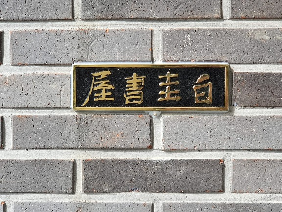

백규서옥의 옥호[은사 연민 이가원 선생님의 유작/연민체]

                                                                                                                     조규익

2020. 6. 30. 무성산 끝자락 조용한 곳에 그동안 내 환상 속에만 존재해 오던 백규서옥을 드디어 실물로 완공했다. 만 5개월 동안의 큰 역사(役事)였다.^^ 50여 년 전 대여섯 살 무렵, 당시 젊은 부모님께서 나무와 흙으로 지으시던 고향집의 추억이 아련히 남아 있는데, 마음속의 그 그림 위에 '내 집'을 덧 지은 것이다.

무성산의 용맥(龍脈)이 흘러내려 혈(穴)을 맺은 곳. 그 안온한 곳을 내 최후의 은거처(隱居處)로 삼은 이유는 무엇인가. 그간 제법 많은 곳들을 떠돌아다녔고, 정처 없이 그려온 노마드(nomad)의 궤적 속에 내 알량한 내면은 무거운 피로감으로 절어 온 게 사실이다. 마무리해야 할 공부들은 아직도 수두룩한데 세상은 내 뜻처럼 움직여 주지 않고, 내 사고방식이나 삶의 양식은 더 이상 세상의 추이(推移)와 맞지도 않음을 절감한다. 그럴 경우 굴원(屈原)이 그려낸 <어부사(漁父辭)> 속의 어부처럼 방향을 틀어 세상에 맞추거나 조화를 가장한 아부라도 떨어야 마땅한 일이나, 그렇게 하고서야 내 성격에 어찌 단하루인들 맘 편히 살 수 있겠는가. 내가 핍박했고 나를 핍박해온 사회에서 내 불만과 불행의 원인을 찾으려는 게 아니라, 안으로 돌이켜 나를 반성하는 데서 내 자아와 본래 면목을 찾으려는 것이니, 저 석문(釋門)의 이른바 ‘회광반조(廻光返照)’ 정신과 다름이 없을 것이다. 내 자아를 다시 찾기 위해 지금 이 자리에서 허둥대지 않고, 이미 어긋난 세상과 나를 일치시키기 위해 궤변과 아부를 농하려 하지 않는 것도 그 때문이다. 애당초의 출발점으로 돌아가고자 하는 것도 바로 그 때문이다.

그런 생각으로 집을 짓기 시작했다. 무엇보다 올해 그 거사에 착수할 수 있었던 것은 학교로부터 받은 마지막 연구년 덕이었다. 그러나 일을 시작한지 몇 발짝 만에 코로나 바이러스가 세계를 강타했다. 하루 앞을 내다볼 수 없는 상황이 계속되면서 ‘집을 짓는 일’이 난감했고 남 보기에도 미안했지만, 내친걸음을 돌이킬 수 없었던 것은 ‘원래의 나로 돌아가는 일’은 대안 없는 선택지였기 때문이다. 뿐만 아니라 나를 철석같이 믿고 있는 가족들을 태운 채 달리던 내 차의 핸들을 급히 꺾을 수 없었기 때문이고, 어려운 시기 잠시라도 내게 와서 자신의 기술을 제공하겠다고 나선 장인(匠人)들의 모습이 너무 안타깝게 다가왔기 때문이다.

공사 기간 동안 참으로 성실하고 실력 출중하며 성격 좋은 분들을 많이 만났다. 담건축사사무소 남궁 담 대표, 임전수 감리사, 김병호 대목장(大木匠), 천명선・이종식・양승만・김수남・김창례 목장(木匠), 이재필 전기장(電氣匠), 고현용 조적장(組積匠), 상량문을 써 주신 서예가 우공(愚工) 이일권 선생, 나를 대신하여 모든 관리업무를 총괄해주신 유수근 사장 등 각 분야의 뛰어난 전문가들과, 레미콘・타일・벽돌・기와・철근・창호・각종 장식 돌・각종 건재・중장비・미장・설비・용접・난방・목공・페인트 등을 제공한 거래처와 도움을 아끼지 않으신 전문가들의 수를 헤아릴 수 없으며, 단계마다 노역을 제공해주신 분들의 이름도 일일이 열거할 수 없다. 그 뿐인가. 안정적인 전력을 공급하기 위해 전봇대를 세우고 전선을 이어주신 전력회사 직원들과 엔지니어들, 인력들의 맛있는 점심을 늘 시간에 맞게 제공함으로써 일에 차질이 생기지 않도록 해주신 부흥식당 정연희 사장도 잊을 수 없다.

백규서옥의 기념 동판

백규서옥을 지으며, ‘집을 짓는 일’이란 단순한 기술이 아니라 영혼을 일깨우는 종합예술임을 알게 되었다. 건축주와 장인들의 끊임없는 소통을 통해 재료들에 숨결을 불어넣고, 그 숨결이 음표로 바뀌어 생명을 노래하고 춤추는 마술임을 알게 되었다. ‘집을 짓는다’는 건 자기만의 세계와 자아의 존립근거를 마련하는 일이다. 집이 없으면 정주(定住)할 수 없고, 정주하지 못하면 다른 사람들과 공존할 수 없으며, 자신의 변함없는 존재를 입증하기 어렵기 때문이다.

앞에서 말한 대로 그동안 백규서옥은 내 환상 속에만 존재해 왔다. 은사 연민(淵民) 이가원(李家源) 선생님께서 내려주신 이 옥호(屋號)의 이면에는 이상을 품고 노력하여 그것을 현실 속에서 구현해보라는 지엄한 명령이 들어있다. 시류(時流)에 영합하여 세상 사람들과 이해를 다투지 말고, 자신의 흠결을 갈아내기 위해 수양할 것이며, 항상 근원을 추탐(推探)하여 내 존재의 본질을 꿰뚫어보라는 것이 그 명령의 핵심이다. 그러기 위해서라도 조용한 곳에서 주경야독(晝耕夜讀)을 통해 자아의 본래면목을 깨달을 필요가 있었다. 세상의 극심한 혼란 속에서 건축을 강행할 수밖에 없었던 것도 바로 그 때문이다. 이것이 ‘무성산 백규서옥 건축’의 정신적 바탕이다. 바야흐로 그 생각을 실행에 옮길 때가 되었다.

정면에서 바라본 백규서옥

백규서옥 문앞에서 백규

백규서옥 기념동판 앞에서 포즈를 취한 관계자들[왼쪽부터 임미숙・임효수・대목장 김병호・백규・총관리 유수근・목장 이종식・전기장 이재필・목장 김창례. 중앙에 유 사장의 상추도 함께 했다.]

공유하기

게시글 관리

**백규서옥\_Blog ver.**