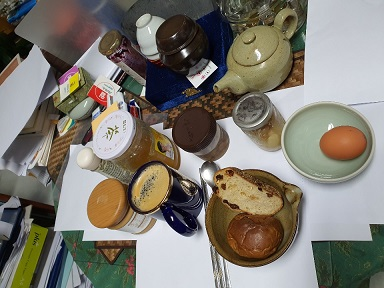

                                                                                                                                                                                                                                                                                         조규익

#### 나는 대부분 연구실에서 점심을 혼자 빵으로 때운다. 요즘 시중에는 맛난 빵들을 구워 파는 집들이 제법 많아졌다. 누구네 빵집이 맛있다고 매스미디어에라도 뜰라치면 빵집 주인들은 달려가 냉큼 배워온다고 한다. 그 뿐 아닐 것이다. 젊은이들 중에는 제빵의 달인이 되고자 세계 ‘빵의 나라들’에 유학을 하며 배워오는 모양이다. 10여 년 전 프랑스를 여행할 때 그곳 제빵 학원에 유학 나온 한 젊은이를 만난 적이 있었다. 고생하면서도 빵의 달인이 되려는 의지로 충만한 그가 참으로 경이롭고 존경스러웠다. ‘할 일 없으면 잠이나 처잘 것이지, 그 비싼 돈 들이며 빵 배우러 프랑스에 간단 말이여~?’ 라고 일언지하에 꾸중을 듣던 시대에 태어나 자란 나로서는 참으로 놀라운 만남이었다. 그런 젊은이들이 나이가 들고 자리를 잡으면서 우리네 빵 산업도 세계와 어깨를 겨룰 정도가 된 것 아닐까. 후배 세대가 만드는 그런 빵의 덕을 나는 톡톡히 보고 있는 셈이다.

#### 

#### 어쨌든 빵은 두 쪽으로 충분하다. 그러나 여기에 따라야 할 것들이 적지 않다. 버터, 치즈, 잼, 커피 등이 대중적인 것들이지만, 내 점심상에는 ‘꿀에 잰 마늘’과 ‘매실조림’이 더 오른다. 그리고 즉석에서 쪄낸 계란 한 알로 모자라는 단백질을 보충하곤 한다. 다 먹은 뒤 아무래도 서운하여 나만의 레시피로 제조한 디저트를 꺼낸다. 얇게 썬 완숙 토마토에 올리고당과 매실청을 부어 밀봉한 다음 냉장고에 넣고 1주일간 숙성시킨 음식이다. 점심식사 후 그 중 일부를 덜어 직접 만든 요플레와 아몬드 몇 개를 섞으면 어디 내 놓아도 꿀릴 것 없는 최고의 디저트가 된다.

#### 

#### 내가 지금 점심을 호화판(?)으로 먹고 지내노라는 자랑을 하기 위해 이 글을 적는 건 결코 아니다. 핵심은 설거지에 있다. 원래 띄엄띄엄 먹던 ‘연구실 혼밥’이 코로나가 창궐하면서는 일상이 되었다. 그런데 다양한 음식 용기들을 수용하려면, 가뜩이나 좁은 책상이나 응접탁자가 터질 지경이다. 설거지 거리들이 많은 것도 ‘당근’이다. 밥상이 작든 크든 먹고 나면 설거지는 피할 수 없는 고역이다. 사람들이 내 말을 믿을지 의문이긴 하나, 나는 처음부터 설거지가 싫지 않았다. 아니, 오히려 설거지를 즐긴 지가 꽤 오래 되었다.

#### 사실 혼자 점심을 먹다 보면 이런 저런 생각들이 많이 떠오른다. 주로 당장 해야 할 일들, 누군가가 나에게 던진 실언이나 의도치 않은 실수, 잘 나가던 논문이 봉착한 난관 등등. 많은 것들이 음식과 함께 씹혀 내 안으로 들어온다. 식사가 끝날 무렵 이것들이 뒤엉키면 모색해야 할 방향은 오리무중이 되고 만다. 그 상태에서 주섬주섬 그릇들을 챙겨들고, 각 연구실의 조교나 근로학생들이 설거지하러 오기 전 잽싸게 탕비실로 달려가 설거지에 몰입한다. 내가 경험한 설거지의 장점은 다음과 같다.

#### 

#### 첫째, 맛난 음식들에서 이렇게 지저분한 찌꺼기가 나온다는 사실을 눈으로 확인하면서 만남이나 모임의 끝이 어떠해야 하는가를 깨닫게 된다.

#### 둘째, 지저분한 찌꺼기와 때가 시원하게 씻겨나가는 모습을 보면, 식사 도중 떠올랐던 복잡한 상념들이 한꺼번에 정리되면서 일종의 카타르시스를 경험한다.

#### 셋째, 궁극적으로 남들에 대하여 가졌던 서운한 감정이 대부분 물과 함께 씻겨 나가고 그 원인이 나 스스로에게 있었음을 깨닫게 된다.

#### 

#### 설거지를 하고 나서 몸과 마음이 가뿐해지는 이유를 요 근래 ‘가만히’ 생각해보는 버릇이 생겼다. 그러다가 최근 깨달은 것이 바로 앞에 제시한 세 가지 이유들이다. 물론 앞으로 더 많은 것들이 생각날 수도 있겠지만, 대부분 이 세 가지 범주에서 벗어나지 않으리라.

#### 그렇다면 나는 왜 이러한 깨달음에 이른 것일까. ‘그릇을 닦는다’는 행위와 ‘마음을 닦는다[수신(修身)]’는 행위 간에는 긴밀한 유사성이 있다.  원래 마음은 객관화될 수  없기 때문에 은유로만 표현될  수  있을  뿐이고, 그 경우 '마음을 닦는다'는 취의(趣意)를 객관적으로 보여주기 위해   ‘그릇을 닦는 것’을 유의(喩意)로 끌어왔을 뿐이다. '그릇을 닦는 것'은 행주로 그릇의 때를 빼는 행위이지만, ‘마음을 닦는다’는 것은 좋은 말이나 글 혹은 깨달음을 통해 마음 속의 사악함을 정화시키는 행위이기 때문에 처음부터 둘 사이에는 거리가 있었다. 그러나 오랜 세월 의미의 탐색작용과 결합작용을 통해 인간은 ‘그릇을 닦는다’는 것과 ‘마음을 닦는다’는 것 사이에 이중적 상상을 통한 은유 관계가 성립됨을 알게 되었을 것이다. 그 유산을 물려받은 나도 그릇을 닦으며 ‘내 마음의 때를 닦아내고 있다’는 ‘수신(修身)’의 본질을 결국 떠올리게 된 것이나 아닐까.

#### 

#### 어쨌든 ‘혼밥 점심’을 통해 영양소를 섭취하고 세상사를 사색할 뿐 아니라, 그 설거지를 통해 ‘수신’이라는 망외(望外)의 소득까지 올리고 있는 나로서는 이 두 행위를 마다할 이유가 없다. 아니 오히려 ‘혼밥 점심시간’이 은근히 기다려지기도 한다.  ‘접시 닦이 알바’를 하던 초창기 미국 유학생들[혹은 그 부인들]이 혹시 이런 생각을 하며 그 고역을 견딘 건 아니었을까 하는 객쩍은 생각까지 하게 된 것도 최근의 일이다. 어쨌든 나는 ‘혼밥 점심과 설거지’가 좋다.

공유하기

게시글 관리

**백규서옥\_Blog ver.**