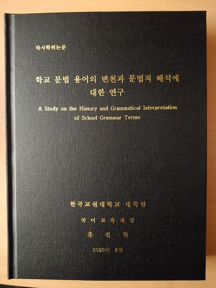

에코팜 농막의 마무리 작업, 풀과의 전쟁, 한없이 밀리고 있는 집필 작업 등으로 심신이 피로한 나날이다. 그것뿐인가. 코로나가 잦아들기는 고사하고 근래 들어 부쩍 치성(熾盛)해지는 양상을 보여주니, 안팎으로 스트레스가 만만치 않다. 그래도 게으름 부릴 수는 없는 일.

아침 일찍 잠자리에서 일어나 신착 이메일을 검색하려니 낯익은 이름 하나가 뜨는 게 아닌가. 홍정현! 아, 오래 전에 졸업한 제자가 보내 온 소식이었다. 잽싸게 메일을 열고 읽으면서 눈시울이 붉어졌다. 옆에 있는 아내에게 큰 소리로 읽어주니, 그녀도 감동한 듯 울먹거린다.

98학번이라? 우리가 미국에 있던 해에 국어국문학과의 새내기로 들어온 그녀였다. 2002년도에 졸업, 올해로 벌써 18년 세월의 강이 흘러내린 것이다. 졸업 후 편입한 춘천교대를 졸업, 초등학교 교사가 되었고, 40 가까운 나이에 한국교원대에서 석사・박사과정을 마치고, 바로 어제 교육학박사가 되었다는 것이다. 아내・어머니・교사로서의 현실적인 삶을 꾸려 나가며 절치부심 공부에 매진해온 그녀의 쉽지 않았을 세월이 파노라마처럼 내 눈앞에 펼쳐졌다.

얼마나 힘들고 외로웠을까. 공부하면서 ‘힘들고 외로웠다’는 말의 의미를 세상 사람들이 모두 이해할 수 있는 건 아니리라. 아직도 이 땅의 젊은이들 대부분은 세상 사람들의 후진적 편견과 싸워야 한다. 프리미엄 없는 자들이 유형무형의 유산을 갖고 있는 자들과 적어도 어깨를 나란히 하기 위해서는 엄청나게 고통스런 노력이 필요하지 않겠는가.

홍정현 박사. 이제 어엿한 국어교육학박사로서 새로운 출발선에 섰다. ‘한 사람의 삶에서 매 순간은 늘 새로운 출발선’이라는 점. 그건 내 스스로 삶의 경험에서 깨달은 진리다. 다만 어떻게 출발할 것이며 다시 어떤 출발선에 서게 될 것인지는 그녀가 감당해야 할 몫이다.

인간승리의 모범적 사례를 내 제자에게서 확인한 오늘. 그간의 피로가 말끔히 사라졌으니, ‘제자만 못한 선생’이라는 비아냥거림을 받지 않기 위해서라도 다시 신발 끈을 조여 매어야 할 것이다. 홍 박사 만세!^^

\*첨부: 홍정현이 보내온 메일

교수님, 안녕하세요.

정말 오랜만에 인사 드립니다.

저 98학번 홍정현입니다.

너무 오래전이라 교수님께서 저를 기억하실지 모르겠어요.

2002년에 졸업했으니 벌써 18년이라는 시간이 흘렀습니다.

졸업 후에 제가 춘천교대로 편입하여 졸업하고,

춘천에서 초등학교 교사로 근무할 때 세은이와 함께 찾아 뵈었던 기억이 납니다.

그 후에 처음으로 연락을 드립니다.

뵙고 싶은 마음이 가득하면서도 그 흔한 전화 한 번을 못 드리고

백규서옥에서 교수님의 글을 읽으며 그리워하기만 하며 지냈습니다.

잘 지내셨지요?

저는 춘천에서 3년을 근무하고,

천안에 직장이 있는 사람을 만나 결혼 하면서 천안으로 근무지와 주거지를 옮겼습니다.

그리고 연년생 남매를 낳아 키우다가

40이 가까운 나이에 청주에 있는 한국교원대학교에서 뒤늦게 공부를 시작했습니다.

그리고 바로 오늘, 8월 24일자로 대학원 박사과정을 마치고 졸업을 하였습니다.

논문을 쓰는 인고의 과정 내내

논문이 완성되면 꼭 교수님께 논문 들고 찾아뵙고 싶다는 생각으로 힘든 시간을 버텼습니다.

비록 상황이 좋지 않아 당장 찾아뵙지는 못하겠지만, 졸업하는 날 교수님께 메일로라도 꼭 인사를 드리고 싶었습니다.

교수님께서 언젠가 제게,

공부란 할 수 있을 때 다부지게 해 볼 필요가 있다고 말씀하신 적이 있습니다.

그때 멋지게 해냈어야 했는데.... 다부지게 공부할 수 있는 시기를 모두 지나 보내고

부끄럽지만 아이들을 노모께 전적으로 부탁드리고 뒤늦은 공부를 했습니다.

제가 어떤 분야를 공부했는지 말씀을 안 드렸네요.

비록 초등교사이지만 문법 분야에 관심이 많아서 교원대 사범대 국어교육학과에서 문법을 전공했습니다.

사범대에 속한 대학원이다보니 중등교사들이 많고,

초등교사라는 제 직업이 주는 편견의 굴레가 제게 늘 씌워져있어 서러움도 있었습니다.

저의 열등감인지는 모르겠으나

초등교사이니 국어의 제반 분야를 제대로 알지 못할 거라는 편견이

함께 공부하는 대학원생들에게도, 또 일부 교수님들께도 있었던 것 같아요.

그런 시선들에 부딪혀 아플 때마다

"나는 숭실대 국문학과 출신이야."를 마음 속으로 새기며,

또 한편으로는 교수님께서 학문에 쏟으셨던 열정적인 모습과 학문을 대하시던 진지한 자세를 생각하며 마음을 다잡았습니다.

교수님, 20년 가까운 세월이 지나도록 저의 사표(師表)가 되어 주셔서 정말 감사합니다.

그리고 언제 뵙게 될지는 모르겠지만 이 힘든 시기가 좀 지나면 꼭 찾아뵙겠습니다.

전화를 먼저 드려야 하나 고민을 했는데,

연구실로 불쑥 전화를 드리기가 겸연쩍어 메일을 먼저 올립니다.

뵙는 날까지 부디 평안하고 건강하시기를 기원합니다.

2020년 8월 24일

제자 홍정현 올림.

공유하기

게시글 관리

**백규서옥\_Blog ver.**