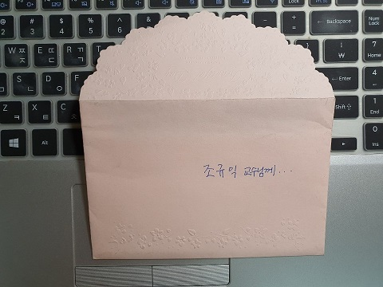

내일은 에코팜으로 이사 가는 날이다.

조금 전 서재를 정리하던 중 미색 봉투 하나가 눈앞에 툭 떨어졌다.

급히 내용물을 꺼내 펼쳤다.

아, 깨알 같은 글씨의 정성을 다한 편지였다.

겨우 한 주 남짓 전 블로그에 소개한 제자 홍정현 박사가 학부 시절에 보내 준 편지. 읽다가 가슴이 뭉클해지면서 따스한 행복감이 전신에 번졌다. 편지라기보다는 다정한 음성이 뚝뚝 떨어지는 녹음테이프같은 것이었다. 스승의 날을 며칠 앞두고 보낸, 정감 넘치는 편지였다.

2000년이면 그녀가 학부 3학년 때였으리라. 매사에 허점이 많은 내가 어찌 그녀의 편지를 이렇게 고이 간직하고 있었을까. 어쩌면 이 편지를 받고 고마운 마음에 무엇으로라도 그녀를 상찬(賞讚)해야겠다는 마음을 먹었을 것이다. 그러나 평소의 내 장기(長技)대로 깜빡 잊어버린 채 오늘날까지 밀려오게 된 것이다. 그런데, 참 이상하지 않은가. 8월 25일에 나는 그녀로부터 박사학위를 받았다는 소식을 이메일로 받고, 감동의 마음을 블로그에 올린 바 있었다. 그로부터 겨우 열흘이 지난 오늘. 30여년이나 묵은 서재의 종이뭉치와 책 더미들을 간신히 정리하던 중이었는데, 흡사 ‘교수님 저 여기 있어요!’하는 외침이라도 내뱉듯 생생하게 내 눈 앞에 현신한 그녀의 편지였다.

세월의 여울에 떠밀려 오는 동안, 편지를 받은 사실도 그 내용도 까맣게 잊고 있었다. 다시 읽어보니 그녀의 나직하면서도 다정한 목소리가 오롯이 살아 있었다. 그동안 답답한 종이더미 속에서 용케도 살아 있었구나! 수많은 제자들을 맞이하고 떠나보내는 일을 반복하며 긴 시간을 살아온 나는 졸업축사를 하게 되는 경우 빼놓지 않는 말이 있다.

“앞으로 10년 후 여러분은 이 사회의 어느 분야에선가 나름의 존재감을 드러내며 살게 될 것입니다. 그러니 치열한 10년을 보낸 후 나를 찾아와 여러분의 성장한 모습을 보여주기 바랍니다. 지금 나와 함께 ‘10년 후 재회’의 약속을 합시다!”

그녀가 내게 보낸 편지를 20년 만에 다시 찾았고, 박사학위를 받은 모습으로 내 앞에 나타난 것은 18년 만이지만. 그게 무슨 문제이랴. 18년 만에 교육학박사가 된 그녀를 만났고, 20년 만에 학부 3학년의 그녀를 재회했으니, 이보다 더 기쁜 일이 어디 있으랴. 내일 이사가 매우 순조로울 것이고 에코팜에서의 삶이 행복할 것임을 강하게 암시하는 '멋진 조짐'이 아니면, 그 무엇이란 말인가.^^

\*\*\*

홍정현이 2000년 5월 12일에 보내준 ‘스승의 날’ 축하 편지

조규익 교수님께

교수님! 안녕하셨어요?

저 홍정현입니다.

오랫동안 찾아뵙지 못해 죄송해요.

한동안은 시험 때문에 좀 바빴습니다.

교수님께선 어떻게 지내셨는지요?

몇 번인가 홈페이지에 들렀었는데, 글은 남기지 못했습니다.

그곳에서 새로운 사실을 알게 되었는데, 홈페이지 제작자가 아드님이더군요.

정말 놀랐어요.

아직 어린 학생이라고 알고 있었는데, 컴퓨터를 잘 다루는 모양이에요.

전 홈페이지 제작의 경지에 오르려면 아직~ 멀었는데 말이에요.

전에 편찮으시다고 하셨는데, 이제는 완쾌하셨죠?

항상 건강하셔야 해요.

그러셔야지 지금과 같이 ‘참 학자’의 모습으로 연구하실 수 있으시잖아요.

스승의 날을 맞아서, 교수님께 진심으로 존경과 감사를 드립니다.

언제나 제게 아버지의 이미지가 되어 주시는 교수님의 배려에 큰 힘을 얻고 있습니다.

다시 한 번 감사드리고요.

든든한 제자가 될 수 있도록 노력하겠습니다.

교수님 가정에 평화와 사랑이 가득하시길 빕니다.

2000년 5월 12일 금요일

-제자 홍정현 올립니다-

공유하기

게시글 관리

**백규서옥\_Blog ver.**