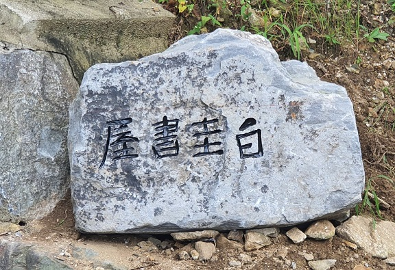

터 파기 공사 중 나온 돌에 옥호(屋號)를 새기고...

## 잡답(雜沓)의 메트로폴리스 서울에서 정밀(靜謐)의 공간 에코팜으로!

## 드디어 삶의 터전을 옮겼다. 2020년 9월 2일엔 당진의 막내 동생 병원에 10년 가까이 보관해 두었던 책 짐을, 5일엔 서울 아파트의 책들과 살림살이들을, 12일엔 학교 연구실의 책 짐을 각각 실어 나름으로써 세 차례에 걸친 이사의 대장정을 마쳤다. 이제 내 생애 노마드의 천막을 걷어 나귀 등에 싣는 일은 더 이상 없을 것이다. 에코팜에 뿌리를 내려 살다가 때가 되면 그 옛날의 은자(隱者)들처럼 자취 없이 땅 속으로 스며들 것이다. 올해로 서울 살이 장장 33년째. 서울 안에서 두 번째 이사 후 정착한 1992년으로부터는 28년 만에 서울을 뒤로 하게 된 것이다.

## 

## 가슴이 후련했고 발걸음은 날 듯이 가벼웠다. 30년을 넘게 살아도 서울은 ‘늘 타향’이었다. 내 집에 살면서도 잠시 세 들어 사는 것처럼 낯설고 불편했다. 문만 열면 가게들과 병원들, 교통수단들이 손에 잡힐 만한 거리에 늘어서 있으니, ‘서울 생활이 불편하다’는 것은 어폐(語弊)가 있는 표현이리라. 그런 차원의 불편이 아니다. 먼 길을 가던 중 잠시 쉬어가려 짐을 내려놓았다가 인파에 휩쓸려 어정세월 30년을 넘긴 지금, 정신을 차려보니 가야 할 길이 까마득하지 않은가. 사람들에 부대끼며 익힌 처세술이나 생존방식 자체의 바탕이 바로 불편 아닌가. 내겐 자성(自性)을 관조(觀照)하지 못한 채 희희낙락 유물론적 편안함에 안주하는, 그 자체가 불편이었다. 그래서 20여 년 전부터 내 나름의 ‘가거지(可居地)’를 물색해 왔다. 그러던 중 8년 전 에코팜을 발견했고, 그간 농사를 지어오다가 드디어 올해 집을 짓게 된 것이다.

## 정년 전 한 차례 ‘1년의 연구년’이 남아 있었는데, 그 기회가 바로 올해 주어졌다. 사실은 연구년의 호기(好機)에 일본의 모 대학으로 건너가 그간 진행해 오던 연구 프로젝트를 마무리하려 했으나, 코로나로 접을 수밖에 없었다. 그 대신 착수한 것이 바로 ‘에코팜에 집짓기’였고, 불안과 초조 속에 6개월 만인 지난 7월 말 완공했으며, 50여일의 장마와 태풍이 휩쓸고 간 이달 초・중순에 이사를 단행하게 된 것이다.

## 

## 지난 8년간은 이곳의 풍토와 문화에 적응해온 기간이었다. 주민들과의 심리적 거리를 좁혀야 했고, 농촌 친화적인 사고방식도 갖추어야 했다. 잡초를 뽑거나 작은 나무들을 심고 큰 나무들의 가지치기를 하면서 생산의 의미를 체득하게 된 것은 물론, 내가 익혀 온 도회적 사고방식을 송두리째 버릴 수도 있게 되었다.

## 땅이 전하는 소리를 들을 수 있어야 이 공간에서 통용되는 삶의 양식도 이해할 수 있었으니, 동 트기 전 잠자리에서 일어나 정안천변을 산책하며 온갖 새들과 고라니들을 만나고, 갈대들 사이로 흘러내리는 맑은 물의 의미를 깨닫는 것은 나의 내면을 정비하기 위한 필수적인 일과였다. 동네 어른들을 만나 농사일을 묻는 것은 이 지역의 풍토를 호흡하여 내 육신의 자양분으로 삼기 위한 수양이자 공부였다. 농사일에 관한 대화는 토착민들과의 소통에 절대적인 의미를 갖는다. 땅을 통해 사람과 사람 사이의 체온이 전달되고, 마음과 마음이 연결되기 때문이다.

## \*\*\*

## 언젠가 연못을 만들었다. 습기가 많아 늘 물이 질척이는 곳을 파고, 그 곁으로 우회도로를 뚫었으며, 연못 맞은편에 채소밭을 만들었다. 관성지(觀性池)라 명명한 연못을 틈틈이 돌며 내면을 관조하노라면, 복잡하던 마음은 한결 차분해진다. 만들고 보니, ‘화룡점정(畵龍點睛)’이 따로 없다! 미꾸라지 1kg과 손바닥 크기의 보리붕어 다섯 마리를 풀어 놓으니 관성지에 아연 생기가 돌고, 맹꽁이도 개구리들도 덩달아 몰려들어 자리를 잡았다. 잠자리는 알을 뿌리느라 꼬리를 물에 내리기 일쑤이고, 이 동네 길냥이들도 목을 축이며 제 그림자를 내려다보곤 한다. 조만간 이 고을의 진객 백로도 날아 올 것이다. 관성지를 한 바퀴 돌면 채소밭이라, 배추와 무를 바라보며 농부로서의 내 정체성을 확인하는 재미도 쏠쏠하다. 채소밭 옆으로 펼쳐진 풀밭에는 3년 전에 심은 30 그루의 소나무가 제법 꼴을 갖추어 가는 중이다. 소나무의 거침없는 기상을 바라보며 에코팜에 들어온 것이 내 생애의 ‘첫 성공사례’임을 실감한다.

## \*\*\*

## 이해관계의 메커니즘 속에서 늘 불편하던 공간이 서울이었다. 사람 사는 곳이니, 에코팜이라고 어찌 이해관계와 무관하랴. 다만 자연에 몸을 의탁한 이상, 인위(人爲)의 이악스러움을 훨씬 자주 순화시켜갈 수는 있을 것이다. 좀 더 나은 방향으로 변해가는 내 모습을 관성지에 비춰보며 자꾸만 흠을 닦아내다 보면, 저 후덕한 무성산의 능선을 닮아가지 않겠는가.

## 30년 묵은 짐들의 정리를 가까스로 마무리한 오늘. 조만간 ‘에코팜 찬가’가 나오길 기대하며, 나 자신과 강호의 벗님들께 ‘무성산 에코팜의 약속’을 조용히 상기시키고자 할 따름이다.

## 

## 2020. 9. 30.

## 백규

관성지(觀性池)

잠시 쉬는 틈에 영빈이와 대화를...

서재 안의 연구실

서재

공유하기

게시글 관리

**백규서옥\_Blog ver.**