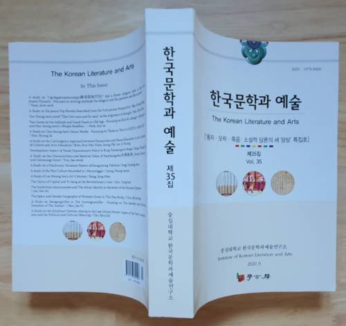

### 

### <<한국문학과 예술>> 제35집을 발간했습니다. 하나의 학술지가 확고히 자리를 잡으려면 70~80호는 발간해야 한다고 보는데, 35집은 이른바 '꺾어지는 홋수'로서 안정을 향해 달려가는 과정에 비로소 진입했음을 의미합니다. 초심(初心)을 유지하며 100호[집]를 훌쩍 넘긴 다수의 학술지들을 경이롭게 바라보며, 우리가 그런 학술지들과 어깨를 나란히 하기 위해서라도 매 순간 기본을 다질 필요가 있음을 절감합니다.

### '문학과 예술의 융합적 연구가 저희들이 지향하는 목표입니다만, 그게 말처럼 쉽지 않은 과제임을 항상 느낍니다. 무엇보다 제도적·재정적 지원이 지속되어야 하는데, 현실은 그렇지 못합니다. 지금 학계에서 각종 연구소와 학술단체들이 활발하게 움직이고는 있지만, 열악한 현실 때문에 내실을 기할 수 없는 것이 큰 문제이고, 우리 연구소 또한 거기서 자유롭지 못합니다. 그럼에도 불구하고 우리는 연구소에 '볕드는 날'이 도래하리라는 희망 아래 최선을 다하는 중입니다.

### 2006년 한국전통문예연구소로 출범했고, 그 후 한국문예연구소로 한국문학과예술연구소로 개명해 오면서 우리의 지향점은 예술작품에서 문학과 예술의 행복한 결합 양상을 분석하여 논리화 시키는 일이었고, 앞으로도 그 지향점은 변하지 않을 것입니다.

### 사실 근대 이전의 작품들 가운데는 문학과 예술의 융합체가 비일비재였고, 그런 작품들의 본질을 분석하기 위해서라도 잘 만들어진 도구가 절실한 것이 오늘날의 현실입니다. 그러나 아직 효율적인 분석도구를 만들어내지 못하고 있는 것이 우리의 현주소입니다. 앞으로 이런 문제의 해결을 위해서라도 우리 모두 협업(協業)의 정신 아래 활발한 대화의 장을 마련해야 하리라 봅니다. <<한국문학과 예술>>은 그런 필요성에 부응하기 위해 만들어진, 드문 학술지입니다.

### 앞으로 더 잘해 보겠습니다. 우리 학술지에 많은 관심 가져 주시고, 적극적인 지도와 편달 또한 아끼지 말아 주시기 부탁드립니다.  고맙습니다.

### 2020. 11. 2.

### 한국문학과예술연구소   조규익 드림

\*\*\*\*\*\*\*\*\*\*

### 

### <<한국문학과 예술>> 제35집

### [‘풍자・오락・죽음: 소설적 담론의 세 양상’ 특집호]

### 

### 목차

### **특집논문 : 풍자・오락・죽음: 소설적 담론의 세 양상**

### 1. 윤준섭, 조선 후기 화훼류 우언 <리국각매문답(籬菊閣梅問答)> 연구

### 2. 배정상, 일인칭 시점 딱지본 대중소설 연구

### 3. 서신혜, 유영모의 죽음철학 시작점으로서의 소설 「귀남과 수남」

### 4. 박선애, 노년의 고독과 좋은 죽음에 관한 두 시선 - 김기창의 <모나코>와 한승원의 <피플붓다>를 중심으로

### **일반논문**

### 5. 한경자, 최승희의 러시아 공연 작품 분석 : 1956~1957 공연 프로그램을 중심으로

### 6. 김은혜, 문화예술교육의 맥락에서 인문정신문화와 무용교육의 융합적 접근 모색

### 7. 성영애, 연산군대(燕山君代) 여악(女樂) 확대정책의 전개양상

### 8. 임재욱, 새로 발견한 금보 <<南薰舊譜>>의 특징과 자료적 가치

### 9. 장경우, 강령탈춤 대본의 통시적 변이양상 연구

### 10. 정영문, <한양가>에 나타난 한양의 놀이문화 연구

### 11. 강정화, 이광수의 미술비평문 연구

### 12. 안용희, 자본의 광학과 루저 혁명가 이상

### 13. 이주미, 조선족 서신을 통해 본 조선족의 경계인 의식과 민족 정체 성 –문화대혁명 이후 한중 수교 전까지의 서신에 나타난 '아리랑'을 중심으로

### 14. 최미정, <<신대륙>> 여성수필의 공간과 젠더지리

### 15. 반재유, 경남일보의 삼강의일사 연구

### 16. 조규익, 고려 말 ｢신찬태묘악장(新撰太廟樂章)｣ 연구-텍스트 구성양상과 그 정치・문화적 의미

공유하기

게시글 관리

**백규서옥\_Blog ver.**