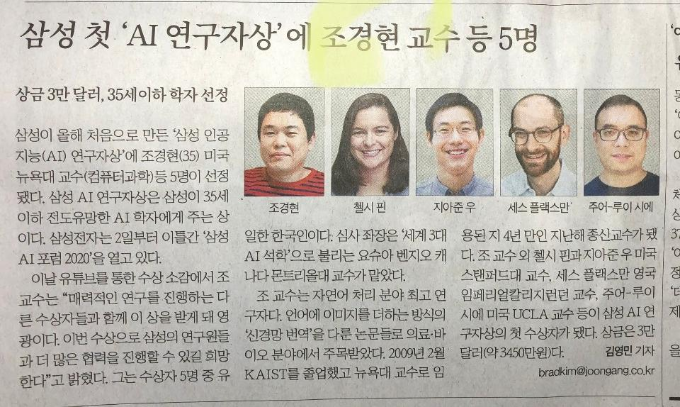

## 

<중앙일보> 2020년 11월 4일자 기사

### 아침 일찍 초코와 동네 한 바퀴 산책을 마치고 거실에 들어오는 순간, ‘까톡!’소리가 울렸다. 대학 동기들 단톡방에 스크랩된 신문기사 한 건이 친구 이대구[전 충남교육청 정책개발담당 장학관]의 멘트와 함께 올라오는 것이었다.

### 

### 무슨 일이지? 안경을 찾아 쓰고 찬찬이 살펴보니, 경현이에 관한 기사였다. 삼성에서 제정한 ‘AI 연구자상’의 첫 수상자로 경현이를 포함한 다섯 명의 세계 학자들이 선발되었다는 내용이었다. ‘유일한 한국인 수상자 조경현’이 중심에 들어 있는 것은 한국 신문의 기사이기 때문일 것이다. 어쨌든 내 놀라움은 컸다. 그간 열심히 노력하여 AI 분야[특히 딥러닝을 이용한 자연어 처리]의 ‘탁월한 연구’로 인정받아 온 것은 사실이고, 그 덕분일까. 세계적인 명문대학 NYU[뉴욕대학교]에서 불과 4년 만에 테뉴어십[종신교수 직위]을 받는 영광도 누린 바 있다. 그러나 세계적인 기업 삼성이 ‘AI 분야의 전도유망한 연구자들에게 주는 상’의 첫 수혜자가 되었다는 사실을 친구들의 제보로 알게 된 것이 우선 어이없는 일이려니와, 무엇보다 불과 이틀 전의 통화에서도 부모에게 전혀 귀띔조차 하지 않은 녀석의 ‘무심함’은 대체 무어란 말인가.

단톡방 '공주사대 국어교육과 27회 동기회'

### 정신을 차리고, 친구들의 축하인사를 받을 수밖에 없었다. 그런 다음 여러 매체들에 실린 기사들을 검색해보고 나서야 그것이 매우 영광스러운 상임을 알 수 있었다. 어쨌든 점심 무렵 간신히 전화 연결이 된 녀석으로부터 대수롭지 않다는 듯한 답변을 받고서야 그동안 부모에게 한 마디의 귀띔도 없었던 이유를 짐작할 수 있었다. 좀 쑥스러운 일이긴 하지만, 이 사실을 다음과 같이 페이스북에 올렸다.

<중앙일보> 2020년 11월 4일자 기사를 링크하고 포스팅한 글

### 나도 초년 교수 시절 몇 건의 상들[성산학술상/한국시조학술상/도남국문학상]을 받은 일이 있어서, 그 때의 기억을 떠올려 보았다. 사실은 그 때의 나도 그다지 흥분하지 않았었다. 솔직히 흥분보다는 오히려 부담이 컸다. 내가 상을 받을 만큼 ‘충분히 훌륭한가’에 대하여 자신이 없었고, ‘이런 기조를 얼마나 지속시킬 수 있을 것인가’에 대한 자신도 없었다. 지금 생각하면, 당시 내게 상을 안겨주셨던 학계의 어른들은 내가 ‘완성되었다’는 판단보다는 ‘약간의 싹이 보이니 좀 더 노력해보라’는 다그침의 뜻을 갖고 계셨을 것이다. 그런 깊은 속을 알지도 못하고, 으레 ‘상이란 완성된 자에게 주는 것’이라는 짧은 생각에 마냥 부담스러워 했던 것이 사실이다. 내 경우를 비추어 보니, 경현이의 반응도 충분히 납득할만하다고 생각되었다.

### 

### 그러나 단순하게 생각하면, 상 받는 것처럼 기분 좋고 신나는 일이 어디에 있으랴. 작게는 한 집단의 발전을 이루는 데서, 크게는 문명의 진보와 고양을 꾀하는 데서 상이라는 제도가 발휘하는 힘이야말로 그 얼마나 큰가. 상을 받기 위해 일을 하는 것은 아니지만, 모든 일의 놀라운 진척이나 발전에서 동기부여의 힘이 절대적이고, 동기부여의 가장 큰 수단이 상이라는 사실은 동서고금이 다를 수 없고, 미래세라고 지금과 달라질 수 없다. 그래서 상은 많이 줄수록 좋고, 많이 받을수록 좋은 것이다. 아들이자 학계의 동료인 조경현 박사에게 진심어린 축하의 말을 보내고 싶은 것도 바로 그 때문이다. <2020. 11. 4.>

공유하기

게시글 관리

**백규서옥\_Blog ver.**