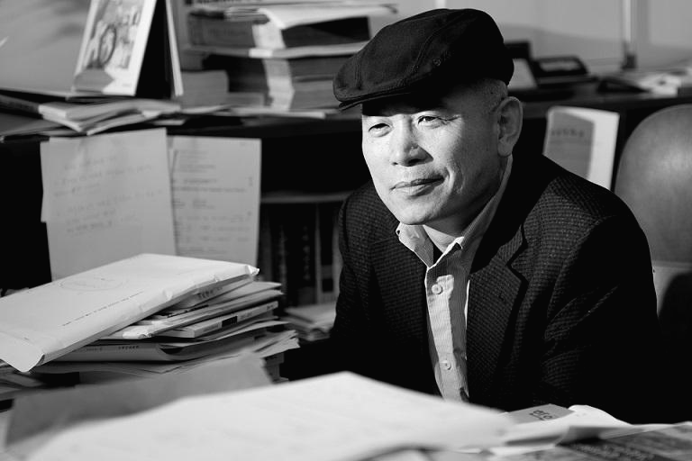
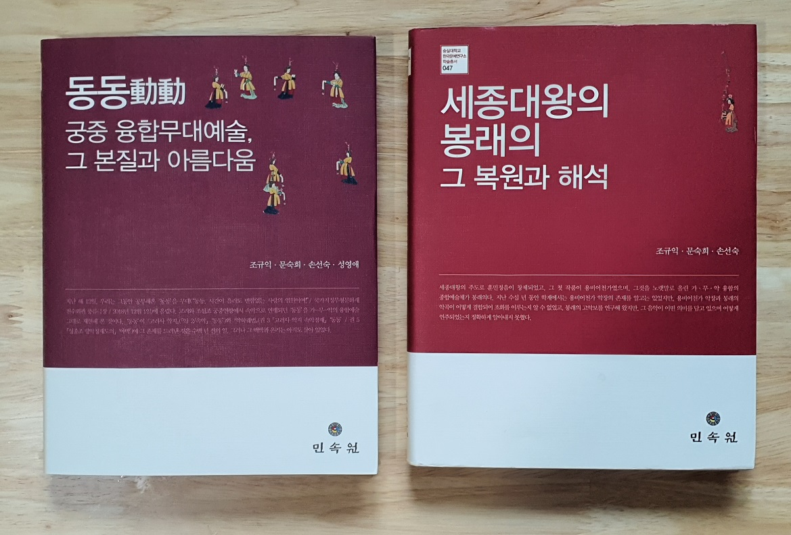

## 선생님들께

안녕하세요?

한국문학과예술연구소입니다.

2020년 2월 개최 예정이던 학술발표 및 보허자 학무 복원공연을 연기하여 11월 21일(토) 14시에 개최하게 되었습니다.

이번 학술대회는 학술발표와 보허자 학무 복원공연 등 두 부분으로 이루어져 있습니다. 학술발표와 공연을 중심으로 현장[국가지정무형문화재 전수회관]에서 행사를 진행하고, 그 실황을 참석하지 못하는 분들을 위해 <https://youtu.be/FPvrJjcHi-o> 로 실시간 중계합니다. 유튜브를 통해 발표와 공연을 함께 해주시면 고맙겠습니다.

2020. 11. 13.

한국문학과예술연구소 배상.

=행사 팸플릿=

### 신선의 음악과 춤, 노래 속에 멋진 ‘시간여행’을...

                                                                                                                조규익(숭실대학교 교수)

#### 언제부턴가 우리에게는 특별한 꿈이 있었습니다. 예술인들과 학인들이 가슴 가득 품고 있었으되 펼쳐 보이지 못한, 작지만 울림이 큰 꿈입니다. 악사들의 반주로 가공(歌工)과 무용수가 하나로 어우러지는 무대. 그 무대 주변에 둘러앉은 학인들이 예인(藝人)들의 몸놀림과 또 다른 하나가 되는 경험을 통해 비로소 이지(理智)의 샘을 열고 도란도란 그들의 미학을 담론하는 자리 말입니다. 세상 어디에 이보다 더 아름답고 성대한 공간이 있을까요. 지금까지 우리는 두 번의 멋진 무대를 만들었고, 이것들을 두 권의 책으로 엮어 낸 바 있습니다.

<지난 무대들>  
“봉래의(鳳來儀): 세종의 꿈, 봉황의 춤사위 타고 하늘로 오르다!”[2013. 11. 21./국립국악원 우면당]  
“동동(動動): 시간이 흘러도 변함없는 사랑의 염원이여!”[2018. 12. 1/국가지정문화재 전수회관 풍류극장]

<펴낸 책들>  
조규익∙문숙희∙손선숙, <<세종대왕의 봉래의, 그 복원과 해석>>, 민속원, 2015.  
조규익∙문숙희∙손선숙∙성영애, <<동동動動: 궁중 융합무대예술, 그 본질과 아름다움>>, 민속원, 2015.

<새 무대>  
“보허자(步虛子): 허공을 즈려밟고 훨훨 나는 신선이여! 태평성세 유토피아 이루시는 제왕이여!”[2020. 11. 21./국가지정문화재 전수회관 풍류극장]

<새로 나올 책>  
조규익∙문숙희∙손선숙∙서인화∙성영애∙임미선, <<보허자步虛子: 궁중 융합무대예술로 편입된 신선 예술의 아름다움>>, 2021. 1.

#### 우리는 그동안 가꾸어 온 ‘꿈의 무대’를 이렇게 펼쳐 보여 왔고, 새로운 무대를 통하여 이번에도 그렇게 하고자 합니다. 여러분이 앉으실 폭신한 좌석은 여러분을 모시고 그 옛날 고려∙조선시대의 궁중으로 날아갈 타임머신입니다. 좌석에 앉아 음악에 따라 춤추고 노래 부르며 임금의 장수를 축원한 보허(步虛)의 예술에 잠시 마음의 주파수를 맞추시면, 여러분은 그 옛날 진사왕(陳思王) 조식(曹植)이 어산(魚山)의 동아(東阿)에서 만난 ‘신선 예술’의 경지를 체험하시게 됩니다. 맑고 심원하며 굳세고 밝은 그 소리와 춤사위를 통해 허공을 날아다니는 신선들을 만나시게 될 것입니다. 그들과의 그런 짧은 만남을 뒤로하고 되돌아올 현실의 공간에서 우리는 다시 씩씩하고 치밀한 논조로 새롭고 아름다운 경험들을 담론하고자 합니다.

#### 원래 보허성(步虛聲)이나 보허자(步虛子)는 중국에서 발생한 도교음악이었고, 그 음악에 맞추어 춤을 추며 보허사(步虛詞)를 불렀습니다. 그러나 우리 조상들은 그것을 유교적 패러다임으로 변용했고, 중세적 보편성의 한 요소로 끌어들이는 지혜를 발휘할 수 있었습니다. 옛날 사람들은 임금이 앉아있는 궁중을 현실 속에 자리 잡은 ‘선계(仙界)’라 여겼습니다. ‘상선(上仙)’인 임금의 불로장생은 소망(所望)에 속하는 일이었지만, ‘보허 예술’에 담아낸 만백성의 염원을 통해 그것은 분명한 현실로 구현될 수 있다고 믿었던 것입니다.

#### 이 자리에 모시게 될 여러분이 바로 임금님들이십니다. 우리 궁중예술의 헌상 대상이 바로 임금이신 여러분들입니다. 여러 가지로 바쁘시겠지만, 잠시 이곳에 오셔서 저희와 함께 멋진 ‘시간여행자’가 되어보실 생각은 없으신지요?

#### 2020. 11. 21.

조규익

|  |  |  |  |  |  |  |
| --- | --- | --- | --- | --- | --- | --- |
| 보步허虛자子  허공을 즈려밟고 훨훨 나는 신선이여!  태평성세 유토피아 이루시는 제왕이여! | | | | | | |
|  | | | | | | |
| 사회 : 하경숙(선문대) | | | | | | |
| 14:00 - 14:10 | | 개회사 : 조규익(숭실대학교) | | | | |
|  | |  | | | | |
| 제1부 가무악(歌舞樂) 융합적 시각으로 본 조선전기의 보허자 | | | | | | |
|  | |  | | | | |
| 시간 | 발표자(소속) | | 논문 제목 | | | |
| 14:10-14:30 | 조규익(숭실대) | | <보허사(步虛詞)> 수용태(受容態)로서의 <벽연롱효사(碧烟籠曉詞)>에 대하여 | | | |
| 14:30-14:50 | 성영애(숭실대) | | 조선조 문인들의 보허사 수용양상 | | | |
| 14:50-15:10 | 손선숙(숭실대) | | 보허자 음악에 맞춘 성종 대 학무(鶴舞) 복원 연구 | | | |
| 15:10-15:30 | 문숙희(한국외대) | | 15세기 보허자 음악 복원 연구 | | | |
| 15:30-15:50 | 임미선(단국대) | | 성종대 정재반주 음악 고찰 | | | |
| 15:50-16:10 | 서인화(국립국악원) | | 조선시대 정재 공연 공간 | | | |
|  | | | | | | |
| 제2부 보허자 복원 음악에 맞춘 15세기 학무 공연[<<악학궤범>> 권5] | | | | | | |
|  | | | | | | |
| 시간 | 제작 | | | | 출연 | |
| 16:20-16:40 | 음악복원: 문숙희 | | | | 학(鶴): 손선숙, 박재란 | |
| 무용복원: 손선숙 | | | | 동기: 서원미, 조보현 | |
| 음원제작: 이정면 | | | | 악사: 윤교순, 강선주 | |
| 노 래: 김대윤 | | | | 지도: 백재욱, 손혜숙 | |
|  | | | | | | |
| 16:40-17:00 | 단체사진 촬영 및 정리 | | | | | |
|  | | | | | | |
| 제3부 질의 및 종합토론 | | | | | | |
|  | | | | | | |
| 시간 | 좌장 | | | 토론자 | | |
| 17:00-18:00 | 조규익(숭실대학교) | | | 서철원(서울대학교)  김지은(중앙대학교)  박은영(한국예술종합학교) | | 임혜정(서울대학교)  박은옥(호서대학교)  윤아영(백석예술대학교) |
|  | | | | | | |
|  | 연구윤리교육 및 폐회식 | | | | | |

공유하기

게시글 관리

**백규서옥\_Blog ver.**