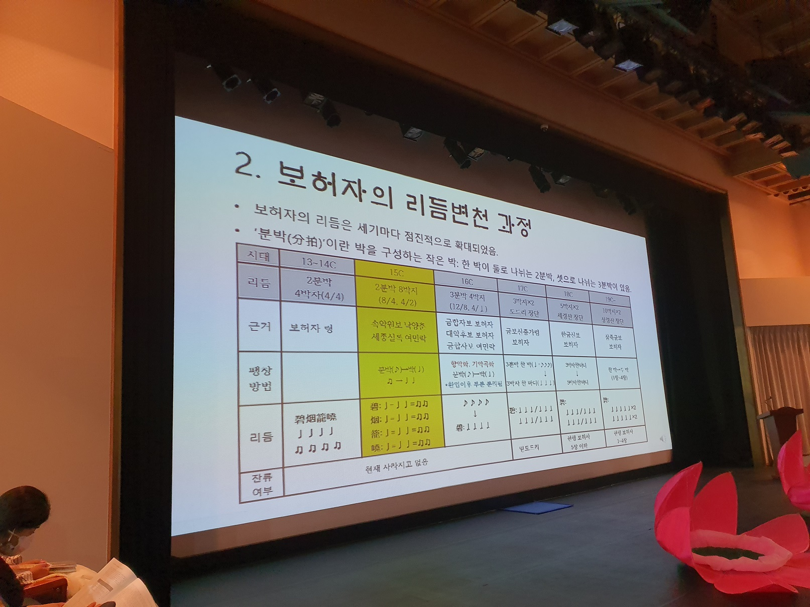

### 코로나의 위협에도 굴하지 않고 예정대로 행사를 잘 마쳤습니다.

### 발표자 및 토론자 여러분, 공연에 참여하신 예술인 여러분, 참관인 여러분께 감사의 말씀을 드립니다.

### 

### 보허자와 보허사는 위진남북조 시대에 시작된 것으로 추정되는 도교 재초(齋醮)의례의 음악과 악장으로 출발한 것인데, 그것들이 일반에 널리 퍼지면서 문인과 예술인들의 사랑을 받았고, 급기야 궁정음악으로 수용되었습니다. 우리나라 문헌에서 보허자가 처음으로 발견되는 사례는 <<고려사 악지>>의 당악정재 5건 가운데 '오양선'의 '악곡 보허자령과 그 연주에 맞추어 부르던 <벽연롱효사(碧烟籠曉詞)>'를 들 수 있습니다. 즉 오양선의 악장 <벽연롱효사>를 악곡 보허자령의 연주에 맞추어 노래 부른다는 뜻입니다. 그 악곡과 가사가 고려 말까지 궁중에서 왕성하게 공연되던 당악정재의 핵심 역할을 해왔습니다.

### 

### 그것이 조선조로 이어지면서 '고려 당악'이 지속되는 한편, 새롭게 악장을 창작하여 고려 당악의 곡들에 올려 부르게 되었습니다. '우리나라 왕조들이 보허자 및 보허사를 수용한 양상과 조선조 성종 때 보허자령에 올려 공연된 학무를 복원하여 공연한 것'이 본 행사의 핵심입니다. 유투브[https://youtu.be/FPvrJjcHi-o]로 들어가시면 실황내용을 확인하실 수 있습니다. 발표논문들은 <<한국문학과 예술>> 36집[2020. 12. 30. 발간예정]에 게재될 예정입니다. 많은 관심과 질정 부탁드립니다.

### 고맙습니다.

### 2020. 11. 22.

### 한국문학과예술연구소  소장  조규익 드림

=학술발표 및 복원 공연 주 내용=

## 步 虛 子

#### 허공을 즈려밟고 훨훨 나는 신선이여!

#### 태평성세 유토피아 이루시는 제왕이여!

### "가무악(歌舞樂) 융합적 시각으로 본 조선전기의 보허자"

### 제1부 학술발표

#### 조규익(숭실대): <보허사(步虛詞)> 수용태(受容態)로서의 <벽연롱효사(碧烟籠曉詞)>에 대하여

#### 성영애(숭실대): 조선조 문인들의 보허사 수용양상

#### 손선숙(숭실대): 보허자 음악에 맞춘 성종 대 학무(鶴舞) 복원 연구

#### 문숙희(한국외대): 15세기 보허자 음악 복원 연구

#### 임미선(단국대): 성종대 정재반주 음악 고찰

#### 서인화(국립국악원): 조선시대 정재 공연 공간

### 제2부 보허자 복원 음악에 맞춘 15세기 학무 공연

#### 음악복원: 문숙희

#### 무용복원: 손선숙

#### 학(鶴): 손선숙, 박재란

#### 동기: 서원미, 조보현

#### 음원제작: 이정면

#### 악사: 윤교순, 강선주

#### 노 래: 김대윤

#### 지도: 백재욱, 손혜숙

#### 제3부 질의 및 종합토론

#### 좌장: 조규익(숭실대)

#### 토론자: 서철원(서울대), 김지은(중앙대), 박은영(한예종), 임혜정(서울대), 박은옥(호서대), 윤아영(백석예술대)

공유하기

게시글 관리

**백규서옥\_Blog ver.**

[저작자표시
(새창열림)](https://creativecommons.org/licenses/by/4.0/deed.ko)