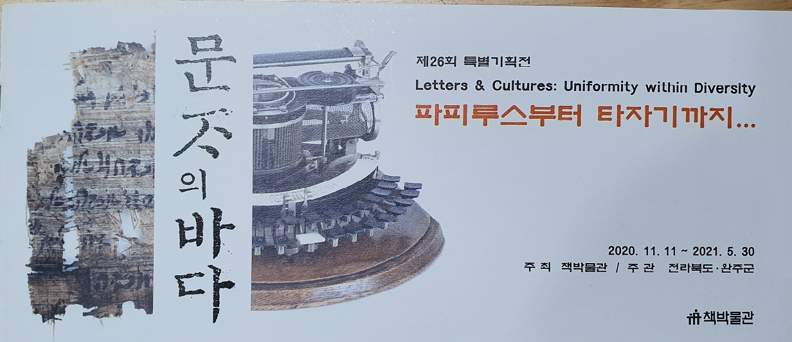

흥미로운 문자들과 고서들을 접할 수 있는 기회

### 

### 

### 조규익(숭실대 교수)

### 

### 한・중 수교 직후 중국의 한 소도시에 갔었다. 중국어를 한 마디도 말하거나 알아듣지 못하던 나였고, 곳곳에서 만나는 중국인들 또한 성조(聲調)에 맞지 않는 ‘얼치기 중국어’에 대해서 못 들은 척 무시하기 일쑤였다. 그러나 말과 달리 글자를 활용한 필담(筆談)은 가능했다. 간체자(簡體字)만 쓰는 중국인들이었지만, 학교 물을 먹은 사람들일 경우 번체자(繁體字)도 대충 통했다. 그렇게 간신히 며칠을 버틸 수 있었다.

### 담헌 홍대용(洪大容)을 비롯한 연행사들도 연경의 많은 문사들과 필담으로 창화(唱和)했고, 조선의 통신사들도 일본의 문사들과 그렇게 소통했다. 이처럼 예로부터 ‘기호로서의 문자’는 나라와 말이 달라도 누구든 익혀 사용할 수 있었고, 문자에 담겨 있는 다른 나라의 문화나 정신을 배울 수 있었다. ‘제국주의 언어’로 군림해온 중국어와 영어는 한자와 알파벳을 통해 이른바 지구촌의 보편문화나 보편정신을 주도해왔고, 지금도 그렇게 하고 있다.

### 

### 지금으로부터 1만 7천여 년 전인 BC 15,000 년 경, 프랑스 도르도뉴 지방의 라스코 동굴에서 벽화들이 발견되었다. 말・사슴・들소 등 대략 100점 내외의 동물상들에 성공적인 수렵과 풍요를 기원하는 주술적 의미가 들어 있다.

### 스페인 북부 알타미라 동굴에서 발견된 구석기 후기의 들소・사슴・멧돼지 등 야생동물 벽화들에도 사냥의 성공과 풍요를 기원하는 주술적 의도가 들어 있음은 마찬가지다. 신을 비롯한 초자연적 존재에 자신들의 소망을 기원하는 것이 주술의 주요 목적임을 생각하면, 그 그림들도 그들의 생각을 표현하여 신에게 보여주기 위한 일종의 문자들임은 분명하다.

### 그로부터 상형문자와 설형(楔形)문자의 단계들을 거쳐 기원전 14세기 경 한자가 성립되었다고 본다. 한자의 발전으로 ‘동아시아 한자문화권’이 형성되었고, 이 지역의 중세정신을 견인했으며, 역으로 각 민족단위의 독자적 문자생활을 촉발시킨 점 또한 사실이다.

### 일찍이 일본 한문학의 석학 시라카와 시즈카(白川 靜)는 “태초에 말씀이 계시니라. 이 말씀이 하나님과 함께 계셨으니, 이 말씀은 곧 하나님이시니라”는 <<신약성경>> ｢요한복음｣ 모두(冒頭)의 문장을 “(말씀에)이어서 문자가 계시니라. 이 문자가 하나님과 함께 계셨으니, 이 문자가 곧 하나님이시니라”고 패러디하여 문자의 중요성을 설파한 바 있다.

### 

### 말과 문자가 함께 가는 것은 아주 행복한 경우다. 입에서 나오는 말을 그대로 적을 수 있는 문자가 문자로서는 최고라는 뜻이다. 우리는 15세기에 이르러서야 독자적 문자인 훈민정음을 갖게 되었고, 그것마저 민중이 보편적으로 사용하기까지는 몇 세기의 세월이 더 필요했다. 훈민정음이 나오기까지 향찰(鄕札)같은 차자(借字) 방식의 대체표기, 구결(口訣)・이두(吏讀) 등의 보조표기 문자들이 사용되었으나, 모두 독자적인 문자 체계 출현을 위한 준비단계에 불과했다. 말 나오는 대로 적는 문자가 어디 쉬운 일이랴.

### 예컨대, 작자 미상의 1700년대 <<한글 시조집>>을 보자. 한글 시조 160수가 실려 있는 이 책은 17세기의 어떤 가객이나 애호가가 만들어 지녔던 문헌일 것이다. 시조의 본질은 노래이고, 노래는 노랫말과 악곡이 결합된 구조다. 물론 악곡이나 창조(唱調)는 대중의 기억에 각인되어 그럭저럭 얼마간 전승될 수는 있었으리라. 그러나 가창의 현장에서 무릎을 탁 칠만큼 정곡을 찌르는 노랫말의 경우 허무한 1회성 발화(發話)일 뿐이니, 짧은 기억으로 어찌 오래도록 기억할 수 있었겠는가.

### 우리말로 된 가사를 적을 만한 문자가 없거나 음을 기록할만한 악곡체계가 없는 경우, 시간과 공간의 한계를 뛰어넘을 수 없는 안타까움이야 이루 말할 수 없었을 것이다.

### 세종대왕이 한글을 창제하시면서 “우리나라의 말이 중국과 달라 문자로 적으면 서로 맞지 아니하니, 이런 이유로 어리석은 백성이 말하고자 하는 바가 있어도 마침내 제 뜻을 펴지 못한다. 내 이를 불쌍하게 여겨 새로 스물여덟 글자를 만드노니, 사람들로 하여금 쉽게 익혀 매일 쓰는 데 편하게 하고자 할 따름이니라.”고 말씀하신 것도 사실은 한자 전성시대인 중세의 한복판에서 ‘우리의 독자적인 문자 체계’가 절실함을 깨달았다는 증거라 할 수 있다. 우리의 독자적인 문자체계로부터 큰 혜택을 받은 결과가 바로 ‘우리말 노래’인 시조와 가사의 기록이요, ‘우리 이야기 문학’인 고대소설의 창작인 것이다.

### 

### 문자의 역사가 인류 지혜의 역사임을 보여주려는 것이 본 전시의 주제[‘문자의 바다-파피루스부터 타자기까지’]에 내재된 총괄기획자의 의도이다. 문자란 단순히 생각의 전달수단만은 아니다. 생각이 문자에 담겨 오랜 세월 전승되는 것은 의미의 발효와 숙성을 위한 필수 과정이다. 인간의 생각은 그 과정을 거쳐야 오래도록 의미의 창조를 거듭한다.

### 발효와 숙성을 통하지 않은 인간의 생각은 후손들에게 그저 ‘그렇고 그런 골동품’으로나 인식될 뿐이다. 발효와 숙성을 통해 새로운 모습을 갖출 때 그 생각은 후손들에게 수용되어 그들의 현재와 미래의 지혜로 탈바꿈한다. 이번 전시회에서 볼 수 있듯이, 고금의 다양한 국가나 민족들의 이상과 꿈이 문자를 통해 전 인류가 공유하게 되는 것도 그 때문이다. 이것이 문자를 통해 이루어지는 인문학의 본질이기도 하다.

### 기원전의 암각문자와 상형문자, 그리이스 로마의 라피스 문자, 메소포타미아 대형 점토판의 설형문자, 고대 이집트 파피루스의 콥트 문자, 각종 매체에 기록된 라틴어 문자・카탈루냐 문자・알파벳 문자・독일어 문자・프랑스어 문자 등 수많은 종류의 문자들, 중국과 조선의 학자와 문인들이 한문으로 작성한 각종 서책들, 서양의 선교사들이 한글로 적어놓은 조선말 교재나 한글로 번역한 성서들, 가객들이나 문인들이 한글로 적어놓은 시조와 가사 등...

### 

### 밤하늘에 뿌려진 별들처럼 다양한 언어권의 무수한 문자들과 그 문자들을 아로새긴 전적(典籍)들이 인류의 지혜를 담은 채 바로 지금 꺼지지 않는 빛을 발하고 있지 않은가. 또한 그 빛이 새로운 불꽃으로 타올라 인류의 먼 앞길까지 환히 비추고 있지 않은가.

공유하기

게시글 관리

**백규서옥\_Blog ver.**