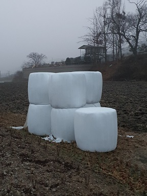

### 이제 더 이상 사람이 낫을 들고 벼 수확을 하는 시대가 아니지요. 콤바인을 몰고 다 익은 벼논에 들어가 곡물을 베고, 탈곡하고, 선별하고, 포대에 담는 등 여러 단계의 일들을 일관 작업으로 수행하는 시대이지요. 콤바인 작업이 끝나는 대로 거둔 벼를 트럭에 실어 건조장으로 보내면 일단 주인 손에서 떠납니다. 건조된 벼는 수매장으로 넘겨 정부의 비축미로 팔고, 남는 것 중 일부를 쌀로 찧어 가족들의 한 해 식량으로 삼는 겁니다.

### 

### 그것으로 끝이 아닙니다. 콤바인 작업을 하고난 논바닥에는 낟알 털린 볏짚들이 줄줄이 누워 있게 됩니다. 적당한 시간이 지나고 그 볏짚들을 모아 유산균을 섞은 다음 단단히 포장한 것이 바로 곤포 사일리지입니다. 그 속에서 맛있게 발효된 볏짚들은 다음 해 목초가 나올 때까지 소들의 먹이로 요긴하게 쓰이지요.

### 

### 이십여 년 전 미국 체류 중에,  십 수 년 전 유럽 여행 중에,  저는 곤포 사일리지들을 자주 목격했습니다. 그 때부터 저는 전원 혹은 농토 위에 구르는 하얀 색 곤포 사일리지들을, 농촌의 부를 상징하는 일종의 기호로 받아들이게 되었습니다. 그러던 중 그것들은 몇 년 전부터 가을・겨울에 걸쳐 우리나라 농촌에서도 흔한 풍경으로 자리 잡은 것을 알게  되었지요. 이제 우리나라 농촌도 제가 그려온 ‘부농(富農)’의 단계로 접어들었다고 할 수 있을까요?

### 

### 곤포 사일리지를 볼 때마다 저는 타임머신을 타고 수 십 년 전의 어린 시절로 시간여행을 하곤 합니다. 제 어린 시절 농촌에서는 농지 다음으로 소를 중요하게 여겼습니다. 어느 집이나 소 한 마리씩은 데리고 살았지요. 소 없이 논밭 일을 한다는 건 상상도 할 수 없었어요. 이른 봄부터 소와 함께 논밭에 나가 땅을 가는 것이 농민들의 주된 일이었습니다. 그러다 보니 소를 먹이는 것은 사람이 먹고 사는 것 다음으로 중요한 일이었습니다. 늦은 봄부터 가을까지는 들판에 풀이 그득하니 그것들을 베어다 먹이거나 풀밭에 끌고 나가 매어놓기만 하면 그만이었습니다. 그러나 겨울부터 봄철에 이르기까지 오랜 기간 동안 소의 배를 어떻게 채울 것인가가 문제였습니다.

### 

### 집집마다 약간씩 달랐지만, 우리 집의 경우를 말씀드리지요. 당시 방앗간에 가서 보리방아와 쌀 방아를 찧으면 겨가 나오지요. 아주 고운 보릿겨는 송두리째 지고 와야 할 만큼 가장 긴요한 물건이었지요. 벼의 경우 1차로 나오는 왕겨는 모두 방앗간에 버리고, 두 번째 나오는 속겨는 한 주먹도 버리지 않고 실어 와야 했습니다. 두 가지 모두 소 먹이의 가장 중요한 부분이었지요. 그리고 추석 4~5일 전쯤 소가 좋아하는 길고 부드러운 풀들을 중심으로 관리해오던 산판에서 ‘새 꼴’을 베었습니다. 왜 새 꼴이라 불렀는지 정확히 알 수는 없습니다. 지금 와서 생각해보니 ‘새 꼴’은 ‘새+꼴’로 만들어진 복합어인 것 같습니다. ‘새’와 ‘꼴’이란 말들을 네이버 국어사전을 찾아보니 아래와 같이 설명되어 있군요. 먼저 ‘새’.

### 

### “1. 볏과 식물을 통틀어 이르는 말. 띠, 억새 따위가 있다.

### 2. 볏과의 여러해살이풀. 높이는 30~120cm이며, 잎은 흔히 뿌리에서 나고 선 모양이다. 여   름에서 가을까지 연한 녹색의 작은 이삭으로 된 꽃이 원추(圓錐) 화서로 피고 목초로 쓰인다. 볕이 잘 드는 초원이나 황무지에서 자라는데, 한국・일본・중국 등지에 분포한다.”

### 

### 그리고 ‘꼴’이란 말을 다음과 같이 풀어 놓았군요.

### 

### “말이나 소에게 먹이는 풀”

### 

### 아, 그 ‘새 꼴’이란 바로 억새 등의 볏과 식물과 기타 잡초 등 소가 잘 먹던 풀들을 통틀어 부르던 명칭이었던 것 같네요. 그러니 당시 우리 고향의 어른들은 매우 정확한 명칭을 사용하고 계셨던 겁니다. 어쨌든 일꾼들 4~5명이 들러붙어 하루 종일 낫으로 천여 평 가까운 풀을 베어 산 바닥에 깔아놓습니다. 추석이 지나고 한 일주 쯤 지날 때쯤 파란 풀들이 기분 좋은 풀 향기를 풍기며 대충 마르게 되고, 그 상태를 살펴서 괜찮다는 판단이 들 경우 걷어서 낟가리 모양으로 누려놓습니다. 그 다음 벼 타작이 끝나고 나오는 볏짚 또한 한 올도 버리지 않고 누려놓습니다. 그래서 추수가 끝나면 볏짚과 새 꼴 등 작은 동산 모양의 두 종류 낟가리가 집집마다 마당 한 구석에 올록볼록 솟아올라 있게 되는 것이지요.

### 날씨가 추워져서 소를 외양간으로 옮겨 맨 다음부터는 볏짚과 새 꼴을 7:3으로 배합하여 작두로 썰어낸 여물이 주식으로 소에게 제공되는 것이었습니다. 아침 일찍 일어나신 아버지는 부엌의 가마솥에 여물과 겨[쌀겨・보릿겨], 채소 이파리 등을 ‘조리 후에 나오는 영양분 섞인 구정물’로 버무려 ‘소죽’을 끓이셨습니다. 저는 그 구수한 소죽 냄새를 맡으며 잠자리에서 일어났습니다. 아버지, 어머니는 새벽 5시대에 잠자리에서 일어나시고, 저는 6시 대에 일어난 것도 그 때문이었습니다. 가마솥 소댕이 덜컹거리며 푹푹 김이 오르면 소죽이 익었다는 신호이고, 다 익은 소죽이 그득 담긴 양동이를 달랑달랑 들고 4~5차례 왕복하면서 외양간의 구유로 날라 주는 일은 제 담당이었지요. 쬐끄만 녀석이 달랑거리며 소죽 양동이를 들고 오는 모습을 큰 눈으로 바라보며 침을 흘리던 ‘뿔 찌그러진 암소’를 지금도 잊지 않고 있습니다. 소죽을 다 먹고 나면 볏짚과 새 꼴을 섞어 썰어낸 여물을 구유 가득 채워 주는 것이지요. 소가 소죽을 다 먹지 않는 경우 아버지와 어머니는 그 이유를 분석하곤 하셨습니다. 여물에 문제는 없었는지, 겨에 문제는 없었는지, 구정물에 문제는 없었는지 등등. 저는 두 분 사이에 다양한 의견들이 오고가는 모습을 보며 자랐습니다.

### 

### 그렇게 세월은 마구 흘러갔습니다. 이제 돌아온 전원에는 볏짚이나 새 꼴 동산 대신 곤포 사일리지가 구르고 있네요. 지금 제가 살고 있는 동네 어른들을 잡고 물어도 새 꼴이나 소죽의 추억을 갖고 계신 분들은 안 계셔요. 콤바인으로 추수가 끝나면 농부들은 볏짚을 팔아버리지요. 저는 이곳 어른들에게 값을 물어보지는 않았어요. 추수 후 볏짚을 돈으로 계산할 수 없었던 내 고향의 추억 때문입니다. 가족 같은 소가 먹을 겨울 동안의 양식인데, ‘판다’는 것은 상상도 못할 일이었지요. 그래서 나는 동네 어른들에게 그 값을 묻지 않는 것입니다. 지금의 농부들이 곤포 사일리지를 팔아서 주머니는 두둑해졌을지 몰라도, 그 볏짚과 새 꼴을 섞어 작두로 썰어내던 ‘여물’의 추억은 아마 누구의 마음속에도 없을 겁니다.

### 

### 그렇다고 제가 감히 ‘농경시대를 헛 살아오셨네요!’라고 그 분들을 조롱하는 것은 아닙니다.  ‘새 꼴과 볏짚을 섞어 썰어낸 여물의 추억’이 제겐 소중한 ‘빈티지 보물’일 수 있지만, 누군가에겐 ‘버리고 싶은 시간의 땟자국’일 수 있기 때문이지요. 앞으로 언제쯤 ‘라떼’적 삶의 모습을 재현해 놓고 젊은 영혼들을 유혹할 수 있을까요?ㅠㅠ

### 

공유하기

게시글 관리

**백규서옥\_Blog ver.**