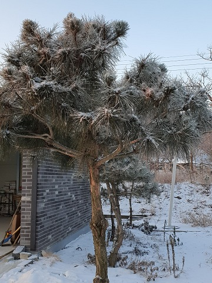

\*며칠 전의 일. 한문학을 전공하는 가까운 친구가 글 한 편을 보내왔다. 열어본즉 최치원(崔致遠)의 '토황소격문(討黃巢檄文)'을 패러디한 글이었다. 천재로 꼽히던 해동 3최[최언위・최승우・최치원]. 그 가운데 일인인 신라[제49대 왕 헌강왕 때]의 최치원이 중국 당나라에서 벼슬하던 중 황소의 반란이 일어났는데, 그 토벌총사령관 고변(高騈)의 휘하에서 종군하며 황소(黃巢)를 치기 위해 지은 격문(檄文)이 바로 '토황소격문'이다. 내가 '문추(文酋)'가 누구냐고 묻자, 즉시 '그대는 바보인가?'라는 대답이 친구로부터 돌아왔다. 짐작은 가나, '그'가 내가 알고 있는 그인지 아리송했다. 아, 시골 구석에 살다보니 그간 '문추'가 누구인지도 잊어버리고 있었구나! 시사(時事)에 어두운 나를 자책하며 다시 전문을 읽어보니, 참으로 보기 드문 가편(佳篇)이다. 어리석기 한량없는 '그'야 알아볼 리 없을 것이고, 국가 권력기관 또한 이 글을 탈잡아 무슨 행패를 부릴 일이야 있으랴. 풍자란 그래서 좋은 것인가. 그냥 버리기 아까워 이곳에 그 글을 실어둔다. 다만 요즈음 도처에 출몰한다는 '문추 홍위병'들의 등쌀에 내 친구가 다칠까 염려되어 지은이의 이름은 이곳에 밝히지 않는다.   

### 경자(庚子)년 섣달 28일, 초의한사(草衣寒士) 아무개는 문추(文酋)에게 고하노라.

### 무릇 바른 것을 지키고 떳떳한 것을 행하는 것을 도(道)라 하고, 위험한 때를 당하여 올바른 방법으로 변통할 줄 아는 것을 권(權)이라 하느니라.

### 

### 지혜로운 이는 때의 적실함을 따름으로 성공하고, 어리석은 자는 이치를 거스르는 무도(無道)함으로 패하게 되는 것이 우주의 이치. 비록 우리의 일생이 하늘의 명에 달려 있어 생사를 기약할 수는 없으나, 만사의 성패는 마음먹기에 달린 것이므로, 옳고 그른 것은 가히 분별할 수가 있느니라.

### 

### 지금 나는 한미한 일개 백성으로서 경고하러 온 것이지 싸움하러 온 것이 아니요, 백성의 마음은 대도(大道)와 상식(常識)을 앞세울 뿐 무도하게 몰아냄을 능사로 삼지는 않느니, 앞으로 대의를 회복하고 큰 신의를 펴서 조심스런 마음으로 백성의 마음을 살펴 대도를 걷도록 촉구하고자 할 뿐이니라.

### 

### 그대는 본시 먼 시골의 백성으로 갑자기 억센 지배자가 되면서, 갑작스런 시세(時勢)를 타고 감히 대의를 어지럽히고 있지 아니한가. 결국 무도한 마음으로 자신의 몸에 닥치는 징벌을 피하고자 국정의 상도(常道)를 어지럽혔으니, 이미 죄는 하늘에 닿을 만큼 극에 달하여 반드시 패망할 것이라는 사실은 불 보듯 뻔하도다.

### 

### 아, 단군왕검 이래 오랑캐와 난신적자(亂臣賊子)들이 나라를 훔치고자 대의에 복종치 않은 적이 허다하였으니, 양심 없는 무뢰한 무리와 의롭지 않고 무도한 그대 같은 무리가 어느 시대인들 없었겠는가?

### 

### 먼 옛날 궁예와 견훤이 삼한의 패권을 노렸고, 가까이는 공산도배들이 반도의 평화를 깨부수려 발호하였느니라. 사술(邪術)과 무력으로 세상을 흔들어 암흑으로 만들고, 선량한 백성들을 죽음으로 몰아넣지 않았는가. 그러나 잠깐 동안 못된 짓을 자행타가 결국 더러운 무리들은 섬멸되었느니라. 하늘에 태양이 활짝 떠오르매 어찌 요망한 기운이 지속되겠으며, 하늘의 그물이 높이 베풀어져 있으니 무도한 집단이 어찌 길게 갈 수 있었겠는가.

### 

### 하물며 하향(遐鄕)의 한사(寒士)로 태어난 그대는 인권(人權)의 율사(律士)를 자처하며 세상에 나타났고, 어리석은 무리들의 헛된 꿈을 민의(民意)와 대의(大義)로 참칭하는 무도를 자행하지 않았는가.

### 그리하여 그대는 헤아릴 수 없는 큰 죄를 지어 온 것이다. 선량한 백성들이 그 죄를 용서해 주려 해도 그 거짓이 너무 끔찍하여 치를 떨기에 이른 것 아닌가. 그래서 천하 백성이 모두 그대를 징치하려 절치부심(切齒腐心)할 뿐 아니라, 땅 속에 있는 귀신까지도 몰래 그대를 몰아내려 의논함을 보지 않는가. 잠깐 동안 숨이 붙어 있다고 해도 벌써 정신은 죽었고, 넋 또한 빠져나간 것 아닌가. 무릇 사람이라면 자신을 아는 것이 가장 중요하니, 자신을 알면 사람이고 자신을 모르면 짐승이기 때문이니라.

### 

### 내가 헛된 말을 하는 것이 아니니, 모름지기 새겨들을지어다. 그간 선량한 백성들은 많은 덕을 베풀어 더러운 것도 받아들이고, 두터운 은혜를 내려 잘잘못을 따지지 않고 모르는 체 하며 지나쳐 온 게 사실이다. 그래서 그대를 추장으로 임명하고 전권을 몰아 준 것 아닌가. 그런데 그대는 국기(國基)의 붕괴를 요설(妖說)로 분칠하고 합리화하려 했다. 무능과 과욕으로 나라의 근본을 흔들었고, 그 과정에서 죄를 벗어나고자 법률체계를 송두리째 무너뜨려 나라는 형언할 수 없는 혼란에 빠져버린 것이다.

### 

### 반드시 쫓겨날 날이 멀지 않았음에도, 어찌 하늘을 무서워하지 않느냐? 이런 처지에 어찌 구중궁궐을 그대의 영원한 안식처로 생각하여 무도한 꼼수를 접지 않는 것이냐?

### 앞으로 그대는 도대체 어떻게 할 작정이냐?

### 그대는 듣지 못하였는가? 노자가 <<도덕경>>에서  "회오리바람은 하루 아침을 가지 못하는 것이요, 소낙비는 하루 동안을 내리지 않는다." 하였으니, 하늘의 일도 오래 가지 못하거늘 하물며 사람의 일이겠는가? 또 듣지 못하였는가? "하늘이 잠깐 나쁜 자를 도와주는 것은 복되게 하려는 것이 아니라, 그의 흉악함을 쌓게 하여 벌을 내리려는 것"이라는 <<춘추>>의 지엄한 훈계를.

### 

### 정상적인 사람이 생각할 수 없는 온갖 간사한 꾀를 부려 악이 쌓이고 재앙이 가득함에도, 목전에 드러난 거짓과 간사(奸邪)를 스스로 편하게 여기고 미혹하여 뉘우칠 줄 모르니, 대체 그대를 어찌 해야 옳단 말이냐.

### 

### 위태롭기가 '제비가 바람에 날리는 장막 위에 둥지를 틀어놓고 마음 놓고 날아드는 것 같고, 물고기가 끓는 솥 속에서 노니는 것 같다'는 옛말도 있느니라. 이제 웅장한 전략을 가지고 군대를 모은 강호의 지사들이 구름같이 날아들고 지혜로운 백성들이 보이지 않는 곳에서 힘을 모으고 있음을 그대는 정녕 모르는가.

### 

### 높고 큰 깃발이 초나라 요새의 바람을 에워싸고, 튼튼한 군함이 오 나라 강의 물결을 막아 끊었듯, 연대(連帶)에 나선 백성들의 힘이 그대의 아성(牙城)을 부수겠노라 이를 가는 소리를 그대만 듣지 못하는 것인가. 그 대열 속에 진나라 도태위 같은 장수가 있어 적을 부수는데 날래고, 수나라 양소 같은 병법가가 있어 법을 엄숙하게 시행하여 신이라 일컬어짐을 듣는가, 못 듣는가.

### 

### 이들은 널리 팔방을 돌아보고 거침없이 만 리를 오가는 안목을 지니고 있느니라. 그대 무리들을 무찌르는 것은 맹렬한 불이 기러기 털을 태우는 것과 같고, 태산을 높이 들어 참새알을 눌러 깨는 것과 무엇이 다르리오? 조만간 정의의 바람이 불고 새벽이슬이 내려 바야흐로 말라가는 풀을 살려 내고서야 그 힘을 알겠는가?

### 

### 파도도 일지 않고 도로도 통하였으니, 석두성에서 뱃줄을 풀매 손권이 뒤에서 호위하고, 현산에 돛을 내리니 두예가 앞장 선 일을 아지 못하는가. 열흘이나 한달이면 반드시 권부(權府)의 핵심을 회복할 수 있으리라. 다만 살리기를 좋아하고 죽임을 싫어하는 것은 하늘의 깊으신 인자함이요, 법을 굽혀서라도 은혜를 펴려는 지사들의 선의를 아직도 그대에 대한 복종으로 착각하는가.

### 

### 나라의 도적떼를 토벌하려는 이들은 사사로운 분함을 생각하지 말아야 하고, 어둔 길에 헤매는 자를 일깨우기 위해 진실로 바른 말을 해주는 것이 도리 아니겠나. 이 글 몇 자로 그대의 거꾸로 매달린 듯한 다급함을 풀어 주고자 하는 것이니, 부디 고집을 버리고 이 나라 백성의 어진 마음과 일의 선후를 잘 판단하여 올바른 계책을 통해 잘못된 일을 그대 스스로 고치는 것이 최상의 방책 아니겠나.

### 

### 법에 따라 그동안 지은 죄업을 씻고 삼척신(三尺身)이나마 보존하려면, 그대의 토벌에 나선 민병(民兵)들에게 백배사죄함으로써 죄 사함을 받아야 할 것이니라. 그게 대장부로서 할 수 있는 최소한의 일 아니겠나. 그러니 절대로 이 말을 의심하지 말고 회답할지어다. 나의 명령은 천하 공도(公道)를 바탕으로 발(發)한 것이라, 원망만 깊게 하지는 않을 것이니라. 만일 미쳐 날뛰는 무리들에 이끌려 미몽(迷夢)과 미망(迷妄)에서 깨어나지 못하고, 사마귀가 수레바퀴에 항거하듯 한다면, 그때는 곰을 잡고 표범을 잡는 정의의 힘으로 한꺼번에 없애 버릴 것이니, 까마귀처럼 모여 솔개 같이 덤비던 너의 무리들은 사방으로 흩어져 도망갈 것이니라.

### 

### 몸은 날카로운 도의(道義)의 검(劍)에 산산조각 날 것이요, 뼈는 가루가 되어 백성들의 발밑에 깔리게 될 것이다. 일이 그 지경에 이르면, 그대는 인류사 최대의 웃음꺼리가 됨을 면치 못하리라.

### 

### 그대는 모름지기 나아갈 것인가 물러날 것인가를 잘 헤아리고, 잘된 일인가 못 된 일인가 분별하라. 이 말을 거역하여 멸망을 당하는 것보다는 차라리 귀순하여 극형을 면하는 게 낫지 않겠는가. 그러면 최소한 고종명(考終命)은 이룰 것이며, 개과천선한 소시민의 삶도 얼마간 더 누릴 수는 있을 것이니, 부디 어리석은 생각으로 의심하지 말지어다.

공유하기

게시글 관리

**백규서옥\_Blog ver.**