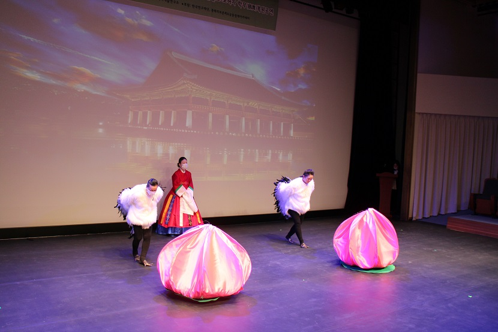

리허설 장면[무원: 오른쪽 손선숙, 왼쪽 박재란]

                                         춤의 위치로 이동하는 두 마리의 학

                                          북향춤 위치에서 내고하는 장면

                                         향지당춤 위치에서 북향으로 가기 위해 내선하는 장면(2단계 도약 춤사위)

공유하기

게시글 관리

**백규서옥\_Blog ver.**