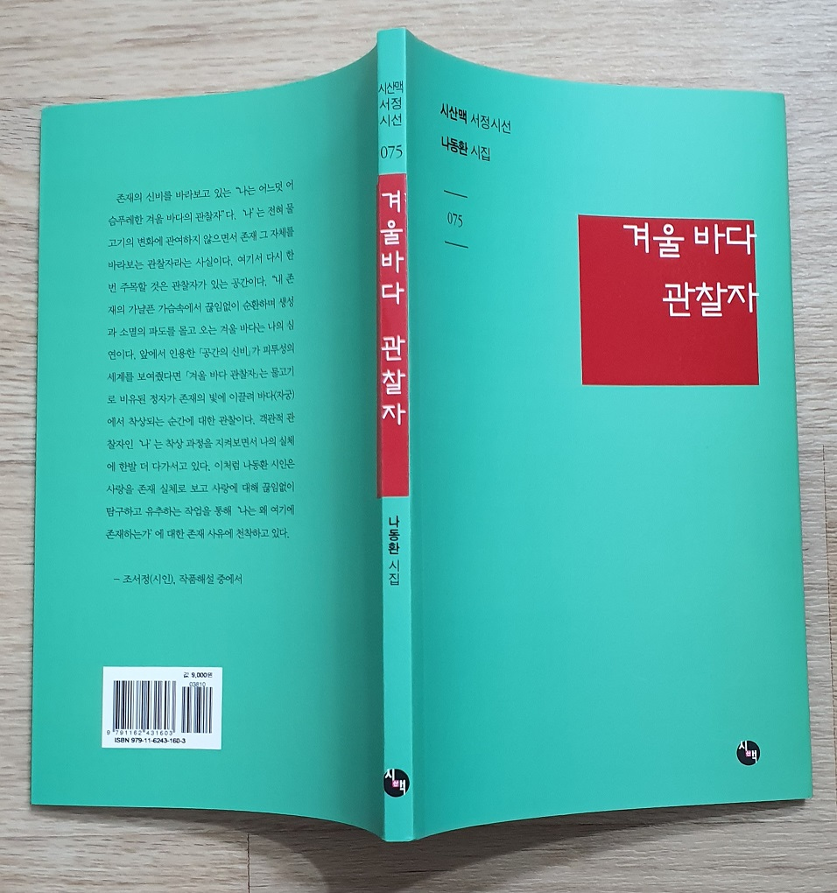
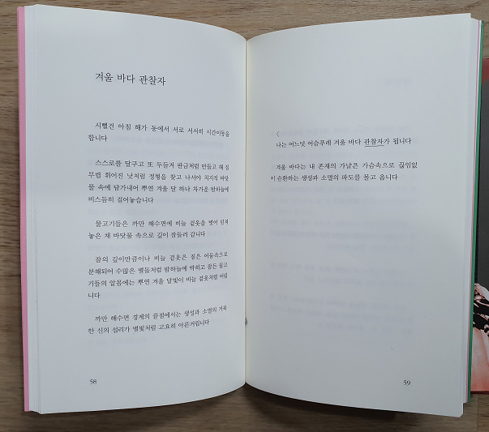

조규익

### 

### 페이스북은 무성산의 은둔자 백규가 세상과 소통하는, 작지만 큰 창이다. 그 창을 열면 반가운 이들의 따스한 미소가 보이고 다정한 음성이 들린다. 내게 손짓하는 반가운 이들 가운데 두어 명의 시인들이 있다. 이른바 ‘페친’들. ‘페이스북의 친구’들이란 뜻일까. 그러나 그 시인들을 감히 ‘친구’라고 부를 수는 없다. 나는 그분들로부터 세상에서 지금까지 배우지 못한 것들을 배우고 있기 때문이다. 그러니 ‘페친’보다는 ‘페사’란 말이 옳으리라. ‘페이스북 사부(師傅)’란 뜻이다. 그 시인들은 세상의 창 페이스북을 통해 내가 만나는 ‘싸부님들’이다. 긴 세월 비싼 등록금 내고 학교를 다니며 시를 배웠으나 아직도 시가 무엇인지 모르고, 시를 통해 삶의 진실을 깨달을 수 있다는 사실은 더더욱 깨우치지 못했는데...그러나 지금 나는 설레는 마음으로 매일 페이스북의 문지방을 넘는다. ‘공짜 학생’ 백규는 오늘도 삶의 진실을 깨달을 수 있다는 설렘으로 페이스북에 자리를 펴고 앉아 있는 시인들을 만난다. 귀하고 얻기 어려운 게 진실임을 세상살이에서 깨달았다. 그것을 진부한 말과 이론으로 깨닫기는 더더욱 어렵다는 걸 알았다. 장강대하처럼 흘러내리는 세상의 말들을 보라. 욕망과 거짓, 증오와 간계를 숨기기 위한 레토릭이 대부분 아닌가. 그 어느 갈피에 한 오리라도 진실이 숨어 있단 말인가. 힘을 탐하고 물질을 탐하며 남을 거꾸러뜨리기 위해 오도독 이를 갈며 거미줄을 치기에 분주한 세상의 말들에서 무슨 진실을 느낄 수 있단 말인가.

### 

### 내 소중한 페사 중의 한 분이 바로 나동환 시백이다. 나 시백을 포함한 내 페사들은 내게 시로 말을 건다. 나는 시를 통해 인간세상의 진실을 배운다. 진실과 사실은 다르다. 사람들이 치고받으며 찾아내려 하고 또 찾아냈다고 억지 쓰는 ‘사실’, 어쩌면 ‘시장의 우상’ 숭배자들을 뛰어 넘어 사실 아닌 진실을 추구하는 존재들이 페이스북의 내 ‘싸부들’이다. 세상 사람들의 말이 모두 다르듯 두어 분의 ‘페사들’의 어조는 다르다. 그 어조의 다름을 좀 더 분명히 보여주려는 배려였을까. 나 시백이 시집 <<겨울바다 관찰자>>를 보내 오셨다. 페이스북의 라운지에서 ‘불경스럽게도’ 커피를 마시며 ‘눈팅’을 해온 그 어조가 활자로 변신하여 다시 한 번 내 감성과 이성의 촉수를 자극한다. 아, ‘페사’ 나 시백은 꾸준히도 존재의 근원을 성찰해 오셨구나! 시공에 한정시킨 존재가 아니라, ‘어디까지라도 언제까지라도’ 확장되거나 공유될 수 있는 ‘존재의 진실’을 추구하셨구나!

### 표제시 <겨울바다 관찰자>를 보자.

#### 시뻘건 아침 해가 동에서 서로 서서히 시간이동을 합니다.

#### 

#### 스스로를 달구고 또 두들겨 판금처럼 만들고 해 질 무렵 휘어진 낫처럼 정형을 찾고 나서야 치지직 바닷물 속에 담가내오 뿌연 겨울 달 하나 차가운 밤하늘에 비스듬히 걸어놓습니다

#### 

#### 물고기들은 까만 해수면에 비늘 겉옷을 벗어 던져 놓은 채 바닷물 속으로 깊이 잠들러 갑니다

#### 

#### 잠의 깊이만큼이나 비늘 겉옷은 짙은 어둠속으로 분해되어 수많은 별들처럼 밤하늘에 박히고 잠든 물고기들의 알몸에는 뿌연 겨울 달빛이 비늘 겉옷처럼 어립니다.

#### 

#### 까만 해수면 경계의 끝점에서는 생성과 소멸의 거룩한 신의 섭리가 별빛처럼 고요히 아른거립니다.

#### 

#### <

#### 나는 어느덧 어슴푸레 겨울 바다 관찰자가 됩니다

#### 

#### 겨울 바다는 내 존재의 가냘픈 가슴속으로 끊임없이 순환하는 생성과 소멸의 파도를 몰고 옵니다

#### 

### 쉼 없이 들레이는 바다를 보며 시인은 순환의 고리를 건져 올린다. 시인이 보기에 생성과 소멸은 1회로 마무리되는 단순지속이 아니었다. 소멸은 또 다른 생성의 모태가 되고, 그 생성은 또 다른 소멸을 낳고, 그 소멸 또한 ‘또또다른’ 생성을 낳는다는 순환. 한 순간도 쉼 없는 순환의 연속이 바다에서 일어나고 있지 아니한가. 그 고리를 몸으로 현시하는 것이 바로 시간의 지속이고. 나같이 어리숙한 독자를 깨우치기 위함이었을까. 태양과 달, 별, 그리고 물고기 등을 출연시켜 그 감동적인 순환과 지속을 보여주고 있으니, 시인의 상상력은 우주적 스케일로 펼쳐진다. 그러나 바다에 펼쳐지는 순환과 지속이 아무리 우주적 스케일이라 해도 결국 ‘내 존재의 가냘픈 가슴속으로 끊임없이 순환하는 생성과 소멸의 파도를 몰고 올’ 뿐이라는 것이다. 이 순간에 시인은 자잘한 세상의 얽매임에서 놓여나 자유로워지는 것이다. 시뻘겋게 해 뜨는 아침부터 별빛 고요히 아른거리는 밤까지 바다를 관찰하고 분석한 시인의 결론은 무엇인가. 수많은 생성과 소멸의 순환이 반복되는 무한대의 공간을 아예 가슴 속에 품음으로써 자잘한 존재의 한계를 넘어야겠다는 깨달음 아닌가. 바다는 시인에게 모습을 드러낸 텍스트였고, 시인은 그 텍스트로부터 생성과 소멸의 순환법칙을 얻어 내게 보여주고 있는 것 아닌가. 그래서 이 시는 아니 이 시집은 바다라는 성소(聖所)에서 시인 혼자 벌인 비의(秘儀)의 기록이라 할 수 있지 않겠는가.

공유하기

게시글 관리

**백규서옥\_Blog ver.**