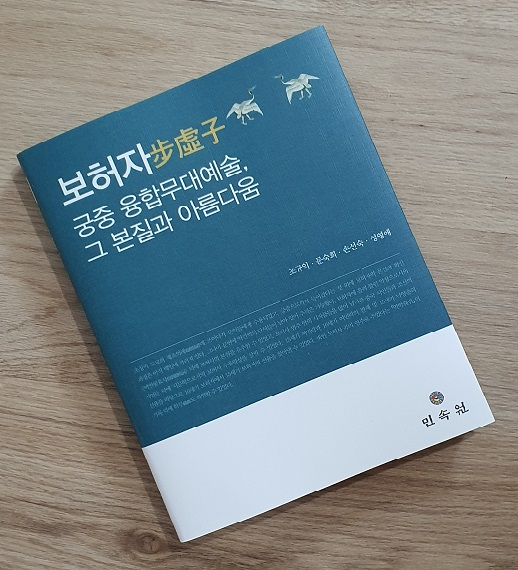

### ‘읽는 책’에서 ‘보고 듣고 느끼는 책’으로!!!

### 

### 작년도 제 연구실에서는 네 사람의 연구자들[조규익・문숙희・손선숙・성영애]이 음악으로서의 보허자(步虛子) 악곡과 시가로서의 보허사(步虛詞)를 분석・정리하는 모임들을 가졌습니다. 이미 우리 팀은 세종대 궁중정재 ‘봉래의’와 고려시대 궁중 속악정재 ‘동동’을 복원하고 분석하여 책으로 엮어낸 경험들을 갖고 있었기 때문에, 이 작업 또한 일사천리로 진행되었습니다. 작년 11월 21일에 우리는 다음과 같이 복원 공연 및 학술발표회를 가졌습니다.

### 

### 보허자步虛子: 허공을 즈려밟고 훨훨 나는 신선이여!

### 태평성세 유토피아 이루시는 제왕이여!

### 

### 국가지정문화재 전수회관 풍류극장

### 2020. 11. 21.

### 

### 그 자리에서 이루어진 학술발표들과 공연을 함께 묶은 책이 오늘 드디어 세상에 나왔습니다. 책 제목과 출판사항은 다음과 같습니다.

### 

### 보허자步虛子

### 궁중 융합무대예술,

### 그 본질과 아름다움

### 

### 조규익・문숙희・손선숙・성영애

### 

### 민속원, 2021. 3. 2.

### 

### 이 책의 내용과 의미는 책의 서문과 목차에 잘 밝혀져 있으므로, 그것들을 여기에 붙이겠습니다.

### 

### 

### ◆ 머리말 ◆

### 

### 신선의 음악과 춤,

### 노래 속에 즐거운 ‘시간여행’을...

### 

### 

### 보허자步虛子에 관한 멋진 설화 한 토막.

### 

### 일설에 이르기를, “진사왕[조식]이 유산할 때 문득 허공에서 경을 외는 소리가 들리는데, 맑고 심원하며 굳세고 밝으므로 음을 아는 자가 본뜨고 그려내어 신선의 소리로 삼았으니, 도사가 이를 모방하여 보허성을 만들었다.”고 한다.

### –<<이원異苑>> 권5

### 

### 남북조 시대 최고의 산수시인山水詩人 사령운謝靈運이 “천하의 재능이 한 섬이라면, 그 중 8말을 조식이 차지하고, 내가 한 말을 가졌으며, 나머지 한 말을 세상 사람들이 나눠가졌다.”고 말할 정도로 조식曹植은 천재 시인이었다. 지금 보허성 혹은 보허자의 근원을 알 수는 없다. 그러나 당시에 보허자가 얼마나 환상적이고 신비스러웠으면, 그들은 조식을 내세워 이런 스토리까지 만들었을까

### 

### 우리는 몇 해 전부터 중세왕조들의 궁중예술을 연구해오는 중인데, 고려․조선의 궁중예술들은 악곡․노래[시가/악장]․춤이 융합된 무대예술[정재呈才]이었다. 음악만으로, 춤만으로, 시가만으로는 그 미학의 진수를 전혀 알 수 없는 것이 융합예술체들이다. 그래서 각 부분을 연구한 뒤 하나로 합치는 과정을 거쳐 무대에 올려야 완성되는, 복잡하지만 즐거운 작업들을 해온 것이다. 그간의 연구 결과들은 아래와 같다.

### 

### 무대들

### 고려 및 조선노래 복원 연주회: 노래박물관 특별전[600년의 소리향]

### -국립국악원 우면당, 2011. 11. 10.

### 세종, 음악으로 다스리다

### -한중연 소강당[학술발표], 대강당[축하공연], 2012. 11. 27.

### 봉래의鳳來儀:세종의 꿈, 봉황의 춤사위 타고 하늘로 오르다!

### –국립국악원 우면당, 2013. 11. 21.

### 동동動動:시간이 흘러도 변함없는 사랑의 염원이여!

### –국가지정문화재 전수회관 풍류극장, 2018. 12. 1.

### 

### 펴낸 책들

### 조규익・문숙희・손선숙,  <<세종대왕의 봉래의, 그 복원과 해석>>, 민속원, 2015.

### 

### 조규익・문숙희・손선숙・성영애,  <<동동動動:궁중 융합무대예술, 그 본질과 아름다움>>, 민속원, 2019.

### 

### 동동에 빠져 지낸 뒤 보허자와 보허사를 만났고, 상당 기간의 연구를 거쳐 세 번째 복원공연 및 학술발표회를 가졌다.

### 보허자步虛子:허공을 즈려밟고 훨훨 나는 신선이여!/태평성세 유토피아 이루시는 제왕이여! –국가지정문화재 전수회관 풍류극장, 2020. 11. 21.

### 이제 그 결과를 책으로 엮어 세상에 내놓는다.

### 

### 초창기 도교의 재초의례齋醮儀禮에 쓰이다가 문인들에게 수용되었고, 궁중으로까지 들어갔다는 것 외에 보허자의 본질과 확산 과정은 아직 베일에 가려져 있다. 그나마 문헌에 약간씩의 단서들이 남아 있어 추적은 가능했다. 보허자에 올려 불린 악장으로서의 <벽연롱효사碧烟籠曉詞> 덕에 보허사의 본질을 유추할 수 있었고, 보허사 범주 안의 시작품들을 많이 남겨준 중국 시인들과 조선의 시인들 덕에 시문학으로서의 보허사 수용양상을 살필 수 있었다. 15세기 여민락과 16세기 여민락의 관계 및 15세기 낙양춘의 선율을 바탕으로 16세기 보허자에서 15세기 보허자의 선율을 찾아낼 수 있었다. 또한 보허자 곡의 연주로 추었다는 <<악학궤범>>의 기록 덕에 학무鶴舞도 복원할 수 있었다.

### 

### 

### 우리는 1,500여 년 전의 보허자가 우리 곁에 오기까지의 과정을 이렇게 추적해왔다. 이 책으로 1차 보고의 의무를 마치고, 우리는 앞으로 나아간다. 다시 ‘시간여행자’가 되어 또 다른 작품들과 씨름하다가 퍼뜩 새로운 아이디어가 떠오르면 다시 돌아올 것이다. 신선의 음악과 노래, 춤 속에서 즐긴 ‘시간여행’은 매우 환상적이었고, 그래서 행복했다.

### 

### 큰 도움 주신 한국연구재단과 힘들인 원고를 멋진 책으로 꾸며주신 민속원의 홍종화 사장님과 편집부의 노고에 감사드리며, 강호 제현의 애정 어린 비판을 고대한다.

### 

### 2021. 3. 1.

### 

### 지은이들을 대표하여

### 조규익

### 

### ◆ 목차 ◆

### 

### 제1부

### 총서 / 19

### 조규익

### 

### 

### 제2부

### 악장으로서의 <보허사步虛詞>, 그 전변轉變에 따른 시대적 의미 / 27

### 조규익

### 1. 머리말 28

### 2. 고려왕조의 보허자․보허사 수용과 1차적 의미 전변 32

### 3. 조선왕조의 보허자 계승과 콘텍스트의 복합성 44

### 4. 조선조 보허자 악장 텍스트의 실험과 2차적 의미 전변 51

### 5. 맺음말 68

### 

### 

### 제3부

### 조선조 문인文人들의 보허사步虛詞 수용양상 / 71

### 성영애

### 1. 머리말 72

### 2. 송대宋代 <<악부시집樂府詩集>>에 나타난 보허사步虛詞 개관 75

### 3. 문인文人들의 보허사步虛詞 수용양상 80

### 4. 맺음말 97

### 

### 

### 제4부

### 15세기 보허자 음악 복원 연구 / 99

### 문숙희

### 1. 머리말 100

### 2. 보허자 리듬 변천 과정과 15세기 보허자의 리듬 104

### 3. 15세기 보허자 음악 찾기 113

### 4. 맺음말 124

### 

### 

### 제5부

### 보허자 음악에 맞춘 성종대成宗代 학무 복원 연구 / 127

### 손선숙

### 1. 머리말 128

### 2. <<악학궤범>>의 <학무> 검토 132

### 3. <학무> 복원의 주요 키워드 11가지 135

### 4. <학무> 복원의 수용 범위와 근거 139

### 5. <학무>의 가무악歌舞樂 융합적 복원 안무보 198

### 6. 맺음말 200

### 

### 

### 제6부

### 총결 / 207

### 조규익

### 

### 

### 제7부

### 텍스트 / 223

### 1. 고려사 악지 오양선 기록 224

### 2. 악학궤범 학무 기록 225

### 3. 여민락 악보 226

### 4. 금합자보 악보 000

### 5. 대악후보 악보 000

### 

### 

### Abstract 215

### 참고문헌 227

### 찾아보기 233

### 

### 

### 

### 

### 강호제현의 많은 조언과 편달, 부탁드립니다. 고맙습니다.

### 

### 

### 

### 2021. 3. 19.

### 

### 조규익 드림

### 

### 

### ◆췌언(贅言)◆

### 

### 

### 세상에 또 한 권의 책을 보태면서

### 

### 

### 책이란 무엇이며, 왜 만드는 것일까요? 많지는 않지만, 지금 제 서재에는 이름 모를 옛 선조들이 꼬박꼬박 적은 다음 묶어놓은 책 형태의 문적들과, 근대 이후 신활자로 출간한 선학들의 책들이 몇 권 꽂혀 있습니다. 글자를 아는 사람들도 많지 않고 변변한 종이도 없던 시절, 그 분들은 왜 그런 자취를 남긴 걸까요? 주변 사람들에게 말하고 싶어도 들으려 하지 않고 글자로 써놓아도 읽어주는 사람이 없던 그 당시에 그 분들이 느낀 좌절은 어떠했을까요?

### 

### 아마 ‘지금은 모르지만, 앞으로 백년 천년 뒤 누가 있어 이 글을 보면 내가 이 땅에 살다 갔음을 알아주겠지’라는 생각으로, 이런 문적을 남겼겠지요? 저는 그저 제가 하고 있는 공부에서 무언가를 발견하면 흐뭇하고 즐거워 이 날 이 때까지 아무도 읽어주지도 알아주지도 않는 글들을 반복적으로 쓰고 있습니다만. 공부를 하면 할수록 내가 아는 것이야말로 세상을 가득 채운 미세먼지 한 톨만도 못하다는 사실을 절감하면서, 비로소 ‘남은 기간’과 ‘해야 할 것들’ 사이의 불균형이나 괴리를 깨닫게 되었습니다.

### 

### 대학원생 시절 저를 아껴 주시던 나손(羅孫) 김동욱(金東旭) 선생님은 저를 만나실 때마다 무슨 공부를 하고 있는지 물으셨고, 제 대답이 끝나기도 전에 당신의 말씀을 툭툭 던지곤 하셨습니다. 나중에 선생님의 말씀들을 곱씹어 보며 그 말씀들 속에 담긴 아이디어가 얼마나 금쪽같은 것들이었는지를 깨닫곤 했습니다.

### 

### 그러면서 드는 의문이 있었습니다. ‘그렇다면 선생님께서는 왜 그런 아이디어들을 속속 더 많은 논저들로 만들어 내지 않으실까?’ 물론 선생님은 당시 이미 등신대(等身大)의 논저들을 남겨 놓으셨으니, 거기에 새삼 무엇을 더 얹으실 수 없는 입장이셨지만, 어린 저로서는 의문이 아닐 수 없었습니다.

### 

### 이제 저도 그 때 그 분의 연치에 도달했습니다. 남들의 논저를 읽어갈 때마다 ‘이건 왜 이렇게 썼을까?’, ‘이 점을 놓친 것 같군’, ‘이런 견해를 표명한 글들이 이미 나왔는데, 미처 읽지 못했군’ 등등. 여러 생각들이 떠오르는 경우가 적지 않습니다. 어쩌면 그 후학을 만나 이야기하면, ‘그럼 당신이 한 번 써보구려!’라는 반박이 되돌아 올 수도 있겠지요. 그러나 생각을 논리화하는 작업에 착수한다는 것은 ‘열정과 힘’이라는 연료가 있을 때 비로소 가능한 일이라는 점을 이제야 절감하게 되었습니다. 그 열정과 힘을 다른 말로 하면 ‘젊음’이겠지요. 신은 인간에게 아이디어를 풍성하게 주면서 열정과 힘까지 주지는 않습니다. 인생을 불태워 아이디어와 지혜를 얻었다면, 그 아이디어와 지혜는 더 이상 그의 것이 아닙니다. 그를 뒤따르는 누군가들에게 건네주어야 할 ‘대가 없는’ 선물일 뿐이지요.

### 

### 이 책[보허자步虛子: 궁중융합무대예술, 그 본질과 아름다움]을 포함, 10권 정도를 시리즈로 내고자 한 것이 얼마 전까지 갖고 있던 제 내심의 계획이었습니다. 이제 겨우 3권이 나왔습니다. 그리고 그것들에 대한 평가결과도 아직은 알 수 없습니다. 그러니 그런 ‘헛된 꿈’을 버리라고, 제 옆지기는 자꾸 다그치네요. 좀 과하고 헛된 꿈일까요?

공유하기

게시글 관리

**백규서옥\_Blog ver.**