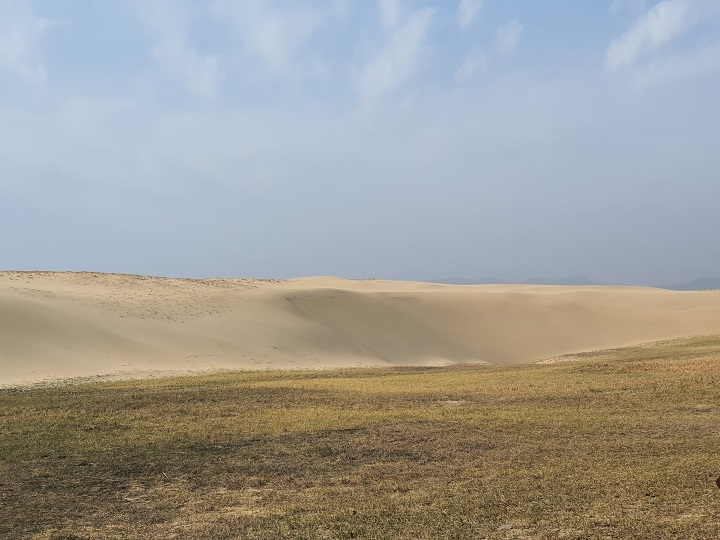

말없이 누워 시간을 증명하는 태안사구

### 세사(世事)가 번잡하다는 생각이 들면, 지체 없이 고향을 찾을 일이다. 고향을 찾는 일은 시간여행이다. 하기야 모든 여행이 시간여행 아니냐고 반문한다면, 할 말은 없다. 그러나 고향을 찾는 일은 다른 곳을 찾는 것과 다르다. 낡은 집 혹은 집터와 부모님의 산소가 있어 특별하다. 자연이 변했고 그 옛날의 사람들도 더는 살고 있지 않지만, 다북쑥으로 뒤덮인 집터나 산소는 의연히 그곳을 지키고 있지 않은가. 수많은 발자국들이 찍혀 있고 그 발자국들에 묻어온 바깥세상의 티끌들이 켜켜이 쌓여 있으며 각종 잡초들이 자라나 엉켜 있는 곳. 그곳에 서리고 앉아 있는 스토리와 히스토리를 헝클어진 실타래 풀 듯 정리하려면 어쩔 수 없이 타임머신을 타야한다. 그래서 심사가 복잡할 때면 삽과 쟁기를 던져두고 달려가는 곳이 고향이다.

### 

### 어릴 적 소에게 풀 뜯기러 다니던 백사장. 물소리와 물빛은 여전하고, 수평선에서 들려오는 뱃고동 소리도 그대로다. 겨우내 말라붙은 통보리사초가 바닷바람에 일렁이고, 그 사이에서 간신히 삶을 부지하고 있는 해당화 줄기들은 조심스레 눈을 틔워내고 있다. 해변에 빠끔빠끔 뚫려있는 작은 구멍들은 아마 부모 품에서 갓 떨어져 나온 달랑게 아가들의 새 집들일 것이다. 주변이 말끔한 어미 게의 집들과 달리, 녀석들의 집 주변은 온통 장난처럼 그어놓은 그림들로 어지럽다. 하하, 장난꾸러기 아가 달랑게들이여, 부디 행복하기를!

### 

### 간신히 명맥을 유지하고 있는 모래언덕을 힘겹게 지나 소나무 숲으로 들어간다. 뚫고 들어갈 수 없을 만큼 빽빽한 곰솔들. 바람에 실려 번져 나가는 그들의 노래가 미세먼지로 더껑이 진 내 귀를 간질인다. 그래, 잘들 자랐구나. 손가락 굵기의 묘목을 새하얀 모래 언덕에 꽂아 넣던 수십 년 전 그 시절. 어찌 알았으랴? 순식간에 이토록 장대한 소나무 숲으로 자라날 줄을! 해신(海神)과 풍신(風神), 그리고 토신(土神)이 누천년 쉼 없이 불고 쓰다듬으며 만들었을 모래동산들은 다 어디로 사라졌단 말인가. 신의 손길이 만든 사구(沙丘)들 대신 개미 같은 인간들이 그 곱고 이국적인 동산들을 눈 깜짝 할 사이에 집어 삼키지 않았는가. 해신과 풍신이 안간힘을 써가며 모래 알갱이들을 불어 올리고 있지만, 저 무성하게 태양을 향해 뻗어 올라가는 소나무 숲을 어찌 덮어버린단 말인가. 소를 풀밭에 풀어놓고 벌렁 누운 채 수평선을 바라보며 ‘따분한 고향’ 탈출을 꿈꾸던 어린 시절의 내 모습이 모래밭 한 가운데 화석으로 남아 있음을 비로소 발견한다. 수십 년 세월의 강을 건너며 모래밭에 남은 그 자국은 오히려 선명하게 내 눈앞으로 다가 서지 않는가. 자연은 바뀌어도 자연 속에 남겼던 내 어린 시절의 모습은 계절 따라 색깔만 바꾸어 갈 뿐, 사라지지 않음을 비로소 확인해주지 않는가.

### 

### 내 옛집이 앉아있던 빈 터, 아직도 나를 쓰다듬어 주시는 조부모와 부모의 산소, 어린 시절 뒹굴며 찍어 놓은 모랫벌의 내 모습, 순식간에 모랫벌을 삼키고 하늘같이 자라난 소나무들, 아직도 미련을 버리지 않고 모래알을 불어 올리는 해신과 풍신 그리고 토신, 작은 구멍을 뚫고 구멍 앞에 현란한 그림들을 그려놓은 아가 달랑게들... 모두가 내 시간여행을 가능하도록 한 도우미들이었다. 시인 서정주는 “머언 먼 젊음의 뒤안길에서/인제는 돌아와 거울 앞에 선/내 누님같이 생긴 꽃이여”라고 국화를 노래했지만, 젊은 시절 욕망과 꿈의 미로에서 헤매다가 고향 앞에 돌아와 끊임없이 밀려드는 바닷물과 이젠 한 줌 사구에 남은 그 옛날의 내 모습이나 찾아볼 뿐이다.

### 

### 왜 고향을 찾는가. 내 모습을 찾기 위한 시간여행. 그것을 가능케 하는 타임머신이 그곳에 있기 때문이다.

말없이 누워있는 사구

할 말이 많은 사구

사구와 풀들

사구 뒤편의 곰솔밭

건강한 곰솔

곰솔의 남성미

사구 앞의 등대

사구의 주인 갈매기들

사구 앞 해변

태안사구 아가 달랑게들의 집들과 그림

태안사구의 태양

부모님 산소

나무숲이 되어버린 고향집터

공유하기

게시글 관리

**백규서옥\_Blog ver.**