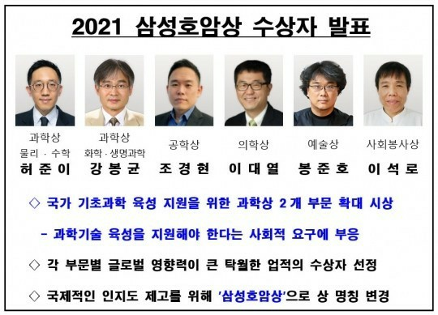

호암재단 발표내용

### 아들의 수상 소식을 접하고 그에 관한 이야기를 하려는 내게 누군가 '불출(不出)'이라 꾸짖어도 어쩔 수 없다.

### 며칠 전 학교에서 강의를 마친 뒤 집에 오려는데, 양훈식 선생이 방금 인터넷 신문에서 보았다며 경현의 ‘2021 삼성호암상’ 수상 소식이 보도된 기사 한 건을 문자로 보내주었다. 그 기사를 읽고 집까지 두 시간 넘는 거리를 운전하며, 내 마음 속에는 여러 가지 상념들이 명멸했다.

### 

### 평소 삼성호암상은 아무나 받는 상이 아니라고 생각해온 나로서는 그 상 자체에 큰 관심을 갖지 않았던 것이 사실이다. 국문학을 포함한 인문학자에게 주는 상도 아니고, 자연과학과 공학 등 실용적 보편학문과 예술분야, 사회봉사의 특출한 인물들이 받는 상이라는 점에서 그에 대하여 큰 관심을 갖지 않았던 것이다. 그런데 하루 밤을 자고 일어나 여러 사람들로부터 축하 전화를 받으며 그 상의 무게를 비로소 실감하게 되었다.

### 

### 기사를 검색해보니, 호암재단[이사장 김황식]이 발표한 2021년도 삼성호암상 수상자 및 심사과정은 다음과 같았다.

### 

### 수상자

### 1. 과학상

### 1) 물리・수학부문: 허준이 교수[38세/스탠퍼드 대]

### 2) 화학・생명과학부문: 강봉균 교수[60세/서울대]

### 

### 2. 공학상: 조경현 교수[36세/뉴욕대]

### 

### 3. 의학상: 이대열 특훈교수[54세/존스홉킨스대]

### 

### 4. 예술상: 봉준호 감독[52세/영화]

### 

### 5. 사회봉사상: 이석로 원장[57/방글라데시 꼬람똘라병원]

### 

### 심사

### 

### 국내외 저명학자와 전문가 46명으로 구성된 심사위원회와 해외석학 자문위원 49명의 업적 검토 등 4개월 동안의 엄격한 심사과정

### 

### 삼성호암상은 삼성그룹 창업자인 호암(湖巖) 이병철 회장의 ‘인재제일, 사회공익 정신’을 기려 1990년에 제정되었다 하니, 한국 내에서는 그 권위와 역사를 능가할 만한 상도 없을 것이다.  또한 대부분의 기사들에서 호암재단이 ‘허준이 교수, 조경현 교수 등 30대의 젊은 과학자 2명이 수상자로 선정된 것은 학계의 큰 소득임’을 밝혔다고 했는데, 나로서는 그 점이 더욱 감격스러웠다. 학문의 성격에 따라 다르겠지만, 나이가 들어감에 따라 완성도가 높아지는 인문학 종사자로서 솔직히 놀라운 일이 아닐 수 없었다. 사실 그간의 내 경험으로 미루어 그 방향이 타당할 뿐 아니라 대단히 바람직하다고 생각한다. 인문학이라 해도 나이가 들어감에 따라 비전의 성숙도가 높아지는 것은 맞지만, 그것을 학문적 결과로 실현하기가 쉽지 않기 때문이다. 그런 점에서 삼성호암상이 시대적 조류를 과감히 받아들여 30대인 조경현을 역대 최연소 수상자로 선정한 것은 영광스러운 쾌거라 할 수 있지 않은가.

### 

### 다음으로 감격스러운 것은 그의 학문분야와 성취도에 대한 평이다. 그것들은 다음과 같다.

### 

### 1. 공학상 조경현 교수는 문장 전후 맥락까지 파악하는 ‘신경망 기계번역 알고리즘’을 개발해 ‘인공지능[AI] 번역의 혁신가’라는 평가를 받았다. [매일경제]

### 

### 2. 공학상 조경현 교수는 인공지능[AI] 번역 전문가다. 문장의 전후 맥락까지 파악해 고품질의 번역을 할 수 있는 ‘신경망 기계번역 알고리즘’을 개발했다. 조 교수가 개발한 알고리즘은 현재 대다수 번역 엔진에 사용되고 있다는 게 재단 설명이다. [동아사이언스]

### 

### 3. 인공지능[AI] 번역 기술의 대가로 꼽히는 조경현 미국 뉴욕대 교수는 공학상 수상자로 선정됐다. 조 교수는 문장 단위의 AI 번역을 뛰어넘어 사회・문화적 맥락과 작가 스타일을 살리는 ‘신경망 기계번역 알고리즘’[NMT]을 처음 선보였다. 그가 개발한 NMT는 현재 대다수 번역 엔진에 채택돼 AI 번역 및 관련 산업계에 영향을 끼치고 있다. [중앙일보]

### 

### 4. 조경현 교수는 문장 전후 맥락까지 파악하는 ‘신경망 기계 번역 알고리즘’을 개발해 인공지능 번역에 혁신을 가져왔다. [조선일보]

### 

### 5. 특히 “올해는 물리・수학 부문 허준이 교수, 공학상 조경현 교수 등 30대 젊은 과학자 2명이 수상자로 선정됐다.”며 “세계 유수의 상들과 견줘 손색없는 수준을 인정받는 삼성호암상에 올해 30대의 젊은 수상자가 2명이나 선정된 것은 학계의 큰 소득으로 평가된다”고 덧붙였다. [아이뉴스 24]

### 

### 1~4는 뉘앙스의 차이가 있을 뿐, 똑같은 내용이다. 그가 그 분야에서 손꼽히는 AI의 전문가라는 점, 그가 개발한 새로운 번역의 알고리즘이 매우 훌륭하여 대다수 번역 엔진에 사용되고 있으며 관련 산업계에 영향을 끼치고 있다는 점 등이 그 내용의 골자들이다. 5는 호암재단이 30대의 연구자를 수상자로 선정한 의미를 밝힌 내용이다. 나로서는 이 기사들의 내용이 그에 대한 최고의 감동적인 찬사라고 생각한다. 무엇보다 이 말들이 사실과 부합되는지, 혹은 36살의 젊은 그가 오륙십 대의 시니어 학자들과 함께 이 상을 함께 받을 자격이 있는지 등에 대하여 크게 의심하고 싶지는 않다. 대학 졸업 이후 해외의 유수 대학들과 훌륭한 학자들을 찾아다니며 스스로 미래의 블루오션이라 믿은 AI를 배우며, 그것을 자신의 전공분야로 삼아 매진하기로 결심한 그의 판단과 노력을 잘 알고 있기 때문이다. AI의 2세대가 시작도 되기 전에 어린 나이의 그가 그 학문의 중요성과 의미를 간파하고 뛰어들었으니, 교수나 학자로서는 '약관'이라 할 수 있는 36의 나이에 학계의 주목을 받게 된 것이 크게 이상한 일은 아니리라.

### 

### 그러나 조경현이 명심해야 할 일이 있다. 한 사람의 학자가 자기 당대에 자신의 학문을 완성하는 경우는 없다는 사실이다. 그게 전통 고전문학이든, 첨단의 AI이든, 제대로 된 학자라면 늙어 꼬부라질 때까지 연구실에 틀어박혀 끊임없이 정진해야 하는 이유이다. 제 아무리 뛰어난 인간이라 할지라도 그 인간의 당대에 한 분야를 완성할 수 없도록 한 것은 감히 거스를 수 없는 ‘신의 섭리’가 아닐까. 간혹 ‘이 논문은 이 분야의 결정판이니, 아무도 더 손댈 수 없다’고 큰소리치는 인사들도 없지는 않았으나, 얼마 지나지 않아 100% 허언(虛言)임이 판명된 것만으로도 그 점은 분명하다.

### 

### 이제껏 빠져 지내는 잡기(雜技) 하나 없이 답답하게 살아가는 학자가 조경현이다. 자리에 앉아 컴퓨터를 무릎에 올려놓고 온갖 알고리즘의 세계를 유영(遊泳)하며 종으로 횡으로 자신의 가설을 논증하기에 바쁜 친구가 바로 조경현이다. 강의와 연구에 몰두하는 틈틈이 각종 컨퍼런스의 촘촘한 스케줄 따라 세계를 돌아다녀야 하는 것도 그의 생활 중 큰 부분이다. 어느 틈에 오만한 마음을 가질 수 있겠는가.

### 

### 2018년 블룸버그 통신이 그를 ‘새해에 주목해야 할 각 분야 50인’의 한 사람으로 선정했을 때도, 2019년 뉴욕대학이 부임[2015년 9월] 4년만에 종신교수직을 주고 미국 정부가 입국[2015년 9월] 3년 반만에 그린카드를 부여했을 때도, 2020년도에 삼성이 한국인으로서는 유일하게 ‘삼성연구자상’을 주었을 때도, 변함없이 허름한 티셔츠 한 장 걸치고 아무데나 앉아 쉼 없이 컴퓨터를 두드리며 발표문을 작성하는 그였다. 드디어 올해 삼성호암상을 받게 되었으나, 이후 그의 그런 자세엔 추호의 변함도 없으리라. 그래서 그는 내 아들이되, 나는 그를 내 선생으로 생각해야 마땅한 일이다. 아들을 훌륭한 선생으로 두고 있으니, 나는 분명 하늘로부터 큰 축복을 받은 셈이다.♣

블룸버그에서 발표한 2018년 각계의 수상자들과 조경현

<<시사인>> 570호 표지사진[2018. 8. 10.]

        삼성 첫 'AI연구자상' 시상 관련 기사[중앙일보 2020년 11월 2일자 경제면]

공유하기

게시글 관리

**백규서옥\_Blog ver.**