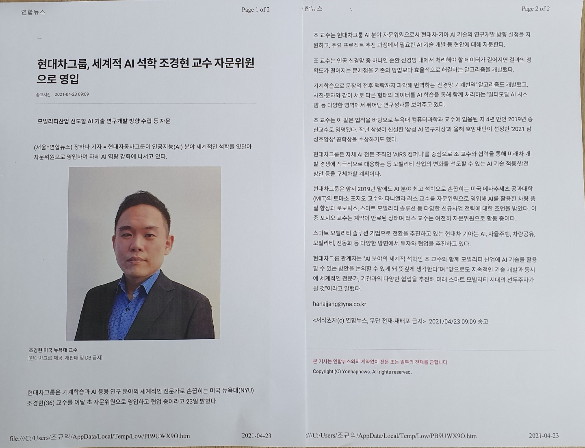

### 어제 밤 내 블로그의 조회 수가 급상승한 채로 마감했고, 오늘 아침 일찍 100 건이 넘는 조회수를 보이더니, 오후 5시 현재 358회를 기록하고 있다. 오후 쯤 작은 아이로부터 경현의 뉴스에 관한 카톡을 받고서야 그 이유를 알게 되었다. ‘현대차그룹에서 조경현을 자문위원으로 영입했다’는 내용의 소식이 인터넷 매체에 뜨면서, 조경현을 검색하는 사람들이 급증했고 급기야 내 블로그까지 덩달아 분주해졌던 것이다.

### 

### 많은 매체들에서 그의 소식을 전하고 있으나, 그 가운데 연합뉴스와 중앙일보의 기사만을 들기로 한다.

### 

### ◆연합뉴스◆

### 

### 현대차그룹, 세계적 AI 석학 조경현 교수 자문위원으로 영입

### 

### 모빌리티산업 선도할 AI 기술 연구개발 방향 수립 등 자문

### 

### (서울=연합뉴스) 장하나 기자=현대자동차그룹이 인공지능(AI) 분야 세계적인 석학을 잇달아 자문위원으로 영입하며 자체 AI 역량 강화에 나서고 있다.

### 현대차그룹은 기계학습과 AI 응용 연구 분야의 세계적인 전문가로 손꼽히는 미국 뉴욕대(NYU) 조경현(36) 교수를 이달 초 자문위원으로 영입하고 협업 중이라고 23일 밝혔다. 조 교수는 현대차그룹 AI 분야 자문위원으로 현대차・기아 AI 기술의 연구개발 방향 설정을 지원하고, 주요 프로젝트 추진과정에서 필요한 AI 기술 개발 등 현안에 대해 자문한다.

### 

### 조 교수는 인공 신경망 중 하나인 순환 신경망 내에서 처리해야 할 데이터가 길어지면 결과의 정확도가 떨어지는 문제점을 기존의 방법보다 효율적으로 해결하는 알고리즘을 개발했다.

### 

### 기계학습으로 문장의 전후 맥락까지 파악해 번역하는 ‘신경망 기계번역’ 알고리즘도 개발했고, 사진・문자와 같이 서로 다른 형태의 데이터를 AI 학습을 통해 함께 처리하는 ‘멀티모달 AI 시스템’ 등 다양한 영역에서 뛰어난 연구성과를 보여주고 있다.

### 

### 조 교수는 이같은 업적을 바탕으로 뉴욕대 컴퓨터과학과 교수에 임용된 지 4년 만인 2019년 종신교수로 임명됐다. 작년 삼성이 신설한 ‘삼성 AI 연구자상’과 올해 호암재단이 선정한 ‘2021 삼성호암상’ 공학상을 수상하기도 했다.

### 

### 현대차그룹은 자체 AI 전문조직인 ‘AIRS 컴퍼니’를 중심으로 조 교수와 협력을 통해 미래차 개발 경쟁에 적극적으로 대응하는 등 모빌리티 산업의 변화를 선도할 수 있는 AI 기술 적용・발전방안 등을 구체화활 계획이다.

### 

### 현대차그룹은 앞서 2019년 말에도 AI 분야 최고 석학으로 손꼽히는 미국 메사추세츠 공과대학(MIT)의 토마스 포지오 교수와 다니엘라 러스 교수를 자문위원으로 영입해 AI를 확용한 차량 품질 향상과 로보틱스, 스마트 모빌리티 솔루션 등 다양한 신규사업 전략에 대한 조언을 받았다. 이중 포지오 교수는 계약이 만료된 상태이며 러스 교수는 여전히 자문위원으로 활동 중이다.

### 

### 스마트 모빌리티 솔루션 기업으로 전환을 추진하고 있는 현대차・기아는 AI, 자율주행, 차량공유, 모빌리티, 전동화 등 다양한 방면에서 투자와 협업을 추진하고 있다.

### 

### 현대차그룹 관계자는 “AI 분야의 세계적 석학인 조 교수와 함께 모빌리티 산업에 AI 기술을 활용할 수 있는 방안을 논의할 수 있게 돼 뜻깊게 생각한다”며 “앞으로도 지속적인 기술 개발과 동시에 세계적인 전문가, 기관과의 다양한 협업을 추진해 미래 스마트 모빌리티 시대의 선두주자가 될 것”이라고 말했다. hanajjang@yna.co.kr

### 

### ◆중앙일보◆

### 

### 삼성 이어 현대차도 ‘30대 AI 전문가’ 조경현 교수에 러브콜

### 

### 현대자동차그룹이 최근 인공지능(AI) 분야에서 주목받는 30대 한국인 교수를 자문위원으로 선임했다. 현대차뿐 아니라 삼성도 먼저 러브콜을 보냈을 정도로 AI 영역에서 손꼽히는 인물이다.

### 

### 현대차그룹은 23일 조경현(36) 미국 뉴욕대학교(NYU) 교수(컴퓨터과학과)를 이달 초 자문위원으로 영입했다고 밝혔다. 1985년생인 조 교수는 2009년 한국과학기술원(KAIST) 컴퓨터과학부를 졸업했다. 2015년 뉴욕대 교수로 임용된 지 4년여만인 지난해 종신교수로 승진했다. 현대차그룹에 따르면 조 교수는 최근 현대차의 AI 담당 연구진과 협업을 시작했다. 앞으로 현대차의 AI 연구개발 방향 설정을 지원하고, 주요 AI 프로젝트를 추진하는 과정에서 자문 역할을 맡는다.

### 

### AI 자연어 처리 분야에서 조 교수는 최고 수준의 연구자로 꼽힌다. 단순한 언어 번역이 아닌 언어에 이미지를 더하는 방식인 ‘신경망 번역’을 통해 의료・바이오 분야에서 주목할 만한 논문을 다수 발표했다. 현대차그룹 관계자는 “조 교수는 AI 데이터 과정에서 기존 알고리즘보다 구조적으로 간결하면서도 효과적인 해법을 제시했다”고 설명했다.

### 

### 삼성전자에서도 조 교수를 눈여겨봐 지난 해 11월 ‘삼성 AI 연구자상’에 선정했었다. 당시 수상자(5명) 가운데 조 교수는 유일한 한국인이다. 그는 올해도 삼성이 후원하는 ‘2021 삼성호암상’ 공학상을 받았다. 그는 미국 기업 페이스북의 객원연구원으로도 활동했었다.

### 

### 현대차는 자체적인 AI 개발 조직인 ‘AIRS 컴퍼니’를 중심으로 조 교수와 협력을 지속할 계획이다. 자율 주행, 차량 공유, 전동화 등 새롭게 떠오르는 모빌리티(이동수단) 분야에 적극적으로 대응하기 위해서다. 현대차그룹 관계자는 “앞으로도 지속적인 기술개발과 동시에 세계적인 전문가와 다양한 협업을 통해 미래 스타트 모빌리티 시대의 선두주자가 될 것‘이라고 말했다.

### 

### 김영민 기자 bradkim@joongang.co.kr

#조경현 #현대자동차그룹 #자문위원 ##AIRS 컴퍼니 #신경망번역 #삼성호암상 #삼성연구자상 #삼성전자 #자율주행 #차량공유 #전동화 #조경현 뉴스 업데이트

공유하기

게시글 관리

**백규서옥\_Blog ver.**