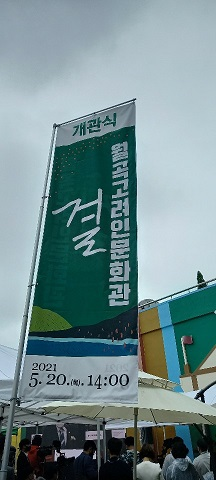

### 2021. 5. 20. 오후 2시. ‘월곡고려인문화관’의 감격스런 개관식이 열렸습니다. 광주광역시 광산구 월곡동 주택가 한 복판에 숨듯이 자리한 문화관의 개관식에 다녀왔습니다. 광산구청에 소속된 문화관은 김병학 관장이 25년 간 중앙아시아에 체류하면서 모은, 고려인 관련 역사문화자료들을 모태로 이루어진 공간입니다. 냉전 종식 이후 중앙아시아 고려인들을 포함한 해외 한인들은 그들의 조국 대한민국으로 밀려들고 있지만, 정부는 물론 우리의 지식사회는 그들의 역사와 문화를 소중히 여기고 보존하려는 생각조차 하지 못하고 있었습니다. 물론 김병학 관장 같은 선각자가 없었다면, 이곳에서도 이런 쾌거는 이루어지지 못했을 것입니다.

### 가서 들은 바에 의하면, 광산구에는 현재 6000~7000명의 고려인들이 거주하고 있다고 합니다. 고려인들 뿐 아니라 10여개 종족이 넘는 소수민족 출신들도 함께 섞여 있다는 것이니, 이 작은 지역은 다양한 인종의 전시장이라고 해도 과언이 아닐 것입니다. 잠시 동안 거리를 걷다보면, 여러 나라의 글자들로 이루어진 간판들이 예사롭지 않고 식당이나 까페에 앉아 있는 손님들의 면면 또한 낯설고 신기하기만 합니다. 단순히 고려인들 뿐 아니라 그들 나라의 원주민들도 고려인들과 함께 들어와 이곳에 둥지를 틀고 있다는 점을 분명히 보여줍니다.

### 김병학 관장. 만나던 첫날부터 예사롭지 않은 인물이라 생각했고, 교유를 지속해온 15년 간 그 생각은 더욱 깊어졌습니다. 저는 고전문학을 연구・강의해 오던 중 중국 조선족의 문학과 재미한인문학을 만났고, 그 연장선에서 구소련 고려인들의 존재와 문학을 알게 되었습니다. 현지답사의 필요에 의해 중앙아시아 여러 나라들을 찾게 되었고, 그 초입에서 만난 인사가 바로 김병학 관장입니다. 2007년 그를 만난 뒤로 우리는 지금까지 15년간 담담한 관계로 우정을 나누어 오는 사이입니다. 그의 자산은 겸손과 집념입니다. 이야기를 나눠보면 지극히 겸손하고 소박합니다. 그러나 일단 마음을 먹으면 그만 두지 않는 투지와 집념이 누구 못지않게 강합니다. 사실 중앙아시아처럼 한국 사람이 마음 붙이고 살기에 척박한 지역은 없을 것입니다. 그럼에도 불구하고 그는 25년을 그곳에서 지내왔습니다. 웬만하면 중간에 그만 두고 뛰쳐나올 수도 있었으련만, 왜 그는 투사처럼 그 긴 세월을 그곳에서 보냈을까요?

### 

### 1992년 민간한글학교 교사로 카자흐스탄에 처음 들어갔고, 1995-1996년, 2000-2003년 등 두 차례에 걸쳐 재소 고려인 한글신문 <고려일보>의 기자로 일했으며, 알마틔 국립대학교 한국어과 강사, 카자흐스탄 한국문화센터 소장 등으로 활약하기도 했습니다. 특히 냉전체제가 흔들리던 1980년대 말부터 구소련 고려인 동포들 사이에서 잃[잊]어버린 모국어를 부흥시키자는 운동이 크게 일어났고, 그에 부응하여 광주와 전남 지역의 유지들이 기금을 모아 카자흐스탄과 우즈베키스탄, 러시아에 각각 두 개씩의 민간한글학교를 세웠는데, 그것들이 그에게 중앙아시아 체류의 계기를 마련해주었던 것입니다. 그 때 그는 우리나라 바깥에서 우리의 전통과 언어를 지키고 있는 그들을 돕고 싶다는 생각으로 민간한글학교 교사에 자원했던 것입니다. 그렇게 해서 김 관장의 중앙아시아 생활은 시작된 것입니다.

### 

### 그가 첫발을 내디딘 곳은 카자흐스탄의 우쉬또베 마을이었습니다. 이곳은 1937년 강제이주 때 고려인들이 처음으로 짐짝처럼 실려와 부려진 곳이었습니다. 첫 도착자들의 공동묘지가 아직도 처절한 모습으로 남아있는 곳이 바로 여기입니다. 그곳에서 고려인들에게 한글을 가르치면서 고려인 사회의 어른들로부터 가슴 아픈 역사적 사실들을 얻어 들을 수 있었던 것이지요. 그런 과정에서 김 관장은 고려인의 역사와 슬픔에 눈을 뜨게 된 것입니다. 이처럼 그의 첫 관심사는 고려인들의 언어나 문화였으나, 점차 강제이주를 중심으로 고려인들이 당한 역사적 시련에 공감하게 되었고, 그와 함께 그곳에서 고려인과 공존하고 있는 많은 인종들의 삶 또한 목격하게 되었습니다. 역사・문화・종교가 다른 민족들이 상호 이해를 바탕으로 평화롭게 어울려 사는 모습을 보면서 김 관장은 새로운 삶의 양식과 공존의 원리를 배우게 되었다고 술회합니다.

### 

### 그는 고려인들의 언어・문화・역사를 탐구해오는 한편 시와 산문을 쓰기 시작하면서 시인과 작가로 활동영역을 넓혔고, 러시아 말로 쓰인 시나 산문들을 번역하기도 했습니다. 기억나는 것들만 들면 다음과 같습니다.

### 

### ▪김병학 지음, <<카자흐스탄의 고려인들 사이에서>>, 숭실대학교 한국문학과예술연구소 문예총서 3, 인터북스, 2009.

### ▪아바이, 김병학 역, <<황금천막에서 부르는 노래>>, 인터북스, 2010.

### ▪이 스따니슬라브, 김병학 역, <<모쁘르 마을에 대한 추억>>, 숭실대학교 한국문학과예술연구소 문예총서 5, 인터북스, 2010.

### ▪김병학 엮음, <<한진전집>>, 숭실대학교 한국문학과예술연수고 문예총서 12, 인터북스, 2011.

### ▪조규익・김병학, <<카자흐스탄 고려인 극작가 한진의 삶과 문학>>, 글누림, 2013.

### ▪김병학 편, <<김해운 희곡집>>, 숭실대학교 한국문학과예술연구소 학술자료총서 4, 학고방. 2017.

### ▪김경천, 김병학・유가이 콘스탄틴 공역, <<경천아일록 읽기-김경천 장군의 전설적 민족해방 투쟁론(한글판・러시아어판 합본>>, 숭실대학교 한국문학과예술연구소 학술자료총서 5, 학고방 | 2019.

### 

### 이제 막 개관된 ‘월곡고려인문화관’은 우리 동포가 해외로 나가 보존해오던 우리의 문화와 역사를 자료의 형태로 갖고 돌아와, 이 땅의 우리에게 보여주는 ‘보물창고’라 할 수 있습니다. 또한 그것은 다른 지역의 동포들을 포함한 ‘해외 동포 문학관’으로 확대될 단초 역할을 하게 되리라 믿습니다. 월곡고려인문화관과 김병학 관장의 무궁한 발전을 기원합니다.

### 

### 2021. 5. 20.

### 

### 백규

공유하기

게시글 관리

**백규서옥\_Blog ver.**