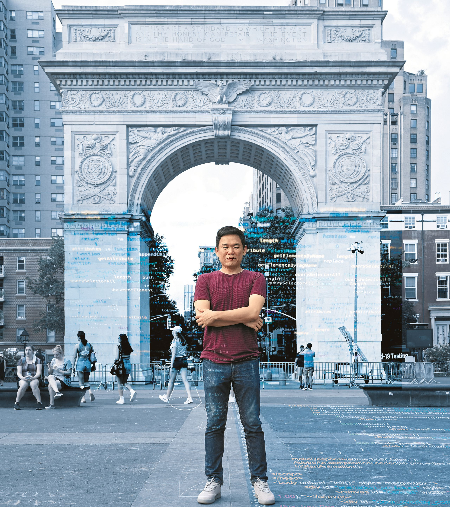

### 

미국 뉴욕대 근처 워싱턴 스웨어 아치 앞에 조경현 교수가 섰다. 핀란드와 캐나다를 거쳐 뉴욕으로 온 이 한국 젊은이는 지금 세계 인공 지능 학계의 주목을 받는 스타다. 조 교수는 말하기를 "AI는 만능도, 마법도 아니다" 라며 "세상을 한번에 바꾸기란 결코 쉬운 일이 아니다" 라고 했다. 사진에 프로그래밍 언어 이미지를 합성했다. 사진작가 서승재, 그래픽 김현국

2019년 '삼성 AI 포럼'에서 발표하고 있는 조경현 교수/삼성전자

### 

### 조선일보 [아무튼, 주말] [김미리 기자의 1미리]

### 

### 호암상 받은 36세 인공지능 석학

### 조경현 뉴욕대 컴퓨터과학과 교수

### 

### [김미리 기자/입력 2021.07.03. 03:00]

### 

### 2008년 가을 KAIST(한국과학기술원) 대덕 캠퍼스. 졸업으로 직진하는 대부분의 KAIST 천재와는 달리 7년째 학부생 신분을 벗어나지 못한 전산학과 ’02학번' 학생이 있었다. 유일한 목표는 무사히 졸업하는 것. 학점 따기 쉬운 1학년 교양과목을 집중 공략해 강의실 뒷자리를 지켰다. 하루는 선배가 학과 사무실에서 가져온 팸플릿을 건넸다. 핀란드 알토대 ‘인공 지능(AI)’ 석사과정 프로그램 모집 공지였다. 미래가 희미했던 공학도는 이듬해 무작정 핀란드로 떠났다.

### 

### 13년 전 졸업을 걱정했던 그 청춘이 지난달 모교 KAIST 전산학과에 1억원을 쾌척했다. 장학금 이름은 ‘임미숙 장학금’, 지원 대상은 여학생이었다. 그렇다면 그 졸업생이 임미숙이냐고? 아니다. 임미숙은 기부자의 어머니다.

### 

### 자기 이름 대신 어머니 이름 석 자를 내걸며 “여성 공학도를 지원하겠다”고 한 주인공은 30대 남자 공학자다. 세계적 AI 석학으로 꼽히는 조경현(36) 뉴욕대 컴퓨터과학과 교수. ‘인공 지능 번역’의 역사를 새로 썼다고 평가받는 인물이다. 그가 스물아홉 살이던 2014년, 요슈아 벤지오 몬트리올대 교수와 함께 발표한 ‘신경망 기계 번역’ 개념은 기존 기계 번역의 패러다임을 뒤집어 버렸다. 구글 번역기 등 대부분 번역기가 이 개념을 활용한 것이다.

### 

### 이 천재 공학자에게 쏠린 관심은 뜨겁다. 2015년 뉴욕대 교수로 임용된 지 4년 만에 종신 교수가 됐고, 작년까지 페이스북에서 연구 과학자로도 일했다. 구글, 아마존 등 굴지의 글로벌 IT 기업이 그의 연구를 후원했다. 네이버, 삼성전자, 현대자동차 등 국내 주요 기업의 자문도 맡고 있다. 얼마 전엔 국내 최고 권위 학술상인 ‘삼성호암상’ 공학 부문 수상자로 선정됐다.

### 

### 상금은 타는 족족 기부하고, 남성 공학자이지만 여성 공학자 육성을 누구보다 강조한다. 최첨단 AI 전문가인데 정작 정부 지원이 필요한 분야는 인문학이라고 역설한다. 뉴욕에 있는 괴짜 공학자를 화상 앱 ‘줌’으로 만났다.

### 

### 

### ◇AI 전설 삼인방이 인정한 ‘천재’

### 

### AI ‘딥 러닝(컴퓨터가 방대한 데이터를 스스로 학습해 규칙을 찾아내는 기술)’ 분야에서 ‘3대 전설’로 꼽히는 이들이 있다. 제프리 힌턴(구글 석학 연구원) 캐나다 토론토대 교수, 요슈아 벤지오 몬트리올대 교수, 얀 르쾽(페이스북 수석 AI 엔지니어) 뉴욕대 교수. 2018년 ‘컴퓨터 과학계의 노벨상’으로 꼽히는 ‘튜링상’을 공동으로 받은 이 삼인방이 공통으로 꼽는 이 분야 차세대 스타가 조경현 교수다.

### 

### –천재들한테 천재로 인정받은 셈 아닌가요.

### 

### “스타인지는 잘 모르겠어요(웃음). 세 분 다 이 분야에서 매우 유명하신 분이죠. 모두 친분이 있고요. 벤지오 교수 연구실에선 박사 후 과정(포스트닥터)을 했고, 얀 르쾽 교수는 뉴욕대 동료입니다.” 2017년 블룸버그가 선정한 ‘2018년에 주목할 인물 50인’ 명단에 올랐을 때, 그를 추천한 이는 ‘딥 러닝의 아버지’라는 힌턴 교수였다.

### 

### –교수님이 고안한 ‘신경망 기계 번역’은 어떤 개념인지요.

### 

### “기존 기계 번역은 원문과 번역본 사이에서 ‘단어’가 어떻게 번역됐는지 보고, 이 데이터를 기반으로 번역하는 시스템이었어요. 단어와 어순이 비슷한 언어끼리는 번역이 잘되는데, 한국어·영어처럼 완전히 다른 언어끼리는 엉터리 번역이 많았죠. ‘신경망 기계 번역’은 딥 러닝을 적용해 문장의 ‘맥락’을 파악해 번역하는 방식입니다.” 예컨대 과거엔 ‘나 말리지 마’란 문장을 번역기에 돌리면 ‘Don’t dry me’가 나왔지만, 요즘은 ‘Don’t stop me’가 나온다. AI가 접목된 결과인데, 그 핵심 기술이 조 교수가 고안한 개념에서 나왔다.

### 

### –'번역'에 왜 관심이 많은가요?

### 

### “10년 넘게 헬싱키, 몬트리올, 뉴욕에서 살며 번역의 중요성을 느꼈어요. 그리고 인터넷 세상에선 번역이 더 중요해요. 온라인 콘텐츠의 60%가 영어, 나머지 40%가 중국어·아랍어·불어 등으로 돼 있다고 해요. 영어 편중이 너무 심하죠. 인도네시아는 인구가 3억명 가까운데 인도네시아어로 된 콘텐츠는 거의 없어요. AI 번역이 잘되면 이런 정보 비대칭을 해결하고, 디지털 장벽도 확 낮출 수 있어요.”

### 

### –곧 외국어를 공부할 필요가 없는 시대가 올까요?

### 

### “안타깝지만, 한참 걸릴 겁니다. AI는 만능도, 마법도 아닙니다.”

자택에서 컴퓨터 작업을 하는 조경현 / 사진작가 서승재

### 

### 

### ◇넥타이 못 매도 AI 알고리즘은 뚝딱

### 

### –호암재단 관계자가 공식 자료용으로 넥타이 맨 사진을 요청했더니 교수님이 넥타이를 못 맨다고 했다고요? 담당자가 “그 복잡한 알고리즘을 짜는 분이 넥타이를 못 맨다니 안 믿긴다”면서 웃더군요.

### 

### “교복 입을 때 지퍼로 된 넥타이 맨 거 빼고 넥타이 맬 일이 거의 없었어요. 안 해본 건 잘 못 해서…. 담당자가 유튜브로 넥타이 매는 법 영상까지 보내주셨는데 포기했어요(웃음).”

### 

### –'링크트인'(인맥 전문 소셜미디어)에서 한 지인이 “조경현만큼 똑똑한 사람을 본 적이 없다. 같이 일하면 명석함과 통찰력에 놀랄 뿐만 아니라, 유머로 동료를 무장해제시키는 재주가 있다”고 평한 걸 봤습니다.

### 

### “굳이 재미없고 딱딱하게 일할 필요가 있나 싶어요. 사람처럼 웃고 농담하는 생명체는 없어요. AI가 아직 사람 근처에 가지도 못하는 영역이기도 하고요. 유머는 창의력이 있어야 나오는데 AI가 가장 힘들어하는 부분이 창의력입니다.”

### 

### –비과학고 출신으로 KAIST에 들어갔다고요?

### 

### “사촌 형이 KAIST에 다니고 있어 그런 학교가 있다는 건 알았어요. 고2(서울 경문고) 때 대학 입시를 생각하다가 KAIST를 찾아봤더니 일반고 2학년까지만 마치고도 갈 수 있더라고요. 빨리 대학에 가고 싶어 시험 삼아 지원했는데 운 좋게 붙었어요. 저처럼 일반고 2학년을 마치고 들어온 친구들이 만든 ‘2막 1장’이란 모임이 있었는데 열 명 정도밖에 안 됐어요. 어릴 때부터 수학, 과학 올림피아드 준비한 과학고 출신과 같이 공부하려다 보니 1~2년은 엄청 헤맸죠. 방황하다 휴학도 하고, 산업기능요원으로 복무하고 오니 동기들은 거의 졸업을 했더라고요.”

### 

### –인공 지능엔 언제부터 관심이 있었습니까.

### 

### “학부 땐 인공 지능 관련 정규 수업이 아예 없었어요. 특강을 들은 적이 있는데, 너무 어려워 이런 걸 어떻게 배우나 싶었습니다.”

### 

### 

### –결국 선배가 가져다준 알토대 AI 석사과정 팸플릿이 운명을 바꿨군요.

### 

### “아직도 생각나요. 노란색 팸플릿. 얼마나 조악했는지. 이렇게 내 인생을 바꿀 줄 알았다면 보관하고 있을걸!”

### 

### –주로 미국으로 유학을 많이 가던데 굳이 핀란드를 택한 이유라도.

### 

### “미국으로 유학 가려면 GRE 점수가 필요한데 막판에 졸업 학점 채우느라 한 학기에 24학점씩 몰아서 들었어요. GRE고 뭐고 준비할 시간이 없었어요(웃음). 알토대 프로그램이 마침 영어로 하는 프로그램인 데다 학비가 공짜였고, 유럽에 대한 동경도 있었어요. 가보니 한국에선 모든 뉴스의 중심이 미국, 중국, 일본이었는데, 거기선 러시아, 발트 3국 같은 나라 뉴스가 계속 나왔어요. 어디에 있느냐에 따라 세상을 보는 눈이 달라질 수 있다는 걸 깨달았죠.”

### 

### –핀란드에서 한 AI 연구는 어땠습니까.

### 

### “신입생에게 무작위로 연구실을 배정했는데, ‘인공 신경망’(인간의 신경 세포 구조를 본떠 만든 기계 학습 모델)을 다루는 연구실에 당첨됐어요. 처음 들어본 개념이라 이해는 안 됐지만, 다른 사람이 연구하는 모습을 어깨너머로 볼 수 있는 것만으로 굉장히 신났지요. 딥 러닝, 머신 러닝(기계 학습) 같은 개념이 지금만큼 뜨지 않았던 시절이어서 엄청난 연구를 해봐야겠다는 생각 없이 즐겁게 석·박사과정을 마쳤습니다.”

### 

### –이후 캐나다로 건너갔지요?

### 

### “대학원 생활 막바지에 AI 구루들이 ‘아이클리어’라는 인공 지능 학회를 만들어 미국 애리조나에서 행사를 했어요. 핀란드에서 돌아갔는데 어찌나 멀던지. 학회 첫날 아침 식사 때 옆자리 분과 대화를 했는데, 그분이 저명한 벤지오 교수였어요. 그 인연으로 몬트리올대에서 박사 후 연구원 과정을 했고요. 정말 제가 지금까지 온 데는 ‘우연’과 ‘운’이 참 많이 작용했네요.”

### 

맨해튼의 거리를 걸어가는 조경현 / 사진작가 서승재

### ◇AI 분야 남자 일색… 불평등 깨려 여자 공학도 지원

### 

### 조 교수는 젊은 나이인데도 줄기차게 기부를 해왔다. 지난해 11월 ‘삼성 AI 연구자상’을 받고 상금 전액을 몬트리올대에 기부했다. 네이버, SK텔레콤 등 국내 기업체 강의료도 받는 족족 내놓았다.

### 

### –블로그에 이번 호암상 상금 3억원 기부 계획을 밝혔더군요.

### 

### “재단에서 세금 떼고 바로 계좌로 입금해주시더라고요. 수중에 이렇게 많은 돈이, 그것도 현금으로 들어오다니! 계획에 없던 돈이 생긴 거라, 제 돈이 아니라고 생각했어요. 쓸 데도 없었고요. 맨해튼 사니까 자가용 살 필요도 없고, 팬데믹 시대니 고급 휴양지 갈 일도 없고(웃음).”

### 

### –상금에 전혀 미련이 없을 만큼 많이 부유한가요?

### 

### “부자는 아니지만 대학에서 받는 월급이면 저 혼자 충분히 삽니다. 학계에도 빈익빈 부익부 현상이 있어요. 초반 운이 어쩌다 좋아 기회를 잡으면 그걸 기반으로 점점 더 좋은 일자리를 찾게 되고, 실력이 있어도 타이밍이 안 좋아 기회를 못 잡으면 점점 더 설 자리가 없어집니다. 저는 운 좋게도 전자였고요. 실제 능력 차이보다 아웃풋(결과) 차이가 작은 게 좋다고 생각해요. 사회가 불평등을 일정 부분 완화해주는 쿠션 역할을 해야 하고요. 그런데 지금은 기회 불평등 때문에 실제 능력 차이보다 아웃풋 차이가 더 나요. 형편이 되는 한, 형평성을 높이는 데 기여하겠다는 신념이 있습니다.”

### 

### 호암상 상금으로 지금까지 세 가지 기부를 했다. 석·박사를 한 알토대에 3만유로(약 4000만원), 모교 KAIST에 1억원, 한국 고전 연구자를 위한 ‘백규 고전 학술상’ 제정에 1억원을 기부했다.

### 

### –알토대나 그 이전 몬트리올대 기부를 보면 대상이 ‘컴퓨터과학을 전공하는 신입 여자 유학생’이더군요.

### 

### “우선 유학생으로 사는 게 생각보다 스트레스가 많아요. 언제든 이사할 수 있다는 생각을 하고 사는 임시 거주자인 데다 계좌 잔액을 계속 신경 써야 해요. 유명한 관광지가 널렸는데, 부모님 오실 때나 겨우 가봅니다. 침대 틀 없이 매트리스만 깔고 지내는 경우도 많고요. 저는 아주 쪼들리지 않았는데도 늘 이케아 제일 싼 침대만 썼어요. 서울 부모님 집을 떠난 후 얼마 전까지 소파도 없었고요. 팬데믹이 길어져 도저히 참을 수 없어서 지난겨울 해외 생활 처음으로 소파를 하나 장만했죠.”

### 

### –여학생만 후원하는 것도 특이합니다.

### 

### “KAIST 전산학과 때 동기 60~70명 중 여자가 너덧 명밖에 없었어요. 지금도 전 세계적으로 컴퓨터과학 분야엔 젠더(性) 불균형이 심각합니다. 그런데 AI에서는 ‘젠더 균형’이 더 중요해요. AI는 간단히 말하면 알고리즘 안에 데이터를 넣어서 학습하는 건데, 이 데이터가 젠더·지역 등 여러 측면에서 대표성(representation)을 갖는가가 중요합니다. 편향된 데이터는 알고리즘을 반복해 거치면서 편향성이 증폭돼요. 여성과 소수 집단이 배제되면 점점 더 배제되는 거지요. 이런 문제를 보완해 나가야 하는데, 연구자 대부분이 남성이에요. 그들 눈엔 이런 편향이 잘 안 보여요. 그래서 ‘다양성’을 높이는 게 무척 중요해요.” 그는 ‘증폭(amplification)’과 ‘데이터 편향(bias of data)’ 문제가 요즘 인공 지능에서 굉장히 중요한 화두라고 했다.

### 

### –금액을 보니, 1인당 1000달러(약 112만원) 정도를 여럿에게 나눠 주던데요.

### 

### “유학생들이 막 입학해 인생의 새로운 장을 열 때 숨 돌릴 수 있는 조금의 여유를 준다는 의미예요. 사용처 제한도 없습니다. 친구하고 맥주 마셔도 되고, 근사한 데서 밥 한 끼 먹어도 되고, 넷플릭스 결제를 해도 되고, 아이패드 사도 됩니다. 매트리스만 사지 말고 제대로 된 침대를 사도 좋고요(웃음).”

### 

### –한국 기업과도 일하는데, 해외 기업과 격차가 있던가요.

### 

### “연구원 미팅을 주로 하는데, 다들 똑똑하고 열심히 합니다. 다만 차이라면 한국 기업엔 한국 사람만 있다는 것? 다양성을 강화해야 해요. 너무 남성 중심인 것도 문제고요. 한국 유명 IT 기업이 주최한 AI 학회 공지를 봤는데 발표자가 100% 남성이었어요. 그런 환경에 있는 사람들은 편향돼 있다는 걸 몰라요. 불균형을 깨기 위해서라도 여성 인력을 지원해야 한다고 봐요.”

### 

### –AI가 모든 것을 대체하면 어쩌나, 사람 일자리를 위협하면 어쩌나 하는 불안감이 있어요.

### 

### “미래 예측은 정말 어려워요. 맹목적으로 예측을 따라가는 것도 경계해야 하고요. 증기기관, 자동차, 인터넷 등이 나왔을 때 당장엔 영향이 없었지만 몇 십 년 뒤 대중화됐을 땐 사회 전반에 큰 영향을 미쳤어요. AI도 그렇습니다. 당장 이거 큰일 났네 하기보다는 어떤 영향을 줄까 심도 있게 분석하고 부작용을 정교하게 시뮬레이션해야 해요. 기술로 저같이 이득 보는 사람도 있지만, 손해 보는 사람도 있어요. 정책적으로 부작용, 불평등을 완화하려는 노력이 중요합니다.”

### 

### 

### 

### ◇'경현이 엄마'로 산 어머니 향한 헌사

### 

### –KAIST에 어머니 이름으로 기부한 게 화제가 됐어요. 아버지 이름으로 내는 경우는 봤어도, 어머니 이름으로 내는 경우는 거의 못 봤습니다.

### 

### “부모님이 대학(공주사대 국어교육과) 동기예요. 어머니는 국어 교사였는데 저와 남동생을 낳고 기르느라 일을 관두셨어요. 그 시절엔 당연하게 받아들여졌겠지만 죄송한 마음이 있어요. 어머니 희생에 감사드리고 싶은 마음에 어머니 이름을 넣었어요. 혹시 여자 후배들이 저희 어머니처럼 출산과 육아 때문에 일을 관둘까 고민하게 된다면, 이 장학금의 의미를 생각하면서 한번 더 생각해줬으면 하고요. 개인적으론 초등학교 1학년인 여자 조카(영빈)가 나중에 AI 과학자가 됐으면 좋겠어요. 그 아이가 롤모델로 삼을 여성 AI 전문가가 나왔으면 합니다.” 장학금은 어머니의 과거, 조카의 미래를 위한 그의 작은 응원이었다. 그는 “그러고 보니 어머니와 조카 생일이 같다”며 웃었다.

### 

### 어머니 임미숙(65)씨는 기자와 한 통화에서 “엄마를 생각하는 고운 맘을 거절하지 않는 것도 부모 역할이라 생각해서 아이 뜻을 따랐는데, 아직도 내 이름을 넣는 것이 맞는지 의문”이라고 몸을 낮췄다.

### 

### 조 교수는 장학금을 내며 KAIST 측에 조건 하나를 걸었다. 장학금을 받는 학생과 조 교수 부모님이 함께 식사하는 자리를 마련해 달라는 것이었다. 부친은 조규익(64) 숭실대 국문과 교수다. 그는 “내년이면 아버님이 정년인데 적적하실 것 같다. 부모님이 젊은 세대와 만나 세상 돌아가는 얘기를 하면 서로에게 좋을 것 같아 부탁했다”고 했다.

### 

### –AI 전문가인데 한국 고전 학술상 제정도 후원했어요. 대척점에 있는 학문 같아 보이는데.

### 

### “아버지가 고전 문학 전문가입니다. 아버지와 제자들이 지원도 부족한데 수십 년 고군분투하며 연구하는 모습을 봐왔어요. ‘미래가 안 보이는 갑갑한 연구를 어떻게 할까’ 싶은데 돈이 안 될지라도 묵묵히 한 우물 파는 인문학자들이 있어요. 그런 분들에게 힘을 보태고 싶었습니다.” 아버지는 ‘고전’ 아들은 ‘AI’라는 전혀 다른 갱도를 파고 있는 듯했지만, 부자(父子)는 ‘언어’라는 공통분모에 뿌리 내리고 있었다.

### 

### –최첨단 기술을 다루는 전문가인데, 인문학이 중요하다고 보나요?

### 

### “어렸을 때 책에 둘러싸여 지냈어요. 소설이든 논픽션이든 작가들이 시대상을 작품에 남기기 때문에 가보지 않고도 그 시대를 경험할 수 있는 게 신기했어요. 현재 고민을 해결하는 지혜를 과거에서 얻기도 하고요. 고전, 인문학이 그래서 중요하다고 생각해요. 그런데 정부는 AI 사업 등 과학기술 산업엔 컨소시엄을 만들어 몇 조원씩 지원하면서, 인문학 분야는 거의 지원을 안 합니다. 돈이 되는 분야는 기업들이 알아서 투자해요. 정부는 미래를 위해 기업이 투자하지 않는 분야에 장기적인 지원을 아끼지 말아야 한다고 봐요.”

### 

### 그는 “AI 연구를 하면 할수록 과연 ‘지능이란 무엇인가’ ‘이성이란 무엇인가’ 근원적인 질문을 하게 된다. 그래서 인문학이 더 중요하게 느껴진다”고 했다.

### 

### 상금 3억원 중 세금까지 떼니 이제 2000만원 정도만 남았다. 그래도 자신을 위해 하나쯤은 하고 싶은 게 있지 않으냐고 묻자 그가 고개를 가로저었다.

### 

### “저는 심심하게 사는 사람이에요. 필요한 거라고 해 봐야 맥주 정도? 그건 제 봉급으로 해결할 수 있고요. 10원짜리 하나 남기지 않고 탈탈 털어 다 기부할 거예요. 하하!” 줌 영상 건너, 조 교수의 뉴욕 집이 눈에 들어왔다. 화려한 가구 한 점 없이 휑했고, 설거지 거리가 쌓인 싱크대 옆으로 술 몇 병이 달랑 보였다. 가상 세계를 움직이는 서른여섯의 천재 공학자는 이미 물질세계로부터 초탈한 듯했다.♣

### 

### 

### =인터뷰 기사를 읽고=

### 

### 아들 덕에 며칠 꿈 속 여행을 했다. 발은 땅에 붙어 있으되 머리는 구름에 닿아 있었다. 조선일보의 김미리 기자가 경현이에 관한 인터뷰 기사를 쓰고 있다며 내게 몇 가지 물어온 날부터 토요일판 조간신문이 발간・배포된 오늘[2021/7/3]까지 마음속에는 갖가지 상념들이 명멸했다. 오늘 아침 조선일보 주말 판 B01면을 가득 채운 경현이의 기사를 접한 나는 그간 숨어 살던 동굴에서 커밍아웃 당한 기분을 느꼈다. 두 가지 점에서 그랬다.

### 

### 첫째, 그간 산발적이고 즉흥적이며 정치적으로 취급되어오던 우리 사회 페미니즘론의 수준을 상상할 수 없을 만큼 높였다. 그는 과학계[아니 거의 모든 분야!]에 여성인력이 소수인 문제적 현실을 강조하며 개선의 당위성을 환기시켰다. 그동안 자신이 받는 상금이나 강연료를 여성들을 위해 기부해옴으로써 여성 진출을 고무시키는 대열의 상징적 기수 역할을 스스로 떠맡았다는 점에서 그렇다. 그 결과가 어떻게 될지 알 수는 없지만, 기존의 위선적 페미니즘론이 보다 개선될 가능성을 보여 준 점은 인정할 수 있으리라. 무엇보다 자신의 모친을 피해자의 사례로 내세움으로써 자신의 부친 역시 반페미니즘 대열의 일원임을 은근히 강조하고 있지 아니한가.^^

### 

### 둘째,  '인문학 중시'를 표방한 점은 자신의 부친에 대한 배려인 동시에 모친에 대한 배려와 균형을 맞추려는 세심한 마음 씀의 소산일 것이다. 나는 그간 세상이나 가족의 일에 일견 무심한 듯했던 경현이가 부모에 대하여 그런 생각까지 갖고 있으리라는 점은 전혀 생각지 못하고 있었다. 신문 기사를 접한 지인들이 전화를 걸어오거나 문자를 보내오면서 그의 생각이 ‘범상치 않음’을 비로소 깨닫게 되었고, 내가 그동안 그를 매우 무심하게 대해 왔음을 처음으로 고백하고자 한다. 경현이에 대한 지인들의 칭찬을 귓전으로 흘려 들으며, 나는 지난 시간들을 성찰하게 되었다. 어쩌면 아이가 자라 나름대로 무언가를 성취하기까지도 나는 내 생각과 일에 매몰되어 있었을지 모른다는 생각이 떠오르면서 갑자기 지난 시간들에 대한 상실감이 밀물처럼 밀려들었다. 그걸 눈치 챈 것일까. 그는 인터뷰 후반에 다음과 같은 두 가지 멘트를 덧붙였다.

### 

### “아버지가 고전 문학 전문가입니다. 아버지와 제자들이 지원도 부족한데 수십 년 고군분투하며 연구하는 모습을 봐왔어요. ‘미래가 안 보이는 갑갑한 연구를 어떻게 할까’ 싶은데 돈이 안 될지라도 묵묵히 한 우물 파는 인문학자들이 있어요. 그런 분들에게 힘을 보태고 싶었습니다.”

### 

### “어렸을 때 책에 둘러싸여 지냈어요. 소설이든 논픽션이든 작가들이 시대상을 작품에 남기기 때문에 가보지 않고도 그 시대를 경험할 수 있는 게 신기했어요. 현재 고민을 해결하는 지혜를 과거에서 얻기도 하고요. 고전, 인문학이 그래서 중요하다고 생각해요.”

### 

### 그는 내 성찰의 결과 필연적으로 안게 될 후회나 상실감을 어루만져 주려는 생각을 했을 것이다! 내게 도래할 회한과 미안함을 이런 말들로 조금은 가볍게 해주려는 어른스러움을 발휘한 것이리라. 내 추론이 사실이라면, 오히려 지금부터 나는 더 큰 부채감과 후회의 아픈 길을 걸어야 할지도 모른다. 어쨌든 잠시 분리되었던 '이상 지향의 머리'와 '현실 집착의 다리'는 시간이 흘러 봉합되었고, 나는 결국 현실과 이성 조합의 시간대로 돌아왔다. 이제 30대 중반의 요량과 기획으로 세상은 분명 변할 것이고, 그것은 또 다른 매트릭스로 전환되어 나의 사고와 움직임을 조종할 것이다. 관념상으로나마 자신이 세상의 주인이라고 착각했던 나는 오만의 세계에서 벗어나 전혀 다른 시공(時空)으로 이입(移入)하고 있음을, 지금 이 순간 깨닫고 있다. 어쨌든 앞으로 나는 그 시공의 충실한 사역자가 되어야 하리라.♥

공유하기

게시글 관리

**백규서옥\_Blog ver.**