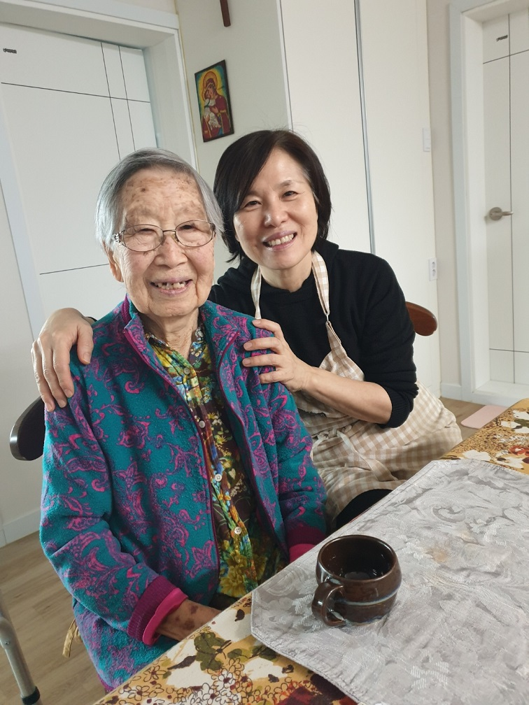

딸과 함께 에코팜에서 즐거운 한때를 보내시며

## “그래, 이곳 정안이 그렇게도 좋던감?

## 돌아 다니다 다니다 이곳으로 들어오게?”

## --빙모(聘母)님을 보내드리며--

### 

### 

### 

### “어머님의 맥박이 점점 느려지신대요. 병원에서 연락이 왔어요!”

### 

### 큰 처남댁의 다급한 전화를 받고 '라온병원'으로 달려가는 길. 안개 자욱한 도로 위, 핸들 잡은 손에 힘이 들어갔다. 도착해서 2층으로 뛰어 올라가니, 방금 잠에 빠지신 듯 빙모님의 표정은 거짓말처럼 고요하고 평온하셨다. 아직 손에도 볼에도 가슴에도 온기는 남아 있었다. 그러나 그 뿐. 이미 받으신 선고를 되물릴 수는 없었다. 다시 기동을 하시면, 에코팜에 모셔와 멋진 파티라도 한 번 열어 드려야겠다는 야무진 꿈이 무색했다. 빙모님은 총총히 먼 길을 떠나셨고, 우리는 허탈했다.

### 

### 어수선함 속에 도착한 공주시의료원 장례식장은 시골 장날 새벽녘인 듯 조용함 속에 붐비기 시작했다. 먼 길 보내드리는 의식이 번잡하기만 했다. 차라리 문상 온 지인들과 함께 빙모님의 얼굴을 다시 한 번 확인하고픈 충동이 일기도 했다. 함께 목청을 돋우어 “이제 일어나세요!”라고 외치면, 자리를 박차고 일어나실 것 같기 때문이었다. 그러나 빙모님의 다정하신 음성과 환한 미소는 벌써부터 저 멀리 공중에 맴돌고 계셨다. 남은 건 차가운 육신 뿐. 그래서 더욱 허탈했다.

### 

### 그런 환상과 현실이 교차하는 이틀을 보내고 난 사흘째. 우리는 빙모님을 모시고 느릿느릿 '나래원'으로 향했다. 시원한 녹색과 따스한 주황색이 섞인 계곡 한 가운데 불꽃이 이글이글 타오르고 있었다. 장모님의 육신은 단정한 상자 속 한 그릇의 재로 돌아와 우리의 가슴에 안겼다. 단 두 시간 만에! ㅠㅠ

### 

### 그 상자를 안고 ‘대전공원묘원’으로 향하는 발걸음이 무거웠다. 멀리 계룡산의 연봉이 건네다 보이는 산 중턱 양지바른 곳. 빙부(聘父)께서는 이미 그곳에 누워 계셨다. 그 옆자리에 빙모님의 유골함을 묻고 나니, 마음의 짐을 함께 내려 묻은 듯 약간 가벼워짐을 느꼈다. ‘금슬 좋으시던 두 분이 15년 만에 만나셨으니 얼마나 반가우실까’ 생각하며, 합장(合葬)의 취지가 ‘산 자들의 위안’에 있음을 새삼 깨닫는다. 다정하시던 두 분이 오랜만에 다시 만나시리라 우리는 굳게 믿고 있지 아니한가. 그렇게 빙모님은 이승을 하직하셨다.

### 

### 1926년 11월 4일(음) 공주에서 태어나시고, 2021년 10월 1일(음) 공주에서 돌아가셨으니, 한 달 모자라는 향년 96세. 공주여자사범 부속학교 2회 졸업,  1938년-1943년 도립여자사범학교 에서 수학, 부모님의 고향인 평양의 여러 초등학교에서 교편을 잡으심.

### 

### \*\*\*

### 

### 대학 시절의 은사 유당 림헌도 선생은 내 빙부이시고 최순보 님은 내 빙모이시다. 엄격하기만 하시던 빙부와 달리 빙모님은 자애로우셨다. 훤칠한 키에 시원한 미모와 따사한 미소가 어우러져 군계일학(群鷄一鶴)으로 돋보이는 분이셨다. 학창시절엔 공주시내에서 행사들이 더러 있었는데, 어쩌다 빙부・빙모님이 동반으로 참석하시는 경우가 있었다. 화사한 한복을 입고 착석하신 모습을 뵐 때마다 ‘참으로 멋진 분’이라는 생각이 들곤 했다. 나중에서야 알게 된 한 토막의 일화가 있다. 나이 듬뿍 든 딸[임미숙]이 어떤 촌놈에게 시집가겠노라 하니, 걱정에 싸인 엄마가 그 녀석의 고향집을 보러 먼 길을 나선 것. 버스도 들어가기 전이니, 고초가 오죽하셨을까. 태안읍에서 택시로 자갈길 100리를 달려 시골구석의 작은 초가집을 찾아가신 것이다. 집에는 아무도 없었고, 개 한 마리와 닭 몇 마리가 손님을 맞았던 모양이다. 나 같으면 어떻게 했을까. 당장 돌아와 ‘딸년’을 꿇어앉히고 종아리를 쳤을 것이다. ‘정신 나간 것아! 그 놈 집에 가본 적이나 있니?’라고 소리소리 쳐댔을 것 아닌가. 그러나 빙모님은 ‘그런 곳에서 대처로 학교를 보낼 정도면, 사람 만나 보지 않아도 됨됨을 알 수 있다’고 오히려 딸을 안심시키셨던 모양이다. 오히려 주변 사람들이 내 변변찮음을 들며 혼사를 극구 말렸다는 사실을 그 후 알고 나서 나 스스로 크게 웃은 적이 있었다. 차라리 그 때 깨어졌더라면, 나야말로 더 멋진 짝을 만날 수 있었을 것 아닌가.^^

### 

### 빙모님은 이른바 여장부 혹은 대인배(大人輩)이셨다. 늘 긍정적이고 낙천적이셨다. 걱정에 휩싸인 주변사람들에게 늘 위안과 자신감을 주시던 분이었다. 결혼식 전날 밤, 비바람이 휘몰아쳤다. 진해에서 예식장이 있던 서울로 올라온 나는 크게 걱정되어 빙모님께 전화를 드렸다. 그랬더니, “이 사람아, 걱정 말게. 하늘도 둘의 결혼을 축복하느라고 그러는 걸세!”라고 명랑하게 대답하시는 게 아닌가. 다음 날 하늘은 거짓말처럼 청명하게 개었고, 나는 빙모님의 담대하심을 새삼 깨닫게 되었다.  최근 기억력을 잃으시면서 한동안 말수도 크게 줄으셨다. 그렇게 말씀 나누시길 좋아하시던 빙모님이 안타까워 일부러 새로운 화제들로 대화를 이어나가곤 했다. 그러나 대화는 늘 다음과 같은 문답으로 똑 같이 마무리되곤 했다.

### 

### “그래, 이곳 정안이 그렇게도 좋던감? 돌아 다니다 다니다 이곳으로 들어오게?”

### 

### “그럼요. 돌아 다니다 다니다 보니 이곳이 최고였어요. 무엇보다 빙모님이 가까이 계시고, 형제들도 모두 근처에 살고 있잖아요? 외롭지 않아서 좋지요. 그러니 빙모님께서도 저희 집에서 오래 오래 머무시며 옛날의 건강을 회복하도록 하세요. 진지도 많이 드시고요.”

### 

### “놀고먹는 할매 밥 많이 먹어서 뭐하게?”

### 

### “진지 많이 드시고 걷기 운동도 많이 하셔서 건강하게 오래 오래 사셔야지요. 오래 사셔야 손주들이 자라서 제 앞가림 하는 것도 보시고, 좋은 세상 많이많이 즐기실 수 있지요.”

### 

### “그래. 말은 고맙네만. 늙은이 그저 걸치적거리기만 하지 뭐.”

### 

### ∙

### ∙

### ∙

### 

### 삼가 빙모님의 영전에 명복을 빌어드립니다. 두 분이서 영원히 행복하게 영계(靈界)의 청복(淸福)을 많이많이 누리소서.

### 

### 

### 2021. 11. 7.

### 

### 

### 사위 규익 엎드려 절하고 올립니다

초코를 데리고 사위와 함께 에코팜을 산책하시는 빙모님

공유하기

게시글 관리

**백규서옥\_Blog ver.**