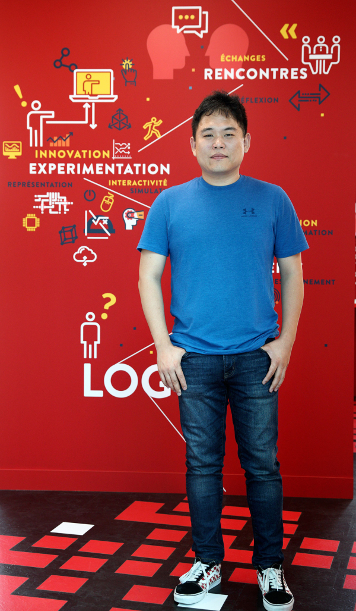

### 시사IN 740호[2021. 11. 23.]

### 전혜원 기자 woni@sisain.co.kr

### 인공지능 분야 최정상에 오른 조경현 교수는 인공지능의 편향과 사회적 영향에 목소리를 내고 다양성을 강조한다. “인간의 나쁜 면과 기술은 같이 갈 이유가 전혀 없습니다.”

                      인공지능 분야 차세대 톱스타로 꼽히는 조경현 뉴욕 대학 컴퓨터과학과 교수.ⓒ시사IN 조남진

### 인공지능의 세계적 권위자들이 나란히 손에 꼽는 차세대 톱스타는 1985년생인 조경현 뉴욕 대학 컴퓨터과학과 교수다. 그는 요슈아 벤지오 몬트리올 대학 교수와 ‘신경망 기계번역’을 고안해 인공지능 번역의 혁신을 이끈 인물이다. 그가 만든 ‘어텐션(attention·집중)’ 메커니즘은 GPT-3를 비롯한 초거대 인공지능의 기반 기술이 되었다.

### 지난 6월 삼성 호암상 공학상을 수상한 그는 상금 3억원 중 1억원을 ‘컴퓨터 과학을 전공하는 여자 학생’을 위해 써달라며 모교인 카이스트에 기부했다. 출산과 육아 과정에서 교사 일을 그만둔 어머니의 이름을 딴 ‘임미숙 장학금’이다. 1억원은 인문학 연구를 위해 백규고전학술상에, 3만 유로(약 4000만원)는 비유럽 국가에서 온 컴퓨터과학 전공 여자 학생에게 써달라며 자신이 유학한 핀란드 알토 대학에 기부했다.

### 그가 여성 과학자 양성을 위해 상금을 기부하는 일은 이미 유명하다. 남성이 대부분인 이 분야에서, 그는 초등학교 1학년 여자 조카가 롤모델로 삼을 수 있는 여성 AI 과학자가 나오길 바란다고 했다. 호암상 수상 연설에서는 “제 공부 및 연구 경력에는 ‘우연’과 ‘운’이 많이 작용했다”라고 말했다. 카이스트에서 같이 강의를 듣던 선배가 핀란드 알토 대학 머신러닝(기계학습) 석사과정 팸플릿을 우연히 전달해줘서 인공지능을 공부했고, 역시 우연히 신경망 연구 그룹에 배정됐으며, 학회 아침식사에서 요슈아 벤지오 교수 옆자리에 앉은 인연으로 그와 함께 연구한 데다, 연구 주제로 생소했던 기계번역을 선택한 것 모두가 지금의 자신을 만들었다고 말이다.

### 궁금했다. 세계 레벨에서 최정상에 오른 그는 왜 자신의 커리어를 ‘운’이라 말하나. 인공지능 연구의 최전선에서 오히려 인공지능의 편향과 사회적 영향에 목소리를 내는 이유는 무엇인가. 다양성이 왜 그렇게 중요한가. 친구들과 놀러 나가고 맥주 마시는 데서 즐거움을 얻으며, 최근에는 〈오징어 게임〉도 한번에 다 봤다는 조경현 교수를 화상 앱 ‘줌’으로 90분간 만났다.

조경현 교수와 함께 ‘신경망 기계번역’을 고안한 요슈아 벤지오 몬트리올 대학 교수.ⓒAP Photo

### **GPT-3의 등장을 어떻게 보셨나요?**

### 사실 이렇게 대중적으로 크게 관심이 있을 줄은 예상 못했어요. 연구하는 사람 입장에서 기술은 굉장히 조금씩 발전해요. 하루아침에 뭐가 확 바뀌는 건 별로 없고요. GPT-3에서 쓰는 알고리즘 자체는 나온 지 꽤 오래됐어요. 다만 이걸 그동안 상상하지 못한 스케일과 엄청나게 많은 양의 데이터로 훈련시켰을 때 어떻게 되는지를 GPT-3가 보여줬다고 할 수 있겠죠.

### **GPT-3는 ‘파라미터(parameter· 매개변수)’를 1750억 개 갖췄다고 합니다. 기존 GPT-2의 100배라는데, 이게 커졌다는 게 어떤 의미인가요?**

### 너무 좋은 질문인데요. 단순하게 얘기하자면, 앱스토어 들어가서 앱을 설치할 때 용량이 나오잖아요. 어떻게 보면 용량과 파라미터 개수는 같은 거거든요. (딥러닝이 사용하는) 신경망이나 AI 시스템이 다 소프트웨어니까, 파라미터 개수는 프로그램의 사이즈와 같다고 보면 됩니다. 그러다 보니 이게 크면 좀 더 뭘 많이 하지 않을까 생각하는 게 당연하겠죠. 물론 이렇게 단순하게 답했을 때의 문제점은 언제나 이게 틀린다는 건데요(웃음). 사실 파라미터의 개수를 세는 거 자체가 연구 주제입니다. 그걸 어떻게 정의하고, 세어야 하는지 정확하게 정해져 있지가 않아서요.

### **무슨 뜻인가요?**

### 같은 사건을 서로 다른 기자 두 명이 썼는데 길이가 다르다고 해보죠. 그렇다면 과연 기사의 길이를 글자 수로 세는 게 맞는지, 아니면 실제 기사 안에 담긴 내용의 양을 세는 게 맞는지 생각해볼 수 있겠죠. 어떤 사람은 글을 간결하게 잘 써서 똑같은 내용을 전달하는 데도 짧게 쓰는 반면, 주저리주저리 늘려 쓰는 사람도 있잖아요. 신경망이나 소프트웨어도, 똑같은 걸 배우는 데 파라미터가 굉장히 많이 쓰일 수도 있고 적게 쓰일 수도 있어요. 용량이 큰데 아무것도 못하는 프로그램을 짜는 건 어렵지 않으니까요.

### **GPT-3가 교수님에 대해 “바둑 챔피언이었다가 구글 딥마인드의 머신러닝 연구자가 되었다”라고 틀린 주장을 한 게 떠오르네요.**

### 네, 봤어요(웃음). 어떻게 보면 놀랍고, 다르게 보면 놀랍지 않은 일이에요. 사실 저를 모르는 사람들이 보면 꽤 ‘그럴싸한’ 답이었잖아요. 근데 문제를 푼다는 건 원래 그런 거거든요. 학습 중에 보지 않은 상황에 대해 답을 할 수 있어야 의미가 있으니까요. 그러기 위해선 어쩔 수 없이 좀 지어내야 해요. 전에 봤던 걸 그럴듯하게 조합하는 거죠. 그럼 지금까지 없던 답이 나올 수밖에 없는데, 과연 이게 맞는 답인지 알기 힘들다는 게 문제입니다. 재밌는 게, 이 답을 생성한 신경망에게 물으면 당연히 맞는다고 할 거거든요. 그게 아니었다면 답을 안 했겠죠. 이렇다 보니 인공지능의 답을 어느 정도까지 신뢰할 수 있고 그러려면 뭐가 필요한지 질문이 생기고, 걱정이 되기도 합니다.

### **GPT-3가 이른바 ‘인공 일반지능 (Artificial General Intelligence, AGI)’의 시초이거나 적어도 포문을 열었다는 평가도 있는데요.**

### 그래요? 하하하. 제 생각에 그건 비약이 큰 것 같은데요. 대체 AGI가 뭔지 저는 잘 모르겠어요. 거의 철학이나 종교에 가까워서, 그렇게 정의가 안 되어 있는 용어로는 무슨 얘길 할 수가 없습니다. 지능이란 것도 과연 어디에서 선을 그을 수 있을까요? 예를 들어서 사람이 지능이 있냐, 없냐 하면 대부분 있다고 하겠죠. 유인원의 경우도 대부분 있다고 하고요. 아무래도 똑똑하잖아요. 사자나 호랑이, 개와 고양이는 지능이 있나 하면 또 있는 것 같죠. 조금 더 가서 벌을 생각해보면, 기억력이 좋아서 몇십㎞ 밖에 있는 꽃을 보고 돌아와서 다른 벌들을 다 데리고 가니 똑똑한 것 같고요. 그럼 지렁이는? 땅속에 있다가 비가 오고 습해진 걸 느끼면 올라가요. 이런 걸 보면 조금 똑똑한 거 같고. 만약 주위의 자극에 반응해 몸을 움직이는 게 지능의 일부라면, 사람은 호랑이·사자·개·고양이에 비해 떨어지죠. 벌이 수십㎞ 길을 외우는 것도 사람은 못하고요. 이렇게 보면 지능이란 ‘있다, 없다’라기보다는 스펙트럼에 가깝습니다. 다방면에 걸쳐 있죠.

6월24일 대전 카이스트에서 열린 조경현 교수 발전기금 감사패 전달식. 미국에 있는 조 교수를 대신해 어머니 임미숙씨(가운데)와 아버지 조규익씨(오른쪽)가 대신 참석했다.ⓒKAIST 제공

### **GPT-3는 어디쯤일까요?**

### 짧게 질문했을 때 그 뒤를 어떻게 이어야 하는지 답하는 걸 보면, 확실히 언어 면에선 어떤 동물보다도 훨씬 나은 것 같습니다. 반면 이미지나 비디오를 보는 건 못하니, 이쪽은 어떤 동물보다도 못한 것 같고요. 롱 텀 메모리(장기 기억)도 없죠. 그렇다면 과연 GPT-3라는 게 (지능의 다방면 중에) 어디에 위치하는지, 나아가서 AGI가 대체 이 큰 면의 어디에 있는 건지 알아야 GPT-3가 AGI에 가까이 간 건지 멀리 떨어진 건지 알 수 있는데 그게 전혀 정의가 안 되어 있잖아요. 그렇게 보면 GPT-3가 AGI의 포문을 열었는지 아닌지 잘 모르겠네요. 답이 아닌 답이네요(웃음).

### **오픈 AI가 올해 1월 내놓은 DALL-E는 텍스트를 입력하면 이미지를 생성합니다. 인공지능이 어디쯤에 있는지는 모르지만, 적어도 ‘인간 같은 무엇’을 향해 가고 있는 것은 맞지 않나요?**

### 졸업 후 마이크로소프트에서 일하는 제 박사과정 학생이 2015년에 쓴 논문이, 설명이 주어졌을 때 이미지를 생성하는 거였어요. ‘하늘에 비행기가 날아가고 있다’ 하면 파란 바탕에 비행기 모양이 나오는. 물론 지금은 퀄리티가 굉장히 좋아졌죠. 그럼 여기서 질문은, 과연 이미지나 텍스트를 생성하는 퀄리티만 높이면 실제로 우리가 생각하는 지능이라는 게 올라가는 건지, 아니면 또 다른 것도 해야 하는지인데, 그건 사실 알기 힘들죠.

### **한국에서는 ‘이루다’라는 이름의 AI 챗봇이 성소수자나 흑인을 혐오하는 발언을 하고, 이용자들이 챗봇을 상대로 성희롱을 했으며, 업체가 연인들의 카카오톡 대화를 설명 없이 수집해 20여 일 만에 서비스가 중단된 일이 있었습니다.**

### 그 회사에서 굉장히 실수한 거죠. 아무리 그래도 프라이버시에 대해 조심해야 하는데 그러지 못했고요. 얼마 전 뉴스를 보니 한국 법무부에서 내·외국인 출입국 얼굴 사진을 사기업에 넘겼다는데 기업 이름도 안 나오고… 제 것도 다 들어가 있겠구나 생각이 들더라고요. 큰 이슈가 되어야 할 것 같은데 사후관리가 거의 없는 것 같아서 안타깝네요. 그런데 이 분야가 좀 그렇습니다. 항공이나 조선 엔지니어링은 갑자기 비행기나 배를 만들어서 띄우기 어려운데, 소프트웨어 엔지니어링은 뭘 새로 만들기가 쉬워요. 그냥 랩톱에 앉아서 알고리즘을 짤 수 있으니까요. 그러다 보니 어떤 시스템을 만들어서 사람들에게 사용할 때 너무 쉽게 생각하는 경향이 있어요. ‘일단 만들고 반응을 보자’는 식이죠. 하지만 이렇게 모두가 연결되어 있는 세상에서는 네트워크 효과가 크니까, 시스템을 만들 때의 결과를 상상해보는 연습을 많이 해야 합니다. ‘사용자들이 이렇게 쓰면 어떡하지’, ‘이런 질문이 들어오면 어떻게 답할까’ 몇 번 더 생각해봤어야 하는데 (이루다 운영사 스캐터랩이) 그러지 못한 게 아닐까 싶네요. 저도 교수이지만 이건 우리 교육하는 사람들의 실책이 아닌가 합니다.

인천공항 입국장(위). 지난해 법무부는 ‘인공지능 식별추적시스템 구축 사업’을 위해 내·외국인 출입국 얼굴 사진을 관련 업체에 넘겼다.ⓒ시사IN 이명익

### **인간이 차별이나 혐오를 하는 이상, 기술로 막기에는 한계가 있다는 견해도 있습니다.**

### 인간의 나쁜 면과 기술은 전혀 같이 갈 이유가 없습니다. AI라고 해서 뭔가 특이한 것 같지만 다 소프트웨어이고 알고리즘을 짜는 건데, 만약 사람이 만든 데이터에 나쁜 것들이 들어 있었고, 알고리즘은 구분을 못하니까 뭔가 나쁜 걸 내놓는다면, 그냥 그걸 안 써야 되는 것 아닌가요? 알고리즘이 그렇게 나쁜 것이라면요. 사회가 잘못된 건 잘못된 거지, 그걸 데이터로 입력해서 잘못된 편견을 더욱 재생산하는 기술을 만든다고요? 두 번째 것은 그냥 잘못된 거 같은데요.

### **기술이 사회를 반영할 뿐 아니라, 사회에 있는 편향을 증폭시킨다고 지적했습니다.**

### 좀 완벽하지가 않습니다, 저희가 쓰는 알고리즘들이. 세상에는 명확한 답이 있지만 정보를 완벽하게 갖고 있지 못해서 답을 알 수 없는 문제가 있잖아요. 사람도 마찬가지인데, 이런 경우에도 우리는 보통 알고리즘에게 답을 달라고 하거든요. 이때 알고리즘은 A와 B 중에 조금이라도 A가 답일 것 같으면 A만을 답으로 내놓습니다. A와 B를 같이 주는 게 아니라요. 그러다 보면 잘못된 답이 갑자기 맞는 답처럼 보이기 시작하죠. 알고리즘이 답을 모르겠다거나, 정보가 부족하니 더 가져오라거나, 정확한 확률을 알려주어야 하는데 이 세 가지가 다 안 되니까요. 여기에 알고리즘을 배포하고 나면 사회에서 만드는 데이터들이 다시 알고리즘에 들어가고, 그걸 알고리즘이 학습하다 보니 좋지 않은 ‘되먹임 고리(feed back loop·원인과 결과가 서로 영향을 미치면서 강화되는 것)’가 생길 수 있죠. 그래서 잘못된 답이 증폭되면 쉽게 해결하기가 어렵습니다.

### **한국에서는 공기업 등 채용에서 AI 면접이 쓰입니다. 이를 두고 “혹시 본인의 자녀가 어린 시절 잠깐 강남이 아닌 곳에서 초등학교를 다니는 바람에 AI 인터뷰에서 자동적으로 떨어진 건 아닐까요?”라고 블로그에 썼는데요.**

### 보통 AI라고 하면 가벼운 예제를 생각해요. 프로야구에 대해 질문하면 답변해준다든지, 넷플릭스에서 다음에 볼 영화를 추천해준다든지. 실제로는 필수적인 절차에 AI가 쓰이는 경우도 많습니다. 채용 같은 경우 한번 잘못되면 사람들이 몇 년 고생한 게 날아갈 수도 있죠. 극단적으로는 드론처럼 전쟁에서 쓰이는 무기가 한번 실수하면 민간인의 목숨을 앗아갈 수도 있고요. 페이스북이나 유튜브의 추천 알고리즘이 정치적 견해를 양극화하는 게 아닌지 전 세계적으로 논쟁이 되고 있습니다. 간단해 보이는 알고리즘이 한번 쓰이고, 뭔가 잘못된 걸 하기 시작하면 걷잡을 수 없게 되는 경우가 많습니다.

2019년 12월12일 서울 세종대 컨벤션센터에서 열린 ‘공공연구기관 기술이전 성과확산대전 2019’에서 구직자가 AI 면접을 체험하고 있다.ⓒ연합뉴스

### **예를 들면 채용 면접에 AI를 쓸 경우 사회적 합의나 안전장치가 많이 필요한가요?**

### 그렇습니다. 사실 AI를 썼을 때 가장 큰 문제 중 하나가 ‘누가 책임을 질 것인가’입니다. 이 시스템을 구현했을 때 얼마나 투명성이 있는지도 중요하고요. 이 두 가지에 대해 사회적 합의가 있어야 하고, 규제나 감리 등 많은 체계가 필요합니다. 기록을 어떤 방식으로 남겨놓을 것이며, 결정을 누가 언제 내릴 건지도 생각해야 하죠. 그냥 ‘여기 AI 알고리즘이 있네, 한번 써보자’ 하기엔 문제가 많습니다.

### **미국에서도 알고리즘이 얼굴 인식을 잘못해서 무고한 흑인이 체포된 일이 있었습니다.**

### 첫 번째 문제가 그런 알고리즘들이 쓰이는지도 모르는 상태에서 쓰이고 있었던 점입니다. 대체 어떤 회사가 공급을 하는지도 한참 동안 몰랐고요. 회사를 찾아봤는데 어디 존재하는지도, 어떤 데이터를 썼는지도 알 수 없었죠. 그런 걸 법원이며 경찰이며 다 쓰고 있었는데, 알고 보니 말 그대로 흑인이면 범인일 확률이 더 높게 나오는 식이었고요. 심지어 이런 걸 쓰지 못하게 누구한테 얘기해야 하는지도 모르고, 이게 어떤 소프트웨어이고 어디서 받을 수 있는지도 모르고, 결과를 어떻게 해석해야 하는지 아무도 이야기해주지 못하고, 규제도 감사도 할 수 없었어요. 이러면 사실 알고리즘을 쓸 준비가 전혀 안 되어 있다고 할 수 있겠죠.

### **인공지능의 편향과 사회적 영향에 관심이 많은데, 특별한 계기가 있나요?**

### 저도 별로 크게 생각을 안 했는데, 팀닛 게브루(구글 AI 윤리조직을 이끌다 지난해 말 대규모 언어모델을 비판한 논문을 계기로 해고되었다고 알려진 에티오피아계 미국인 여성 연구자)가 2015년인가 뉴립스 학회(인공지능 분야의 대표적 글로벌 학회) 사진을 페이스북에 올렸어요. 그러면서 ‘여기에 2000~3000명이 왔는데 흑인 연구자가 3~4명밖에 없고, 여자 연구자도 거의 없다’고 썼더라고요. 저도 거기 있었거든요. 보는 순간에 ‘어 그러네, 이거 좀 이상하구나’ 생각이 들었어요. 카이스트 전산과 다닐 때 같은 학년에 전산과 선택한 친구들이 60여 명이었는데, 여학생이 한 3명 있었던 것 같아요. 핀란드에서 머신러닝 석사 할 때도 여학생들은 한 10~15%밖에 안 되었고요. 캐나다 몬트리올에서 박사 후 연구원을 할 때도 40~50명 중에 여자는 4~5명 정도였거든요. 뭔가 이상하죠. 그럴 이유는 딱히 없는 거 같은데. 좀 이상한 생각을 갖고 있는 사람들은 진화가 뭐 어떻게 되어서 여자는 컴퓨터 과학을 별로 안 좋아한다는데, 아니 컴퓨터가 생긴 지 60년밖에 안 되었는데 진화란 게 무슨 상관인지(웃음). 그게 무슨 말도 안 되는…. 그런 게 어딨어요.

### **인공지능 연구자나 개발자의 다양성이 왜 중요한가요?**

### 어떤 분야든 다양성은 중요합니다. 특히 직접적으로 사회에 배포되어 쓰일 수 있는 제품이나 서비스를 만든다면요. 어떤 알고리즘을 배포했을 때 이게 어떤 식으로 쓰일지, 어떤 그룹에겐 결과가 긍정적이고 다른 그룹에겐 부정적일지 많이 상상해볼 수 있어야 한다고 말씀드렸잖아요. 모두가 다 똑같은 학교를 나오고 똑같은 배경을 가졌다면 그런 상상을 하기가 힘들죠. 게다가 인공지능은 하나의 상품에 그치는 게 아니라 여기저기 쓰일 수 있는 알고리즘이다 보니 다양성이 정말 중요한데, 아직은 안타깝게도 많이 부족합니다. 제 연구실만 봐도 여자 학생은 거의 없고, 흑인 학생도 한 명도 없어요. 남미 출신이 한 명 있었는데 졸업했고요. 조금씩 바꿔가야 하는데 아무래도 시간이 걸리겠죠.

### **최근 〈조선일보〉 인터뷰에서 상금을 기부하는 이유를 언급하며 “실제 능력 차이보다 아웃풋(결과) 차이가 작은 게 좋다”라고 말했습니다.**

### 일단 이 사람의 능력이 저 사람보다 더 좋다, 안 좋다 얘기하는 것 자체가 거의 불가능할 것 같습니다. 보통, 능력이라는 게 사회적인 프록시(대용물)를 써서 재는 거잖아요. 대학 입학시험을 잘 봤는지, 어느 회사에 입사했는지, 연봉이 얼만지, 사는 데가 어딘지 애들이 어느 학교를 다니는지…. 이런 걸 써서 ‘저 사람은 능력이 좋은가 보다’ 하고 사람들이 생각하죠. 그러다 보면 실제로 능력이 있는데도 사회적인 영향 때문에 능력이 없는 것처럼 보이는 사람들이 있고, 능력이 없는데도 운이 좋아서, 혹은 태어나길 좋은 환경에서 태어나 능력이 있는 것처럼 보이는 경우도 많죠. 그렇다면 사회의 역할은, 이런 노이즈(왜곡)를 최대한 막아주는 거라고 생각해요. 분명히 개개인의 능력 차이라는 게 그렇게 어마어마하지 않을 거거든요, 아무리 봐도. 그건 말이 안 되잖아요(웃음). 심지어는 능력을 완벽하게 측정할 수 있다고 해보죠. 능력 있는 사람은 더 잘살고 능력 없는 사람은 못살면 그게 그냥 정글이죠. 우리가 사회를 만든 목적은 태어날 때의 능력을 떠나서 모두가 더 잘될 수 있게 하는 것 아닌가요? 저희 통계에서 쓰는 말로 하면, 사회 전체적으로 배리언스(variance·분산, 어떤 대상의 흩어진 정도)는 줄이고 애버리지(average·평균)는 높여야 되는 게 아닌가 싶어요.

구글 AI 윤리조직을 이끌다 대규모 언어모델을 비판한 논문을 계기로 해고된 것으로 알려진 팀닛 게브루.ⓒThe New York Times

### **본인도 운이 좋았다고 표현했던데.**

### 실제로 운이 좋았습니다. 해외에서 몇 년 살다 보니까 다양한 곳에서 온 사람들을 만나는데, 한국에서 태어난 것도 운이 아주 좋았고요. 서울에서 계속 커온 것도 운이 좋았어요. 학교도 좋은 학교를 다녔죠. 카이스트도 다니고, 고등학교는 일반고였지만 집에서 가깝고 선생님도 좋았습니다. 다 너무 운이 좋았던 것 같은데요(웃음).

### **인공지능이 일자리를 대체한다는 공포가 뿌리 깊습니다.**

### 아직 갈 길이 멉니다. 지금껏 아무것도 못하다가 이제 조금 하기 시작했는데 뭐가 잘 되었는지 생각해보죠. 사진을 보여주면 대상이 뭔지 알려주긴 하지만 비디오는 잘 못해요. 음성인식은 요새 잘 되지만 좀 시끄러운 데선 잘 안 되고요. 기계번역도 예전보단 낫지만 전문적인 목적으로는 힘들죠. GPT-3의 질문과 답변은 중·고등학생 정도인데, 실제로 사람들이 무엇을 할 수 있는지 생각해보면 아직 인공지능과는 차이가 크지 않나요? 짧은 기사야 GPT-3가 쓰겠지만 요새 〈월스트리트저널〉이 쓰는 페이스북 탐사보도는 절대 못 쓸 거거든요. 〈조선왕조실록〉을 기계번역으로 영어로 옮기는 것도, 파티장에서 잘 작동하는 바텐더 로봇을 만드는 것도 아직 어렵습니다. 일부 일자리가 대체되는 건 있겠지만 아직 그렇게 대규모로 대체되거나 하진 않을 거라 봅니다. 물론 5년 지났을 때 실제로 어떨지는 정확히 알기가 힘드네요.

### **인공지능이 불평등을 심화한다고 보나요?**

### 아무 준비가 없는 상황에서 특정한 일자리가 대체된다면 그 대체되는 사람들이 상대적으로 불평등한 상황에 처하게 되겠죠. 불평등이라는 건 인공지능이라서가 아니라 새로운 기술이 모두에게 동시에 영향을 미치지 않는 이상 언제든 불거질 수 있는 문제인 것 같습니다. 저는 아직은 모두가 일자리 대체를 걱정할 시기는 아니라고 생각하지만, 정책 입안자들은 미리 준비를 해야죠. 나중에 10년 후가 되었든 20년 후가 되었든 갑자기 기계가 일자리를 다 대체한다고 했을 때 잃어버린 소득을 보장해줄 건지, 해준다면 어느 수준으로 할지, 그 안에서 차등을 둘 건지 아닌지 얘기를 많이 해봐야겠죠. 앤드루 양이 ‘유니버설 베이직 인컴(보편적 기본소득)’을 해야 한다고 하는데, 맞는 건지는 잘 모르겠어요. 제대로 보지 못해서요. 최근 저서 〈포워드〉에서 그 얘길 많이 했다는데 시간 내서 읽어봐야겠네요.

### **인문학에 대한 정부 지원을 강조한 것도 인상적이었어요.**

### 과학은 우주에 있는 것들을 다뤄요. 컴퓨터과학이나 인공지능이 마치 뭔가 새로운 걸 만드는 것 같아도, 계산이라는 게 다 어쨌든 우주 안에 있는 걸 어떻게 붙여서 쓰느냐의 문제니까요. 그런데 인문학은 그야말로 우주에 존재하지 않는 것을 상상한다고 할까요. 인간이 지적으로 할 수 있는 것의 끝은 어디인지 계속 밀어붙여보는 일에 가깝죠. 그러다 보면 말도 안 되는 게 나올 수도 있는데, 이런 건 당장의 비즈니스엔 도움이 되기 어렵죠. 인공지능 연구야 기업들이 필요하다면 자기들 돈을 많이 쓰겠지만요. 그런 면에서 인문학을 사회적으로 좀 더 서포트해야 하는 것 아닌가…. 아까 얘기랑 비슷한데, 학문 분야 간 차이도 줄여주는 게 결국은 사회의 역할 아닌가 싶네요.

Tag[#인공지능](https://www.sisain.co.kr/news/articleList.html?sc_area=A&sc_word=%EC%9D%B8%EA%B3%B5%EC%A7%80%EB%8A%A5)[#AI](https://www.sisain.co.kr/news/articleList.html?sc_area=A&sc_word=AI)[#조경현](https://www.sisain.co.kr/news/articleList.html?sc_area=A&sc_word=%EC%A1%B0%EA%B2%BD%ED%98%84)

공유하기

게시글 관리

**백규서옥\_Blog ver.**