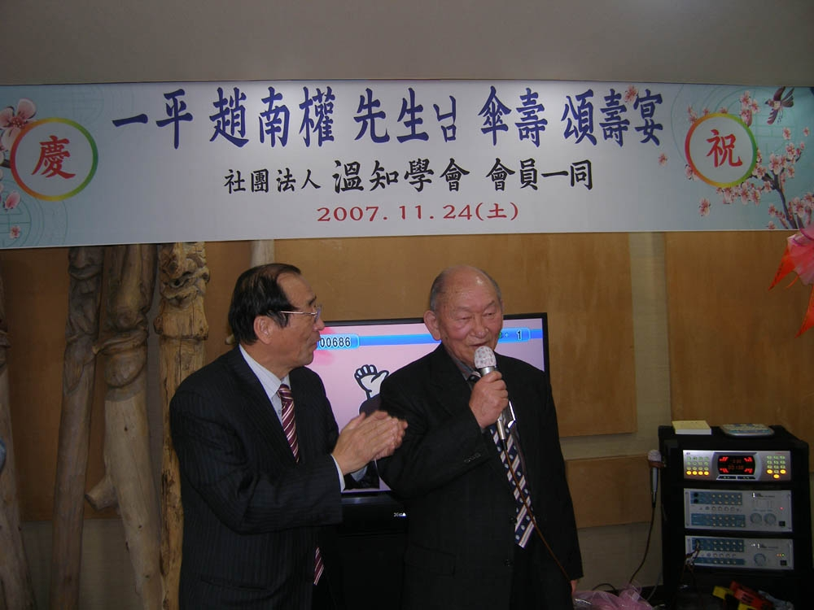

一平선생님 팔순연에

선생님!

올 가을 단풍은 유난히도 붉고 곱습니다. 山野에 불타듯 깔린 단풍을 바라보며 불현듯 10년 전 선생님의 古稀宴을 떠올립니다. 안팎으로 나라가 어렵던 시절이었지요. 무책임한 정치인들이 내뿜던 狂氣가 온 나라를 짓누르던 그 때. 오래도록 隱居하시던 화곡동으로부터 명동 저잣거리의 한복판으로 나오신지 얼마 되지 않을 무렵이었지요. 선생님의 열정에 이끌려 하나 둘 모여든 문하생들은 그날 선생님의 파안대소를 뵈며 시절의 험난함을 잠시나마 잊을 수 있었습니다.

 세상이 아무리 좋지 않은 방향으로 흘러가도, ‘늘 처음처럼’ 변하지 않는 것들을 탐구하시며 문하생들을 이끌어 주시는 선생님의 의연하신 모습에 저희들은 크나큰 희망을 갈무리할 수 있었던 것입니다. 그로부터 10년이 흘렀습니다. 많은 문하생들이 선생님의 가르침에 힘입어 사회적으론 각자의 길에 접어들었습니다만, 아직도 선생님의 품을 떠나지 못하는 것은 아직도 배움이 모자라기 때문이고, 어디에도 선생님의 문하만한 곳이 없음을 깨달았기 때문일 것입니다. 아니, 어쩌면 고금을 無不通知하신 선생님께서 늘 연마에 여념 없으신 모습을 뵈며, 스스로들 부끄러움을 느끼기 때문이기도 하겠지요.

선생님!

그간 참으로 많은 일들을 하셨습니다. 문하생들을 가르치시는 틈틈이 고전을 번역하시어 等身大로 이루어 놓으신 업적들. 단순히 ‘浩澣하다’는 말로는 덮을 수 없을 만큼 洋洋한 학문의 바다를 이룩하셨습니다. 안타깝게도 그 와중에 眼力은 크게 損傷되셨으며, 컴퓨터와 씨름하시느라 건강도 약간 쇠해지셨음을 저희들은 최근에야 발견하게 되었습니다.

 1995년 한서대학교 부설 동양고전연구소 소장으로 취임하신 이래 <<주역>>, <<심경>>, <<맹자>>, <<문장달덕록강령>>, <<유예지>>, <<한국고전비평론자료집>>, <<통감절요>>, <<농암집>>, <<마일부학 연구논문집>>, <<삼한시귀감>>, <<임원경제지>>, <<고문진보>>, <<근사록>>, <<동계서화론>>, <<논어>>, <<시경>>, <<개자원 화보>>, <<춘추좌전>>, <<중용>>, <<한사경>>, <<중국음악철학>>, <<악기>>, <<서경>>, <<고문진보>>, <<일본서기>>, <<녹문사서>>, <<악론>>, <<맹자>>, <<음청사>>, <<기재집>>, <<대학>>, <<통감절요>>, <<오언칠언당음>>, <<중국역대화론>>(1~5), <<오언당음>>, <<칠언당음>>, <<혜환 이용휴 산문전집>> 등 들기에도 숨찰 만큼 많은 고전들의 강독을 통해 후학들을 깨우치셨습니다.

 그 뿐인가요. 최근 12집까지 <<동방학>>을 발간하셨고, <<조용문선생집>>, <<한국고전비평론자료집>>(1~3), <<죽계일기>>, <<역주 악기>>, <<양심당집>>, <<김택영의 조선시대사>>, <<혜환 이용휴시전집>>, <<송구봉 시전집>>, <<중국 역대화론>>(1~5), <<국역 오언당음>>, <<국역 칠언당음>>, <<혜환 이용휴 산문전집>> 등 많은 역서들을 펴내셨습니다. 요즈음의 자잘한 학인들로서야 몇 생을 산다한들 언감생심 이룰 수 있는 양이겠으며, 제법 한다하는 선비들이라 할지라도 쉬 이룰 수 있는 업적이겠는지요? 참으로 놀랍고 두려울 따름입니다.

  
 

선생님!

저는 최근 ‘나이야말로 숫자에 불과하다’고 외치는 어떤 사람을 만났습니다. 같은 세월을 살아도 創出하는 가치에는 사람마다 큰 차이가 있다는 말이겠지요. 단 몇 년을 살아도 남의 100년에 맞먹는 삶을 사는 사람이 분명 있습니다. 선생님 같으신 분이 바로 그런 예에 속한다고 생각합니다. 갈수록 빛을 발하시는 선생님의 학문세계야말로 남들이 백년을 넘겨 닦아도 도달 못할 경지임을 문하생들은 지금 새삼 깨닫게 됩니다. 지난 10년 선생님을 뫼시고 학문의 近海를 빠져나온 저희 문하생들은 이제 드넓은 遠洋을 향하고자 합니다. 앞으로 10년, 그리고 또 10년, 영원히 문하생들에게 이념의 푯대가 되어 주소서.

아, 海屋의 산가지에 萬歲를 더하시고, 다함없는 南山의 壽를 누리소서!

                             2007. 11. 24.

                             문하생들을 대표하여

                      사단법인 온지학회 회장 조규익은 삼가 절하고 올림

공유하기

게시글 관리

**백규서옥\_Blog ver.**