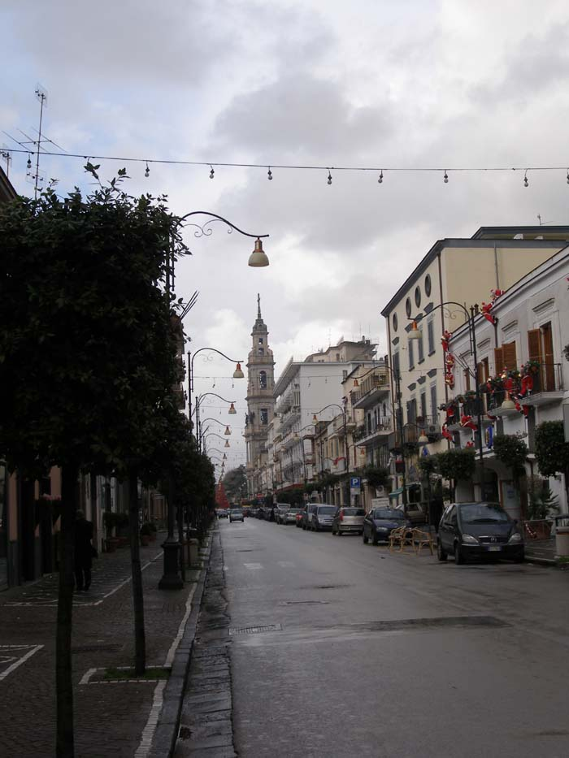
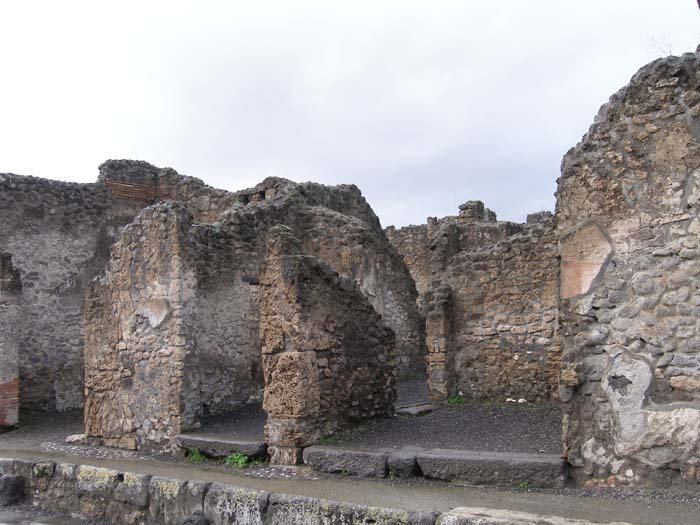
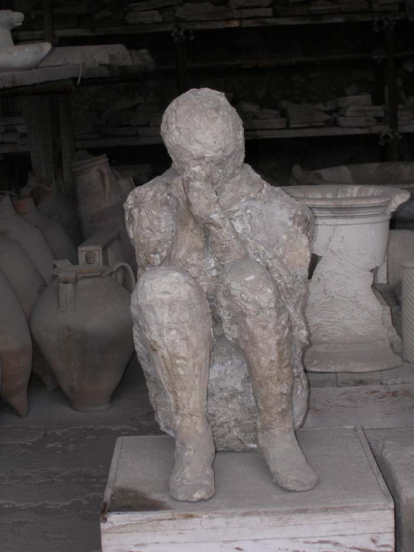

\*알립니다. 저는 올해(2007) 초에 '조규익 임미숙의 유럽 자동차 여행기 <<아, 유럽!>>(푸른사상)을 출간한 바 있습니다. 여기에 그 원고에 해당하는 기행문을 차례로 싣고자 합니다. 말하자면 여행기간의 역순(逆順)으로 싣게 될 것입니다. 여러분의 많은 성원 부탁드립니다.    
  
  
  
           제1신 : 삶은 우리에게 축복인가 고통인가-  
                            폼페이의 비극을 보며  
  
  
우린 2006년도 첫날을 아드리아 해에서 맞이했다. 바리 항에 내리자마자 곧바로 이탈리아 남부를 횡단하여 폼페이에 입성했다. 동에서 서로 달리는 길. 중간쯤부터 거센 바람이 구름을 몰고 다니더니 오락가락 비가 내리기 시작했다. 나폴리를 지나 살레르노에 이르자 빗발은 굵어졌고, 폼페이에 들어오자 흙탕물이 튀었다.   

이탈리아 바리 항에서 폼페이로 가는 도중 만난 아름다운 자연

  
도시는 썰렁했다. 1월 1일 휴일에 비까지 내리니 도심은 공동(空洞) 상태. 길 물어볼 사람조차 없었다. 빗발 속에 간신히 호텔 하나를 잡은 뒤 도시를 대충 살폈다. 티레니아 해로 연결되는 살레르노 만을 접한 폼페이. 중심에 옛 도시의 폐허가 있고, 그 바깥으로 새로운 도시가 형성되어 있었다.  
몇 안 되는 관광객들이 매표소 주변에서 서성대는 모습을 보았으나, 폼페이 폐허와의 만남을 다음날로 미루었다. 그 만남을 좀더 의미 깊도록 만들고픈 우리의 희망 때문이었다. 폼페이의 음울한 분위기를 살리려는 듯 줄기차게 비는 내리고, 나그네의 수심을 도와 밤은 더욱 깊어갔다.   

폼페이 시가지 일부

  
본의는 아니었으나 우연찮게 근래 우리는 폐허만을 찾아다녔다. 터키의 에페소, 그리이스 아테네의 아크로폴리스와 에인션트 코린트, 그리고 이탈리아의 폼페이까지. 터키, 그리이스, 이탈리아는 바다로 접한 나라들. 역사의 진행과정에서 서로 물고 물리는 길항(拮抗) 관계였던 이 나라들이었다.  
아시아와 유럽의 중간지대인 터키, 완전 서유럽도 아니고 그렇다고 동유럽도 아닌 그리이스와 이탈리아다. 에게해, 아드리아해, 지중해 등 서로 물길처럼 연결되는 바다를 공통의 무대로 하는 나라들이다.  
일찍부터 꽃 피운 인류문명을 세계로 전파시키며 주름잡던 주역들. 그들은 자신들의 영역 안에서 항만들을 기반으로 도시문명을 이룩했으나, 전쟁을 비롯한 인재(人災)와 지진이나 화산폭발 등의 천재(天災)로 멸망을 면치 못했다.

폼페이 폐허의 한 부분

  
영속하고자 한 그들의 욕망이 허무로 귀결된 현실을 보며, 명백한 신의 섭리를 깨닫기도 했다. 섭리의 현실화이든 단순한 허무이든, 폐허로 남은 ‘옛날의 영화’는 범부(凡夫)들의 마음에 참담함만 안겨 주었다. 역사의 이성을 믿는다고 하면서도, 그것을 뛰어넘는 어떤 힘에 대한 두려움 때문일까. 폐허의 돌조각에서 느끼는 온기가 예사롭지 않은 나날이다.  
물론 시간은 매 순간 절대 동일할 수 없고, 최소한 ‘동질적’일 수도 없다. 그러나 언제든 새로운 코린트, 새로운 에페소, 새로운 폼페이가 생겨날지 모른다는 두려움. 크게 보아 반복되는 것이 인간의 역사라고 믿는 우리로선 그 두려움을 떨칠 수 없는 요즈음이다.

폼페이 폐허 유물 저장고에 있는 시신의 부조

  
폼페이의 폐허 속에 쭈그리고 앉은 채 미이라처럼 형상화 된 어느 남자의 입에서, 누운 채 죽어버린 일가족의 입에서 우리는 분명 그런 내용의 말을 들을 수 있었다. 폐허를 대하면서 우리는 ‘살아있음’에 환희해야 하는가, 아니면 역사의 반복 가능성에 몸서리를 쳐야 하는가.   
<계속>

공유하기

게시글 관리

**백규서옥\_Blog ver.**