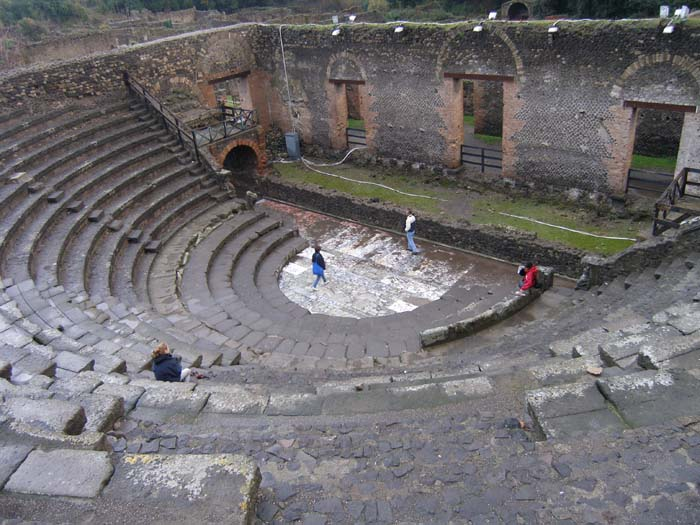
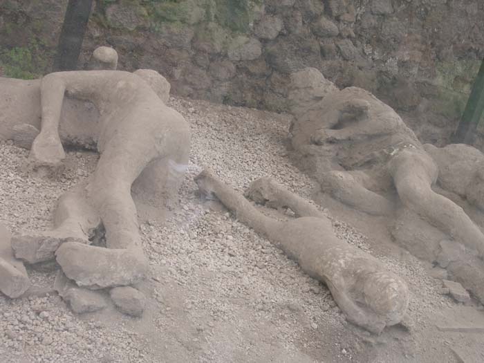
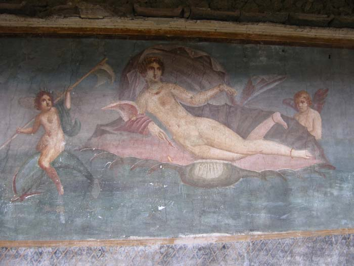
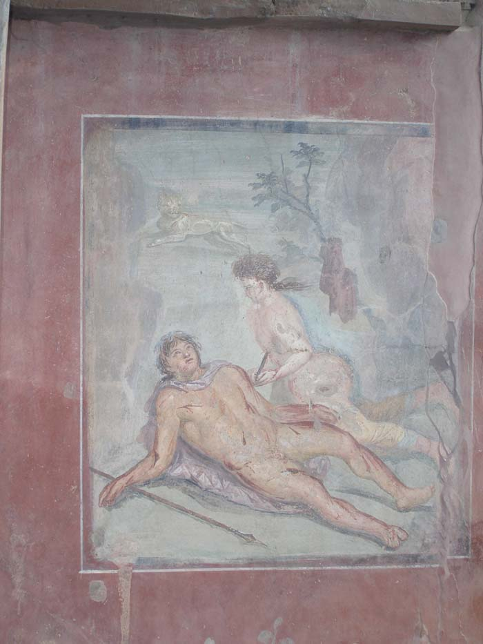
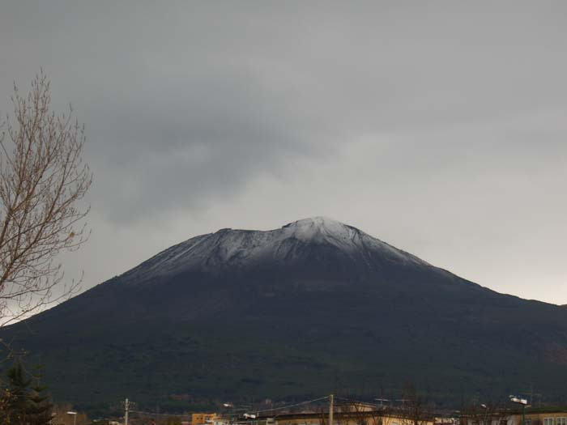
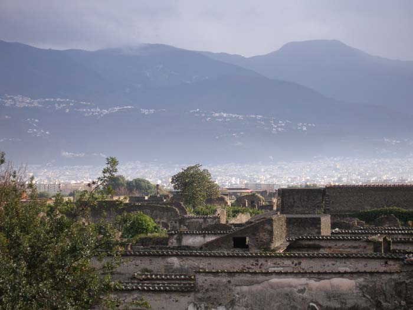

이탈리아 제1신 :            삶은 축복인가 고통인가  
                                   -폼페이의 비극을 보며  
  
  
폼페이! <폼페이 최후의 날>이란 소설과 영화로 이미 우리의 뇌리에 강렬한 인상을 준 도시. 그러나 현장에서 보는 폼페이는 허구화된 상상의 공간이 아니라, 정겹고도 슬픈 현실의 공간이었다.  
정겨움과 슬픔. 일견 모순적인 두 감정의 근원은 무엇인가. 우리의 삶의 모습들과 큰 차이 없는 데서 오는 것이 전자이고, 흔적만 남아 있을 뿐 그 속에 생명 그 자체가 존재하지 않는 데서 오는 것이 후자이리라. 그 날 뜨거운 열기를 내뿜었던 베수비우스 산정엔 하얀 구름이 피어오르고 있었다. 조용하게, 흡사 경고라도 하려는 듯 침묵 속에 무언가를 피워 올리는 그 자태가 음산했다.

폐허로 변한 폼페이 극장

  
지금으로부터 1926년 전인 A.D. 79년 8월 24일 이른 오후. 한창 뜨거운 태양이 작열하던  시각. 대부분의 폼페이 사람들이 늘 그래왔듯 일상에 분주하던 바로 그 때, 엄청난 포효와 함께 베수비우스산은 폭발했다. 검은 화산재는 용암과 함께 분화구를 솟구쳐 나와 도시를 덮쳤고. 단숨에 모든 것을 가두어 버린 죽음과 파괴의 견고한 울타리로 변했다. 영광과 긍지의 폼페이는 일순 지표에서 6-7m 아래로 매장되고 말았다.   
기원전 8세기 경, 티레니안 해변을 따라가며 정착하기 시작한 일단의 오스칸(Oscan) 사람들. 과거 언젠가 베수비우스산의 융기로 만들어진 높은 지역에 마을의 중심을 만들었다. 그것이 폼페이의 두드러진 전략적 위치였다. 그 때문에 속속 이 지역의 주역들은 바뀌게 된다. 에트루스족(Etruscans), 그리이스족(Greeks), 샘족(Samnites) 등. 결국 폼페이는 로마의 지배에 들어가고, 기원전 80년엔 로마의 식민지가 된다. ‘콜로니아 베네리아 코르넬리아 폼페이(Colonia Veneria Cornelia Pompeii)'란 이름도 갖게 되었고.   
화산재에 덮인 지 1천 7백년 후 사르노(Sarno) 계곡에서 터널을 건설하던 건축가 도메니코 폰타나(Domenico Fontana)가 명문(銘文) 석판을 우연히 발견함으로써 파묻힌 도시를 발견하게 된다.  
1748년 실질적인 첫 탐사가 챨스 부르봉(Charles Bourbon)의 지휘로 이루어졌고, 그로부터 1세기 가량 뒤인 1860년 쥬제뻬 피오렐리(Giuseppe Fiorelli)에 의해 ‘신화 속의 폼페이’는 기적적으로 우리들의 곁으로 돌아올 수 있게 되었다. 그러나 지금까지 80% 정도만 빛을 보았고, 나머지 20%는 아직도 암흑 속에 갇혀 있다.

처참하게 죽은 일가족의 모습

  
3km의 긴 성벽에 여덟 개의 문을 가진 폼페이. 서쪽에는 신전들과 공공건물들이 있는 포럼(Forum)이, 앞쪽에는 대극장과 일반 주택들이, 성문 밖에는 네크로폴리스(Necropolis)가 각각 자리 잡고 있었다. 원래 바다로부터 500m 정도 떨어져 있던 폼페이. 그러나 화산 폭발 후 항만이 메워져 그 거리는 2km로 늘어났다. 물론 항만의 정확한 위치는 현재도 알 수 없지만. 폼페이에서 가장 오랜 건물들은 기원전 6세기의 것들. 그 후 도시는 점진적으로 확장되었다. 2세기 후 로마의 지배에 대항하여 폼페이, 스타비아(Stabia), 헤르쿨라네움(Herculaneum) 등의 도시가 반란을 일으키자, 로마의 장군 실라(Silla)가 이들을 재 정벌했다. 원주민들은 새 이주자들에게 공간을 내주고 떠나야 했다. 폼페이 유적들의 건설 시기가 대부분 기원전 80년경인 것도 그 때문이다.  
로마에 의해 정비된 폼페이에 적용된 것은 합리적인 도시 시스템. 특히 둥글고 넓은 돌로 포장된 도로와 물 공급 시스템이 인상적이었다. 도로포장엔 베수비우스 산의 암반으로부터 가져온 둥글 넙적한 돌들을 사용했고, 사르노 강과 샘에서 물을 받아 도시 전역에 파이프로 공급해주었다. 주 송수관은 포장도로 밑에 묻혀 있었으며, 그 송수관들을 통해 부유한 주민들의 집과 공중목욕탕, 가난한 서민들이 사용하던 공공 파운틴으로 물이 공급되었다.   
폼페이의 인구는 8000에서 1만명. 약 6할이 자유민, 4할이 노예들이었다. 노예들은 대부분 동방 출신들로서 교육수준도 높았다. 그 가운데는 주인보다 훨씬 교육수준이 높은 노예들도 있었다. 잘 사는 집은 2, 3명의 노예를 거느릴 수 있었고, 그보다 나은 집에서는 더 많은 수의 노예를 거느릴 수 있었다. 놀라운 것은 이들 노예들 가운데는 박사도 교사도 있었다는 사실. 어떤 노예가 원한다면 주인의 은전(恩典)을 입거나 많은 금액의 돈을 지불함으로써 자유민이 될 수도 있었다.   
우리는 오락가락하는 빗속에서 미로와 같은 폐허를 누비고 다녔다. 사통팔달된 도로를 경계로 나누어진 구획들에는 주택들과 공공건물들이 빽빽하게 들어차 있었고, 각각의 주택들도 사회적 지위나 신분의 차이 때문인 듯 규모나 구조에서 약간씩 차이를 보여주고 있었다. 그러나 대부분 호화로운 흔적들이 역력했다. 특히 화덕이 설치된 부뚜막은 그림 같은 무늬가 화려한 대리석을 매끄럽게 갈아 쓴 경우가 대부분이었다. 그 뿐 아니라 몇몇 집이나 건물들엔 아직도 생생한 그림들이 벽화로 남아 있었다.

폼페이 판 '비너스의 탄생'

  
원형 경기장, 극장, 공공건물, 신전, 일반 주택 등을 비교적 자세히 돌아본 우리들의 뇌리에 사라지지 않는 것 세 가지가 있었다. 서쪽 메인 포럼의 아폴로와 다이애나 신전, 공중목욕탕, 그리고 그림들.  
메인포럼은 폼페이의 아크로폴리스에 해당하는 장소였다. 이곳엔 아폴로와 다이애나 신전이 있었다. 그곳 정면에 거의 완벽한 모습으로 남아 있는, 활을 쏘는 아폴로. 근육질의 몸매가 매혹적이고, 아름다운 얼굴 또한 인상적이었다. 그들도 태양과 달을 숭배하여 가장 높은 곳에  둘의 신전을 세워 놓았던 것인가.  
다음은 공중목욕탕. 기원전 수세기의 도시인들이 공중목욕탕을 사용한 흔적을 보는 일은 경이로웠다. 서울이나 지방에서 가끔씩 사우나엘 가보지만, 그 때마다 형편없는 시설과 서비스에 불만을 느껴오던 차였다. 그런데 지금으로부터 2천 3, 4백 년 전의 이들이 멋진 목욕탕에서 향유하던 삶의 질을 우리는 어떻게 이해할 수 있는가.   
우리는 건물 벽이나 바닥, 혹은 천장에 남아있는 상당수의 그림들도 만났다. 화려한 채색이, 멋진 선이 아직도 살아 생생했다. 그 뜨거웠을 화산재도 그들의 예술을 망가뜨리진 못했으니, 놀랍도다.  
그림들의 오브제는 신화 속의 인물들이 대부분이고, 가끔 화조(花鳥)나 사자 등 동물들도 있었다. 두루미와 원앙이 연꽃을 희롱하는 그림은 흡사 동양화를 보는 듯 했고, 모자이크 화의 섬세함은 참으로 놀라웠다. 뛰어난 형상력과 색채감, 지금의 그림들 못지않거나 오히려 능가한다고 보면 좀 지나친가.  
그런데 어찌 이것밖에 없는 것인가. 그곳 담당자에게 물었다. ‘여기서 출토된 것들은 모두 어디에 있는가?’ 라고. 그러자 그는 나폴리의 고고학박물관에 가보라는 것이었다. 폼페이 그림의 진수는 모두 그곳에 가 있다는 대답이었다. 내일 나폴리에 가면 우선적으로 고고학박물관을 찾아보리라.

'비너스의 탄생' 근처에서 발견한 그림('옥타비안의 최후'로 기억되나 정확한 것은 알 수 없음)

  
그러나, 무엇보다 우리를 놀랍고 슬프게 한 것은 출토품들을 임시로 저장해놓은, 이른바 ‘뮤지엄’이었다. 그곳엔 대량의 그릇들(주로 포도주나 올리브기름을 담기 위해)이 있었고, 간간이 미이라처럼 굳어진 시신들도 있었다. 그러나 그것들은 말 그대로의 미이라가 아니었다. 화산재에 묻힌 시신들은 썩어 없어졌고, 굳어진 화산암 속에는 시신들이 사라진 공간이(사람들이 죽을 때의 모습으로) 생겨난 것이다. 훗날 발굴할 때 그 틈에 석고를 부어넣어 응고시켜 만들어낸 것들이 바로 그 시신들이었다.    
무릎 사이에 고개를 모으고 고통스러워하는 모습, 엎드려 몸부림치는 모습, 옆으로 누워 새우처럼 꼬부린 모습 등. 삶과 죽음의 경계가 그 순간만은 모호했다. 그들은 살아 있는 것인가, 아니면 죽은 것인가. 그들은 죽음의 재가 덮이는 순간 과연 살기 위해 몸부림친 것일까. 알 수 없었지만, 가슴에 밀려드는 슬픔만은 어쩔 수 없었다. 나약한 인간의 무력함에서 오는 슬픔이었다.  
 한낮이었으면 낮잠을 즐기던 사람도 있었을 것이고, 일터에서 땀을 흘리던 사람도 있었을 것이다. 길 하나 건너 이웃집에 마실 나간 아낙도 있었을 것이고, 동네 파운틴에서 흘러나오는 물로 등물을 하던 떠꺼머리총각들도 있었을 것이다. 한 마디 말도 남기지 못한 채 그들은 화산재에 묻혔다. 일가족이 얼어붙은 듯 죽어있는 모습. 어른들이야 그렇다손 치더라도 저 젖먹이는 어째서 이런 천재(天災)의 희생이 되었단 말인가.

베수비우스 산(이 산이 그토록 무서운 불을 뿜었답니다)

  
서유럽에서 우리는 매끈한 현재진행의 역사만 보았다. 과거가 고스란히 현재로 이어지는 역사, 잘 나가는 그들이었다. 그러나 이 지역에서 우리는 정지된 시간과 공간을 보았다. 건물은 부서져 폐허로 남아 있었다. 대리석 기둥은 연필심처럼 부러져 나뒹굴고, 단단한 초석도 조각조각 난 채 쳐 박혀 있었다. 겉으로만 보면 그건 처참한 패배이자 소멸이고, 좌절이었다. 소생의 가망은 전혀 보이지 않았다. 역사에 대한 투철한 안목을 지니지 못한 우리에겐 일단 ‘허무’였다. 그리고 그 출발은 욕망이었다. 인간 욕망의 보편적인 귀결은 허무임을 그들은 깨어진 돌조각으로 웅변하고 있는 듯 했다.  
우리는 잠시 혼란한 마음을 추슬러야 했다. 그리고 나서야 우리의 생각을 수정할 수 있었다. 과연 지금 진행되는 것처럼 보이는 역사가 앞으로도 지속될 것이며, 지금 죽은 듯이 보이는 그 역사가 과연 완전 소멸된 것일까.   
아닐 것이다. 지금도 9·11테러, 이라크 전쟁 등 인간 문명에 관한 패러다임을 바꿀만한 사건들은 일어나고 있으며, 그것들은 물질의 폐허가 아닌 인간의 마음을 황폐하게 만들고 있지 않은가. 또한 ‘쯔나미’처럼 인간의 삶을 송두리째 초토화시키는 자연재해 또한 빈발하고 있지 않은가.

폐허로 변한 구시가지와 현재 사람들이 살고 있는 신시가지의 대비되는 모습

  
폼페이에서 인류문명이 봉착할 수도 있는 위기의 가능성을 발견한 우리. 약간은 초조한 마음으로 인근의 나폴리로 향했다. 그곳에 보관되어 있다는 폼페이 유물들을 통해 폼페이의 문명사적 의미를 좀더 살펴보리라.    
  
  

|  |  |
| --- | --- |
| |  | | --- | |  | |

  
  
  

|  |  |  |
| --- | --- | --- |
|  || |  | | --- | | name | |

  

|  |  |  |
| --- | --- | --- |
|  || |  | | --- | | name | |

공유하기

게시글 관리

**백규서옥\_Blog ver.**