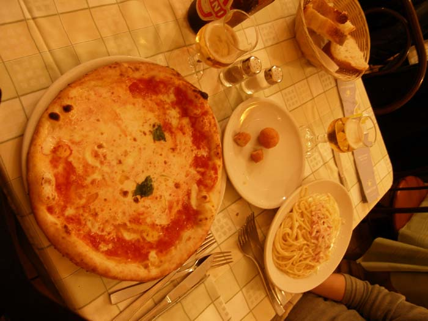
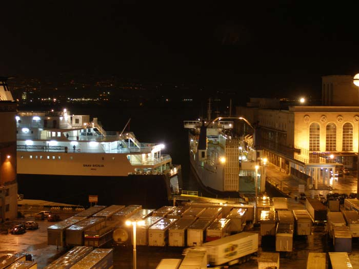
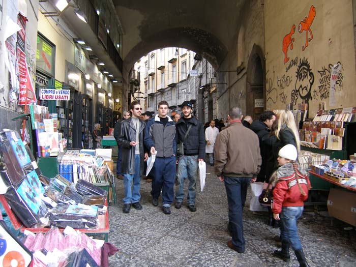
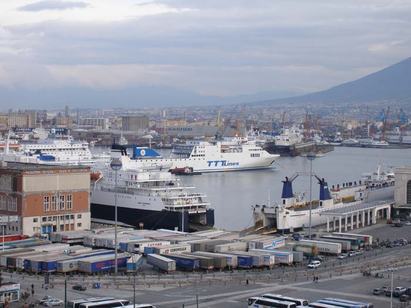

이탈리아 제2신  
       
                          깊고 화려한 역사, 그러나 감당할 수 없는 무질서  
                              -나폴리의 환상과 현실  
  
  
1월 3일 월요일. 오락가락하는 빗줄기를 헤아리며 폼페이를 떠났다. 하얀 눈을 이고 있는 베수비우스산은 여전히 말이 없고, 음산했던 폼페이는 우리의 기억 저편으로 스르르 묻혀져 갔다. 폼페이 시내에 있는 베수비우스 박물관은 끝내 문을 열어주지 않았다. 폐허 속에서 건져낸 삶의 편린들을 보고 싶었는데. 그들은 나폴리의 고고학박물관으로 가보라고 했다.  
한 시간 정도 달려 도착한 나폴리. 도시를 따라 펼쳐진 해변의 한 부분으로 들어온 듯, 차창으로 바닷 내음이 울컥 밀려들었다. 궂은비는 사정없이 내려 가난한 나그네들을 안절부절 못하게 했다. 좁은 도로를 질주하는 차량들. 신경질적인 경적소리와 위협하는 헤드라이트의 불빛이 난무했다. 도로 주변에 그득그득 쌓인 쓰레기는 비에 젖은 채 널브러져 있고, 가득 메운 차량들은 움푹움푹 파인 도로의 흙탕물을 사정없이 튀기며 질주했다.  
주변에 호텔은 즐비했다. 그러나 어딜 가도 턱없이 비싸거나, 신뢰하기 어려운 ‘이탈리아식 흥정’을 벌여야 했다. 가장 큰 문제는 주차장. 주차장을 갖고 있는 호텔이 거의 없었다. 늘 차량의 안위(安危)를 먼저 고려해온 우리였다. 타고 다니는 게 아니라 모시고 다닌다고 할 정도로 차에 신경을 쓸 수밖에 없었다. 이 차가 없었다면 그 먼 길을 어떻게 돌아다닐 수 있었을까. 그보단 없어질 경우 그 골치 아픈 일을 어떻게 감당할 수 있으랴. 시종일관 호텔 선택의 첫 조건이 ‘차의 안전을 보장할만한’ 주차장인 것도 그 때문이었다.   
오후 세 시 가까운 시각에서야 그 유명하다는 ‘나폴리 핏자’로 점심을 때웠다. 계속되는 호텔 탐색전. 어둑어둑해지는 4시쯤 구시가의 중심부로 들어갈 수 있었다. 사람과 차의 엄청난 물결이 휩쓸고 다녔다. 일방통행 구간이 많아 한 번 길을 잘못 들면 먼 길을 돌아와야 했다.

나폴리의 핏자와 파스타

  
3, 4차선 도로에도 보행자 신호등이 없었다. 차들의 눈치를 보며 길을 건너는 사람들, 그 사람들을 잽싸게 앞질러 달리는 차량들. 길 건너는 사람들을 보며 속력을 늦추면 어김없이 돌아오는 짜증스런 경적 소리. 도로 좌우로 꽉 들어찬 우중충한 건물들. 너무 좁아 있으나마나한 인도. 그나마 도처에 펼쳐진 공사판. 차와 사람들이 엉겨 붙은 차도. 그 틈을 비집고 질주하는 오토바이들. 숨쉬기조차 어려운 매연. 비에 젖어 달라붙은 휴지조각들... 더러움과 무질서의 전시장이었다.   
그 도로들을 오르락내리락 하길 여러 차례. 오후 6시가 넘어 깜깜해진 시각에야 항만에 인접한 호텔 하나를 잡을 수 있었다. ‘나폴리를 그냥 포기하고 떠나버릴까’ 망설이던 끝이었다. 호텔은 허름했으나, 창문을 여니 전망이 기가 막혔다. 바로 앞에 부두가 있고, 그 너머로 지중해의 파란 물이 그득했다. 부두엔 환하게 불을 밝힌 페리선 여러 척이 정박해 있고, 선착장 곳곳에 서 있는 지구 모양의 조명등은 우리의 얼어붙은 마음을 녹여 주었다. 주차장과 배들 사이로 분주히 오고가는 사람들. 비로소 이곳이 항구임을 깨달을 수 있었다.

호텔 발코니에서 내려다 본 나폴리 항

  
누가 나폴리를 미항(美港)이라 했을까. 우리는 비로소 아름다운 배들이 정박한 항구를 내려다보며 서운했던 마음을 풀기 시작했다. 그러나 한 발만 시내로 들여놓으면 나폴리는 ‘지저분과 무질서’의 전시장이었다. 나폴리를 미항이라고 예찬한 누군가의 ‘턱없는 과장’, 우리는 그 실체를 확인해야 할 의무(?)까지 지게 된 셈이었다.  
 1월 4일 아침, 창 밖으로부터 맑은 햇살이 비쳐왔다. 호텔방에서 내려다보는 에머럴드 빛깔의 바다와 그 위에 떠 있는 페리들의 하얀색이 멋진 조화를 이루고 있었다. 시내로부턴 여전히 차량들의 소음이 퍼붓듯 몰려오고, 도로엔 날 선 병 조각들과 날리는 휴지조각들이 여전했다. 어젯밤의 그 모습에 햇살만 사알짝 내려앉았을 뿐.  
햇살은 비에 젖은 쓰레기를 말리고, 마른 쓰레기는 다시 먼지를 피워 올릴 태세였다. 차량들과 사람들은 어제처럼 한데 엉겨 도로를 가득 메울 것이고, 그 위에 또 휴지를 버리고 담배꽁초들을 뱉어낼 것이다. 그렇게 ‘미항’이란 ‘미명(美名)’이 붙여진 나폴리를 우리는 날이 밝기가 무섭게 탐색하기 시작했다.    
아름다운 자연경관을 자랑하는 깜빠냐Campania주의 주도 나폴리. 그러나 나폴리는 기원전 6세기부터 외세를 포함한 지배세력의 잦은 교체를 겪어왔다. 그리이스(기원전 6-5세기)를 시작으로 노르만족(12세기), 앙주Anjou·아라곤Aragon 가문(13세기), 스페인(16세기), 프랑스 부르봉 왕가(18세기) 등 다양한 세력들이 나폴리를 지배했다.  
도시의 곳곳에 남아 있는 역사의 흔적들. 그래서 단순히 항만도시라는 이름으로 나폴리의 역사적 의미를 덮어버릴 수는 없다. 복잡다단한 거리만큼이나 의미 있는 역사유물 혹은 유적들이 다양했다. 나폴리의 역사 유적 혹은 관광 포인트는 구역에 따라 대충 10 개 정도로 나눌 수 있었다.

나폴리의 서점가 골목

  
플레비스치토Plebiscito 광장과 왕궁, 성 프란체스코 교회, 성 페르디난도 교회, 제발로스Zevallos 궁전, 성 브리지다Brigida 교회, 누오보 성Castel Nuovo, 성 지아코모 데글리 스파뇰리San Giacomo Degli Spagnoli 교회, 성 마리아Santa Maria di Portosalvo 교회, 성 피에트로 순교자San Pietro Martire 교회, 피에트라르사Pietrarsa 철도박물관 등을 첫 구역으로, 단테Dante 광장, 삼위일체 교회, 성령교회, 성 니콜라스 교회, 그라비나Gravina 궁전, 기우소Giusso 궁전, 파파코다Pappacoda 성당 등을 둘째 구역으로, 성 테레사 교회, 성 뽀티또Potito 교회, 벨리니Bellini 극장, 성 지오반니 바티스타 델레 모나체 교회, 국립 고고학박물관, 성 겐나로 카타콤, 카포디몬테 박물관, 천문대 등을 셋째 구역으로, 프라마리노 궁전, 대주교 궁전, 아포스톨리 교회, 성 죠반니 교회, 포르타 카푸아나 광장 등을 넷째 구역으로, 벨리니 광장, 성 피에트로 아 마이엘라 교회, 폰타노 성당, 로마 수도관, 성 로렌쪼 마기오레 교회, 카푸아노 성 등을 다섯째 구역으로, 성 세베르토 성당, 파로라미타 궁전, 몬테 디 피에타, 성 죠르지오 마기오레 교회, 코모 궁전 등을 여섯째 구역으로, 몬텔레오네의 피그나텔리 광장, 성 치아라 단지, 성 도메니코 마기오레 교회, 코리글라노 광장 등을 일곱째 구역으로, 벨베데레 저택, 루치아 저택, 성 카를로 교회, 타르시아 궁전 등을 여덟째 구역으로, 예술과 산업 박물관, 성 크로체 교회, 델로보 성, 세싸 궁전, 시나고그, 루터란 교회, 비르길의 무덤, 앵글리컨 교회 등을 아홉째 구역으로, 델라 보르사 궁전, 성 펠리체 저택, 페이르체 저택, 보비노 궁전, 갈리 궁전, 스페라 저택 등을 열째 구역으로 각각 나눌 수 있으리라 보았다.

캐슬 누오보에서 내려다 본 나폴리 항

  
<계속>  
  
  

|  |  |
| --- | --- |
| |  | | --- | |  | |

|  |  |
| --- | --- |
| |  | | --- | |  | |

|  |  |
| --- | --- |
| |  | | --- | |  | |

  

|  |  |
| --- | --- |
| |  | | --- | |  | |

공유하기

게시글 관리

**백규서옥\_Blog ver.**