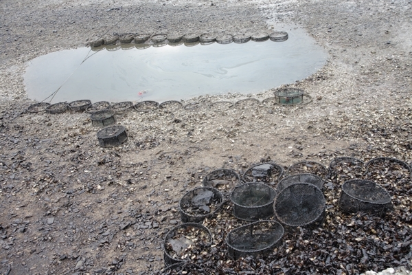
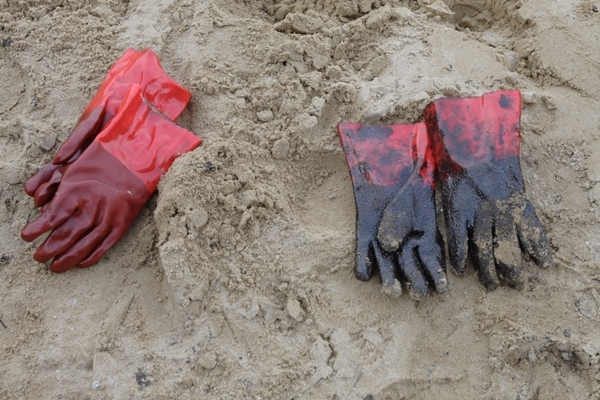
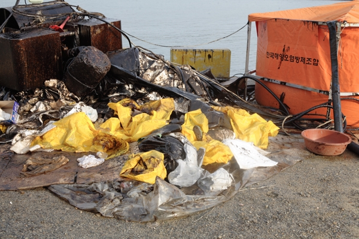
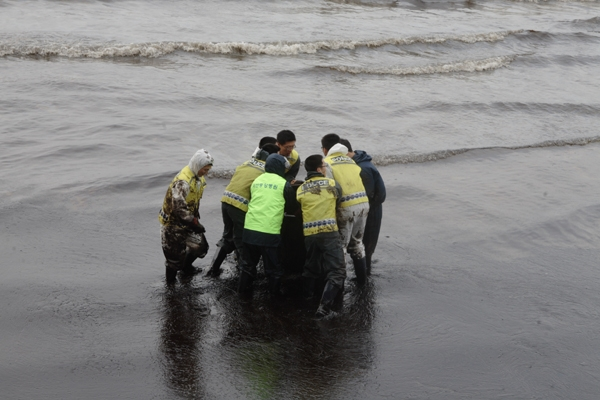
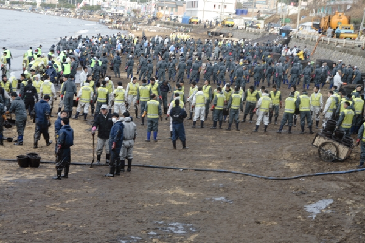
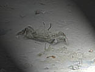

무지갯빛 기름띠 두른 바닷물이 바락바락 밀려드는 신두리 갯벌.  
오늘도 그곳엔 검게 착색된 돌들을 닦고 훔쳐내는 손길들이 분주합니다. 이마에 솟는 땀방울마냥 표면에 기름방울 송글송글 달고 있는 돌들이 안타깝습니다. 흡사 식은땀 흘리며 병상에 누운 자식을 바라보는 부모의 마음이라 할까요? 지금껏 고향 바닷가의 돌들을 이렇게 조심조심 어루만지며 그들의 몸을 소중하게 닦아본 경험이 없습니다. 지금껏 바닷물은, 바닷가 모래사장과 돌들은, 드넓은 갯벌은, 그저 사람들을 위해 존재하는 소품으로만 여겨왔습니다. 몹쓸 것들을 함부로 버려도 금세 정화시켜 우리에게 뛰어난 아름다움과 맛으로 되돌려 주는 ‘무한 희생의 어머니’로만 여겨왔지요.  

죽어가는 태안의 바다(최경자 촬영)

  
함부로 집어 던지고, 깨고, 침 뱉고, 툭하면 찾아와 욕설을 퍼부어도 그 바닷가의 돌들은 말 없는 고요함으로 우리를 맞아준 ‘묵언(黙言)의 성자’였음을 비로소 깨닫습니다. 자식놈들 얼굴 닦아주는 일도 귀찮아하던 제가 바닷가의 돌들을 정성스레 닦아 주면서 터져 오르는 회한의 오열을 삼키고 또 삼킨 것도 그 때문입니다.

기름에 절은, 자원봉사자의 고무장갑

  
울컥 치밀어 오르게 하는 기름 냄새와 끊임없이 들려오는 물소리. 그것들을 빼면 그곳엔 살아있는 게 없었습니다.   
  
             \*\*\*  
  
낮이면 늘 그곳엔 새까맣게 몰려나와 해바라기를 즐기던 능정이, 쇠발이, 황발이, 송장망둥이 등이 널려 있었습니다. 그저 멀리서 다가서는 시늉만 해도 그들은 잽싸게 저들의 구멍으로 몸을 숨기곤 했지요. 그러나 기름 벼락을 맞은 이후 그곳엔 아무런 움직임이 없습니다.

우리의 업보(최경자 촬영)

 아마 모두들 제 집 속에서 죽어있을 겁니다. 제 어린 시절의 삶터이자 놀이터였던 그 바닷가는 그렇게 숨을 놓아버리는 중입니다. 어린 시절 저는 그 바닷가 모랫벌에서 달랑게와 경주를 하며 몸과 마음을 키워왔습니다. 그런데 그들 역시 깡그리 자취를 감추고 말았습니다.  
  
             \*\*\*  
  
저를 아시는 분은 ‘저 촌놈이 또 고향타령을 시작했구나!’ 하시겠지요. 그러나 아무리 오일펜스를 쳐도, 아무리 흡착포를 갖다 붙여도 물길이 이어져 있는 한, 네 바다와 내 바다의 경계는 없습니다. 기름 덩어리는 거침없는 해류를 타고 남으로 북으로 동으로 서로 마구 번져가, 결국은 우리 모두의 마음까지 황폐화 시킬 것이기 때문입니다. 삶터에 ‘독약’을 쏟아 붓고도, 달랑 흡착포 한 장 들고 걸레질이나 하라고 하는 우리의 ‘대책 없는 원시성’이 그저 놀라울 뿐입니다.

바다와 인간(최경자 촬영)

  
  
             \*\*\*  
  
기름 절은 자갈밭을 걸레질하며 비로소 깨닫습니다. ‘자연은 선택이 아닌 삶의 필수조건’이라는 점을 말입니다. 너무나도 자명한 진리를, 아니 상식을 비로소 깨달은 것입니다. 그러나 그건 저만의 깨달음은 아닐 겁니다. 그런 깨달음을 얻었기에 이미 다녀간 자원 봉사자들이 또 찾아오는 게 아닐까요?

이게 힘이다(최경자 촬영)

  
물론 한 뼘씩 걸레질을 해본들 우리가 바다에 가한 폭력의 상흔을 다 씻어낼 수는 없을 겁니다. 그래서 기름이 절어있는 바다엔 절망만 그득한 듯합니다. 그러나 이제부터라도 소중한 자식들의 낯을 닦아주듯 바다와 자연을 소중히 다루는 마음만 갖게 된다면, 머지않아 바다는 다시 숨을 쉬게 될 것입니다. 우리의 젊은이들이 자연과 환경이 우선이라는 인식만 갖게 된다면, 앞으론 많이 달라질 수 있겠지요.  
오늘 걸레질을 하던 중 바위틈에서 살곰살곰 움직이는 아가 능정이를 발견했습니다.

살아있는 능정이

분명 그건 희망이었습니다. 비록 그의 체구는 몹시 연약했지만, 조만간 그는 숨 쉴 만한 갯벌의 공간을 찾아낼 것입니다. 저는 실낱같은 희망일지라도 위대한 힘을 발휘할 수 있으리라 믿기로 했습니다.   
  
지금 이렇게 죽어가는 태안의 바다가 여러분의 아낌없는 응원과 기도를 기다리고 있습니다.   
  
고맙습니다.  
  
   2007. 12. 23.  
  
백규 드림

공유하기

게시글 관리

**백규서옥\_Blog ver.**