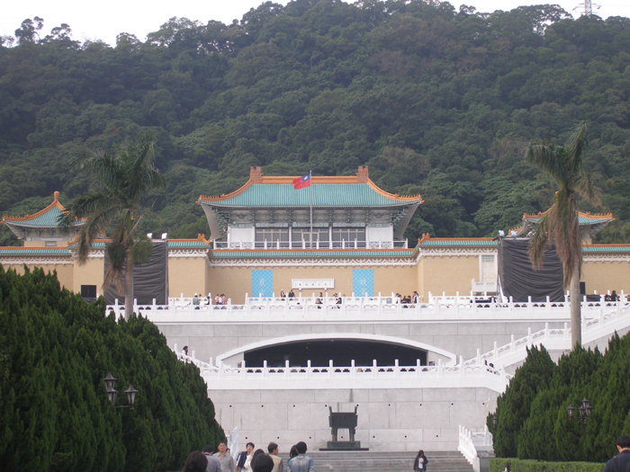
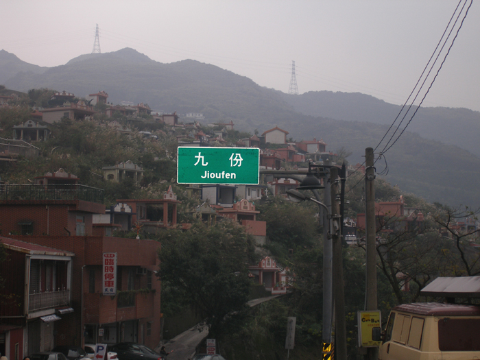
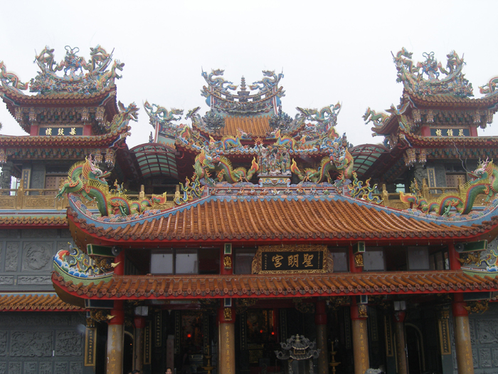
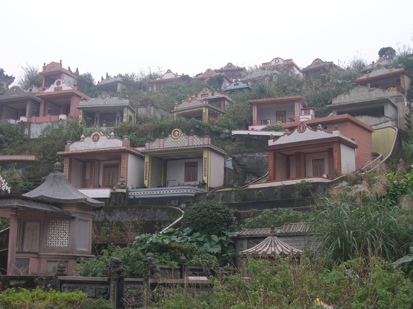
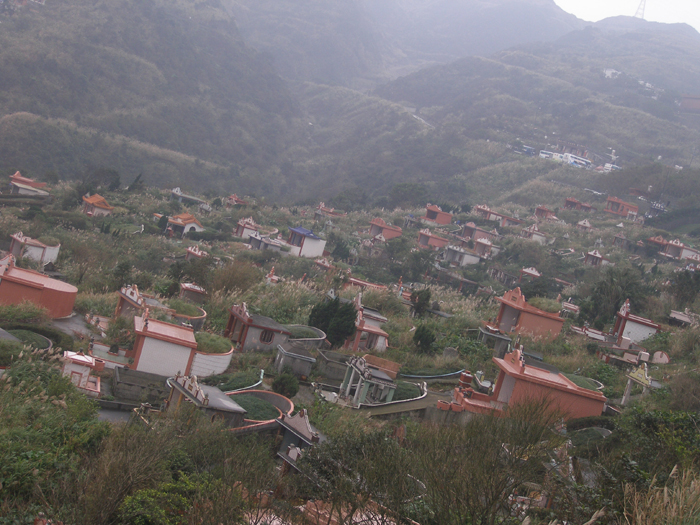
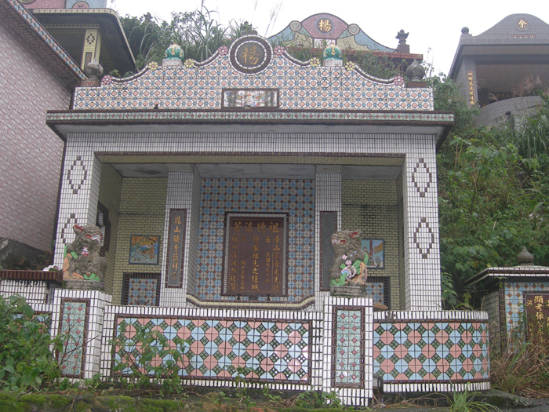
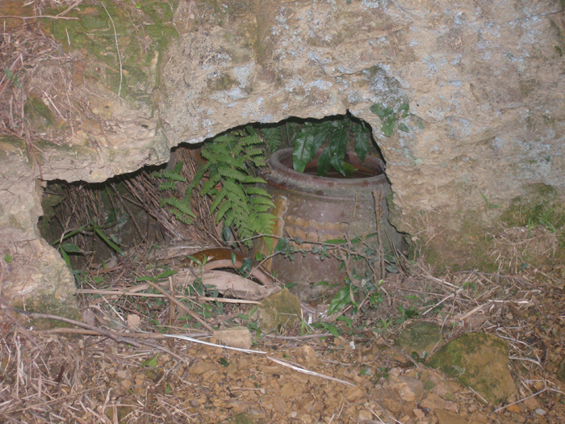

빽빽이도 늘어섰구나, 무덤들이여!

            -대만 인상기(印象記)·1-

                                                                            조규익

‘세상에서 가장 위험한 인간은 책을 한 권만 읽은 사람’이란 말이 있다. 또 ‘군대 안 갔다 온 아무개가 군대 갔다 온 아무개를 이긴다’거나 ‘서울 안 갔다 온 아무개가 서울에서 살다 온 아무개를 이긴다’는 등의 가시 박힌 농담들도 지금껏 우리 사회에는 통용되고 있다. 어느 모임에 나가 보아도 크게 영양가 없는 말로 언성을 높이는 사람이 있기 마련. 그 지식의 근원을 캐 보면 제대로 된 책 대신 인터넷이나 신문 등일 경우가 대부분이다. 해외여행이 보편화된 요즈음. 여행기들이 범람한다. 제대로 발품을 팔아 얻은 글부터 점만 찍고 돌아오는 패키지 여행에서 얻은 인상기에 이르기까지 다양하다. 짧은 생각들이 범하는 어리석음일 뿐이지만, 모조리 무익하지만은 않을 터. 그러니 나도 이 자리에서 그런 어리석음이나 한 번 범해 볼까나?

   \*\*\*

 지난 연말 3박4일의 일정으로 대만을 다녀왔다. 지척에 두고도 ‘언젠가 마음만 먹으면 다녀올 수 있으리라’는 안이한 생각으로 미루어두고 있던 곳이었다. 대만 행에 며칠간의 여유를 활용하기로 했다. 기대와 실망이 교차하는 것은 세계 어딜 가나 마찬가지일 것이다. 사람들 득실거리는 관광지만 찾아 다녀야 하는 것이 여행객의 신세일 터. 어디 한 곳 차분하게 앉아 생각에 잠길 여유가 있으랴. 그저 ‘절에 간 새댁’ 마냥 능란한 가이드의 손에 이끌려 이곳저곳 숨차게 돌아다닐 뿐이었다.

대만 고궁박물원

 여기서 둘째 날 들른 지우펀(九份)을 먼저 언급하려는 것은 그만큼 그곳에서 받은 충격이 컸기 때문이다. 가파른 고갯마루를 넘어 도달한 곳이었다. ‘九份’이란 이정표를 보고 나서야 가이드가 말끝마다 ‘구인분, 구인분’ 하는 말의 뜻을 헤아릴 수 있었다. 지우펀은 금광지대였다. 그 옛날 금광에서 일하던 그 마을의 광부 9명이 매몰되어 죽은 사건이 있었다. 그로부터 9명 광부의 아내들 즉 살아남은 9명의 과부(寡婦)들은 산 넘어 시장에서 늘 ‘9인분’의 식량을 사가지고 고개를 넘어야 했단다. 그래서 이곳이 ‘九份’으로 명명되었다는 것.

지우펀 동네 모습-앞쪽이 산 자들의 집, 뒤쪽이 무덤들이다

 지우펀의 금광박물관을 거쳐 들른 곳이 바로 도교사원으로 화려함의 극치를 달리는 성명궁이었다. 그곳에선 관우를 주신(主神)으로 모시고 있었다. 황금색 바탕에 온갖 화려한 장식들을 붙여 놓은 전각 안에서 관우신을 옹위하고 있는 많은 신들이 사람들의 소원을 들어주고 있었다.

지우펀의 성명궁-관우(관성제)를 모셨음

 그러나 정작 우리를 놀래킨 건 성명궁이 아니었다. 성명궁을 나서서 둘러본 사방의 산중턱에 이르기까지 아파트처럼 보이는 주택들이 그득 깔려 있었다. 그러나 자세히 들여다 본 순간 경악하고 말았다. 그것들은 아파트가 아니라, 모두 유택(幽宅) 즉 무덤들이었다. 충격이었다. 그 무덤들은 흡사 시멘트로 잘 지어놓은 양옥집의 형태를 하고 있었다. 우리나라 같으면 거대한 아파트촌이 들어설만한 양지바른 산록. 그들은 그곳에 ‘죽은 자들을 위한 집들’을 그득하게 지어놓고 있는 것이었다. 어느 경우엔 경계가 모호할 정도로 산 자들의 집과 붙어있기도 했다. 좋게 말하면 ‘산 자와 죽은 자들’이 동거하는 형국이었다.

지우펀의 무덤들

 조부모, 선조들의 유택 아래쪽에 사는 후손들. 참으로 기이한 구도였다. 일찍이 베트남 메콩강 델타 지역 마을에서 뜰 안에 무덤을 만들고 조석으로 향불을 피우는 그들을 본 적도 있었다. 대개 남방 풍속의 공통점일 수도 있겠으나, 대만의 공동묘지는 좀 색다른 점이 있었다.

 딱딱거리는(?) 가이드에게 사정하여 간신히 시간을 얻을 수 있었다. 무덤 탐색을 생략하고 돌아갈 수는 없었기 때문이다. 대략 두어 시간을 헤매고 다니며 무덤 속의 주인공들과 만난 셈이었다. 무덤들을 대충 둘러보고 났을 때 뱃속 저 깊은 곳으로부터 구역질 같은 것이 치밀어 올랐다. 양지 바른 산자락을 점령한 채 늘어서 있는 무덤들. 어느 무덤에나 ‘욕망의 기괴한 그림자’가 드리워져 있었다.

지우펀의 무덤들

 형형색색 단장한, 아무도 없는 텅 빈 시멘트 구조물들을 가득 채우고 있는 냉기와 회한이 내 가슴에 사무쳐 왔다. 무덤들의 실체를 확인한 다음 우리는 빗방울 떨어지는 지우펀의 언덕길을 서둘러 내려왔다. 더껑이 진 가난과 오욕의 현실 속에서 하루하루를 버겁게 살아가는 무덤 속 주인공들의 ‘살아있는’ 후손들과 함께 하고픈 욕망이 강했기 때문이었다.

지우펀의 화려한 무덤

  
묘원(墓苑)이나 유택으로 표현될 만한 그곳의 무덤들은 자세히 보니 여러 층이었다. 호화로운 것은 치장도 그러려니와 규모 또한 웬만큼 잘 사는 집의 그것을 능가할 정도였다. 그러나 길 가 언덕 아래 쪽 구멍에 조막손만한 검은 오지그릇 하나로 남아있는, 초라한 무덤도 많았다. 살아생전 고대광실에서 부귀영화를 누린 자나 노숙의 굴레에서 벗어나지 못한 자나 죽은 다음에 심심산중 한 덩어리 봉분으로 남는다면, 그 얼마나 공평한 일인가. 그런 점에서 우리나라 묘제야말로 얼마나 철학적이고 인간적인가. 물론 호화분묘는 제외해야겠지만.

지우펀의 초라한 무덤

   \*\*\*

 온갖 석물(石物)로 치장한 채 산 자들이 머물러야 할 양지바른 곳을 점령한 대만의 무덤들은 그 자체가 폭력이었다. 물론 조상을 잘 모시려는 자손들의 정성을 어찌 폄하할 수 있으랴. 그러나 내 한 몸 죽여서라도 자식들 살리고자 하는 것이 세상의 부모 마음일진대, ‘산 자들’이 차지해야 할 양지바른 곳에 자신들의 거대한 유택을 마련해준 자손들을 어찌 가상하게 생각할 수 있을까. 우리는 지우펀의 무덤 군(群)을 만나면서 대만에 대한 기대의 반 이상을 접기로 했다.

공유하기

게시글 관리

**백규서옥\_Blog ver.**