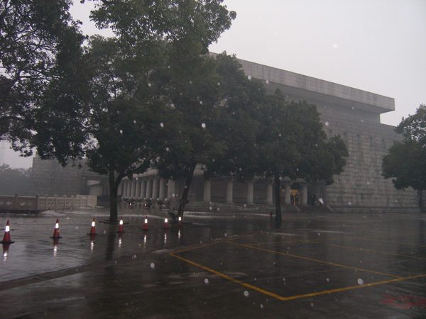
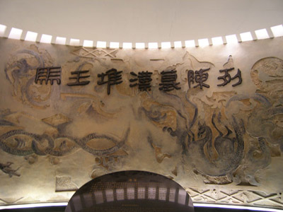
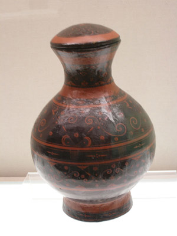
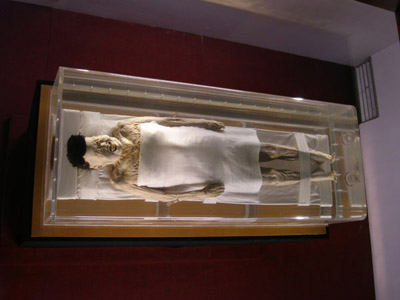
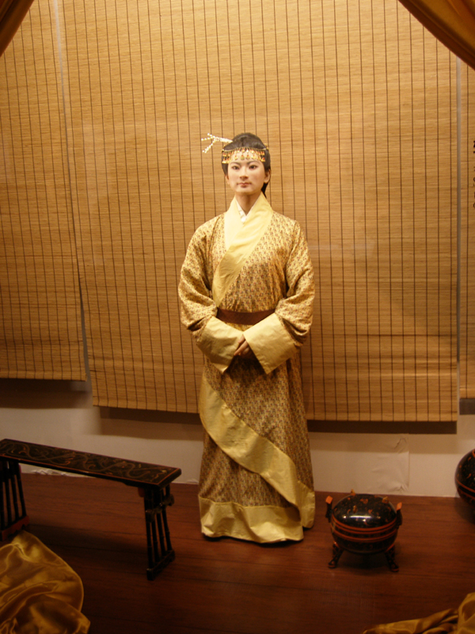

호남성통신 1  
  
마왕퇴의 무덤 속에 잠자고 있는 여인이여!  
           
  
                                                                                                                     조규익

2008년 1월 21일. 내리는 눈발 속에 인천공항 활주로는 허둥대는 비행기들로 북적거렸다. 눈발에 얼어붙은 비행기의 날개를 녹이기 위해선가, 금쪽 같은 두 시간을 공항 대합실에서 하릴없이 기다렸다. 혹시 호남성 박물관 관람의 일정이 날아가는 건 아닌가 하여 속이 바작바작 타들어왔다.

내리는 진눈깨비 속의 호남성 박물관

  
  
중국 호남성 장사시 호남사범대학에서 열린다는 고소설학회의 국제학술회. 그 행렬에 뒤늦게 합류한 까닭이 내겐 있었다. 사실 이곳엔 보고 싶은 게 많았다. 심히 억울했던 굴원이 몸을 던진 멱라수, 두보가 올라가 <등악양루(登岳陽樓)>를 지었다는 악양의 악양루, 천하의 시인들이 찬사를 아끼지 않은 동정호(洞庭湖)와 무릉도원으로 일컬어지는 상덕, ‘사람이 세상에 태어나서 그곳엘 가보지 않는다면 100세가 되어도 늙었다고 할 수 없다’는 장가계 등등.  

호남성 박물관 유물 진열실 입구

그러나 무엇보다 내 마음을 끈 것은 호남성 박물관에서 전시되고 있는 마왕퇴의 유물들이었다. 그 유물들과 함께 발굴되었다는 여인 한 사람도 내 호기심을 심히 자극했다.   
2100년 이상의 세월에도 원래의 모습을 그대로 간직한 그녀, 대후부인 신추(辛追)는 1호 묘의 내관(內棺)에서 발굴되었다. 어쩌면 그 주변에서 발굴된 각종 생활용품을 통해 당시의 생활을 충분히 상상할 수 있으리라는 생각이 들었다.    
  
  
  

|  |  |
| --- | --- |
| 사용자 삽입 이미지 마왕퇴 한묘에서 출토된 배 | 사용자 삽입 이미지 마왕퇴 한묘에서 출토된 술동이. 주석 도금되었음 |

마왕퇴 한묘에서 출토된 구름무늬의 채색칠 둥근병

  
  
이곳 시각으로 오후 3시가 넘어서야 장사 공항의 밖으로 나올 수 있었다. 밖엔 차가운 겨울비가 흩뿌리고 있었다. 한 겨울에도 영하로 내려가는 일이 없다는 이곳이지만, 올해는 벌써 여러 날 영하의 날씨가 계속되고 있단다. 진짜로 뼛속까지 스며드는 추위였다.  
  
기내식으로 점심을 때운 채 우리는 고픈 배를 안고 호남성 박물관으로 달렸다. 다급하게 관람시간 연장을 요청해놓은 터였다. 간신히 찾아들어간 우리는 드디어 마왕퇴의 유물들과 만났다.  
마왕퇴는 지역명, 그곳의 한묘는 서한시대 대후 가족의 묘지다. 마왕퇴의 한묘는 장사시 중심에서 4km 떨어진 곳으로 현재 호남성 박물관 관내다. 1972년에서 74년 사이에 류양하 옆의 마왕퇴에서 1호분, 2호분, 3호분 등 3개의 무덤이 발견되었는데, 모두 장방형의 전형적 서한시대 분묘형식이다. 마왕퇴의 여인은 바로 그 1호분에서 나왔다.  
  
  
  
  
2천 여 년 전의 생활이 어쩌면 그토록 생생하게 내 눈 앞에 다가선단 말인가.   
둘러앉아 담소를 나누는 친구들 사이에 놓여 있었을 아름다운 술동이도, 진수성찬을 담아냈을 반상들도, 적의 가슴에 날려 보냈을 증오의 화살들도, 밤 새워 고뇌하며 써내려갔을 죽간과 목간들도, 여인네의 가발도, 배를 비롯한 각종 과일들도 모두 생생한 모습으로 남아 있었다. 그 한 가운데 그 여인이 있었고, 그녀의 관을 보관했던 거대한 목곽도 원형 그대로 보존되어 있었다.  
  

마왕퇴 한묘에서 출토된 대후부인 신추의 생생한 모습. 죽은 지 2100년이 넘었음

아직도 피부는 탄력을 잃지 않고 있었으며, 그녀의 머리털 또한 숯처럼 새까맣고 건강했다. 1m 54cm의 신장, 34.3kg의 체중. 위장 속에서 다수의 머스크 멜론 씨앗들이 발견된 점으로 미루어 멜론 하나를 먹은 잠시 후 죽은 것으로 보이는데, 사인(死因)은 갑작스런 심장마비로 추정된다고 한다.    
  
상상들 해보시라. 올해가 2008년이니 그녀는 기원전 100년 전의 인물 아닌가. 누군가의 아름답고 젊은 부인이었거나 ‘이쁜’ 딸이었을 그녀. 가족들은 억울한 그녀의 죽음 앞에서 부활에의 소망을 가졌으리라. 그러나 그로부터 2100년이 지난 지금에도 그녀는 아직 부활하지 못한 채 유리관 안에 갇혀 있는 게 아닌가.

이렇게 마왕퇴와 만난 날은 허겁지겁 저물고, 잠시 숨을 고른 후 해가 뜨면 우리는 과거와 현재가 이어지는 삶의 현장을 다시 만나러 가야 하리라.

추정된 대후부인 신추의 생전 모습

공유하기

게시글 관리

**백규서옥\_Blog ver.**