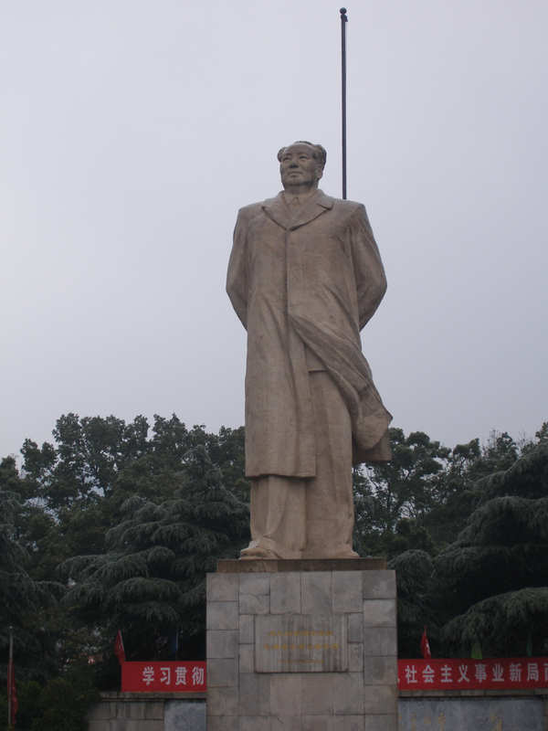
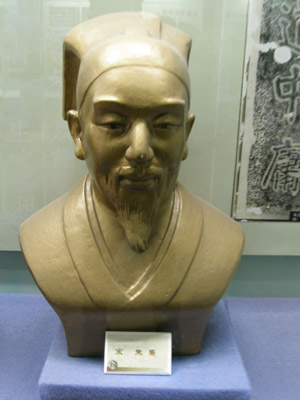
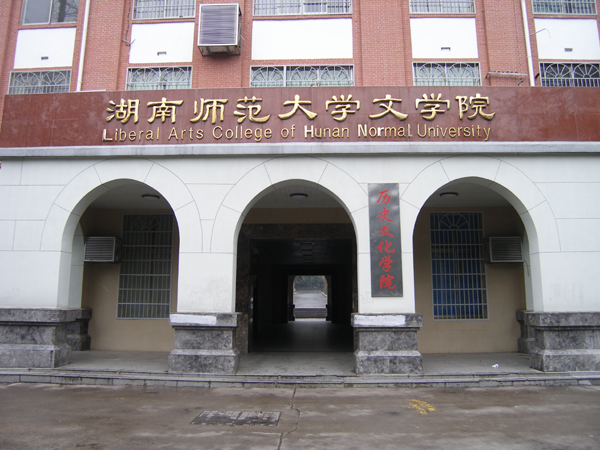
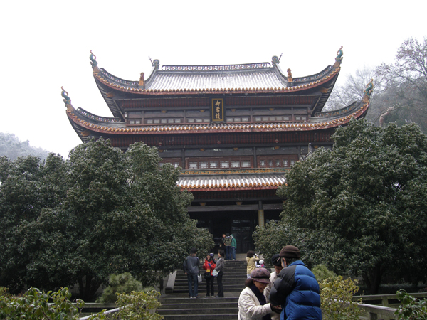

호남성통신 2  
-아, 악록의 정신이여!-  
  
  
                                                                                                                    조규익  
  
호남성은 궂은 겨울비에 젖어 있었다. 남방에 있다하여 내가 방심했던 것일까. 가이드의 표현대로 ‘뼛속을 파고드는 추위’가 매섭다. 차라리 ‘에이는 듯한’ 우리나라의 겨울날씨가 낫다. 이곳은 매우 습한 곳이라 우리보다 기온은 높되 더 춥게 느껴지는 듯하다. 무엇보다 괴로운 건 어느 곳을 가도 난방이 되지 않거나 시원치 않다는 사실이다. 4성급 호텔임에도 천정 밑에서 겨우 온풍기 하나가 돌아갈 뿐이었다.  
우리나라야 밖에서 좀 추워도 집안으로 들어오면 등을 지질 수 있는 온돌이 있지 않은가. 그러고 보면 온돌을 고안해 사용하기 시작한 우리 조상들의 지혜야말로 세계에서 으뜸이랄 수 있다. 이곳에서 움츠리고 길가를 걷다보면 퍼렇게 질린 얼굴로 바람 휑하니 통하는 가게를 지키는 사람들이 안쓰럽다.  
  

  
  
호남성은 중국 22개 성 가운데 면적으로 10위(21.18㎢), 인구로 7위(6천600만), 인구밀도로 13위(313/㎢)란다. 북쪽의 호북(湖北)성과 동쪽의 장시성, 남쪽의 광둥성, 남서쪽의 장족 자치구, 서쪽의 귀주성, 북서쪽의 중경과 접한 곳. 우리가 첫발을 내디딘 장사는 호남성의 성도(省都)다. 모택동, 유소기, 호요방, 주룽지, 화룡장군 등 걸출한 인물이 많이 나온 곳도 이곳 호남성이며, 김구선생이 잠시 피신했던 곳도 이곳이다.

악록서원 앞에 세워져 있는 모택동 상

  
이곳에도 소수민족들이 많지만 그 가운데 토가족, 묘족, 백족, 뚱족 등 네 종족의 수가 많다고 한다. 그 중에서도 옛날 이 지역에서 '산적' 노릇을 하던 토가족은 단연 으뜸. 왜 토가족(土家族 )일까. 가이드의 설명에 의하면 중국인이 섬기던 토지신은 키가 작다고 한다. 그런데 토가족은 대체로 키가 작은 종족이다. 그래서 ‘토가족’이라 하며, 야채를 위주로 하는 이곳의 식사를 ‘토채(土菜)’라 한다는 것. 물론 동정호(洞庭湖)의 남쪽인 데서 명칭을 얻은 호남성의 약칭은 ‘상강(湘江)’에서 온 ‘상(湘)’이오, 이 지역의 음식은 ‘상채(湘菜)’다. 남북으로 흐르는 상강은 장사 시가지를 동과 서로 나누고 있었다. 우리가 잠을 잔 시대제경호텔도, 호남사범대학도, 악록서원도 모두 서쪽에 있었다. 그래서 우리는 장사시에 있는 동안 주로 서쪽에서만 움직인 셈이다.   
  
  

주희 상

22일 아침. 호남사범대학에서 열린 세미나에 참석했고, 호남대학 구내에 있는 악록서원(岳麓書院)을 들렀다. 악록산 청풍협의 아래쪽에 있으며, 중국 4대 서원 가운데 하나인 악록서원. 이 서원이 지어진 것은 북송 때(976년)였다. 악록산의 고상한 산세와 눈발 흩날리는 궂은 날씨 때문인가. 서원의 분위기는 더없이 무거워 보였다. 원문(院門)에 들어선 다음 발길을 옮기자 혁희대(赫曦臺), 대문(大門), 이문(二門), 강당(講堂), 어서루(御書樓) 등이 차례로 나타났다. 통로 양측으로 교학재(敎學齋), 반학재, 상수교경당, 백천헌, 선산사, 숭도사, 육군자당, 염계사, 사잠정 등 즐비한 건물과 공간들이 눈길을 잡아끌었다. 각종 부속 박물관과 연구소도 적지 않은 걸 보면, 동양학 아니 인문학의 근원이 이곳이었음을 알 수 있을 듯 하다.    
우리 역사를 파행으로 몰아간 중국. 그러나 아무리 그렇다 해도 그들이 품고 있는 도학의 큰 맥까지 부정할 수는 없는 일이다. 서원의 경내를 거닐며 산같이 위대한 지성들이 산 속에 파묻혀 진리를 궁구하고 토론하던 모습을 상상할 수 있었다.   
 이 서원에선 그 옛날 주희(朱熹)와 장식(張栻)이 토론을 벌였다. 지금보다 삶의 여건이 결코 좋을 리 없었을 터. 백발이 성성한 대학자들이 추위와 더위를 무릅쓰고 이곳에 틀어박혀 학문을 토론했을 것이니, 참으로 존경스럽도다!

호남사범대학 문학원

  
학문을 한답시고 애꿎은 종이와 전기만 낭비하고 있는 나는 과연 누구인가. 염량세태에 휘둘리며 일희일비하는 백규, 학문의 폭과 깊이를 획기적으로 확장시키려 하지도 못하고, 가르침을 줄만한 세상의 현인들을 찾아 나서지도 못하는 백규, 공부에 모든 것을 걸지도 못하는 겁한(怯漢) 백규...  
호남성의 악록서원에서 위대한 선현들의 마음자리를 깨닫곤 헤어날 수 없는 부끄러움에 빠져드는 순간이다.

악록서원 어서루

공유하기

게시글 관리

**백규서옥\_Blog ver.**