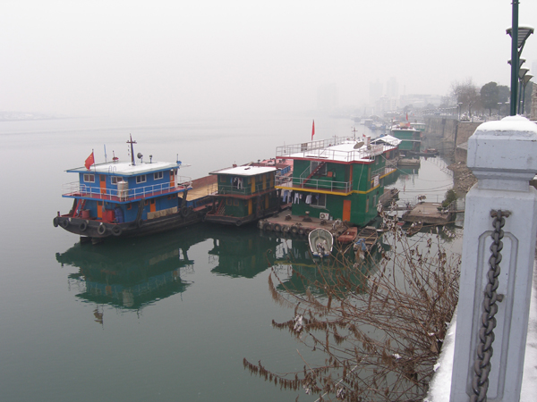
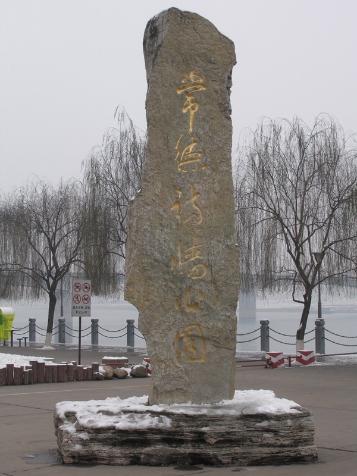
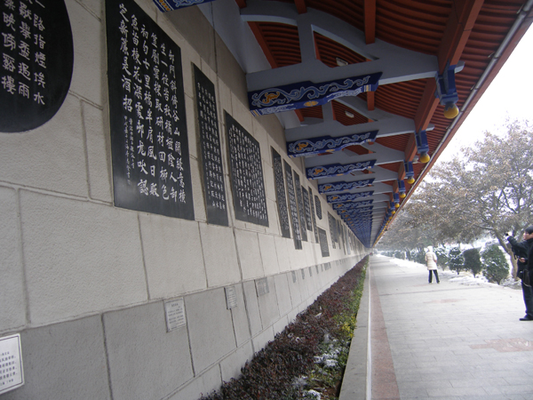
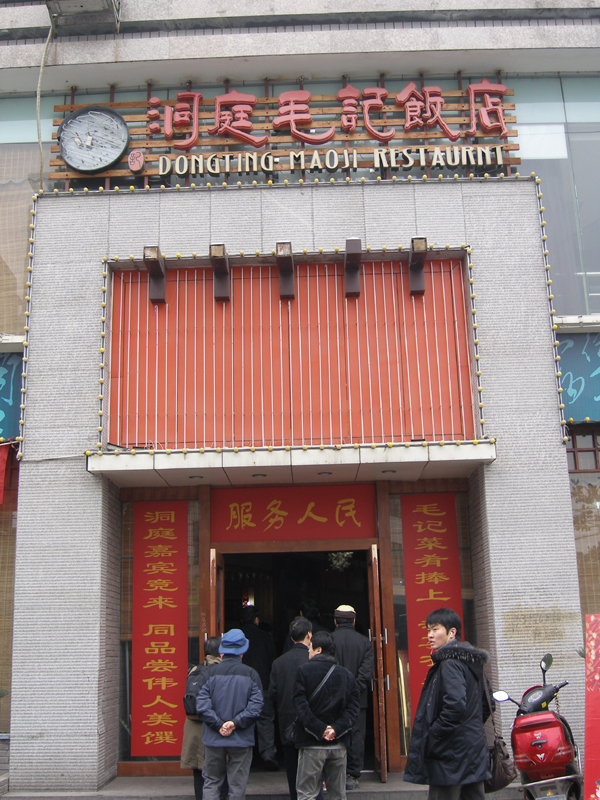

호남성통신 3   
  
상덕(常德)과 원강(沅江), 그리고 모택동  
  
  
                        
  
김형!  
  
지금 우리는 장사(長沙)를 떠나 상덕(常德)으로 향하고 있소. 이곳 사람들의 과장 섞인 말로는 20년 만에 처음 당하는 한파로 곳곳이 얼어붙은 상장(常長) 고속공로를 통해서 말이오. 가는 길에 점심을 해결할 겸 고속도로가 뚫리기를 기다리기 위해 상덕시의 원강공원으로 접어들었소.

원강의 풍경

  
 그런데, 강안(江岸)의 널찍한 공원에 주차한 우리는 뜻하지 않은 진경(珍景)을 만나게 되었소. 외지 관광객들 대부분은 한가로이 흘러가는 강물과 그 물 위에 떠가는 배만 있는 줄 알고는 5분 만에 혀를 차며 떠난다는 곳이오. 차에 내려 이리저리 거닐다 보니 강안을 접하여 무한히 뻗어있는 벽(壁)을 발견할 수 있었소. 아, 그곳엔 무수히 많은 시들이 새겨져 있는, 이른바 시비(詩碑) 아닌 시벽(詩壁)이 있었소!

원강공원 시벽의 표지석

  
  아주 가끔씩 그저 괜찮은 시인의 시작품 하나 만을 겨우 돌에 새겨 비를 세우고 스스로 대견해하는 우리의 모습을 떠올리며, 나는 무수히 뻗어 있는 시벽을 대한 채 말을 잊었소. 중국인들의 규모와 배포를 엿볼 수 있는 일이었소.  
과연 ‘세계 최장의 시벽’으로 기네스북에 오른 사실을 표지판으로 만들어 이곳의 초입에 세울 만큼, 그건 장관이었소.

기네스북에 올른 세계 최장의 시벽

  
이 시벽의 공식명칭은 ‘중국상덕시장(中國常德詩墻)'. 크게 여섯 부분으로 나누어져 있으며, 946명에 달하는 중국 유명 시인들의 시사(詩詞)들이 정(正), 초(草), 예(隸), 전(篆) 등 여러가지 서체로 각자(刻字)되어 있었소.  
그와 함께 명화(名畵) 43폭도 새겨져 있는데, 그 가운데는 상덕의 역사와 풍운을 반영한 <<백대창상(百代滄桑)>>도, 고금의 명현(名賢)들이 상덕을 읊은 <<명현제영(名賢題咏)>>도 들어 있었소. 총 길이 3000m, 총 1267수의 작품들! 놀랍지 않소?  
  더구나 이 거사가 그 흔한 시인협회 등 문인들의 단체에서 주관하여 이루어진 게 아니고, 상덕시위원회와 시정부가 앞장서서 한 일이라니, 이들의 문화의식이 그저 부럽기만 했소.  
우리나라 문인단체 같으면 이 정도의 일을 기획하기도 어렵겠거니와, 현재와 같은 정부나 지방자치단체 혹은 공무원들의 그리 높지 않은 의식수준으로 보아 수용될 수 있는 일 또한 아니겠지요. 그것이 바로 문화적인 면에서 우리가 중국을 따라갈 수 없는 점이라고 생각하오.  
‘전봇대 하나 뽑는데 10년이 걸렸다’는, 요즈음 인구에 회자되는 사건 하나만 보아도, 청계천의 양쪽 벽에 유명 시인들의 시판(詩板)을 붙이자고 할 경우 우리네 공무원들이 과연 수긍하겠소?   
  
\*\*\*  
  
시간에 쫓겨 시벽을 대충 훑어본 다음, 시장기를 해결하기 위해 공원 밖의 식당엘 들렀소.  ‘동정모기반점(洞庭毛記飯店)’이란 난해한(?) 이름의 식당이었소. 번역하면 ‘동정호반의 모택동을 기념하는 식당’ 쯤 될까요?

원강공원 밖의 동정모기반점(洞庭毛記飯店)

  
왜 그런 이름이 붙었는지 알아보았소. 모택동이 원래 호남성 출신이지요? 이곳에서 가까운 소산(韶山)이란 곳에 그의 생가가 있다는 것이오. 이곳 호남성에서 모택동은 거의 신에 가까운 존재로 숭배되고 있었소. 전통 왕조를 무너뜨리고 현재의 중국을 있게 한 그였으니, 그럴 만도 하지요?  
들은 바에 의하면, 대장정에 나섰던 모택동이 고향 땅을 찾았다고 합디다. 어떤 촌가에 들렀을 때 가난하여 대접할 게 없던 그 집 주인은 시장에서 사온 물고기의 머리를 정성스럽게 조리하여 내놓았다고 하오.  
물고기 머리에 뭐 그리 먹을 게 있었겠소? 머리뼈에 붙은 양념을 맛있게 빨아먹은 모택동. 그 후로부터 물고기 머리 요리와 삶은 돼지고기 요리를 가장 좋아하게 되었다나요?  
그 고기 이름이 무엇인지는 기억할 수 없으나, 대충 원강 가이고 보면 잉어가 아니었을까요? 그리고 돼지고기는 동정호 일대에서 근원된 것으로 보이는 ‘동파육’이 아니었을 지요? 그러나 자세한 건 나도 모르오.   
어쨌든 그 식당으로 들어가자 과연 식당 모든 곳에 모택동의 대형 사진들이 걸려 있고, 반상에는 여러 요리들 가운데 물고기 요리가 올라왔소. 모양은 물론 그 맛 또한 발군이었소. 뼈까지 빨아 먹고 나자 샤오제가 국수를 말아주는데, 국수 맛도 일품이었소.  
그 요리의 내력과 레서피를 그녀에게 자세히 물어보고 싶었으나, 우선은 소통이 불가능했고 또 바쁘게 이동하는 일행의 일정에 방해될 것 같아 자제할 수밖에 없었소.       
모택동에 대한 중국인들 특히 호남인들의 지극한 애정은 어딜 가나 한결 같았소. 그의 독특한 서체 또한 명승지 어딜 가도 볼 수 있었소. 거 왜 있지 않소? ‘북경대학(北京大學)’ 현판 글씨체 말이오. '호남대학(湖南大學)‘도 그의 글씨체였소. ’왕희지 체‘ 아닌 ’모택동 체‘라고나  할까요?  
  
\*\*\*  
  
원강공원에서 시향(詩香)과 어향(魚香)으로 배를 불린 우리는, 무릉원과 천문산 그리고 천자산을 품고 있는 장가계로 한 발 다가서기 위해 상덕시로 향하려 하오. 그곳에서 다시 봅시다.    
  
백규 씀

공유하기

게시글 관리

**백규서옥\_Blog ver.**