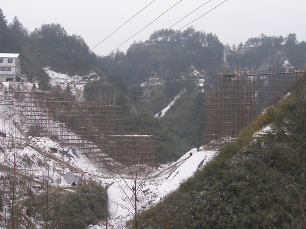
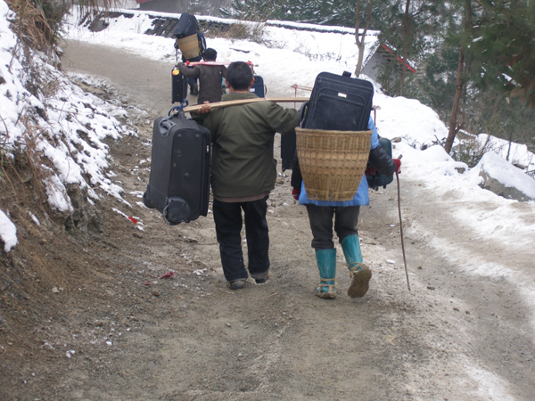
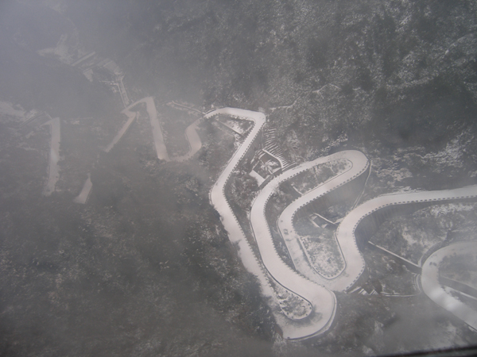
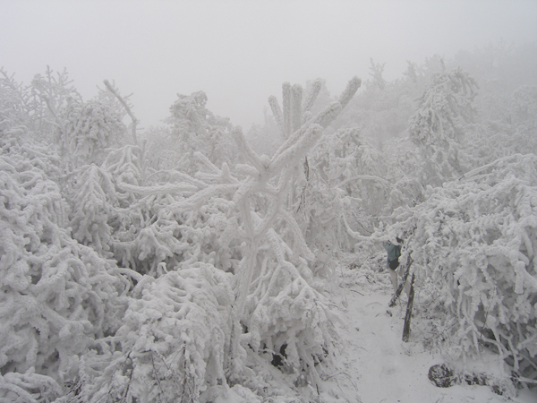
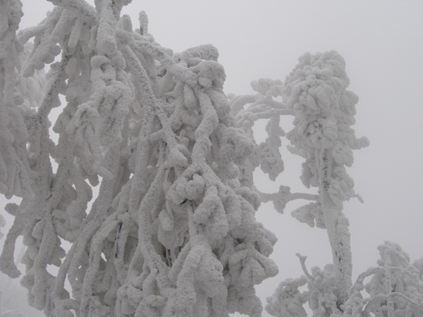
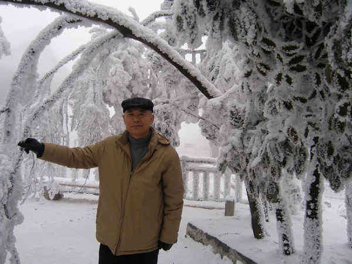
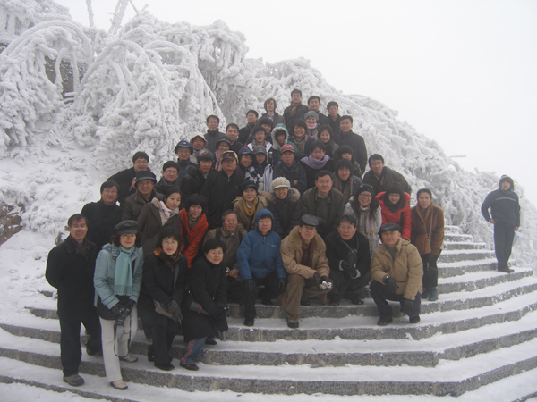

호남성통신 4  
  
      얼어붙은 장가계(張家界), 사라진 무릉도원(武陵桃源)  
          -천문산(天門山)의 서리꽃 눈꽃과 끊어진 다리의 씁쓸한 추억-  
  
  
혹시 이번 참에 무릉도원을 밟아보는 것이나 아닐까. 지도에서 무릉원(武陵源)을 목격하고는 그곳을 주책없이 대뜸 천하의 절경이라 일컫는 장가계와 연관 지어 생각하기로 했다. 복숭아꽃 만발한 무릉도원.  
언제인가 외부인과 연락이 단절된 그곳에 어부 한 사람이 어쩌다가 들어가고 말았다. 그런데 그곳에 천하의 절대 선경(仙境)이 펼쳐져 있는 게 아닌가. 사람을 잡고 물으니, 자신들은 진시황의 폭정을 피해 이곳에 들어온 이래 지금까지 살고 있다는 것이었다. 말하자면 생사를 초월한 절대 낙원이 바로 그곳이었던 것. 자신들의 존재와 공간을 누설치 말 것을 약속하고 빠져나온 어부가 그곳에 다시 갔으나, ‘다시는’ 그곳을 찾을 수 없었다. 내가 바로 그 무릉도원엘 가고 있다는 설렘으로 잠시나마 가슴이 벅차올랐다. 꿈같이 선경에 들렀다가 다시 그곳을 찾아가는 어부의 심정으로. 우리는 험한 도로를 달리고 있었다.  
상덕국제호텔에서 이른 아침을 먹은 다음 우리는 장가계를 향해 허위허위 너덧 시간을 달렸다. 상덕의 시계(市界)를 벗어나 무릉원으로 진입할수록 고도는 높아갔고, 주변의 봉우리들은 날이 서기 시작했다. 길 주변 산기슭에 띄엄띄엄 널려있는 민가들은 온기를 모조리 잃어버린 채 오들오들 떨고 있었다. 한 결 같이 시멘트로 지은 단층 혹은 2층들이었는데, 짓다가 중단한 집들이 태반이었다. 어둠이 깔려도 따스한 불빛 한 줄기 새어나오지 않고, 텅 빈 공간을 채운 것은 적막과 추위뿐이었다.  
다들 어디에 갔을까. 호남성 일대의 가옥들에는 난방장치가 아예 없다는 설명을 들었고, 지금까지 호텔들을 거치면서 그 사실을 확인할 수 있었다. 그러니 이 썰렁한 날씨 속에 사람들은 얼마나 괴로울까. 거지가 남 잠자리 걱정해주듯, 나는 노랑노랑한 아이들과 구부정한 이 땅의 할매 할아배들이 눈에 밟혔다.  
고도가 높아갈수록 기온은 낮아지고, 버스의 창문에 눌어붙는 입김과 성에로 창밖은 가려지고 있었다. 더구나 닥쳐오는 산간의 이른 어둑발은 우리를 하염없는 졸음의 구렁으로 몰아넣었다. 한참 꿈속을 헤매는데 모두 내려야 한다는 가이드의 말이 들려 와 퍼뜩 잠이 깼다. 몇 년 전의 물난리로 없어진 황가 계곡의 다리가 아직 공사 중이라서 차가 갈 수 없으니 우리는 모두 내려 걸어서 계곡을 건너야 한다고 했다.

무릉원 황가계곡의 끊어진 다리, 중단된 공사현장

  
깜깜한 밤, 차에서 내리자 토가족 원주민들이 몰려왔다. 계곡 건너편으로 짐을 지고 갈 일꾼들과 사람들이 빙판 진 계곡 길을 미끄러짐 없이 건너 갈 수 있도록 발에 감을 짚신 등을 팔러 온 사람들로 붐볐다. 다리 공사에서 품을 팔아봤자 하루 종일 20원 벌이가 고작이었으나, 트렁크 두어 개만 계곡 건너편으로 옮겨주면 40원을 벌 수 있다고 했다. 그러니 이곳 사람들이 다리의 완공을 원치 않는다는 것도 헛말이 아니었다.

무릉원을 떠나던 날 우리의 짐을 어깨에 짊어지고 계곡을 건너는 토가족 남성들

  
어릴 적 눈 온 날 등굣길, 고무신발에 새끼를 동여 본 이후 처음으로 엉성한 짚신을 신고 계곡을 건넜다. 깊이가 30m 이상, 길이가 500여m가 넘는 끔찍한 계곡이었다. 빙판에 미끄럽기도 하고 질퍽거리기도 했다. 달빛도 없는 우중충하고 깜깜한 밤중. 인적 없는 타국의 계곡을 건너는 50여인의 나그네들은 참으로 고된 경험을 할 수밖에 없었다. 한참을 걸어서 길 공사가 시작되는 지점에 이르자 토가족 원주민들의 억지가 이어졌다. 계곡을 건너오는 도중 손을 잡아주었으니 20원을 더 내라고도 하고, 비용으로 가방 당 20원을 더 내라고도 하면서 짐을 내주지 않는 것이었다. 험악한 순간이었다. 원래 산적(山賊) 출신이니 어쩔 수 없다고 혀를 차면서 이들의 억지 대부분을 수용할 수밖에 없었다.   
그렇게 가까스로 무릉원에 입성했고, 천자호텔에 여장을 풀었다.   
  
  \*\*\*  
  
다음날 천문산을 케이블카로 올랐다. 공중에서 내려다보이는 무릉원 시가지의 집들 모두 추위에 떨고 있었다. 모두 얼어 있었다. 살아있는 것은 간혹 뿜어대는 열차의 경적뿐. 사람의 모습은 보이지 않고, 그늘 진 주택들의 지붕 밑 빨랫줄에는 그들의 남루(襤樓)가 물에 젖은 채 걸려 있었다.

케이블카에서 내려다 보이는 구절양장의 도로

 그러나 케이블카에 달랑달랑 매달려 내려다보는 산과 계곡은 참으로 의연했다. 추위 속에 증발되는 겨울 안개가 중턱 이후로 자욱했고, 발 밑 아스라이 내려다보이는 꼬불탕 차도가 구절양장으로 장난감처럼 꼬부라져 있었다. 순간순간 아아(峨峨)한 산봉우리들이 케이블카의 창문을 통해 내 몸에 부닥칠 듯 다가왔다 물러가곤 했다. 중턱을 지나자 서리꽃 눈꽃 핀 나뭇가지들이 나타나기 시작했다.

눈과 서리에 얼어붙은 천문산의 나무들

  
장가계의 산들 중 역사 기록에 가장 먼저 나타나는 천문산. 운몽산이나 고량산 등의 이칭을 지닌 이 산은 해발 1518m나 된다. 해발 1300m 지점에 환하게 뚫린 구멍 즉 천문(天門)이 나타난다. 세계에서 가장 높은 천연 종유굴인 천문동이 바로 그것이다. 이곳에 가려면 케이블카에서 내려 다시 99개의 고개를 버스로 올라야 하고, 다시 가파른 999 계단을 걸어 올라야 한다.  
케이블카를 타고 오르는 도중 안개에 가려 어렴풋하긴 했으나, 천문동을 볼 수 있었다. 높이 131m에 너비 57m, 깊이 60m나 되는 큰 동굴이었다. 시내에서 시작되는 케이블카는 종착점까지 7.45km, 편도 35분의 엄청난 길이였다. 오금이 저려오는 1시간여의 체험. 그러나 손에 잡힐 듯한 설화목(雪花木)들 덕택에 그 공포는 찬탄과 쾌감으로 바뀌고 말았다.  
  
\*\*\*  
  
드디어 종착점. 모든 것이 얼어 있었고, 나무들은 무거운 눈을 이고 있었는데, 나무들을 감싸고 있는 눈은 부스러지고 흩어지는 게 아니라 아예 얼어붙어 있었다. 나무들 모두 마치 두꺼운 솜바지를 입고 있는 것 같았다.

눈과 서리에 얼어붙은 천문산의 나무들

 사람들은 넋을 잃어버린 채 눈의 무게에 체념하고 있는 나무들 사이를 날뛰듯 돌아다녔다. 그 순간만큼은 복잡한 세사에서 떠나려는 모습들, 가장 순수하고 아름다운 모습들이었다. 그들을 보는 내 마음도 덩달아 들떴다. 그래, 가장 순수한 곳으로부터 자꾸만 멀어져 온 우리가 가끔씩 순수했던 지점으로 회귀할 수 있다면, 그것도 나쁘지 않겠구나. 아니, 어쩌면 그런 기회를 찾기 위해 열심히 살아가는 것 아닌가.

서리와 눈으로 얼어붙은 나무들 사이에서

  
오늘 무릉도원을 찾아 왔다가 추위에 얼고 삶에 찌든 사람들을 만나 우리의 마음마저 썰렁했지만, 이제 산정의 순수한 설화목들 속에서 그간 잃어버리고 있던 순수를 되찾았으니, 그것만으로도 다리 끊어진 계곡을 천신만고 건너온 고생은 보상을 받지 않았는가. 그리고 우리가 이곳을 내려가면 언제 다시 이곳을 찾을 수 있으랴! 그러고 보면 우연히 만난 무릉도원을 다시 찾지 못한 그 어부의 경우처럼, 이 천문산 케이블카의 종점이야말로 우리에겐 그 어부의 무릉도원과 같은 곳이 아니랴? 그러니 무릉도원 밖에서 무릉도원을 찾을 일이 아니오, 세상 밖에서 세상을 찾을 일이 아님을 오늘 이 천문산은 내게 포효하듯 말해주었다. 그래, 이곳에 다시는 못 올지라도 이제 세상으로 내려가자!

천문산에 오른 기쁨을 만끽하며

  
2008. 1. 24.  백규

공유하기

게시글 관리

**백규서옥\_Blog ver.**