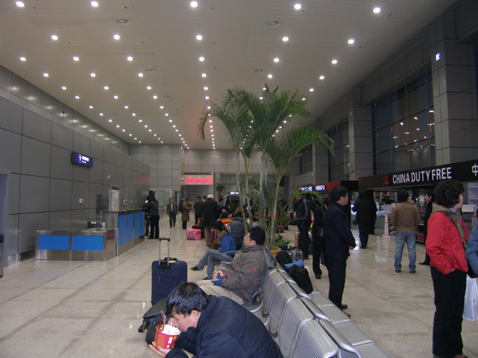
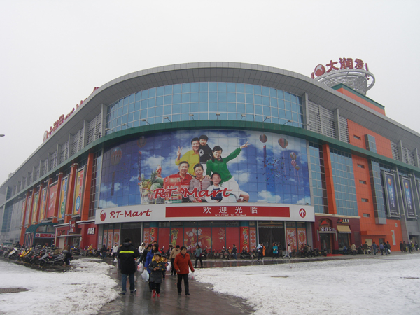
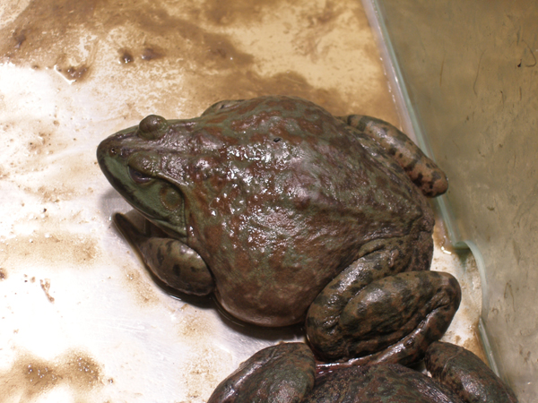
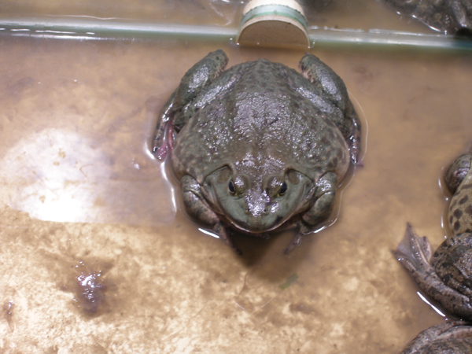

호남성통신 6   
  
  중국의 마트에서 만난 개구리의 슬픈 눈동자  
  
  
                                                                                                                    조규익  
  
  
호남성 사람들의 말로는 50년 만의 혹한이라 했다. 과연 추웠다. 그것은 우리나라 한겨울의 ‘살을 에는 듯하지만 상큼한’ 추위가 아니었다. ‘뼛속까지 스며드는’ 불쾌한 추위였다. 우리의 경우 밖이 추워도 문만 열고 들어서면 따스한 온돌이 기다리고 있지만, 이곳엔 그런 게 없다고 한다. 온통 습하고 음침하다. 습기 때문인지 약간만 추워도 땅바닥은 유리를 깐 듯 미끄러웠다. 그 위에 눈까지 내리니 공항은 물론 팔방으로 통하는 고속도로들도 완벽하게 막혀버렸다. 중국에서 최고급에 속한다는 5성급 호텔도 정전되는 경우가 적지 않았다. 열차가 석탄을 실어 와야 발전소를 돌릴 텐데, 중간에 열차가 멈췄으니 제대로 발전이 될 리가 없다 한다. 과연 대단한 나라였다.

장사 공항 대합실

  
  
\*\*\*  
  
공항이 폐쇄되어 귀국길이 막힌 지 2~3일 만에 생필품 구입을 위해 일행들은 호텔 근처의 마트에 갔다. 그곳까지 차로 20분 거리. 웬만하면 걸어서 갈 수도 있는 거리이나, 가이드는 늘 차로 함께 움직일 것을 요구했다. 중국말도 통하지 않을 뿐더러, 거리가 위험해서일 것이다.

장사 바야호텔 인근의 \*\*마트

  
처음 가보는 중국의 마트. 한국으로 치면 하나로마트, 이마트, 코스코 등과 같은 규모와 형태일까. 많은 사람들이 복닥거렸다. 평소 약간의 식탐(食貪) 끼가 있는 나인지라 그들의 식재료 코너를 당연히 보고 싶었다. 기름에 절이고 말려 갖가지 모양으로 매달아 놓은 새들, 돼지고기 덩어리들, 속을 넣어 줄줄이 사탕처럼 묶어 매달은 갖가지 창자들(소세지?)... 아, 그곳은 지옥의 형상이었다! 우리 인간도 최후의 심판대를 거쳐 지옥에 떨어질 경우 악귀들 세상의 마트에 저런 형상으로 내걸리는 건 아닐까.  
그러나 그건 약과였다. 발길을 돌린 순간, 더 처참한 모습을 목격할 수 있었다. 많은 사람들이 둘러 서 있는 곳을 비집고 들어서니 큰 유리 상자들이 놓여 있었고, 그 안에는 큼지막한 개구리들과 자라, 거북이들이 엉겨 붙어 있었다. 거북이나 자라의 경우 머리를 집어넣거나 눈꺼풀을 내려 버리면 그만이니 그 녀석들의 속내를 들여다볼 방도가 없었다. 문제는 개구리들이었다. 큰 놈은 아이들 머리통만 했고, 아무리 작아도 내 주먹은 훌쩍 넘을 듯 했다. 그런데 그 눈들! 아, 개구리들이 그렇게 영롱한 슬픔의 눈을 하고 있을 줄이야! 그리고 그 눈망울들은 왜들 그렇게 큰 것일까.

다음날까지 살아남아 있던 개구리, 아마 지금쯤 그도 누군가의 뱃속으로 들어갔을 것이다!

  
사람들은 그 개구리들을 우선 육안으로 감별했다. 어느 놈이 가장 실하고 싱싱한지 가늠하기 위해서일 것이다. 그 다음엔 손으로 꼬집어보기도 하고 뒤쪽에서 ‘아귀’를 움킨 채 들어 올려 보기도 했다. 그럴 때마다 무력한 개구리는 버둥거리며 슬픈 눈동자만 굴리는 것이었다. 상자 안에서 이리 밀리고 저리 밀리며 사람들이 혹시 자신을 선택하지나 않을까 공포에 질린 표정들이 역력했다. 그러나 그들의 표정이나 눈동자를 살피는 중국인들은 아무도 없었다.  
잠시 관찰하니, 사람들은 대개 두서너 마리를 비닐봉지에 골라 넣는 것이었다. 가족 당 한 마리씩 먹기 위해 고른 것이리라. 개구리와 자라 상자들이 4각으로 늘어선 안쪽에는 부부로 보이는 남녀가 큼지막한 도마 앞에서 ‘무시무시한’ 칼로 연신 ‘사형’을 집행하고 있었다. 그들의 앞치마는 이미 붉게 착색되어 있었고, 붉은 고무장갑 또한 더욱 또렷한 진홍색으로 변해 있었다. 그들 앞에는 비닐봉지를 든 사람들이 길게 늘어서 있고, 그들은 무표정한 얼굴로 쉼 없이 단칼을 내려치고 있었다.  
고객으로부터 받은 비닐봉지를 열고 큼지막한 개구리를 끄집어내어 널찍한 도마 위에 엎어 놓는다. 한 번쯤 버둥거릴 만도 한데, 목욕탕 때밀이에게 몸을 맡기듯 그 ‘망나니’의 손에 잡힌 개구리는 저항 한 번 해보지 못한 채 도마 위에 쭉 뻗고 엎드리는 것이었다. 그러면 그 망나니의 칼은 한 치의 오차도 없이 목 부분에 내려 꽂혔다. 순간 물갈퀴도 선명하게 뒷다리를 쭉 뻗으며 개구리들은 최후를 고하곤 했다.  
그야말로 칼날에 막걸리 한 입 뿜어 바르지도 않고, 아니 최후 진술의 기회조차 주지도 않은 채 망나니들은 속전속결로 개구리들의 머리를 끊어내고 있었다. 끊긴 머리들은 도마 아래쪽의 플라스틱 바구니에 썩은 밤톨처럼 내동댕이쳐졌다.

인간을 향한 개구리의 항의(?) 그 역시 누군가에게 영양을 공급하고 사라졌을 것이다!

  
삶과 죽음의 경계. 참으로 허망한 개구리들의 운명이었다. 상자 안에 엉겨 있는 그들 가운데는 가족들도 있었으리라. 형장에 끌려온 줄도 모르는 자신의 아이들에게 ‘괜찮을 테니 걱정 말아라!’고 입에 발린 위안을 주어야 하는 개구리네 아버지의 찢어지는 마음도 있을 것이고, 빙 둘러선 사람들의 눈초리가 무서워 품을 파고드는 아이들을 보듬어 주는 모정도 있을 것이다.   
갑자기 구역질이 나고 몸으로는 한기가 느껴졌다. 뒷다리를 쭉 뻗는 개구리들을 보며 침을 꼴깍꼴깍 삼키는 중국인들이 갑자기 저승차사로 보이기 시작했다. 저승차사들이 빙 둘러선 그곳은 생지옥의 현장이었다. 개구리들이 엉겨붙어있는 유리 상자는 이승이었고, 그들을 골라 온 ‘차사’들이 빙 둘러서서 지켜보는 가운데 처참하게 사형을 집행하는 곳은 저승이었다.  그래, 이승과 저승의 경계란 종이 한 장의 두께에 지나지 않는 것을! 아니, 그 두 공간은 아예 공존하고 있는 것을! 지금까지 어리석은 나만 모르고 있었던 것이다.  
  
\*\*\*  
  
호텔로 돌아온 나는 밤새 악몽에 시달렸다. 자연의 물상들을 지배하며 그들을 먹고 살아도 된다는 허락을 신으로부터 받았다고는 하지만, 그들은 꼭 그토록 적나라한 방법을 사용해야 하는 것일까. ‘내가 살아 있다’는 현실과 ‘앞으로도 오래오래 행복하게 살아가야 한다’는 당위 사이의 괴리와 모순이 이처럼 처절하게 나의 내면을 흔든 적이 없었다. 이성과 감성이 우리의 행동과 삶의 방식을 컨트롤할 수 있는 한계는 어디까지인가에 대하여 비로소 심각한 자문을 하기 시작했다. 천재지변으로 오도 가도 못하게 된 중국 땅에서 개구리를 만났고, 과연 나는 그들의 눈망울을 통해 크나큰 깨달음을 얻게 된 것일까. 그래서 사람들은 ‘천재지변’을 신의 뜻으로 해석하는 것인가.

공유하기

게시글 관리

**백규서옥\_Blog ver.**