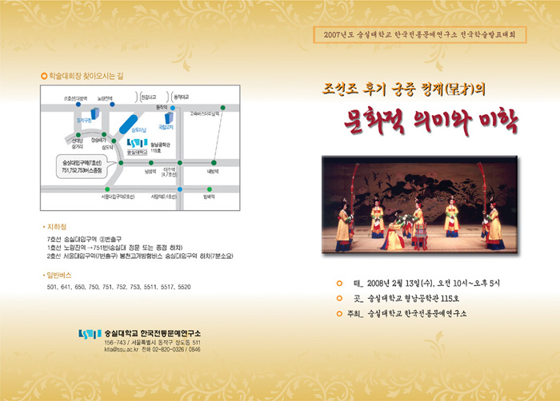
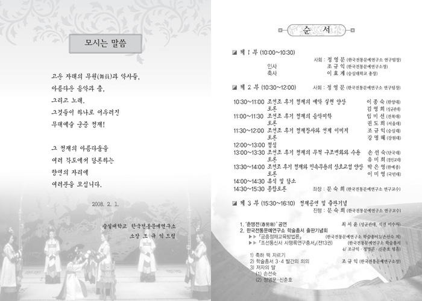
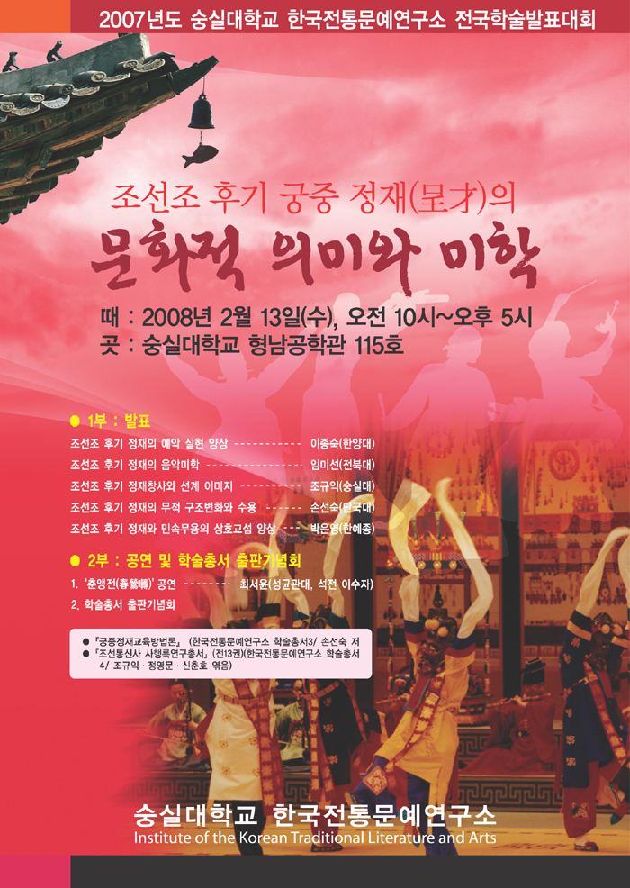

안녕하십니까?   
금번 숭실대학교 한국전통문예연구소에서는 조선조 후기 궁중 정재의 문화적 의미와 미학을 담론하는 학술발표와 공연(춘앵전)의 자리를 아래와 같이 마련했습니다.   
주지하다시피 고려와 조선왕조는 음악, 춤, 노래가 어우러진 종합무대예술을 향유했는데, 그것이 바로 정재입니다. 부디 오셔서 정재의 아름다움을 함께 느껴주시면 고맙겠습니다.   
  
주 제 : 조선조 후기 궁중정재의 문화적 의미와 미학   
때 : 2008. 2. 13.(수), 오전 10시~오후 5시   
곳 : 숭실대학교 형남공학관 115호실   
  
순서   
1부 : 개회사 및 인사, 축사   
  
2부 : 발표   
1. 조선조 후기 정재의 예악 실현 양상--이종숙(한양대)/토론 김영희(성균관대)   
2. 조선조 후기 정재의 음악미학--임미선(전북대)/토론 권도희(서울대)   
3. 조선조 후기 정재창사와 선계 이미지--조규익(숭실대/토론 강명혜(강원대)   
4. 조선조 후기 정재의 무적 구조변화와 수용--손선숙(단국대)/토론 유미희(경인교대)   
5. 조선조 후기 정재와 민속무용의 상호교섭 양상--박은영(한예종)/토론 이미영(국민대)   
  
3부 : 정재 공연 및 출판기념   
1. 춘앵전 공연--최서윤(성균관대, 석전 이수자)   
2. 한국전통문예연구소 학술총서 출판기념   
  
문의처 : 820-0830, 820-0326, 820-0846   
  
2008. 2. 4.   
  
숭실대학교 한국전통문예연구소 소장 조 규 익 아룀

  

공유하기

게시글 관리

**백규서옥\_Blog ver.**