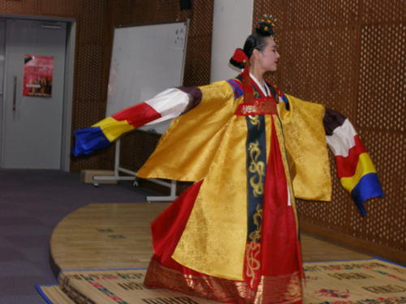
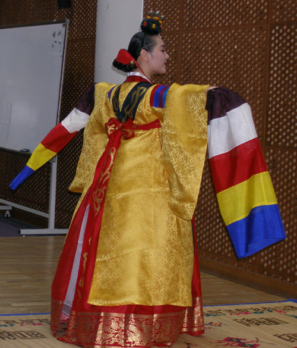

춤추는 무희여, 그대 새의 모습을 한 신선이여!  
           -춘앵전을 보고-  
  
  
  
                                                                                     조규익  
  
당나라 고종때의 일이다. 무슨 근심이 있었던지 새벽 일찍 잠자리에서 일어나 앉아 있던 황제. 밖으로부터 꾀꼬리 울음소리를 들었다. 슬며시 창을 열고 내다본즉 노란 색 꾀꼬리 한 마리가 나뭇가지에 앉아 노래를 부르고 있는 게 아닌가. 갑작스레 흥이 일어, 즉시 악공 백명달을 불렀다. ‘저 꾀꼬리의 자태를 춤과 노래로 만들어보라’는 황제의 명을 받은 그는 침식을 잊은 채 며칠을 고심했다. 마침내 ‘춘앵전(春鶯囀)’을 완성한 그는 아리따운 무희를 선정, 무복(舞服)으로 분장시킨 뒤 또 며칠을 연습시켰다. 자신이 붙은 악공은 드디어 황제 앞에 그 춤과 노래를 올렸다. 황제는 크게 만족했고, 그로부터 이 춤곡은 궁중에서 공연되었으며, 우리나라에까지 전승되었다.   
  
\*\*\*  
  
이번 숭실대학교 한국전통문예연구소의 학술발표회에서는 조선조 후기 정재에 관한 5편의 논문이 발표되었고, 춘앵전 공연도 있었다. 발표된 논문들도 쉽게 들을 수 없는 것들이었으나, 춘앵전 공연은 그날 행사의 ‘화룡점정(畵龍點睛)’ 격이었다.   
황금색 옷으로 갈아입은 무원 최서윤씨는 흡사 신선이라도 된 듯, 일렁이며 춤을 추었다. 객석에 앉은 학인(學人)들은 넋을 잃고 아름다운 춤사위에 취했다. 춤이 진행되는 10분 가까이 객석으로부턴 숨소리조차 들려오지 않았고, 가끔씩 탄성만 흘러나왔다. 그야말로 숨 막히는 아름다움이었다. ‘감동적인 아름다움’이란 바로 이런 것일까.

무아지경에 몰입한 춤꾼 최서윤씨

  
  
\*\*\*  
  
춘앵전에는 두 가지 이미지, 즉 아름다운 꾀꼬리의 그것과 가볍고 자유로운 신선의 그것이 겹쳐 있었다. 옛날부터 사람의 몸에 날개가 돋으면 신선이 된다고 믿었는데, 그 상태로 날아오르는 것을 ‘우화등선(羽化登仙)’이라 했다. 하느님의 사자로 선향(仙鄕)인 곤륜산을 오르내리던 신조(神鳥)가 봉황이었다. 고구려 고분 벽화에는 신선이 봉황이나 학을 타고 하늘을 나는 모습이 그려져 있으며, 덕흥리 고분과 무용총에도 사람의 얼굴에 새의 몸을 한 그림이 그려져 있다.  
승천(昇天)하는 존재, 혹은 자유로운 존재라는 점에서 신선과 새는 유사한 것일까. 새의 동작을 모방하여 춤사위의 상당 부분을 만들어낸 것도 새가 날개를 갖고 있기 때문일 것이다. 그리고 그 날개는 ‘날아다니는 신선’과 긴밀하게 연관된다. 날개가 있어야 복잡한 인간세상을 초탈하는 신선이 되어 신적인 권능을 행사할 수 있다고 믿었다. 오늘날 기독교의 천사와 비슷한 존재일까.   
꾀꼬리의 아름다움을 본떠 만든 춘앵전은 새의 이미지와 인간 및 선계를 성공적으로 연결시켰으니, 이 정재 30박 째의 동작인 ‘과교선(過橋仙)’은 그 핵심이다. 이것은 춘앵전 동작 가운데 압권인 이 용어를 번역하면 ‘다리를 건너는 신선’ 더 구체적으론 ‘신선이 다리를 건너듯 추는 춤사위’가 될 텐데, 무원이 좌와 우로 돌 때 마치 신선이 다리를 건너가듯 사뿐사뿐 춤을 추는 모양에서 유추된 용어가 바로 그것이다.

춤꾼 최서윤씨의 환상적인 춤사위

  
  
\*\*\*  
  
그러나 과연 이것뿐일까. 다음의 동작들은 내 눈을 어지럽게 했다.  
  
 \*새가 날개를 펴고 날듯이 빙글빙글 도는 ‘회란(廻鸞)’(8박)  
 \*날아오르듯 발을 가볍게 디디며 추는 ‘비리(飛履)’(11박)  
 \*한 층 한 층 탑에 올라가듯 세 걸음 나아가며 차츰 두 팔을 올려 드는 ‘탑탑고(塔塔高)’(15박)  
 \*원앙을 쳐서 날갯짓을 하도록 소매를 뿌려 내리는 ‘타원앙장(打鴛鴦場)’(16박)  
 \*기분 좋은 산들바람에 하늘하늘 걷는 듯 악절에 맞추어 추는 ‘사사보여의풍(傞傞步如意風)’(24박)  
 \*금모래가 날리는 것처럼 황금색 꾀꼬리가 나뭇가지를 분주하게 오락가락하듯 앞뒤로 나왔다 물러  
   갔다 하는 ‘비금사(飛金沙)’(27박)  
 \*제비가 둥지로 돌아가듯 춤추며 물러가는 ‘연귀소(燕歸巢)’(32박)  
 \*새가 아름다운 꽃 앞에서 요염한 자태를 짓듯 교태를 부리는 ‘화전태(花前態)’(18박)  
 \*꾀꼬리가 날갯짓을 하듯 소매를 들어 휘두르는 ‘요수(搖袖)’(17박)  
 \*새가 바람에 하늘거리는 꽃잎을 물려다 그만 두듯 물러서는 ‘당퇴립(當退立)’(20박)  
 \*새가 날개를 펼치려다 내리는 것처럼 소매를 살짝 나부끼는 ‘소섬수(小閃袖)’(21박)  
 \*새가 번갈아 좌우로 몸을 기울여 걷듯 하는 ‘사예거(斜曳裾)’(7박)  
 \*새가 몸을 높였다 낮추는 동작을 이어 하듯 소매를 낮추었다 높였다 하는 ‘저앙수(低昻袖)’(9박)     
 \*꾀꼬리가 날개를 펴고 뛰어 올라 흔들리는 꽃잎을 잡듯이 세 번 몸을 돌리는 ‘전화지(轉花持)’(19  
   박)  
 \*꾀꼬리가 머리를 낮추었다가 들듯 허리를 꺾었다가 다시 펴는 ‘절요이요(折腰理腰)’(10박)  
 \*꾀꼬리가 두 날개를 한일자로 폈다가 반쯤 내리고 다시 올려 뿌리듯 하는 ‘수수쌍불(垂手雙拂)’(3  
   박)  
 \*꾀꼬리가 살래살래 몸을 돌리듯 물결이 맴돌 듯 몸을 돌리며 춤을 추는 ‘회파신(廻波身)’(29박)   
  
  등등.  거의 모든 춤동작이 새의 움직임이었고, 그 바탕엔 신선이 있었다.    
  
\*\*\*  
  
무대 위의 돗자리가 치워지고 무희가 사라진 다음에야 우리는 현실계로 돌아왔고,  
그 시점으로부터 나는 황금색 꾀꼬리와 신선이 만들어낸 선계(仙界)의 환상공간을 그리워하게 되었다.   
  
아, 우리를 잡답(雜沓)의 일상으로 되돌려 보낸 무희여!   
   잔인하도록 아름다운 ‘춘앵전’의 무희여!  
  
                                  2008. 2. 13.  
  
                                       백규

공유하기

게시글 관리

**백규서옥\_Blog ver.**