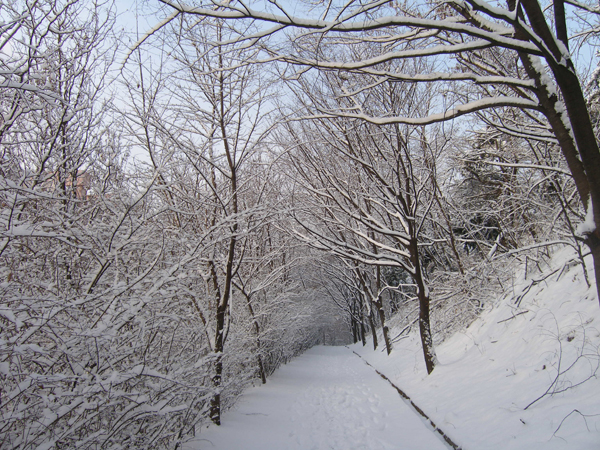
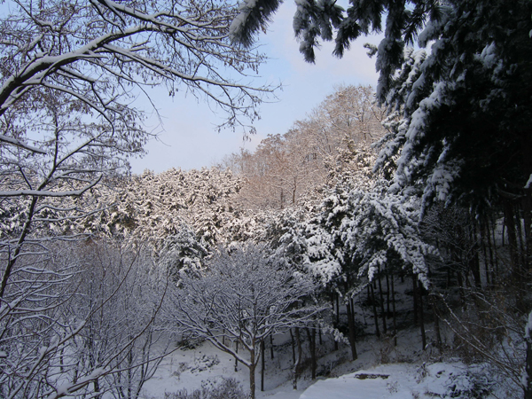
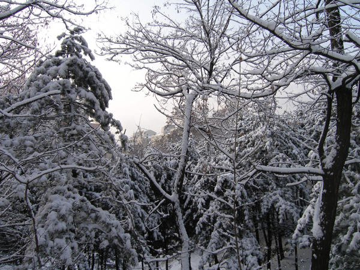
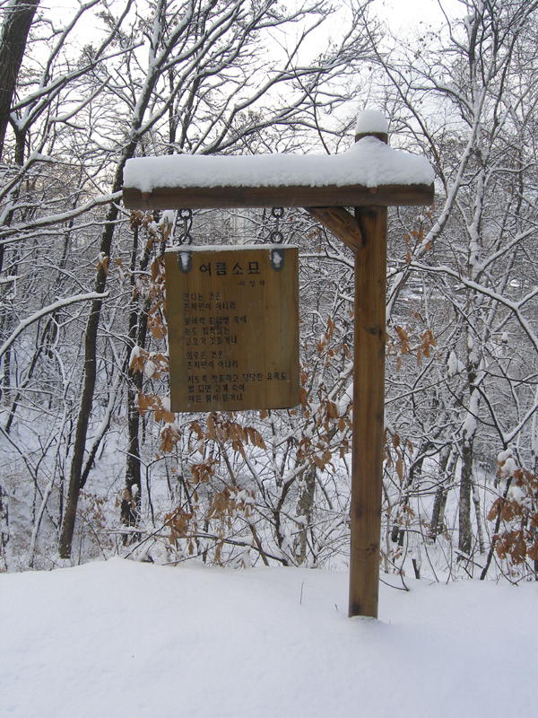
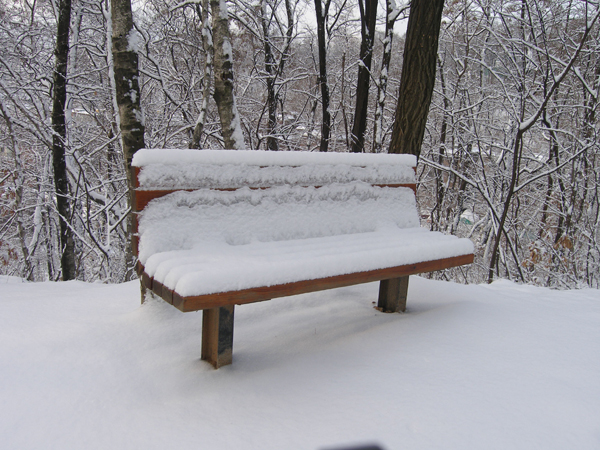
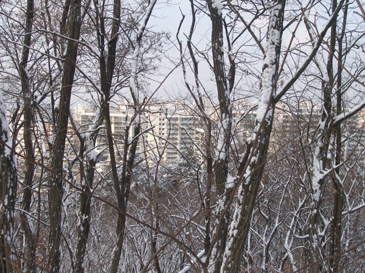
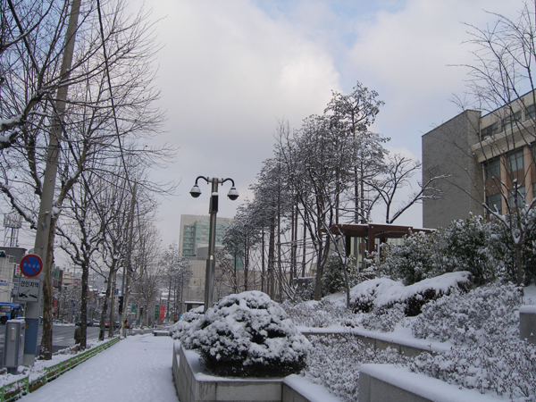

눈 내린 산길을 걸어서 출근하며

                                                          조규익

출근길의 어려움에 고통 받는 분들은 ‘미친 놈!’이라 욕하시겠지만, 밤에 눈이 내리면 못 말릴 정도로 들뜬다. 아침 일찍 아이젠에 배낭차림으로 산길을 걸어 학교로 갈 수 있기 때문이다.

저 끝에 누가 있을까

 대도시의 한 구석에 둥지를 틀고 세상의 잇속으로부터 초연하려 애써온 20년 세월. 누항(陋巷)에 살면서도 그나마 위안이 되는 건 한겨울에만 서너 번쯤 맛볼 수 있는 ‘눈길 출근’ 덕분이다. 노트북과 책을 잔뜩 우겨 넣은 배낭을 짊어지고, 등산화에 아이젠을 차고 나서면 좋게 보아 ‘산사나이’ 서운하게 보아 ‘군밤장수’다. ‘배낭 속의 물건을 많이 팔고 오라’는 아내의 농을 뒤로 하고 산길로 접어들면 별세계가 따로 없다.

아, 나무와 눈의 조화여!

 나보다 극성스런 사람들이 벌써 발자국들을 찍고 지나간 산길이지만, 봄맞이 집 단장에 열성인 까치들의 노래 소리 만큼은 내 독차지가 아닐 수 없다. 아, 4계절 지겹게도 사람들의 체취에 시달리던 나무들이 오늘은 참하게 순백의 화장을 한 채 ‘거울 앞에 선 순이’의 형상을 하고 있구나! 소담하고 정갈한 그 자태여!

고독한 눈길

\*\*\*

내 어릴 적엔 눈이 많았다. 논바닥에서 아지랑이 피어오를 때까지도 차가운 바람은 내 작은 몸 곳곳을 파고들어 안절부절 못하게 만들었다. 그러니 눈과 얼음이 우리의 눈길을 벗어나는 적이 없었던 한겨울은 어떠했겠는가. 30리 들길과 산길을 걸어야 하는 등굣길의 고통이야 말하여 무엇 하리오. 얄팍한 고무신발의 밑창은 닳아 반들거리고, 가끔은 찢어져 너덜거리기도 했다. 얼음으로 판장 박힌 길에 나서자마자 앞·뒤·옆으로 곡예를 하거나 넘어지고 구르기 일쑤. 유도의 낙법(落法)은 그 시절 자연적으로 체득한 생존법이었다.

눈들의 환성

 그러니 검은 때가 거북이 등처럼 더껑이 진 손등은 추위로 갈라져 늘 피가 비쳐 있고, 구멍 뚫린 장갑 밖으로 삐져나온 손가락들은 늘 쓰리고 아렸다. 자상하신 아버지는 발에 새끼를 둘둘 말아 ‘천연 아이젠’을 해주시곤 하셨지만, 성황당 재빽이[‘산등성이’의 충청도 사투리] 초입에서 다 벗겨지기 일쑤였다. 그러니 아이들은 구르고 자빠지며 시퍼렇게 질린 채로 요즘 아이들 ‘용평 스키장에서 미끄럼을 타듯’ 학교엘 오고 갔다. 땀과 눈에 절었다가 다시 추위에 얼어 서걱거리는 솜바지 저고리는 참으로 감당하기 어려웠다. 조개탄의 눈물 나는 열기 속에 두어 시간 수업이 지나서야 참새 같은 우리들의 몸은 녹기 시작했다. 마룻바닥은 얼음물로 흥건하고, 얼었다 녹은 손발은 간지럽기만 했다.

\*\*\*

그렇다. 그 시절 누군들 추위와 배고픔에서 자유로울 수 있었으랴. 그래서 하얀 눈은 아련한 설렘과 궁핍의 이미지로 나를 들뜨게 만드는 건 아닐까. 밤에 눈이 내리면 요즈음 젊은 사람들은 스키장 갈 생각에 잠을 못 이루겠지만, 유년기의 상처로 남은 마음의 궁핍에서 자유롭지 않은 나는 연구실에 도달하기까지 그 30분 남짓의 호사 때문에 잠을 못 이룬다. 어쩌면 음력 그믐날 밤 설빔을 안고 잠 못 이루던 그 시절의 흥분이 이랬던가, 잠시 회상해본다.

                           2008. 2. 26. 눈 내린 산길을 걸으며 백규

공유하기

게시글 관리

**백규서옥\_Blog ver.**