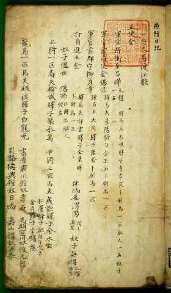
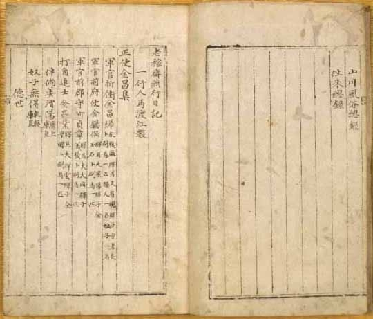
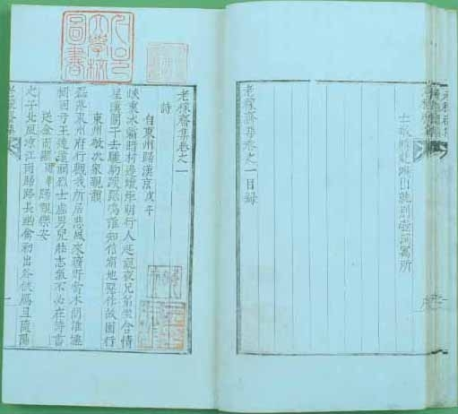

“길을 가르쳐 주는 사람 없는데, 너 홀로 내 앞에 있구나!”  
    -연행록의 교과서, 그 치밀한 해석적 시각 ; 김창업의 『노가재연행일기』  
  
54세의 ‘타각’, 연행 길에 오르다  
  
과거를 통해 벼슬길에 나아가 정적들과 머리 터지도록 싸우거나, 전야에 숨어 학문에 매진하거나. 17세기 조선의 지식인에겐 두 가지 선택지가 있었다. 둘 다 어려운 일이었지만, 벼슬길에 나아갈 수 있음에도 포기한 채 후자를 택하기란 더욱 어려운 일이었다. 쟁쟁한 노론 가문의 뛰어난 시인이자 화가이었던 노가재 김창업이 벼슬길을 버리고 세상일을 멀리한 것은 아버지 김수항이 당쟁의 와중에서 정적들에게 몰려 죽음을 당한 충격 때문이었을 것이다. 그러나 무엇보다 그를 강하게 잡아끈 것은 학문이었다. 새로운 것에 대한 탐구욕이 벼슬길로부터의 유혹을 막았다고 보는 게 타당하다. 그가 숙원이던 연행 길에 나선 것도, 방대하면서도 치밀한『연행일기』를 남긴 것도 그런 점을 입증한다. 그는 원래부터 중국의 산천을 보고 싶어 했다. 그러다가 1712년 그의 형인 창집이 ‘사은 겸 삼절연공’ 사행의 정사로 떠나게 되었고, 결국 노가재는 ‘타각’의 자격으로 연행 길에 나설 수 있었다. 54세의 적지 않은 나이였다. 타각이란 사신 일행의 모든 물건을 감수(監守)하는 직책이었다. 그 자리가 하찮다고 할 수는 없으나, 명망 있는 노론 사대부가의 노가재가 맡을만한 직책은 아니었다. ‘조롱과 비난이 일시에 일어났고 친구들은 흔히 만류했다’는 노가재의 술회도 아마 그 때문에 나왔을 것이다. 그러나 노가재에게 연행 길은 ‘새로운 것’을 찾는 길이었고, 자기 가문이 오래도록 빠져 지내던 이념의 허와 실을 확인할 수 있는 기회이기도 했다. ‘중국에 갈 수만 있으면 되었지 직책이 무슨 상관이랴!’는 것이 노가재의 생각이었을 것이다. 146일 간 북경을 다녀오면서 방대한『연행일기』와 137수의 기행 시 모음인 『연행훈지록』을 남긴 것도 중국 기행에 대한 절절한 욕구의 소산이었으리라. 19세기 중엽 동지사은사의 서장관으로 연경을 다녀와 『연원직지』를 남긴 김경선도 연행록을 남긴 선배들 가운데 노가재와 함께 담헌 홍대용, 연암 박지원 등을 꼽았다. 노가재의 연행록이 가장 이른 시기의 것이고, 후대 연행사들에게 교과서의 위치에 있었음을 말해주는 사실이다.

  
노가재의 증조부는 서인 청서파의 영수이자 척화파의 거두인 청음 김상헌이고, 부친인 김수항은 노론의 영수였다. 가계로만 본다면 노가재는 청에 대한 복수의 감정으로 가득 차 있어야 마땅한 인물이다. 그러나 그가 지니고 있던 화이관이나 소중화 의식이 한으로 맺힐 정도는 아니었다. 오히려 어떤 면에서는 냉철하리만큼 객관적인 태도로 중원의 문물을 대하고 관찰한 그였다.  
  
화이의 차별적 세계관을 바꾸어가다  
  
노가재는 십삼산의 찰원에서 장기모(張奇謨)라는 호인(胡人) 어린이를 만나 대화를 나누었다. 대화중에 다음과 같은 내용이 나온다.  
  
“너희들은 달자(㺚子)와 친교를 맺느냐?”  
“이적의 사람이 어찌 우리들 중국과 어울려 친교를 맺겠습니까?”  
“우리 고려 역시 동이(東夷)인데, 네가 우리들을 볼 때 역시 달자와 한 가지로 보느냐?”  
“귀국은 상등인이요 달자는 하류인인데, 어찌 해서 한가지이겠습니까?”  
“달자들도 머리를 깎으며 너희들도 머리를 깎는데, 무엇으로써 중국과 이적을 가리느냐?”  
“우리들은 머리를 깎지만 예가 있고, 달자는 머리도 깎고 예도 없습니다.”  
나는, “말이 이치에 맞는다. 네 나이 아직 어린데도 능히 이적과 중국의 구분을 하니, 귀하기도 하고 슬프기도 하구나! 고려는 비록 동이라고 불리고 있지만 의관문물이 모두 중국을 모방하기 때문에 ‘소중화’라는 칭호가 있다. 지금의 이 문답이 누설되면 좋지 않으니 비밀로 해야 된다.”고 했다.  
  
노가재는 내심 청국 사람들을 지목하여 ‘달자’라고 한 것인데, 아이는 그것을 몽고로 오인하여 답변한 것이었다. 이렇게 처음에 노가재는 청나라에 대한 조선의 우월감을 조심스럽게 내비쳤다. 그러나 『연행일기』의 후반으로 갈수록 청국을 이적으로 보던 관점은 약간씩 변해 간다. 자기 존재에 대한 깨달음으로부터 그런 변화는 생겨날 수 있었다. 연경에서 중국 사람들을 보며 그들과 대비되는 자신의 모습을 다음과 같이 객관화 시키게 된 것이다.   
  
이곳 사람들은 몸집이 장대하며 모양이 우뚝한 자들이 많은데, 우리나라 사람들을 둘러보니 본래 스스로 작은데다 또 먼 길의 풍진에 시달린 뒤라 세 사신을 빼고는 모두가 다 꾀죄죄하고 착용한 의관도 또한 흔히 여기에 와서 돈을 주고서 빈 것이기 때문에, 도포는 길이가 맞지 않고 사모가 눈까지 내려와 보기에 사람 같지 않으니, 더욱 한탄할 일이다.  
  
이 말은 당시 모습에 대한 사실적 묘사이겠으나, 사실 노가재의 의식 변화를 전제해야 쉽게 이해될 수 있는 내용이다. 이 점은 황궁 묘사에서도 확인된다. 태화전 앞 12향로에 침향을 태우던 관례를 없앤 데 대하여 “황제가 검소한 것을 숭상하고 비용을 아끼기 위해서인 것 같다” 거나 황궁에 대하여 “장려하고 정제함이 정말 황제의 거처다웠다” 는 등의 언급들이 그런 사례들이다.   
청나라 지식인들과 교유함으로써 노가재의 의식변화는 빨라졌다. 예컨대 젊은 학자 이원영(李元英)과의 교제는 상당 기간 지속되는데, 그런 관계를 통해 양국 지식인들이 갖고 있던 문화의식의 동질감을 확인할 수 있었다. 각종 물화의 풍부함이나 찬란함, 건축·의복·음식·기명 등과 각종 제도의 훌륭함, 도서편찬 같은 문화 사업들의 놀라움 등 그들의 실상을 접하면서 노가재는 자신의 인식을 바꾸게 되었던 것이다.   
  
만남을 통해 깨달음을 얻다  
  
그는 천산의 영안사(永安寺)에서 불승 숭혜(崇慧)를 만났다. 그와의 만남은 불교와의 만남이었고, ‘일체중생(一切衆生) 실유불성(悉有佛性)’이라는 평등의식과의 만남이었다. 헤어질 때 “사람에게 안팎은 있지만 불성은 한가집니다. 어찌 다름이 있겠습니까?”라고 던진 숭혜의 말은 노가재로 하여금 그간 굳게 지녀오던 차별의 편견을 깨고 새로운 안목을 갖게 해주었다. 그것은 용천사의 중 운생(雲生)에게 보낸 편지글 속의 “온전히 도력(道力)에 힘입어 영경(靈境)을 두루 밟았으니 구제받음의 기쁨 이루 말할 수 없습니다”는 술회에서도 나타난다. 수행하던 젊은 승려 낭연(朗然)에게 준 시 “길을 가르쳐 주는 사람 없는데/너 홀로 내 앞에 있구나/함께 용천사에서 잤으니/응당 전생의 인연 있음 알겠네”도 그런 깨달음의 기쁨을 드러낸다. 그런 깨달음의 실체야말로 인간의 본질과 참된 도리 그 자체임은 말할 필요도 없다.   
연행을 통해서 노가재는 다양한 종류의 사람들과 문물을 만났다. 달자들은 물론 시정인(市井人)들, 벼슬아치, 학자, 예술인 등 다양했다. 옥전현에 묵을 때는 선비 하나가 춘화도를 팔기 위해 찾아온 적도 있었다. 그 대목엔 춘화도에 미련과 흥미를 보이는 서장관의 모습도 나타나고, “유학을 공부하는 성문(聖門)의 제자로서 어떻게 춘화도를 품고 와서 남에게 보이시오?”라고 핀잔하는 노가재의 기개도 나타난다. 산해관을 지나면서는 반군 이자성에게 성문을 열어준 오삼계의 사실(史實)에 대한 노가재 자신의 사평(史評)을 개진했는데, 논리가 당당하고 정연하다. 오삼계가 어차피 깨질 산해관을 포기하고 황제의 원수를 갚았으니, ‘임시변통의 의리’는 지켰다고 본 것이다. 그러나 아깝게도 명나라의 왕실을 세우지 못하여 천하 사람들의 소망을 저버렸고, 스스로 왕을 참칭하다가 끝내 패망했으니, 그는 이름을 망치고 절의도 잃었다고 비판했다. 이구동성으로 오삼계의 모든 행적을 비판하는 역사서들에 대한 노가재의 반론은 조선 선비의 균형 잡힌 혜안을 보여주었다는 점에서 걸출하다.   
연경에 다녀오기까지 걸린 기간은 146일, 총 거리는 6천 28리인데, 연경에서 출입하거나 길에서 돌아다닌 것이 6백 75리이며, 시문(詩文) 402편을 얻었다고 노가재 스스로 『연행일기』의 말미에서 밝혔다. 그는 왜 그곳에 가려 했으며, 책의 말미에 돌아다닌 거리와 얻은 시문을 특별히 들어 놓았을까. 중국에 가기 전 노가재는 중국에 관한 서책들을 많이 읽었을 것이다. 그러나 그것으로 만족할 수 없었다. 오랑캐의 차지가 되긴 했지만, 중국은 세계 그 자체 혹은 세계를 만나는 창이었다. 어쩌면 그는 오랑캐도 사람임을 확인하고 싶었던 것이나 아닐까. 증조부가 청나라에 적극 대항하던 김상헌이었고, 부친 역시 청국을 이적시하던 노론의 영수였다. 노가재는 분명 그런 가문의 이념으로부터 벗어나 세계를 객관적으로 파악하고 싶었을 것이다. 그게 지식인의 본령이니, 노가재는 그 본령에 충실하고자 했을 따름이었다. 거기서 한 발 더 나아가 노가재 스스로 변화의 기미를 준비하던 17세기 조선 지식사회의 대표로 자리매김 될 만한 단서가 바로 이 책에 드러나 있는 것이다.

공유하기

게시글 관리

**백규서옥\_Blog ver.**