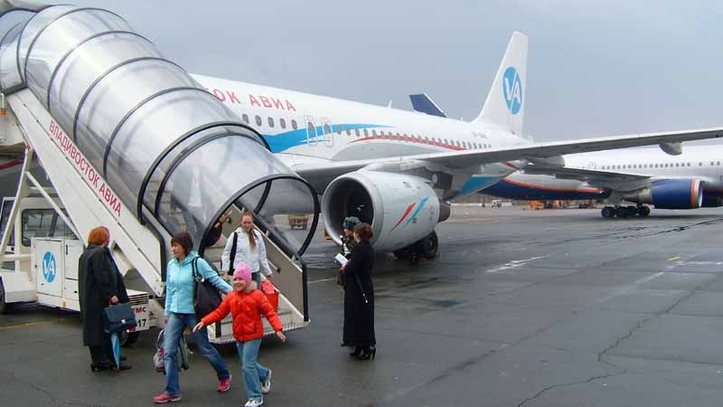
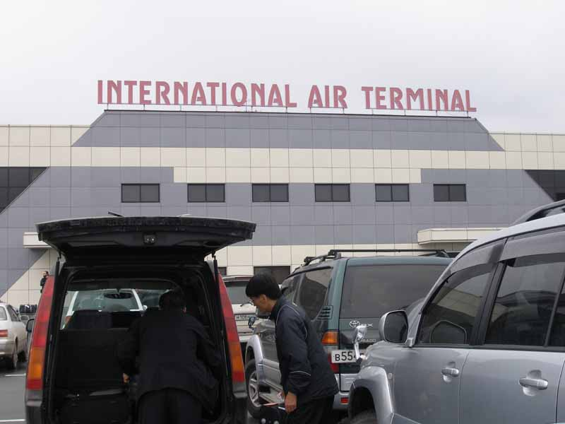
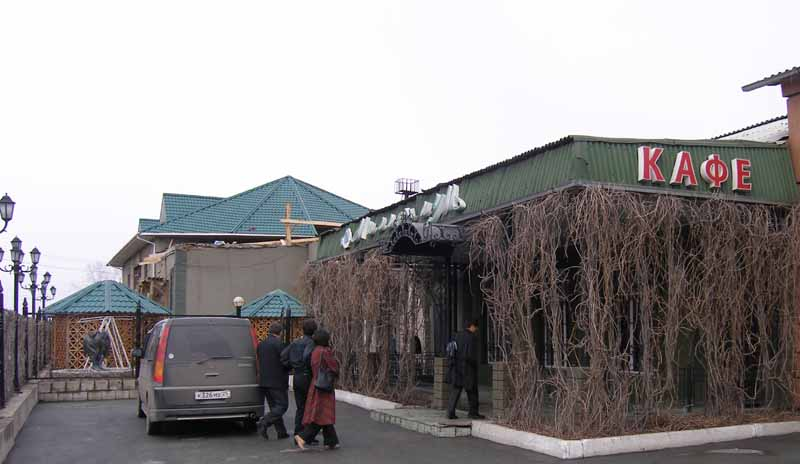
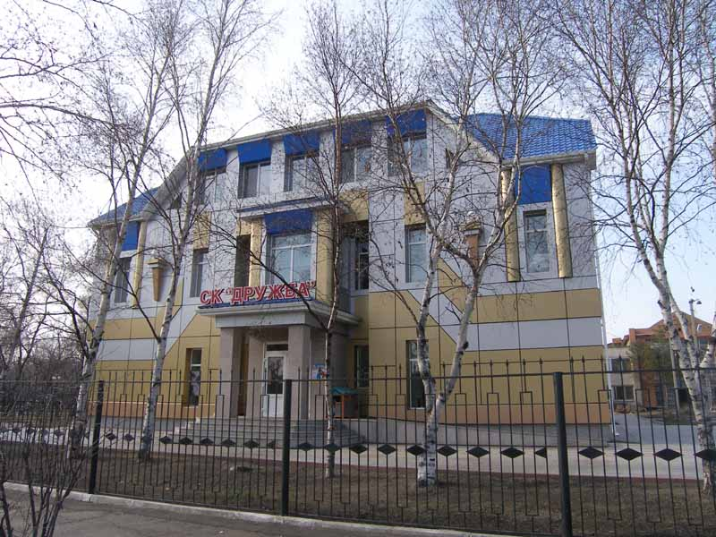
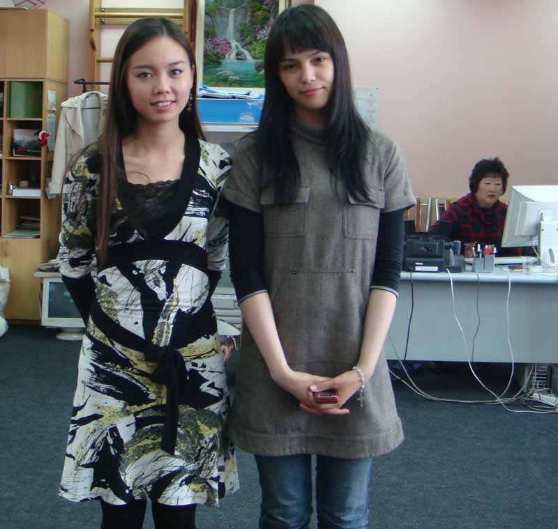
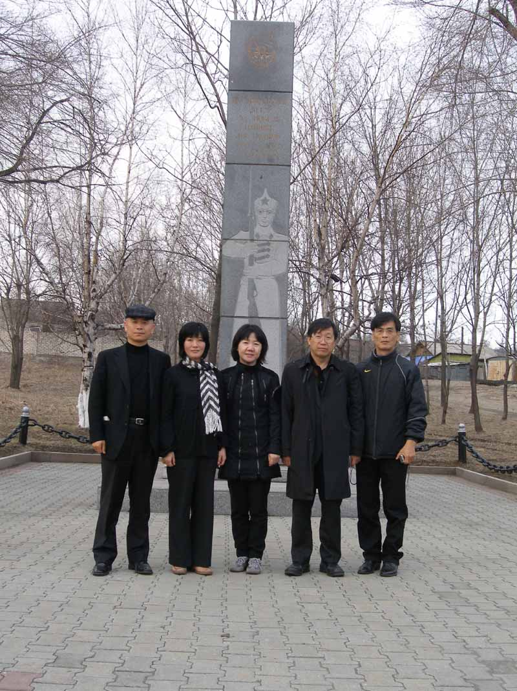
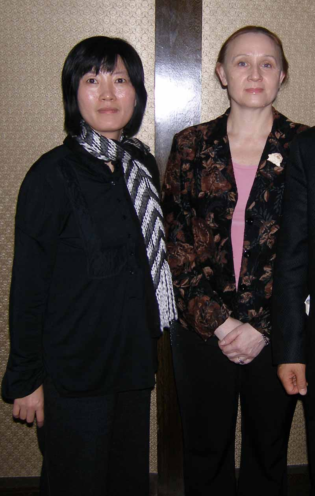
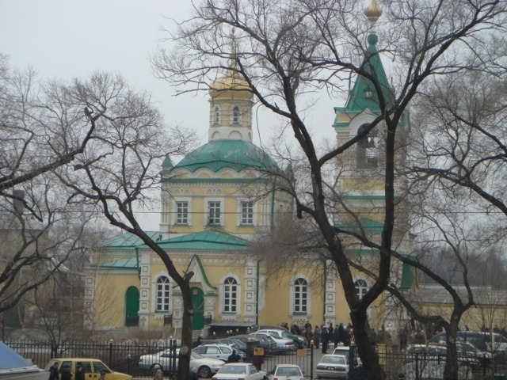

러시아 기행1

회색빛 알쫌공항과 자작나무의 기품

                                                                                                                       조규익

2008년 4월 3일, 인천공항 42번 게이트. 역사적인(?) 러시아 기행에 나서며 차분함과 설렘이 교차했다. 마피아의 천국, 악마처럼 생각되던 맑스․레닌주의의 원조, 매서운 시베리아의 눈보라, 마음까지 얼어붙게 만드는 툰드라의 혹한... 그간 멀게만 느껴지던 러시아였다. ‘그런 곳에 언제 가볼 것이며 꼭 가볼 필요까지야 있으랴?’라는 게 평소 내 생각이었다.

 <알쫌 공항에서 내리고 있는 승객들>  
  
그러다가 블라디보스톡을 중심으로 한 연해주가 선조들이 피를 흘려가며 항일투쟁을 벌인,  ‘성지(聖地)’라는 사실을 깨달은 건 최근이었다. 1920년 4월 4일의 참변은 우리 역사의 상처였다. 그러나 정작 우리는 한반도의 영역 안에서 일어난 일들만 열심히들 토론하고 써내는 중이다. 블라디보스톡에서, 우스리스크에서, 사할린에서, 빨치산스크에서, 하바로프스크에서 추위와 냉대를 무릅쓰고 조국의 광복을 위해 죽어간 우리의 이름 없는 선조들을 애써 외면해온 것은 아닐까. 4월 참변의 추모제와 국제학술대회의 한 축을 우리 숭실대학교 한국문예연구소가 담당키로 한 일은 그런 점에서 의미심장한 일이었다.

\*\*\*

찬바람은 가슴을 파고들지만, 벚꽃들이 망울을 터뜨리려 하고 있으니, 계절은 봄의 문턱을 넘어선 셈이었다. 해맑게 갠 하늘로 치솟아 오르는 러시아 투폴레프 비행기의 움직임은 무표정한 승무원들과 러시아인들의 표정과 달리 산뜻하고 날렵했다. 두 시간 가까이 날아간 ‘인천-블라디보스톡’ 구간. 기내식이라고 주어지는 음식은 오늘날 러시아의 진면목을 보여주었다. 두 시간 남짓의 만남 동안 단 한 조각의 웃음조차 보여주지 않던 승무원들의 표정처럼 차갑고 딱딱한 빵엔 이빨자국조차 낼 수 없었다. 그야말로 무성의의 표본이랄까.

 하늘에서 시곗바늘을 두 시간 앞당긴 뒤 도착한 알쫌은 비에 젖어 있었다. 우리의 일거수  일투족을 감시하는, 인형처럼 굳은 제복 차림의 여군. 그녀의 눈매는 매우 날카로웠다. 저만치 초라하게 서 있는 북한의 고려항공을 ‘도둑촬영’하고자 몇 번이나 망설였으나 그녀들은 바늘 끝만큼의 기회조차 허용치 않았다. 그녀들의 차가운 아름다움을 ‘도촬’하려던 곽원석 선생도 몇 번이나 시도하다가 그만두었다. 짐을 찾고 세관을 통과하기도 쉽지 않았다. 그들 앞에 우리는 손님 아닌 죄인들이었다. 흡사 잡아온 죄인들을 심문하듯 날카롭고 의심에 찬 물음들을 툭툭 던지는 그들이 고약했다. 알량한 우리의 호주머니를 털려는 것이었을까.

<알쫌 공항에서 현지 안내인 발렌찐-발레리아의 차에 짐을 싣고 있는 곽원석박사>  
  
 가까스로 알쫌 공항을 나선 우리들은 발렌틴 선생의 차에 올라 블라디보스톡으로 향했다. 석탄 타는 냄새가 아지랑이처럼 깔려 있고, 하늘은 우중충했다. 주변은 황량하고 집들은 대

체로 윤기를 잃은 채 이른 봄의 차가운 바람에 떨고 있었다. 우리의 눈길을 끄는 것은 단 하나. 황량함을 다소 지워주는 자작나무의 수해(樹海)였다. 독일을 거쳐 넘어간 체코의 산들에서도, 크로아티아의 산록에서도 우리는 하얗게 서 있는 자작나무의 숨결을 체험한 적이 있었다. 어쩌면 이 자작나무의 물결도 동유럽의 그 지역에서 시작되었고, 동토의 땅 시베리아를 거쳐 이곳 동방까지 밀려 왔으리라.   

\*\*\*

교통사고로 막혀버린 울퉁불퉁한 외길. 블라디보스톡까지는 1시간 40분이 소요되는데, 4시로 예정된 총영사와의 약속시간을 기약할 수 없었다. 하는 수 없이 들른 곳이 길 가의 러시아 식당 ‘밀레니엄’이었다. 한 방엔 수십 개의 식탁들이 놓여 있었고, 음악에 맞추어 무도를 즐길 수 있는 또 다른 공간도 있었다. 러시아와 중국 음식을 섞어놓은 듯한 서너 가지 요리로 시장기를 지운 다음 블라디보스톡 행을 포기하고, 길을 돌아 우수리스크로 향했다. 그 길 또한 자작나무의 수해를 뚫고 나 있었다. 산록 곳곳엔 러시아인들의 별장인 ‘다차’\*들이 모여 각박함 속에서 여유를 구가하던 그들의 과거와 현재를 보여주고 있었다.

<알쫌에서 우수리스크 가는 길에 점심을 먹기 위해 들른 식당 밀레니엄>   
\*\*\*

꿈의 우수리스크. 인구 7, 80만의 블라디보스톡보다는 작지만 우리 고려인들이 오래 전부터 둥지를 틀고 있는, 고향 같은 곳이다. 마침 햇살이 비쳐 들었다. 거리는 한산했으나, 정겹고 따스했다. 제정 러시아 시대 최고급 호텔이었고, 지금도 그 명성을 유지하고 있는 우수리스크 호텔. 시설은 열악했으나 마룻바닥을 걸으니 울리는 구두소리가 정겨웠다.

 우리를 이곳까지 픽업해준 발렌틴 선생의 안내로 그의 부인 발레리아 선생, 그들의 딸 악사나, 고려신문 편집장 엘레나를 고려인 민족문화자치회 사무실에서 만났다. ‘드루즈바(우정)’란 이름의 건물로서 자치회 회장인 김니꼴라이 선생의 소유였다. 이들과 우리 5인(반병률  교수, 김보희 박사, 곽원석 박사, 엄경희 교수, 나)과 이들의 협의 아래 추모행사와 학술행사의 모든 순서는 구체적인 모습을 드러내게 되었다.

 <우수리스크 고려인 민족문화자치회 건물>  
  

<고려인 민족문화자치회 건물 안의 고려신문사에서. 왼쪽은 편집장 엘레나, 오른쪽은 유망한 대중연예인 지망생 악사나>  
  

<4월참변 추모비에서. 왼쪽부터 조규익, 엄경희, 김보희, 반병률, 곽원석>  
  
석양 무렵 꼬마로바 1번지 근처에 세워진 4월 참변 추모비를 찾아, 추모식의 규모와 순서를 확정한 다음, ‘일출’ 식당에서 학술행사의 러시아측 파트너인 우수리스크 사범대학 린샤 교수를 만났다. 우수리스크 호텔의 침대에 피로가 솜처럼 젖은 몸을 누인 것은 밤늦은 시각. 아직도 피워보지 못한 고려인들의 꿈이 안타까운 순간순간이었다. 아, 우수리스크의 밤이여!   
  

<식당에서 식사를 마치고. 엄경희 교수와 린샤 교수>  
  

<우수리스크 러시아 정교회당>

-------

\*구소련 시대부터 도시인들에게 교외의 땅을 불하해 주어 집을 짓고 야채 등을 자경(自耕)하여 자급자족하게 했었는데, 그럴 목적으로 지은 일종의 별장이 바로 다차다.

공유하기

게시글 관리

**백규서옥\_Blog ver.**