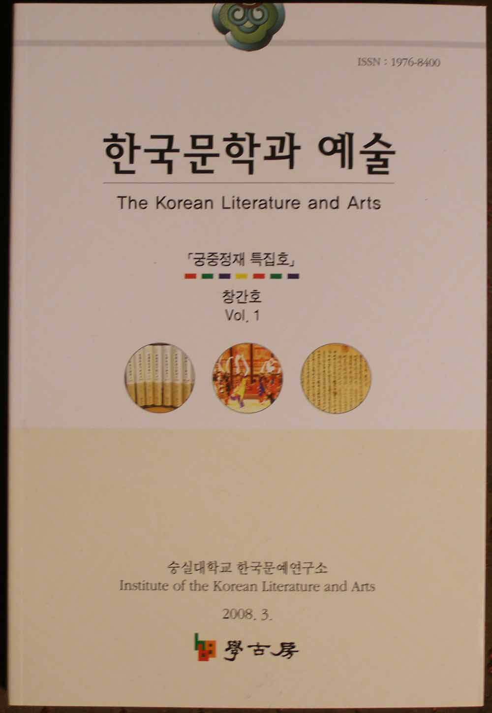

『한국문학과 예술』창간호 발간

한국문예연구소(소장 조규익 교수)에서 학술저널『한국문학과 예술 The Korean Literature and Arts』창간호를 펴냈다. 앞으로 매 3월 말과 9월 말 등 연 2회 발행, 시판된다. ‘궁중정재 특집호’로 나온 이번 호는 조선조 궁중정재에 관한 5편의 논문들과 궁중정재 사진자료, 7편의 서평이 실려 있다. 구체적인 내용은 다음과 같다.

<논문>

 1. 조규익, 궁중정재의 선계 이미지, 그 지속과 변이의 양상

 2. 박은영, 조선 후기 궁중·교방정재 및 민속무용의 상호교섭과 변모양상

 3. 임미선, 조선 후기 정재의 음악

 4. 이종숙, 조선시대 예악 정재의 현대 용어 재고

 5. 손선숙, 조선조 후기 정재의 무적 구조변화와 수용-오양선의 상대·상배를 중심으로

<자료>

 궁중정재 사진 및 설명-손선숙

<서평>

 1. 김현미, 숭실대학교 연행록연구총서(전 10권) 간행 2년에 부쳐

 2. 백로라, ‘쟁점’을 통해 바라본 한국 현대 연극사-김성희, 『한국 현대극의 형성과 쟁

           점』

 3. 이흥구, 조선시대 궁중 공연예술인 정재의 교육방법을 개발한 학술 연구서-손선숙,

          『궁중정재 교육방법론』

 4. 한창훈, 삶과 노래의 관련 양상을 찾아서-이성훈, 『해녀의 삶과 그 노래』

 5. 권혁래, 한국무협소설의 역사와 정체성을 밝히기 위한 탐색-이진원, 『한국무협소설

           사』

 6. 구지현, 홍대용의 중국을 읽고 중국을 읽게 하기까지-정훈식,『홍대용의 글쓰기 방식과

           중국인식』

 7. 허명숙, 1990년대 별자리 그리기-김연수, 『네가 누구든 얼마나 외롭든』

  <휘보>

  <논문투고 규정>

  <원고집필 요령>

  <한국문예연구소 조직>

                                                          학고방 간행, 20000원

공유하기

게시글 관리

**백규서옥\_Blog ver.**