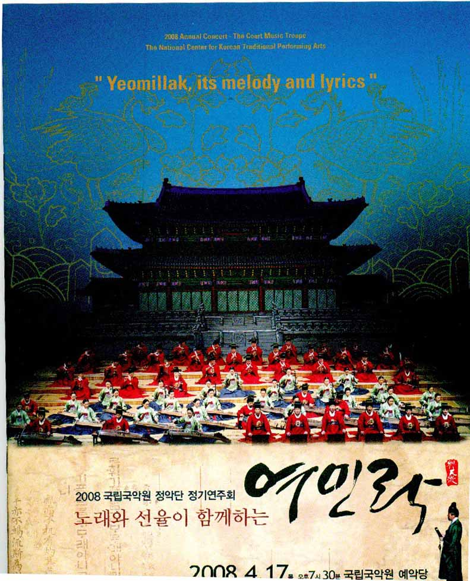
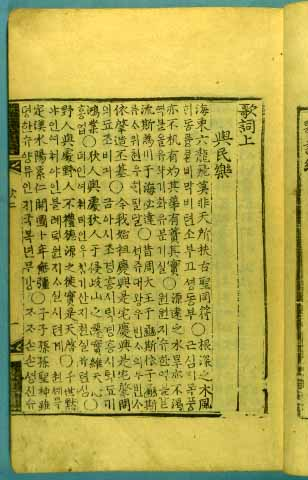
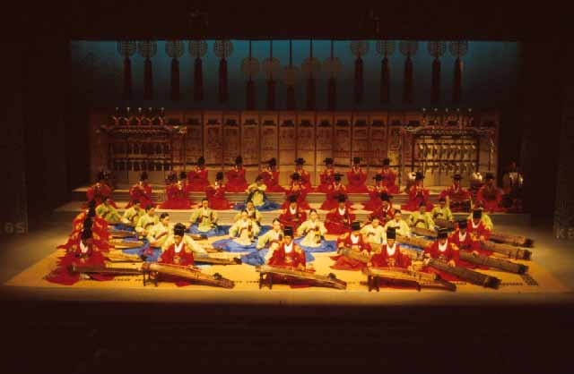
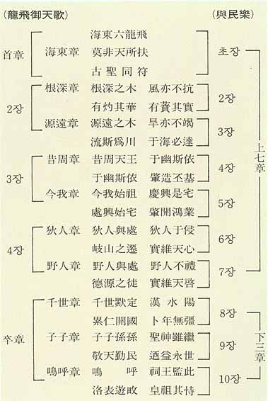

\*이 글은 "2008 국립국악원 정악단 정기연주회 - 노래와 선율이 함께 하는 여민락"(2008. 4. 17.)에 실려 있습니다.   

       <여민락 공연 팜플렛>  
  
왜 지금 ‘여민락’을 말해야 하는가

                                                                조규익(숭실대 교수)

아부하는 사람들을 보며 ‘<용비어천가> 읊지 말라’고 핏대를 올리는 지식인들이 의외로 많다. 정도 이상으로 대통령을 추어올리는 언론의 논조에도 ‘노비어천가’를 부른다거나 ‘명비어천가’를 읊는다고 비난한다. <용비어천가>를 한 번도 읽어보지 못한 사람들일수록 그것을 ‘아부성 발언’으로 폄하하는 데 용감하다. 철학과 경륜을 갖추었던 한 시대의 지성들이 왕도정치와 이상국 건설의 꿈을 담아 만든 <용비어천가>가 500여년 후의 무식한 자손들로부터 이렇게 몹쓸 희롱을 당하는 현실이다.

세종대왕의 주도로 만들어진 향악정재 ‘봉래의’에서 전인자와 진구호 다음으로 나오는 것이 ‘여민락’이고, 그 음악에 올려 부른 가사가 바로 <용비어천가>(1·2·3·4·125장)다. ‘백성들과 즐거움을 함께 하겠다’는 것이 그 음악의 취지이고, 그것을 정재의 앞부분에 배치했으니, 임금의 뜻이 어디에 있었는지 알만하다. ‘애민(愛民)’이야말로 치자가 명심해야 할 첫 덕목임을 세종대왕은 강조하려 했을 것이다.

                               <악장가사의 여민락 부분>

조선왕조의 근원이 깊고 멀다는 것, 왕 되는 자들이 마땅히 해야 할 일과 해서는 안 될 일을 분별해야 한다는 것, 하늘을 공경하고 백성을 사랑해야 나라를 영원히 보전할 수 있다는 것 등이 <용비어천가>의 내용적 줄기다. 물론 6조(목조·익조·도조·환조·태조·태종)의 사적이 지나치게 과장되었다는 지적을 하는 이들도 있다. 그러나 그것은 <용비어천가>의 핵심인 ‘물망장(勿忘章)’(110~124장)과 ‘졸장(卒章)’(125장)의 의미를 부각시키기 위한 수사적 장치일 뿐이다. 초등학생일지라도 그런 내용을 가지고 ‘<용비어천가>=아부성 발언’이라는 판단을 내리지는 않는다.

“주거를 호화롭게 하지 말라, 좋은 음식을 탐하지 말라, 형벌을 마음대로 하지 말라, 백성들의 고통을 잊지 말라, 아부하는 간신들을 멀리 하라, 백성들의 언로를 막지 말라, 세금을 공평하게 거두어 나라의 근본을 다져라, 바른말 하는 신하를 중시하라, 학자들을 가까이 하고 소인을 멀리 하라, 하늘을 공경하고 백성을 사랑하라...”

왕조 초반에 최고의 지성들을 모아 이런 금언(金言)을 만들고, 음악과 춤이 어우러진 종합예술의 무대에 올려 공연하게 함으로써 ‘군-신-민’이 함께 그 뜻을 새기도록 한 일을 동서고금의 어느 역사에서 찾아볼 수 있는가. 한 번이라도 마음의 눈을 크게 뜨고 읽어 보면 그것이 임금을 위한 수신 교과서나 지배계층을 겨냥한 정치학 교과서일지언정 아부의 언사가 결코 아니라는 것쯤은 누구나 알 수 있지 않겠는가.

      <여민락을 연주하는 모습>

         \*\*\*

정치인이나 공무원은 국민을 위한 공복(公僕)임에도 지금껏 그들은 국민 위에 군림해 왔다. 최근 대통령이 공석에서 ‘머슴론’을 통해 땅에 떨어진 이도(吏道)를 질타한 일도 <용비어천가>의 핵심적인 내용과 맥을 함께 한다. 예나 지금이나 정치의 요체는 ‘국태민안’이다. 국가를 태평하게 유지하고 백성을 편안하게 만드는 것. 그게 바로 이상정치의 알파요 오메가다. 풍족한 의식주와 든든한 국방, 반듯한 사회기강 속에서 백성들은 편안함을 느낀다. 권력과 부를 얻고자 아부의 수단으로 만든 것이 <용비어천가>는 아니다.

고금의 역사로부터 시대를 꿰뚫는 통찰력을 얻은 지성인들. 그들은 <용비어천가>로 중국과 우리나라의 역대 왕조가 어떻게 흥망성쇠의 과정을 거쳐 왔는가를 되새겨보고자 했다. 힘겹게 창업한 조선왕조가 영속되기 위해 해야 할 일들이 무엇인지 그들은 알고 있었다. 최고 통치자인 왕들이 나태를 벗어나 백성을 위하는 일에 매진해야 왕조는 망하지 않는다고 그들은 믿었던 것이다. 그들은 후대의 왕들을 대상으로 ‘잊지 말아야 할’ 금언들을 들어놓음으로써 모든 공직자들까지 깨우친, 이른바 1석2조의 효과를 얻은 셈이었다.

                        <여민락 가사의 짜임>

‘임금이 하늘인 시대’였음에도 그들은 국태민안의 요체가 ‘경천근민(敬天勤民)’ 즉 하늘을 공경하고 백성을 사랑해야 하는 일임을 감히 왕에게 강조한 그들이었다. 대통령이든 관료이든 민심이 천심임을 망각하고 자신의 소리(小利)만 취할 때 나라가 망한다는 것은 500년 전이나 지금이나 다를 바 없다. 국민의 공복임을 잊고 있는 관료집단이 나라의 운명을 좌우하고 있는 지금이야말로 <용비어천가>를 끊임없이 부르고 들어야 하는 시대다. 국립국악원이 ‘여민락’을 창조적으로 재현하고자 한 일이 참으로 시의적절한 것도 바로 그 때문이다.

공유하기

게시글 관리

**백규서옥\_Blog ver.**