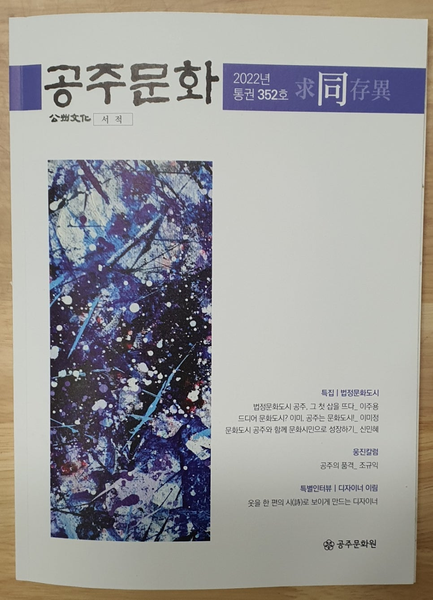
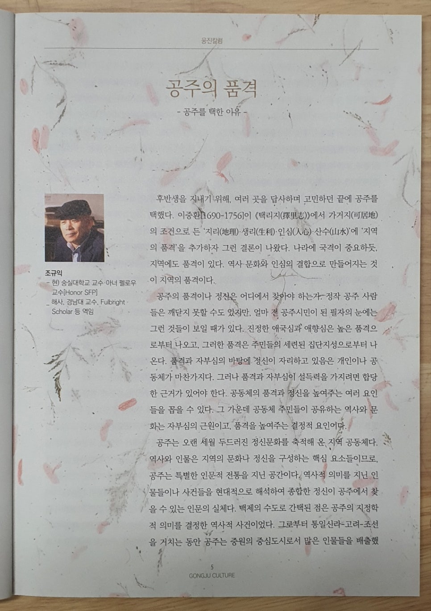
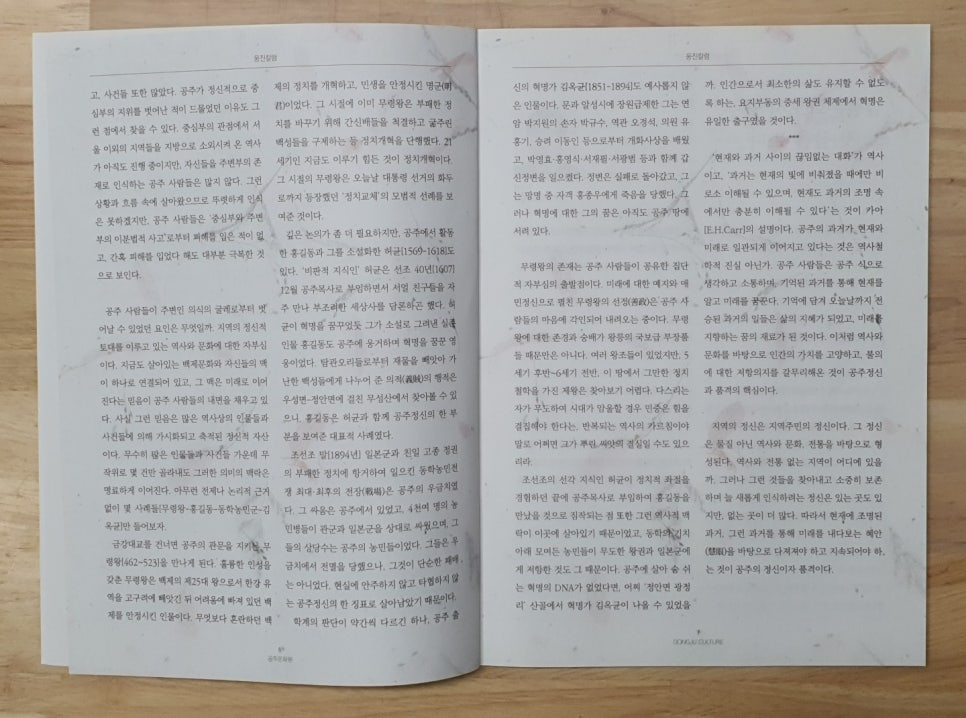

<웅진칼럼>

공주의 품격

-공주를 택한 이유-

​

​

#조규익(숭실대 교수)

후반생을 지내기 위해, 여러 곳을 답사하며 고민하던 끝에 #공주를 택했다. #이중환[1690-1756]이 <<택리지(擇里志)>>에서 가거지(可居地)의 조건으로 든 ‘지리(地理)・생리(生利)・인심(人心)・산수(山水)’에 ‘지역의 품격’을 추가하자 그런 결론이 나왔다. 나라에 국격이 중요하듯, 지역에도 #품격이 있다. 역사・문화와 인심의 결합으로 만들어지는 것이 지역의 품격이다.

공주의 품격이나 정신은 어디에서 찾아야 하는가. 정작 공주 사람들은 깨닫지 못할 수도 있지만, 얼마 전 공주시민이 된 필자의 눈에는 그런 것들이 보일 때가 있다. 진정한 애국심과 애향심은 높은 품격으로부터 나오고, 그러한 품격은 주민들의 세련된 집단지성으로부터 나온다. 품격과 자부심의 바탕에 정신이 자리하고 있음은 개인이나 공동체가 마찬가지다. 그러나 품격과 자부심이 설득력을 가지려면 합당한 근거가 있어야 한다. 공동체의 품격과 정신을 높여주는 여러 요인들을 꼽을 수 있다. 그 가운데 공동체 주민들이 공유하는 역사와 문화는 자부심의 근원이고, 품격을 높여주는 결정적 요인이다.

공주는 오랜 세월 두드러진 정신문화를 축적해 온 지역 공동체다. 역사와 인물은 지역의 문화나 정신을 구성하는 핵심 요소들이므로, 공주는 특별한 인문적 전통을 지닌 공간이다. 역사적 의미를 지닌 인물들이나 사건들을 현대적으로 해석하여 종합한 정신이 공주에서 찾을 수 있는 인문의 실체다. #백제의 수도로 간택된 점은 공주의 지정학적 의미를 결정한 역사적 사건이었다. 그로부터 통일신라-고려-조선을 거치는 동안 공주는 중원의 중심도시로서 많은 인물들을 배출했고, 사건들 또한 많았다. 공주가 정신적으로 중심부의 지위를 벗어난 적이 드물었던 이유도 그런 점에서 찾을 수 있다. 중심부의 관점에서 서울 이외의 지역들을 지방으로 소외시켜 온 역사가 아직도 진행 중이지만, 자신들을 주변부의 존재로 인식하는 공주 사람들은 많지 않다. 그런 상황과 흐름 속에 살아왔으므로 뚜렷하게 인식은 못하겠지만, 공주 사람들은 ‘#중심부와 #주변부의 이분법적 사고’로부터 피해를 입은 적이 없고, 간혹 피해를 입었다 해도 대부분 극복한 것으로 보인다.

공주 사람들이 주변인 의식의 굴레로부터 벗어날 수 있었던 요인은 무엇일까. 지역의 정신적 토대를 이루고 있는 역사와 문화에 대한 자부심이다. 지금도 살아있는 백제문화와 자신들의 맥이 하나로 연결되어 있고, 그 맥은 미래로 이어진다는 믿음이 공주 사람들의 내면을 채우고 있다. 사실 그런 믿음은 많은 역사상의 인물들과 사건들에 의해 가시화되고 축적된 정신적 자산이다. 무수히 많은 인물들과 사건들 가운데 무작위로 몇 건만 골라내도 그러한 의미의 맥락은 명료하게 이어진다. 아무런 전제나 논리적 근거 없이 몇 사례들[무령왕-홍길동-동학농민군-김옥균]만 들어보자.

금강대교를 건너면 공주의 관문을 지키는 #무령왕[462~523]을 만나게 된다. 훌륭한 인성을 갖춘 무령왕은 백제의 제25대 왕으로서 한강 유역을 고구려에 빼앗긴 뒤 어려움에 빠져 있던 백제를 안정시킨 인물이다. 무엇보다 혼란하던 백제의 정치를 개혁하고, 민생을 안정시킨 명군(明君)이었다. 그 시절에 이미 무령왕은 부패한 정치를 바꾸기 위해 간신배들을 척결하고 굶주린 백성들을 구제하는 등 정치개혁을 단행했다. 21세기인 지금도 이루기 힘든 것이 정치개혁이다. 그 시절의 무령왕은 오늘날 대통령 선거의 화두로까지 등장했던 #‘정치교체’의 모범적 선례를 보여준 것이다.

깊은 논의가 좀 더 필요하지만, 공주에서 활동한 #홍길동과 그를 소설화한 #허균[1569-1618]도 있다. ‘비판적 지식인’ 허균은 선조 40년[1607] 12월 공주목사로 부임하면서 서얼 친구들을 자주 만나 부조리한 세상사를 담론하곤 했다. 허균이 혁명을 꿈꾸었듯 그가 소설로 그려낸 실존인물 홍길동도 공주에 웅거하며 혁명을 꿈꾼 영웅이었다. 탐관오리들로부터 재물을 빼앗아 가난한 백성들에게 나누어 준 의적(義賊)의 행적은 우성면-#정안면에 걸친 무성산에서 찾아볼 수 있으니, 홍길동은 허균과 함께 공주정신의 한 부분을 보여준 대표적 사례였다.

조선조 말[1894년] 일본군과 친일 고종 정권의 부패한 정치에 항거하여 일으킨 동학농민전쟁 최대・최후의 전장(戰場)은 공주의 #우금치였다. 그 싸움은 공주에서 있었고, 4천여 명의 농민병들이 관군과 일본군을 상대로 싸웠으며, 그들의 상당수는 공주의 농민들이었다. 그들은 우금치에서 전멸을 당했으나, 그것이 단순히 패배만은 아니었다. 현실에 안주하지 않고 타협하지 않는 공주정신의 한 징표로 살아남았기 때문이다.

학계의 판단이 약간씩 다르긴 하나, 공주 출신의 혁명가 #김옥균[1851-1894]도 예사롭지 않은 인물이다. 문과 알성시에 장원급제한 그는 연암 #박지원의 손자 박규수, 역관 오경석, 의원 유홍기, 승려 이동인 등으로부터 개화사상을 배웠고, 박영효・홍영식・서재필・서광범 등과 함께 갑신정변을 일으켰다. 정변은 실패로 돌아갔고, 그는 망명 중 자객 홍종우에게 죽음을 당했다. 그러나 혁명에 대한 그의 꿈은 아직도 공주 땅에 서려 있다.

무령왕의 존재는 공주인들이 공유한 집단적 자부심의 출발점이다. 미래에 대한 예지와 애민정신으로 펼친 무령왕의 선정(善政)은 공주인들의 마음에 각인되어 내려오는 중이다. 무령왕에 대한 존경과 숭배가 왕릉의 국보급 부장품들 때문만은 아니다. 여러 왕조들이 있었지만, 5세기 후반~6세기 전반, 이 땅에서 그만한 정치철학을 가진 제왕은 찾아보기 어렵다. 다스리는 자가 무도하여 시대가 암울할 경우 민중은 힘을 결집해야 한다는, 반복되는 역사의 가르침이야말로 어쩌면 그가 뿌린 씨앗의 결실일 수도 있으리라.

조선조의 선각 지식인 허균이 정치적 좌절을 경험하던 끝에 공주목사로 부임하여 홍길동을 만났을 것으로 짐작되는 점 또한 그런 역사적 맥락이 이곳에 살아있기 때문이었고, 동학의 기치 아래 모여든 농민들이 무도한 왕권과 일본군에게 저항한 것도 그 때문이다. 공주에 살아 숨 쉬는 혁명의 DNA가 없었다면, 어찌 ‘정안면 광정리’ 산골에서 혁명가 김옥균이 나올 수 있었을까. 인간으로서 최소한의 삶도 유지할 수 없도록 하는, 요지부동의 중세 왕권 체제에서 혁명은 유일한 출구였을 것이다.

\*\*\*

‘현재와 과거 사이의 끊임없는 대화’가 역사이고, ‘과거는 현재의 빛에 비춰졌을 때에만 비로소 이해될 수 있으며, 현재도 과거의 조명 속에서만 충분히 이해될 수 있다’는 것이 #카아[E.H.Carr]의 설명이다. 공주의 과거가 현재와 미래로 일관되게 이어지고 있다는 것은 역사철학적 진실 아닌가. 공주 사람들은 공주 식으로 생각하고 소통하며, 기억된 과거를 통해 현재를 알고 미래를 꿈꾼다. 기억에 담겨 오늘날까지 전승된 과거의 일들은 삶의 지혜가 되었고, 미래를 지향하는 꿈의 재료가 된 것이다. 이처럼 역사와 문화를 바탕으로 인간의 가치를 고양하고, 불의에 대한 저항의지를 갈무리해온 것이 #공주정신과 품격의 핵심이다.

지역의 정신은 지역주민의 정신이다. 그 정신은 물질 아닌 역사와 문화, 전통을 바탕으로 형성된다. 역사와 전통 없는 지역이 어디에 있을까. 그러나 그런 것들을 찾아내고 소중히 보존하며 늘 새롭게 인식하려는 정신은 있는 곳도 있지만, 없는 곳이 더 많다. 따라서 현재에 조명된 과거, 그런 과거를 통해 미래를 내다보는 혜안(慧眼)을 바탕으로 다져져야 하고 지속되어야 하는 것이 공주의 정신이자 품격이다.♣

​

