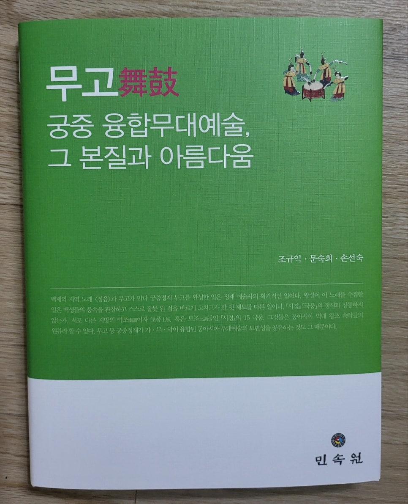
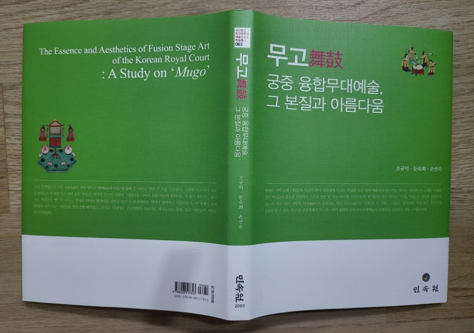
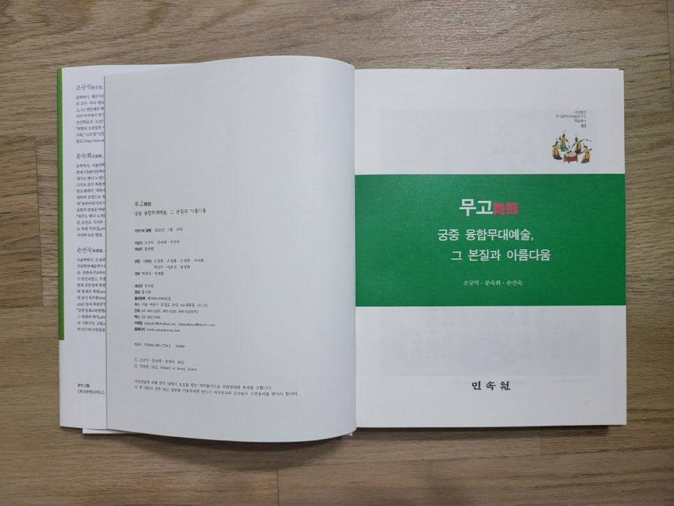
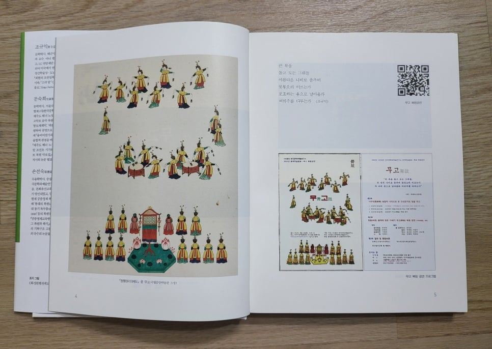
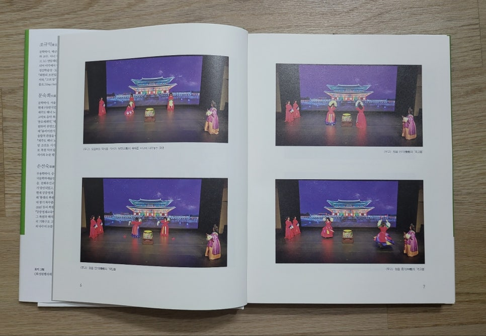
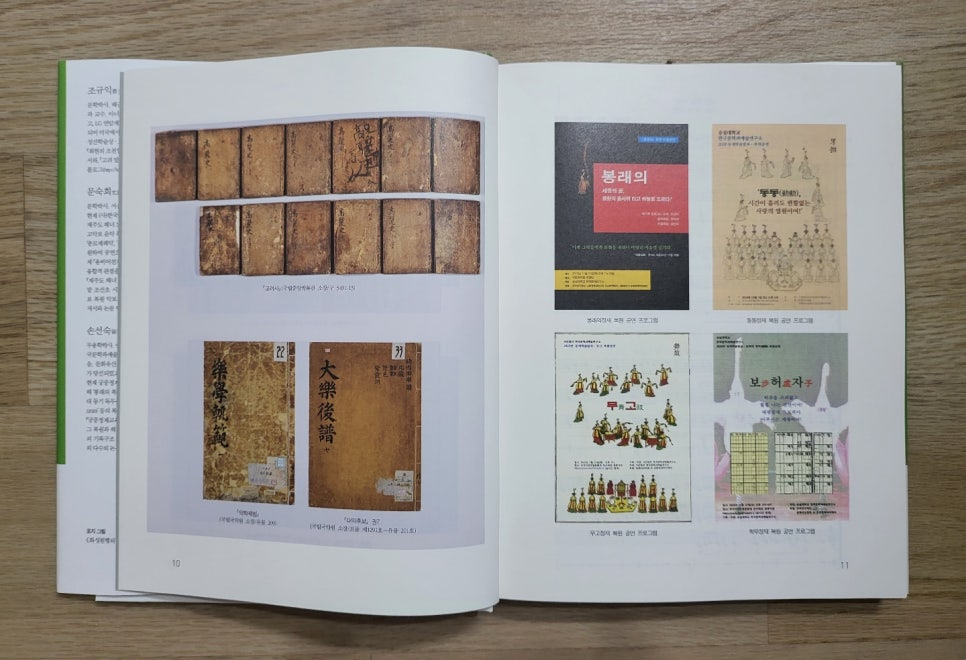
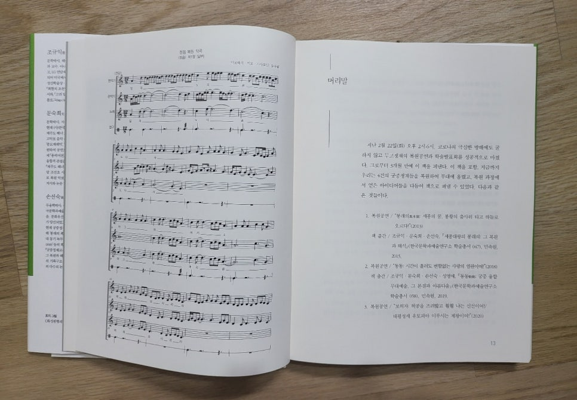
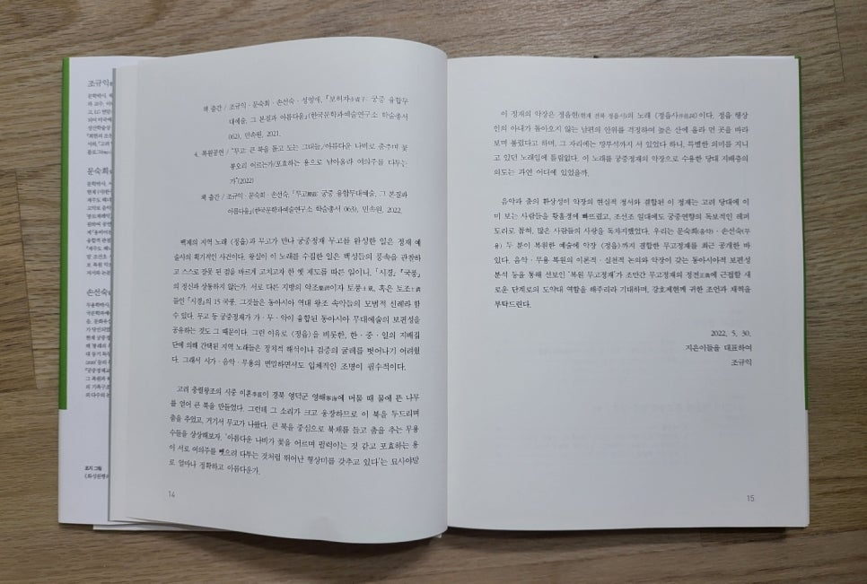

#‘가・무・악 융합’ 아젠다의 구현을 위한 발걸음

​

숭실대 #조규익 교수와 #(사)한국문학과예술연구소의 문숙희・손선숙 수석연구원은 최근 #<<무고舞鼓: 궁중 융합무대예술, 그 본질과 아름다움>>을 연구소 학술총서 63으로 민속원에서 펴냈다. 저자들이 2012년에 # ‘가・무・악 융합’이란 아젠다를 내걸었으니, 그럭저럭 올해로 만 10년이 지나는 셈이다. 그 사이에 #<<세종대왕의 봉래의: 그 복원과 해석>>(학술총서 047/ 민속원/2015), #<<동동動動: 궁중 융합무대예술, 그 본질과 아름다움>>(학술총서 058/민속원/2019), #<<보허자步虛子: 궁중 융합무대예술, 그 본질과 아름다움>>(학술총서 062/민속원/2021) 등을 펴냈고, 이 책을 이번에 내놓은 것으로 알려져 있다.

​

2006년 창립 이후 다양한 분야에 관심을 기울여왔고, 1년에 네 번의 학술대회와 네 번에 걸친 학술지(#<<한국문학과 예술>>)를 발간해 오고 있는 이 연구소는 그간 60여 권의 학술총서, 20여권의 문예총서・학술자료총서 등을 발간함으로써 학계의 담론을 선도해 왔다. 특히 <<연행록연구총서>>(전 10권)와 <<조선통신사 사행록 연구총서>>(전 13권)는 국내 학자들은 물론 중국과 일본의 관련학계에서도 호평을 받고 있다.

이번 6월 말에 42집이 나오는 학술지의 경우 한국연구재단의 등재지로서 융합학술지의 모범적 사례로 인정받았고, 우수한 성적으로 두 번째 등재자격을 유지해왔으며, 현재 세 번 째 심사에 들어가 있는 것으로 알고 있다.

​

연구소 창립초기 음악복원 전문가 #문숙희 박사, 이론과 실기를 겸한 무용 전문가 #손선숙 박사를 영입한 시점부터 고전시가 전공자인 조규익 교수와 한 팀이 되어 #궁중무대예술의 분석과 복원에 집중해온 것으로 보인다. 앞에서 언급한 4권의 책들을 펴내기 위해 세 사람의 연구팀은 ‘문헌해석 및 분석, 복원작업, 공연’ 등의 쉽지 않은 작업들을 반복적으로 진행해 왔다.

​

근대이전 시(노랫말)와 음악, 무용의 융합체가 ‘고전시가’라는 것은 연구팀의 변함없는 지론으로 알려져 있다. 우리의 고전시가를 문학의 관점으로만 볼 경우, 본질에서 벗어난 결론이 도출될 수도 있다는 것이 연구팀의 일치된 견해다. 따라서 이 책의 기본 전제는 “백제의 노래로 기록된 #<정읍>을 ‘무고’라는 콘텍스트 안에서 분석해야 비로소 그 시대의 예술미가 오롯이 드러난다는 것”이다.

백제의 지역 노래 <정읍>과 악기(樂器) 무고(舞鼓)가 만나 궁중정재 <무고>를 완성한 일은 정재 예술사의 획기적인 사건이다. 왕실이 이 노래를 수집한 일은 백성들의 풍속을 관찰하고 스스로 잘못 된 점을 바르게 고치고자 한 옛 제도를 따른 일이니, <<시경>> <국풍>의 정신과 상통하는 일이다. 서로 다른 지방의 악조(樂調)이자 토풍(土風), 혹온 토조(土調)들인 <<시경>>의 15국풍(國風). 그것들은 동아시아 역대 왕조 속악들의 모범적 선례라 할 수 있다. 무고 등 궁중정재가 가・무・악이 융합된 동아시아 무대예술의 보편성을 공유하는 것도 그 때문이다. 그런 이유로 <정읍>을 비롯한, 한・중・일의 지배집단에 의해 간택된 지역 노래들은 정치적 해석이나 검증의 굴레를 벗어나기 어려웠다. 그래서 시가・음악・무용의 면밀하면서도 입체적인 조명이 필수적이다.

고려 충렬왕조의 시중(侍中) 이혼(李混)이 경북 영덕군 영해(寧海)에 머물 때 물에 뜬 나무를 얻어 큰 북을 만들었다. 그런데 그 소리가 크고 웅장하므로 이 북을 두드리며 춤을 추었고, 거기서 #무고가 나왔다. 큰 북을 중심으로 북채를 들고 춤을 추는 무용수들의 아름다운 자태를 상상해 보시라. ‘아름다운 나비가 꽃을 어르며 펄럭이는 것 같고 포효하는 용이 서로 여의주를 뺏으려 다투는 것처럼 뛰어난 형상미를 갖추고 있다’는 묘사야말로 얼마나 정확하고 아름다운가.

이 정재의 악장은 정읍현(현재 전북 정읍시)의 노래 <정읍사(井邑詞)>이다. 정읍 행상인의 아내가 돌아오지 않는 남편의 안위를 걱정하여 높은 산에 올라 먼 곳을 바라보며 불렀다고 하며, 그 자리에는 망부석까지 서 있었다 하니, 특별한 의미를 지니고 있던 노래였을 것이다. 이 노래를 궁중정재의 악장으로 수용한 당대 지배층의 의도를 찾아보는 것도 이 책의 목표들 가운데 하나다. 음악과 춤의 환상성이 악장의 현실적 정서와 결합된 이 정재는 고려 당대에 이미 보는 사람들을 황홀경에 빠뜨렸고, 조선조 일대에도 궁중연향의 독보적인 레퍼토리로 꼽혀, 많은 사람들의 사랑을 독차지했던 것이다.

음악・무용 복원의 이론적・실천적 논의와 악장이 갖는 동아시아적 보편성의 분석 등을 통해 선보인 ‘복원 #무고정재’가 조만간 무고정재의 정전(正典)에 근접할 새로운 단계로의 도약대 역할을 해줄 것으로 기대한다,

​

#정읍 #보허자 #정읍사 #궁중정재 #악장 #시경

​