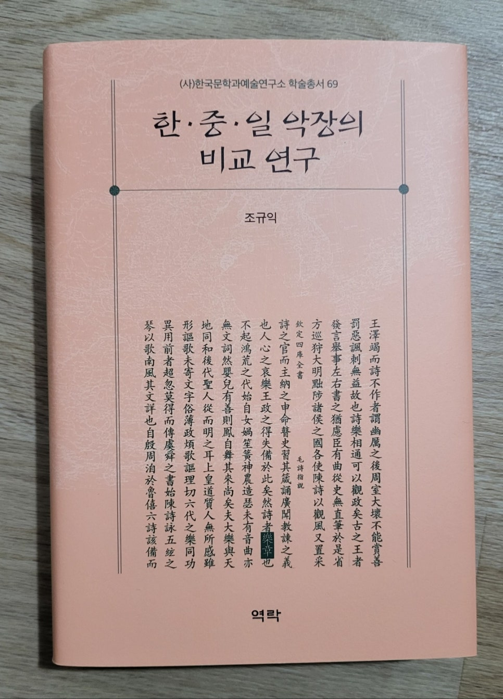

구사회(선문대 명예교수)

악장 연구의 진입 장벽은 높다. 그렇다고 다른 시가 양식의 연구가 쉽다는 말은 결코 아니다. 악장 연구를 제대로 하기 위해서는 갖춰야 할 지적 기반이 상대적으로 복잡하기 때문이다. 악장은 중국에서 시작하여 주변국으로 확대되었기에 출발부터 방대한 한문 자료의 장벽이 가로놓여 있다. 이를 위해서는 기본적으로 고난도의 한문 해독 능력이 있어야 한다. 사실 우리 한국 악장에 대한 분석도 쉽지 않다. 한문악장을 필두로 하는 한국의 악장은 형태적으로 복잡하게 얽혀 있다. 이 과정에서 한국의 여러 시가 양식들이 악장으로 편입되거나 개작되며 겹치기도 한다. 악장을 둘러싼 양식 문제가 제기되기도 하고, 악장 제작과 관련한 복잡한 콘텍스트가 연구자 앞에 대두되기도 한다.

나는 언젠가 성함만 대면 누구나 알 수 있는 학계의 원로 교수 한 분과 자리를 함께 한 적이 있었다. 이때 원로 학자의 말씀이 향가와 고려가요를 연구하고 마지막으로 악장 연구를 시도하였다고 한다. 그런데 반년 정도 하다가 더는 진행하지 못하고 그만 포기하고 말았다면서 고개를 절레절레 흔드셨다. 대가급 원로 교수에게 악장 연구의 진입 장벽이 높았던 모양이다. 그래서 나는 꾸준히 악장 연구서를 내는 연구자를 보면 마음으로부터 존경심이 우러나온다.

최근에 김승우 교수가 발표한 악장 연구의 현황을 보면 검토 대상이 된 악장 논문만 150편이 넘는다. 물론 여기에는 미처 언급되지 못한 논문들도 있을 것이다. 그런데 최근에 나온 조규익 교수의 정년기념 문집에 실린 저·역서 및 논문 목록을 보면, 혼자서 내놓은 악장 관련 핵심 저서가 4편이고, 논문이 50편을 상회한다. 그러니까 분량 상으로 조규익 교수는 지금까지 60여 명이 참여한 한국 악장 연구의 삼분의 일을 혼자서 수행해 낸 셈이다. 그런데 올해는 여기에 <<한·중·일 악장의 비교 연구>>(역락, 2022)를 추가했다.

2

필자가 보기에 이번에 나온 ‘동아시아 악장 비교 연구’는 조규익 교수가 지난 삼십여 년 이상을 천착해 온 악장 연구의 정점에 해당하는 성과이다. 이를 위해 저자는 지금까지 구축한 자신의 이론 체계를 종횡으로 촘촘히 적용하여 동아시아로 확대 적용하였다. 따라서 이번 저작물을 검토하기 위해서는 저자가 그동안 수행해 온 기존의 악장 연구 성과를 검토하지 않을 수 없다. 그러지 않고서는 이 연구가 내포하고 있는 진정한 의미와 성과를 제대로 파악할 수 없기 때문이다.

‘동아시아 악장 비교 연구’의 분석 대상은 한·중·일의 악장이다. 여기에서 서로 비교 대상이 되는 것은 악장이고, 그 공통의 원천은 중국 고대의 노래인 <<시경>>이다. 주지하다시피 <<시경>>은 중국 고대의 가요집으로 위정자들이 백성들의 노래를 통해 민심을 파악하여 정치에 반영한 것이다. 그리고 그것은 조정의 제향이나 연향 등과 같은 의례를 통해 조종을 찬양하거나 왕조 영속을 축원하는 노래들로 이루어져 있다. 이와 관련하여 저자는 초기연구인 <<조선초기 아송문학 연구>>(태학사, 1986)에서 <<시경>> 아송의 그러한 정신에서 발원한 조선초기의 특수한 상황을 주목하였다. 여기에서 저자는 조선이라는 새로운 왕조가 개창되면서 체제 및 문물을 찬양하거나 이들의 통치 이념에 기반을 둔 ‘권계지사(勸戒之辭)’를 형상화한 작품 전반을 ‘아송문학’으로 규정하였다. 이를 통해 아송의 개념과 존재 양상, 작자 계층의 성향과 이념, 장르적 특징과 미의식 구조 등과 같은 선초 악장의 전반적인 특징을 탐색하였다.

이것은 후속 연구인 <<선초악장문학연구>>(숭실대출판부, 1990)에서 일련의 작업들을 통해 선초 악장의 형성 과정과 장르적 성격을 밝혔다. 여기에서 논의된 악장은 “조선초기ㆍ전례적 상황에서・왕조 영속의 당위성이나 삼대지치의 이념을 고양할 목적으로ㆍ당대에 존재하던 시가들의 형태를 차용하고・선왕 혹은 현왕에 대한 찬양을 내용으로 하여・교술적 어조로 전개하는 특수한 문학”으로 정의된다. 이러한 악장 개념의 규정은 ‘동아시아 악장 비교 연구’에서도 그대로 일관된 기저로 적용되고 있다.

이어서 저자는 조선조 악장 연구의 집대성이라고 평가할 수 있는 <<조선조 악장의 문예 미학>>(민속원, 2005)을 내놓는다. 여기에서 저자는 악장에 대한 기존의 편견을 비판하면서 악장의 가치와 전개 양상을 논의하면서 독자적 미학 체계를 모색한다. 그리고 저자는 자신의 이전 연구를 보다 심화시키면서 집권 세력과 악장 담당층의 역학 관계를 주목한다. 이와 함께 정도전을 시작으로 권근 · 하륜· 변계량· 최항의 악장을 분석해내고 있다. 여기에서 이들 선초 악장은 기존 장르를 변형시켜 새로운 시형을 시도했다거나 기존 장르의 지속과 변이가 나타난다든가, 경기체가의 변용과 확대라는 점을 규명해냈다. 이를 통해 이전의 선행장르와 이후 후속 장르의 연관성을 통해 선초 악장문학이 그것의 가교역할을 했다는 문학사적 의의를 새롭게 정립한다.

그리고 2014년도에 나온 <<조선조 악장 연구>>(새문사, 2014)는 그동안 축적한 악장 연구의 성과를 정리하면서 조선악장의 독자성을 분석해내고 있다. 여기에서는 기존에 축적한 악장의 문학성을 종합하면서 악장의 본질적 성격을 파고든다. 특히 저자는 악장에 대한 텍스트와 콘텍스트, 더 나아가 상호텍스트 측면에서 면밀하게 종합적으로 접근하고 있다. 여기에서는 그것은 여러 음악 관련 관찬 문헌인 악서, 궁중 무대 예술, 외래 음악이나 공연, 시(詩)·가(歌)·무(舞)가 결합된 종합무대예술인 정재 등의 연계성을 통한 외적 맥락 등이 종합적으로 반영되었다는 것을 논의하고 있다.

이상에서처럼 조규익 교수는 <<조선초기 아송문학 연구>>(태학사, 1986) 이래로 4편의 악장 관련 단독 저서를 출간하였고, 50여 편의 악장 논문을 발표하였다. 그리고 이를 바탕으로 마침내 한·중·일의 악장을 비교 분석함으로써 악장 연구를 동아시아로 확대하는 성과를 거두고 있다. 이 책을 살펴보면 30년 이상을 연구해온 저자의 악장에 대한 지식 역량과 이론 체계를 확인할 수 있다.

3

조 교수의 <<한·중·일 악장의 비교 연구>>(역락, 2022)는 본래 2015년도에 한국연구재단 ‘우수학자지원’의 다년 과제로 채택되어 수행해 온 성과물이다. 그러니까 지금까지 거의 8년에 걸쳐 연구하고 다듬은 것이다. 연구 분량도 방대하여 800여 쪽에 이른다.

먼저 목록을 살펴보자. 모두 4부로 구성되어 있다. 제1부는 서론에 해당하며 동아시아 한·중·일을 중심으로 악장 비교의 영역과 범주를 설정하여 그것이 지닌 의미를 제시했다. 이 때 동아시아 악장이 갖는 기본 토대로서 주목한 것이 중세 보편주의이고, 그것의 진수를 <<시경>>에서 찾고 있다. 저자는 동아시아의 각국 왕조들이 똑같이 주나라 악장집으로서의 <<시경>>을 수용하여 관습적이고 보편적인 악장의 형태를 갖추고 있었다는 사실을 연구의 출발로 삼고 있다.

제2부는 300여 쪽이 넘는 분량인데, 주로 한·중·일 악장의 존재 양상과 존립 기반을 다루고 있다. 모든 내용을 자세히 언급할 수 없고 주요 항목을 중심으로 언급할 수밖에 없다. 먼저 악장 용어의 의미 범주와 그것의 역사 문화적 의미를 다루고 있다. 여기에서 악장의 출발은 <<시경>>이고, 특정 일부의 연향악장을 제외한 동아시아 후대 왕조들의 대부분 악장은 형태·내용·주제의 측면에서 <<시경>>의 직・간접적인 영향권을 벗어나지 않는 것으로 보았다. 말하자면 악장은 궁극적으로 󰡔시경󰡕의 본질과 결부되어 있다고 파악한 것이다.

다음은 그것을 바탕으로 중국 - 고려 음악의 교섭 양상, 그리고 고려 악장에 미친 중국 악장의 영향에 대해서 논의하였다. 이와 관련하여 송 대에 고려로 들어온 대성악과 함께 음악과 관련된 여러 콘텍스트에 주목하였다. 이때 고려가 󰡔시경󰡕을 바탕으로 한 송 악장을 받아들이면서 중국 악장과 고려 악장은 제작 관습을 공유하게 되었다는 것이다. 이후로도 여러 중국 왕조들과 고려 사이에 악장 제작 의도나 관습 및 주제 의식의 차이는 거의 없었다고 한다. 그것은 조선조에 이르러서도 마찬가지인데, 이는 왕조 악장들이 시대나 지역의 차이를 넘어 공유하던 유사성은 바로 보편성과 관계가 깊다는 것이다.

아악악장만 그런 것이 아니라, 연향에 주로 쓰인 당악이나 당악악장도 마찬가지였다. 이것은 통치 질서의 정점에 있던 제왕의 만수무강이나 복을 빌어주는 것이 궁중 연향의 목적이었고, 그것이 왕조 안정에 가장 중요한 조건이었다는 것이다. 고려나 조선이 중국으로부터 각종 연향악과 악장을 도입한 것도 예술적 세련과 함께 효과적인 송도의 표출 방식을 습득하고자 했기 때문이다. 그들이 전하고자 한 언어적 메시지가 악장이었던 것은 바로 그 때문이었다. 이것은 한국의 당악이나 당악정재에서 임금의 장수와 행복을 빌어주던 행위도 바로 그와 같은 필요성에서 비롯되었다는 것이다. 그것은 <동동>과 같은 속악정재가 당악정재의 악장들로부터 송도를 본뜬 것도 모두 그런 일련의 이유에서 비롯되었다고 보았다.

다음으로 조선에서 중국 악장을 수용한 사실과 조선조 악장의 확립 과정 또한 논의하고 있다. 여기에서는 조선조 악장이 고려 악장 체계의 계승을 통해 중국의 연향악을 수용하고 있다는 것을 밝히고 있다. 뿐만 아니라 음악적 측면에서 조선조 속악의 상당 부분이 고려조 속악을 답습한 것이라는 점도 밝혔다. 그리고 <용비어천가>의 창작과 관련해서는 그것이 주나라 악장이었던 <<시경>> 텍스트를 바탕으로 이뤄졌다는 점을 밝히면서 한-중 악장 비교의 관점에서 중국보다 진일보한 면모를 보여주었다고 평가하였다. 조선조 제례악장의 경우에도 중국 왕조의 제례악장을 수용하고 있음을 밝히면서 서로 같고 다른 점을 논파하고 있다. 마지막으로 일본 악장의 존재 여부와 콘텍스트로서 아악을 검토하였고, 그에 관한 논의를 바탕으로 한·중·일 아악의 같고 다름을 논의한 다음, 이들 국가의 석전악장을 비교・분석하였다.

여기에서 눈에 띄는 내용은 중국과 한국의 악장들이 같거나 비슷한 모습을 공유하고 있는데, 일본은 판이했다는 사실이다. 그것은 일본이 당나라 이전까지 중국과 활발하게 교류하다가 당나라의 몰락으로 사신 파견을 접으면서 자연히 음악 교류도 불가능해졌고 악장 콘텍스트가 달라졌기 때문으로 보았다. 자연히 일본의 아악은 중국이나 한국과 달리, 아악의 개념이나 의미 범주가 많이 달라졌다고 한다. 다시 말해서 일본의 경우 유교적 바탕이 필요한 의례음악으로서의 아악을 중국이나 한국과 같은 양상으로 발전시키지 못하고 달라졌다는 사실과 맥락을 함께한다. 그래서 일본의 아악은 중국이나 고대· 중세의 한국과 달라서 아악에 부대(附帶)되던 악장도 없는 것처럼 보인다는 것이다. 그래서 아악보다도 오히려 연향악에서 삼국 음악의 상통점이 발견된다고 한다. 이들 동아시아 삼국은 공통적으로 속악 체계의 노래들을 재편 내지 개작하여 자신들의 궁중 연향악으로 충당하는 과정에서 상통점을 찾을 수 있었다는 것이다. 이에 대한 구체적인 내용은 제4부에서 진행되고 있고 악장태의 가능성을 타진하고 있다.

4

제3부에서는 앞서 논의된 동아시아 삼국의 악장 논의를 바탕으로 <<시경>> 텍스트 및 그것의 수용으로 이뤄진 악장들을 탐색하여 비교하고 있다. 여기 내용도 400쪽에 근접하는 방대한 분량으로 주요 항목을 중심으로 점검한다.

<<시경>>은 진나라 분서(焚書)의 과정을 거치면서 그것의 음악적 측면, 무용 및 의례적 측면과 같은 핵심적인 사항을 상실한 점에 주목하였다. 그럼에도 <<시경>>은 동아시아 모든 왕조에서 수용함으로써 중세적 보편성을 확립시킨 결정적 텍스트였다. 그리고 이것은 악장의 모범적 선례로 수용되며 악장의 표준으로 자리를 잡았다. 이 점에 <<시경>> 텍스트의 보편성이 존재한다. 󰡔시경󰡕이 동아시아 삼국으로 수용되면서 텍스트 자체가 송두리째 악장으로 활용되기도 하고, 적출(摘出) 어구(語句)들이 새로운 악장으로 조립되기도 했으며, 때로는 <<시경>> 텍스트와 관계없는 새로운 악장이 창작되기도 했다.

<<시경>>의 수용을 통해 중국과 한국의 악장은 문화적・정치적 보편성을 확보하면서 나름의 독자성을 추구해 왔다. 중국 한나라의 악장은 <<시경>> 수용에 관한 모범적 선례로 자리 잡았고, 수나라와 당나라는 <<시경>> 수용 관습을 지속하며 주변의 음악 문화를 폭넓게 흡수하는 특징을 보여주었다고 했다. 송나라는 <<시경>>을 이데올로기의 근원으로 수용하고 아악을 중시하는 새로운 기풍을 마련한 것으로 파악하였다. 이민족이 세운 원나라는 정통성 확보의 다급한 필요성 때문에 󰡔시경󰡕을 묵수(墨守)한 것으로 보았다.

한국도 중국과 큰 틀에서 <<시경>> 수용을 통한 문화·정치적 보편성을 확보하면서 한편으로 독자적 차별성을 보여주었다. 이미 4세기 이전에 <<시경>>을 도입한 한국은 고려 예종 시기에 이르러 송나라의 대성악이 들어왔고 구체적인 예악 문화 또한 뿌리 내린 바 있다. 이 시기에 이미 음악 체계에서의 중세적 보편성이 자리를 잡았으며, 이와 함께 그 때 이미 ｢태묘악장｣이나 ｢휘의공주혼전대향악장｣ 등이<<시경>> 텍스트의 조합으로 만들어졌다. 조선조에 이르자 유교 이념이 보다 강화되며 <<시경>>과 악장은 중세 보편주의를 지향하는 표상이자 예악정치를 실현하는 이념적 도구로 작동되고 있었다. 실용적 측면에서 <<시경>> 시는 국가 의례나 외교 의전 등에서 음악이나 악장으로 사용되었다. 그렇지만 조선조에도 <<시경>> 시작품을 송두리째 가져다 쓰지 않고 시구 단위로 끌어다 씀으로써 표면적이고 부분적인 유사성의 추구에 그쳤다. 그런데 <<시경>> 시는 의례에서 태평성세를 강조하거나 ｢주송(周頌)｣의 <신공(臣工)>처럼 왕권을 위협하는 집단에 대한 경고적 메시지로 사용되면서 중국과 다른 독자성을 보여주기도 하였다. 한편, 조 교수는 <용비어천가>에 이르러 악장의 <<시경>> 수용은 비로소 기존의 패러다임을 벗어나는 양상을 보여주고 있는 것으로 파악하였다. 그래서 역대의 다른 악장과 달리, <용비어천가>는 단순한 차용이나 조립에 그치지 않고, 텍스트의 의미 해석을 통한 주제와 정신을 창조적으로 받아들임으로써 <<시경>> 수용의 양상이 크게 바뀐 것으로 보았다.

이처럼 중국과 한국의 경우에는 비교적 <<시경>>의 수용을 통한 문화·정치적 보편성을 확보할 수 있었으나, 일본은 그렇지 않았다고 보는 것이 저자의 관점이다. 중국과 한국의 악장들은 같거나 비슷한 모습을 공유하고 있었으나, 일본은 판이한 특징을 갖고 있었다는 사실에서 그 점을 확인할 수 있다고 본 것이다. 이 점은 일본이 당나라 이전까지 중국과 활발하게 교류하다가 당나라 몰락으로 사신 파견을 접으면서 자연히 음악 교류도 불가능해지면서 악장 콘텍스트가 달라지면서부터 구체화된 현상이다. 그래서 일본의 아악은 중국이나 한국과 달리, 아악의 개념이나 의미 범주가 많이 달라지게 되었다고 한다. 다시 말해서 일본은 유교적 바탕이 필요한 의례음악으로서의 아악을 중국이나 한국과 같은 양상으로 발전시키지 못하고 크게 달라졌다는 것이다. 좋게 말하여 일본 나름의 독자적인 악장 체계를 구축하게 되었다고도 말할 수 있을 것이다. 따라서 동아시아 악장은 아악보다는 오히려 연향악에서 상통점이 발견된다고 할 수 있다. 즉 삼국은 공통적으로 속악 체계의 노래들을 재편 내지 개작하여 자신들의 궁중 연향악으로 충당하면서 상통점이 형성되었다는 것이다.

저자는 일본의 문헌에서 악장이란 구체적 명칭을 찾을 수 없지만, 악장의 가능태를 몇몇 사례에서 찾고 있다. 일본 석전(釋奠)의 강경(講經) 의식(儀式)에서 <<시경>>은 중심에 놓여 있었다. 8세기 중엽에 만들어진 일본 최초의 한시집인 <<가이후소(懷風藻)>>의 한시에 인용된 <<시경>> 시작품으로부터 송축적인 성격을 지닌 악장의 가능태를 찾고 있다. 그리고 일본의 전통 정형시가인 와카(和歌), 에이쿄쿠(郢曲)에서 <<시경>>과 관련한 악장의 가능성을 타진하고 있다. 그러다가 마침내 저자는 이런저런 검토를 통해 ‘동아시아 삼국의 악장’은 ‘한·중·일 악장’으로 명명하는 것보다 ‘한·중의 악장’과 ‘일본의 유사 악장’으로 구분하는 것이 사실에 근접한다는 결론을 내리게 된다.

5

지금까지 조규익 교수의 <<한·중·일 악장의 비교 연구>>(역락, 2022)를 살펴보았다. 이 책은 지금까지 나온 악장의 공간을 확대하고 지평을 넓힌 연구의 정점에 있는 결과물이다. 모두 800여 쪽에 이르는 방대한 지면 분량을 통해 논의된 많은 내용을 여기에서 몇 장의 서평으로 총괄하는 것은 무리이리라. 따라서 악장에 관심이 있는 연구자들의 또 다른 서평이 필요할 것으로 보인다.

이 책의 저자인 조규익 교수는 그동안 이 분야를 선도하면서 악장 연구를 본궤도에 올려놓았다. 저자의 악장 연구는 장르론을 시작으로 작품론, 작가론, 미적 본질론, 비교문학론 등 여러 방면에 걸쳐 있다. 그리고 악장 저서를 내놓을 때마다 새로운 학설을 구축하였다. 이것은 저자가 악장 연구를 일회성으로 삼지 않고 삼십 년 이상의 오랜 세월을 화두로 붙잡고 있었기 때문이다.

며칠 동안 밤낮을 가리지 않고 이 저작물을 읽으면서 떠오르는 것은 저자의 악장 연구는 여기에서 그치지 않을 거란 생각이다. 가만히 보니까 저자의 끈질긴 성격도 그렇거니와 동아시아 악장과 관련해서 어쩌면 월남이나 유구국의 악장으로 시야를 넓혀가며 탐색하게 되리라는 생각이 들기 때문이다. 아니면 ‘우리가 미처 생각지 못했던 또 다른 차원의 악장 담론을 들고 나오지 않을까?’라는 기대를 가져보기도 한다.

​

#구사회 #조규익 #한중일\_악장의\_비교연구 #악장 #역락 #시경 #와카 #가이후소 #석전 #용비어천가 #중세적\_보편성 #아악 #연향악