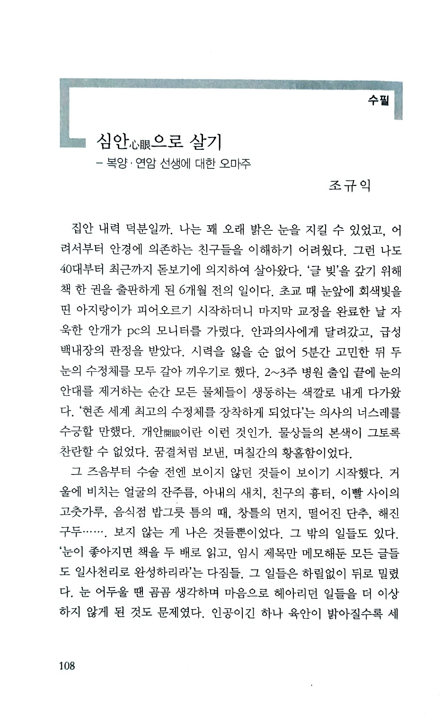
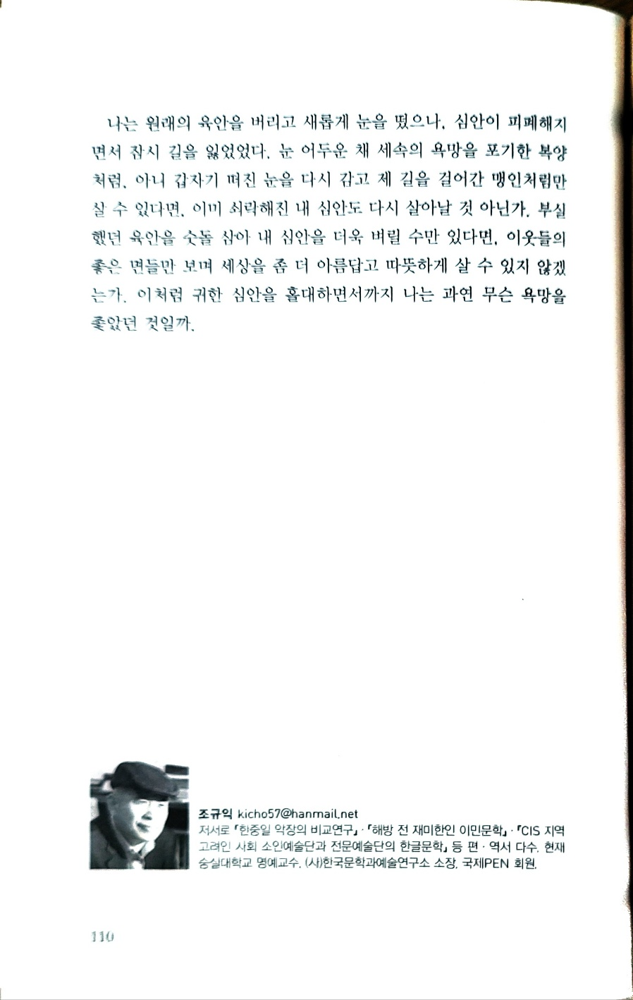

심안(心眼)으로 살기

-복양・연암 선생에 대한 오마주-

조규익

집안 내력 덕분일까. 나는 꽤 오래 밝은 눈을 지킬 수 있었고, 어려서부터 안경에 의존하는 친구들을 이해하기 어려웠다. 그런 나도 40대부터 최근까지 돋보기에 의지하여 살아왔다. ‘글 빚’을 갚기 위해 책 한 권을 출판하게 된 6개월 전의 일이다. 초교 때 눈앞에 회색빛을 띤 아지랑이가 피어오르기 시작하더니 마지막 교정을 완료한 날 자욱한 안개가 pc의 모니터를 가렸다. 안과의사에게 달려갔고, 급성 백내장의 판정을 받았다. 시력을 잃을 순 없어 5분간 고민한 뒤 두 눈의 수정체를 모두 갈아 끼우기로 했다. 2-3주 병원 출입 끝에 눈의 안대를 제거하는 순간 모든 물체들이 생동하는 색깔로 내게 다가왔다. ‘현존 세계 최고의 수정체를 장착하게 되었다’는 의사의 너스레를 수긍할 만 했다. 개안(開眼)이란 이런 것인가. 물상들의 본색이 그토록 찬란할 수 없었다. 꿈결처럼 보낸, 며칠간의 황홀함이었다.

그 즈음부터 수술 전엔 보이지 않던 것들이 보이기 시작했다. 거울에 비치는 얼굴의 잔주름, 아내의 새치, 친구의 흉터, 이빨 사이의 고춧가루, 음식점 밥그릇 틈의 때, 창틀의 먼지, 떨어진 단추, 해진 구두...보지 않는 게 나은 것들뿐이었다. 그 밖의 일들도 있다. ‘눈이 좋아지면 책을 두 배로 읽고, 임시 제목만 메모해둔 모든 글들도 일사천리로 완성하리라’는 다짐들. 그 일들은 하릴없이 뒤로 밀렸다. 눈 어두울 땐 곰곰 생각하며 마음으로 헤아리던 일들을 더 이상 하지 않게 된 것도 문제였다. 인공이긴 하나 육안이 밝아질수록 세속에 대한 욕심은 더 두꺼워지고, 심안은 어두워지고 있었다. 모든 이들이 나보다 나아보이고, 좀 더 나아보이려면 무엇을 갖춰야 할지 신경 쓰게 되었다. 눈에 보이는 것들이 너무 많으면 심안은 닫혀간다는 몇몇 어른들의 말씀이 맞았던 것일까.

<병목(病目)>이란 시를 남긴 고려 명종 대의 문사 복양 오세재. 죽림고회의 일원이었던 복양은 눈이 나빠져 말년에 고생깨나 한 듯하다. 제2구에서 ‘눈은 가리는 게 많아 흐릿하다’ 했고, 제5구에서 ‘등잔 앞에 글자 비춰보기 겁난다’ 했으며, 제7・8구에서 ‘과거 합격자 명단 보기를 기다리다 포기한 채/눈 감고 속세의 욕심 잊는 것 배운다’ 했다.

문장의 라이벌 유한준에 대한 답신에서 연암 박지원은 서화담의 이야기 한 꼭지를 인용했다. 화담이 외출했다가 울고 있는 사람을 만나 그 연유를 물었단다. 20년 동안 눈이 보이지 않다가 (오늘) 아침나절 갑자기 천지 만물을 환히 볼 수 있게 되어 기뻐서 집으로 돌아가려는데, 밭둑에 갈림길이 많고 대문들이 서로 같아 제 집을 알 수가 없으므로 울고 있다는 것이 그의 답변이었다. 그러자 화담이 ‘네 눈을 도로 감으면 바로 네 집이 나올 것’이라고 말해주니, 그는 다시 눈을 감고 지팡이로 더듬으며 발길 가는 대로 걸어가 집을 찾을 수 있었다는 일화다.

내 경험으로 미루어 복양은 백내장 환자였음이 분명하다. 과거 급제도 포기하는 등 세상의 욕심을 잊어야 한다는 깨달음의 출발점은 육안의 한계와 허망함이었다. 망상을 버리고 본분으로 돌아가라는 가르침을 주고자 한 연암은 왜 맹인의 일화를 가져왔을까. 육안의 창을 통해 들어와 심안을 혼탁하게 하는 세상의 물상들과 욕망으로부터 떠나 오염되지 않은 심안의 인도를 따르라는 뜻이리라.

나는 원래의 육안을 버리고 새롭게 눈을 떴으나, 심안이 피폐해지면서 잠시 길을 잃었었다. 눈 어두운 채 세속의 욕망을 포기한 복양처럼, 아니 갑자기 떠진 눈을 다시 감고 제 길을 걸어 간 맹인처럼만 살 수 있다면, 이미 쇠락해진 내 심안도 다시 살아날 것 아닌가. 부실했던 육안을 숫돌 삼아 내 심안을 더욱 벼릴 수만 있다면, 이웃들의 좋은 면들만 보며 세상을 좀 더 아름답고 따뜻하게 살 수 있지 않겠는가. 이처럼 귀한 심안을 홀대하면서까지 나는 과연 무슨 욕망을 좇았던 것일까.

조규익

현재 숭실대학교 명예교수, (사)한국문학과예술연구소 소장, PEN 회원. 󰡔한중일 악장의 비교연구󰡕・󰡔해방 전 재미한인 이민문학󰡕・󰡔CIS 지역 고려인 사회 소인예술단과 전문예술단의 한글문학󰡕 등 저・편・역서 다수