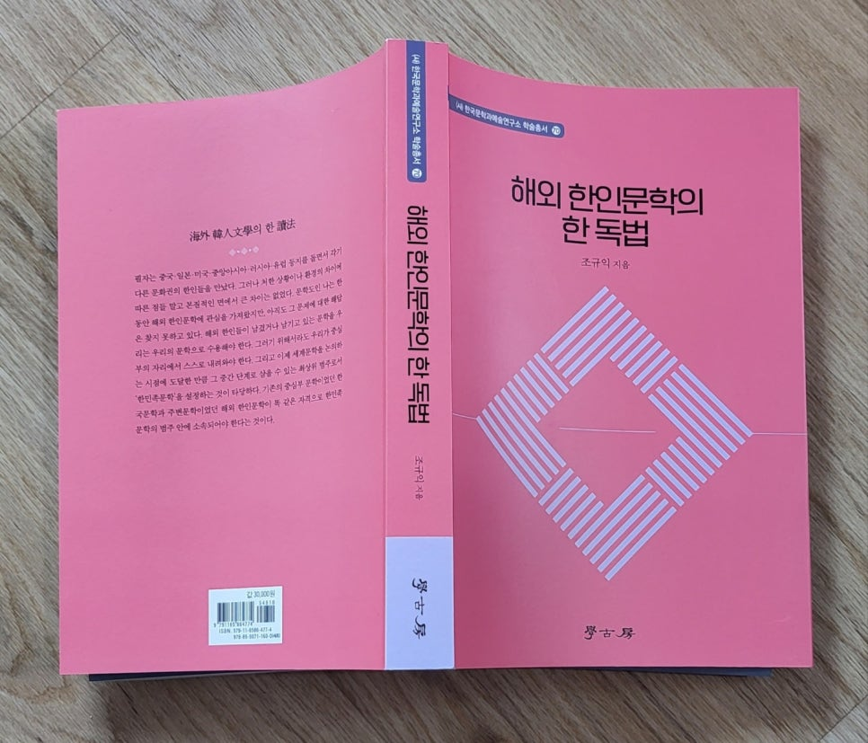
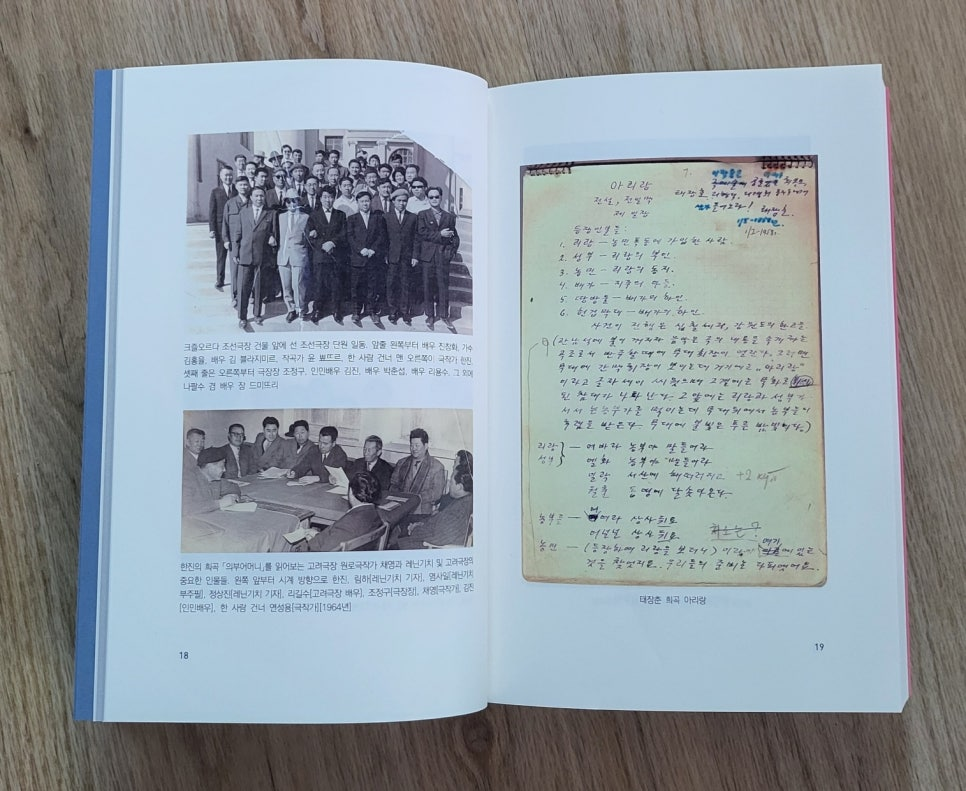
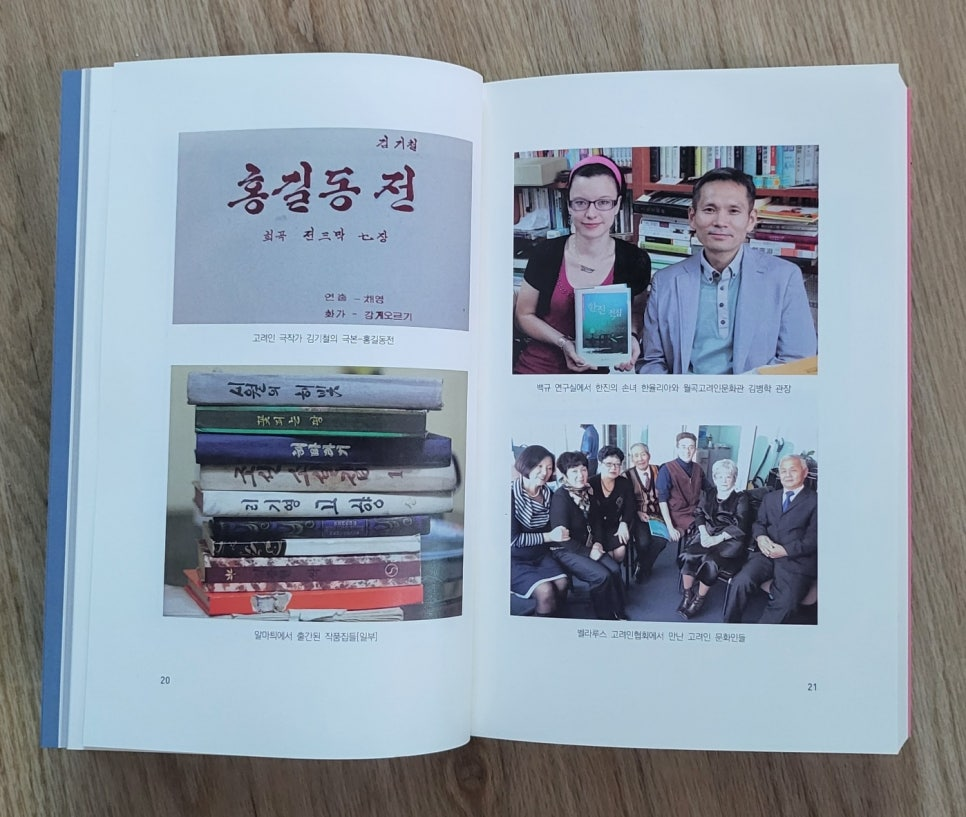
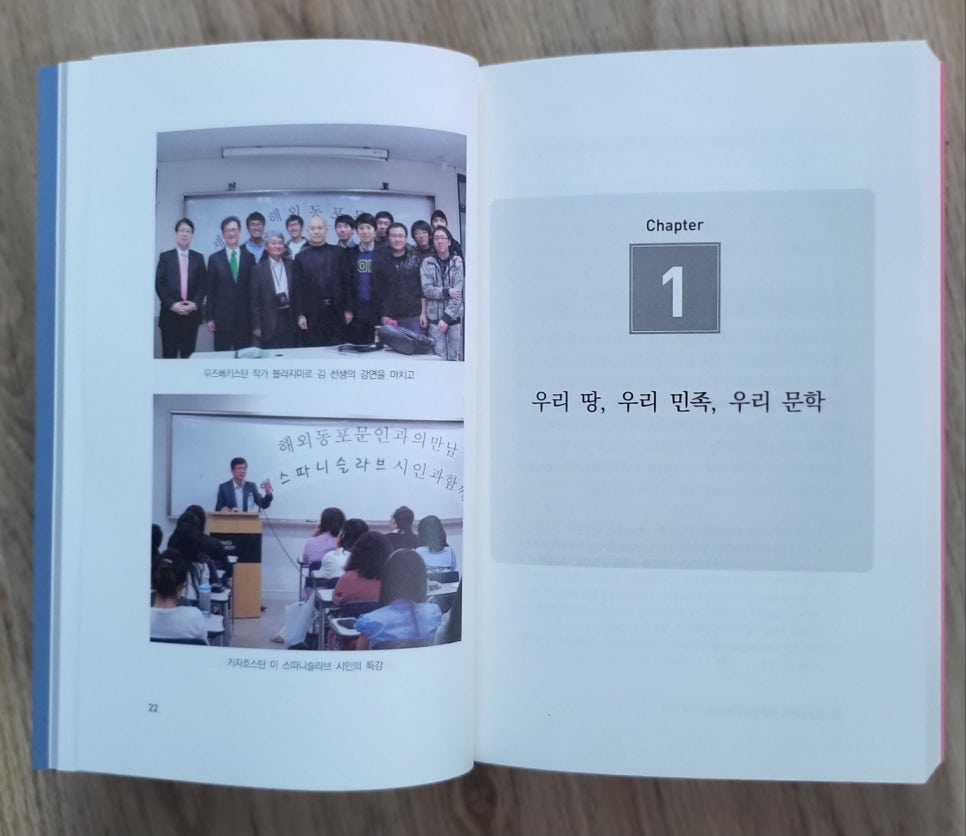
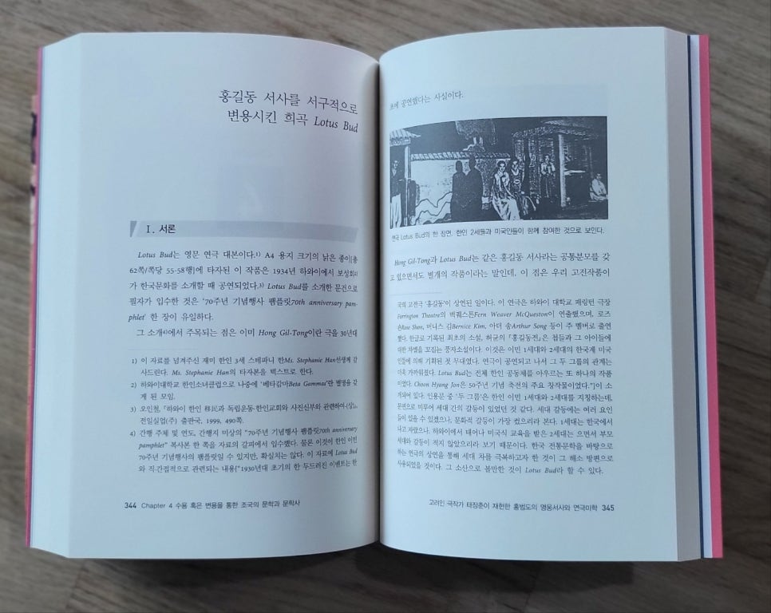

<<해외 한인문학의 한 독법>>을 학고방에서 출간했다. 지금 한 해의 반이 지나고 있으니, 올해에 더 이상의 책은 나오지 않을 것이 분명하다. 이 책을 올해의 유일한 수확이라 해도 무방할 것이다.

1990년대 초기 중국 조선족 문학에 관한 논저들을 내기 시작하면서 해외 한인문학은 내 서브메이저(submajor)들 가운데 하나로 자리를 잡았다. 참 흥미로운 분야를 지지부진 지금껏 끌고 온 셈이다. 이제 그 분야를 정리하는 차원에서 그간 발표했거나 별로 주목받지 못한 글들을 묶어 정리한 것이다. 목차는 다음과 같다.

머리말

Chapter 1 우리 땅, 우리 민족, 우리 문학

해외 한인문학의 존재와 당위

Ⅰ. 시작하는 말

Ⅱ. 해외 한인문학과 탈식민, 그리고 언어의 문제

Ⅲ. ‘한민족문학’ 범주 설정의 필요성

Ⅳ. 맺음말

Chapter 2 잃어버렸거나 잊어버린 자아를 찾아

재미 한인문학과 두 모습의 자아

Ⅰ. 시작하는 말

Ⅱ. 재미한인들의 특성과 문학

Ⅲ. 개인적 자아와 보편정서

1. 탈조국의 꿈, 그 좌절의 초상: *The Grass Roof*와 *East Goes West*의 *Chungpa Han*

2. 구세계 복귀의 꿈, 그 방황하는 경계인의 초상: *Clay Walls의 Hye Soo*와 *A Ricepaper Airplane*의 *Sung Wha*

Ⅳ. 맺음말

욕망과 좌절의 끝없는 반복, 그리고 작가들의 자아 찾기

Ⅰ. 시작하는 말

Ⅱ. 아메리칸 드림과 탈향, 그리고 문화사절 의식

1. 붕괴된 구세계, 그 대안으로서의 아메리칸 드림

2. 소외와 열등감, 그 보상 메커니즘으로서의 문화 소개

Ⅲ. 귀향의 욕망과 좌절, 빛바랜 아메리칸 드림

Ⅳ. 맺음말

바벨탑에서의 자아 찾기

Ⅰ. 네이티브 스피커와 바벨탑

Ⅱ. 바벨탑과 소외된 자아

Ⅲ. 언어 콤플렉스와 진실, 그리고 자아 정체성

Ⅳ. 맺음말

Chapter 3 작가들의 다양한 모험과 길 찾기

카자흐스탄 고려인의 한글노래와 디아스포라

Ⅰ. 시작하는 말

Ⅱ. 재在카자흐스탄 고려인과 노래문화

Ⅲ. 디아스포라의 경험과 문학적 형상화

1. 디아스포라 의식의 보편성

2. 디아스포라 의식의 구체적 방향성

3. 개인사와 관련된 디아스포라 의식

Ⅳ. 맺음말

고려극장에서 불린 우리말 노래

Ⅰ. 시작하는 말

Ⅱ. 가창된 노래들의 텍스트 양상 및 갈래

Ⅲ. 주제의식의 양상

1. 트라우마로 고착된 디아스포라의 실향의식

2. 실향 트라우마의 이념적 승화를 통한 방어기제

Ⅳ. 맺음말

고려인 극작가 한진이 수용한 우리 고전

Ⅰ. 시작하는 말

Ⅱ. 새로운 인물형의 창조를 통한 봉건체제 비판: ｢량반전｣

Ⅲ. 봉건 착취에 대한 비판과 디아스포라의 정서: ｢토끼의 모험｣

Ⅳ. 두 작품의 공시적・통시적 위상

Ⅴ. 맺음말

고려인 극작가 연성용이 수용한 우리 고전

Ⅰ. 시작하는 말

Ⅱ. 예술적 성과에 관한 평가

Ⅲ. 고전의 발견과 재해석 양상

1. 고전소설의 부분적 수용과 이념의 투사: ｢창곡이와 홍란｣

2. 설화의 재해석과 이념의 투사: ｢지옥의 종소리｣

Ⅳ. 맺음말

구소련 고려시인 강태수의 작품세계

Ⅰ. 시작하는 말

Ⅱ. 강태수 문학의 정신적 근원

Ⅲ. 작품세계

1. 뒤틀린 삶과 굴절된 서정성

2. 생존원리로서의 현실적응과 이념지향

3. 회한과 깨달음, 그리고 서정성에로의 회귀

Ⅳ. 맺음말

고려인 극작가 태장춘이 재현한 홍범도의 영웅서사시와 연극미학

Ⅰ. 시작하는 말

Ⅱ. 작품에 대한 당대의 인식과 평가

Ⅲ. 텍스트의 성립과 내용적 짜임

Ⅳ. 작가의식 및 주제

Ⅴ. 맺음말

Chapter 4 수용 혹은 변용을 통한 ‘조국’의 문학과 문학사

홍길동 서사를 서구적으로 변용시킨 희곡 *Lotus Bud*

Ⅰ. 서론

Ⅱ. *Lotus Bud*와 원 ‘홍길동 서사’의 같고 다른 점

1. 사건의 개요

2. 사건의 성격

Ⅲ. 결론

시조 창작을 통한 정서적 유산의 확인・유지: 심연수의 시조

Ⅰ. 시작하는 말

Ⅱ. 시조창작의 계기 및 작품 현황

Ⅲ. 작품의 짜임과 주제의식

Ⅳ. 맺음말

작품 해석의 통시적 체계화를 통해 ‘조선 문학’에 보편성 부여하기: 계봉우의 <<조선문학사>>

Ⅰ. 시작하는 말

Ⅱ. 괄론括論의 내용과 의미

Ⅲ. 시대구분과 작품의 논리적 정합성

1. 계봉우와 안자산・조윤제, 그 시대구분의 같고 다른 점

2. 계봉우의 시대구분과 작품에 대한 해석적 의미의 정합성

Ⅳ. 계봉우의 문학사관

Ⅴ. 맺음말

참고문헌

찾아보기

LG 연암재단의 지원으로 UCLA에서 1년을 지낸 것도 풀브라이트 재단의 지원으로 OSU에서 6개월을 지낸 것도 해외 한인문학과 직・간접적인 연관을 갖는, 내 인생의 귀한 체험이었다. 카자흐스탄・우즈베키스탄・키르기스스탄・벨라루스・러시아 등을 돌아다니며 고려인들을 만난 것도 ‘강제이주’의 트라우마를 추체험하며 블라디보스톡에서 카자흐스탄까지 대륙횡단열차를 탄 것도 모두 고려인과 고려인 문학이 나를 사로잡았기 때문이었다. 내 상상력과 의욕이 허용하는 한 다양한 분야들에 관심을 가져왔지만. 해외동포들과 그들의 문학을 만난 일이 나로서는 일종의 행운이었다.

때마침 우리나라는 전례 없는 국운융성의 호기를 맞았다. 해외동포 800만, 북한 동포 2,700만! 둘을 합하면 3,500만이 해외에 살고 있는 셈이다. 한반도 남부를 차지하고 있는 우리나라가 이북을 포함하여 전 세계의 동포들을 정서적인 면에서 하나로 묶어야 비로소 세계 굴지의 선진국으로 도약할 수 있다는 것이 오래 전부터의 내 지론이다.

앞으로 언젠가 여건이 허락된다면, 연구소[(사)한국문학과예술연구소]에서 세계 한민족의 문학과 예술을 조명하는 학술토론의 난장을 벌여볼 꿈을 갖고 있다. 이 책이 그 일을 성사시키기 위한 디딤돌이 되었으면 좋겠다.

​

#해외\_한인문학의\_한\_독법 #학고방 #LG\_연암재단 #풀브라이트재단 #카자흐스탄 #우즈베키스탄 #키르기스스탄 #벨라루스 #러시아 #해외동포 #북한동포 #사단법인\_한국문학과예술연구소