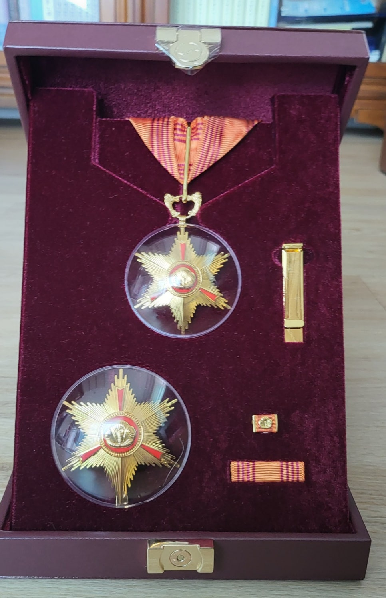

​

황조근정훈장을 전달받았습니다.

​

서훈의 이유는 다음과 같습니다.

"숭실대와 해군사관학교, 경남대에서 40년 6개월간 교수로 종사하면서 230편의 논문, 86편의 저서, 83회의 국내외 학술발표를 통해 학술진흥에 기여함."

연수(年數)도, 업적의 편수도, 약간씩 적게 산정된 것 같습니다만, 약간 숫자의 드나듦이야 무슨 큰 문제이겠습니까?

대과 없이 인생의 큰 부분을 마무리했고, 생각하지도 않았던 훈장까지 받았으니 저로서는 더 할 수 없는 영광이지요.

학교당국과 정부에 고마움을 표합니다.

2023. 9. 1.

조규익

​

#황조근정훈장-조규익 #숭실대학교 #해군사관학교 #경남대학교 #황조근정훈장 #조규익

​

[-조규익.jpg)](#)

​